![[blossom.png|1000]]
# Connections

The real CS2023 label is **HCI-Accessibility: Accessibility and Inclusive Design**.  
The connected responsibility route is **HCI-Accountability: Accountability and Responsibility in Design**.  
The real-life meaning is **understanding that accessibility is a technical, social, institutional, and ethical design problem**.

> [!quote] Bridge rule
> Accessibility becomes stronger when it is treated as a system of relations: people, tools, code, standards, institutions, evidence, and responsibility.

## Connection Map

## CS2023 Connection Gate

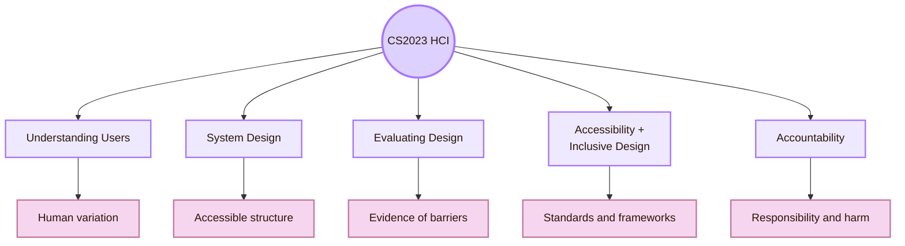

- **Understanding the User:** Users differ in vision, hearing, motor control, cognition, language, device, context, stress, and experience
- **System Design:** Accessibility becomes structure, labels, focus order, keyboard paths, alternatives, error states, and component behaviour
- **Evaluating the Design:** Accessibility must be checked through standards, manual review, assistive technology, and user evidence
- **Accessibility and Inclusive Design:** The central route for WCAG, inclusive design, universal design, ability-based design, and assistive technologies
- **Accountability:** Designers must state assumptions, limits, harms, excluded users, and repairs

## Local UVT Connection Layer

UVT also has a wider institutional accessibility context. That matters because accessibility is not only a code issue. It is also connected to support services, teaching adaptations, alternative materials, assistive technologies, and academic participation.

## Disability Studies Bridge

Disability studies helps HCI avoid a narrow view of disability. It shows that barriers are often created by environments, policies, tools, and assumptions. In HCI, this matters because an interface can create a disability barrier even when the user is skilled and motivated.

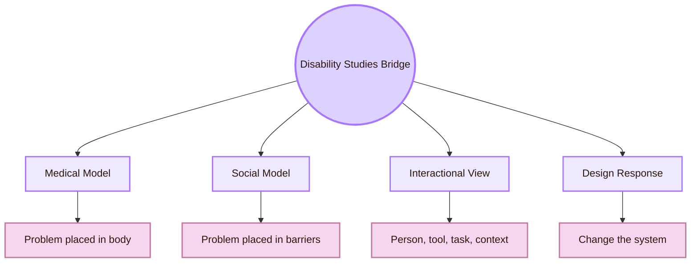

- **Disability is shaped by environment:** The interface can create or remove barriers
- **Exclusion is social and political:** Accessibility is about rights, dignity, and participation, not only usability
- **The “average user” is a design simplification:** Human variation must be expected from the beginning
- **Accommodation is not failure:** Alternative formats and flexible interaction are part of responsible design
- **Lived experience matters:** Disabled users can reveal barriers that checklists miss

This bridge connects to [[Activities/Theory]] because it explains why accessibility is not just a set of technical fixes. It is also a way to understand power, participation, and design assumptions.

## Assistive Technology Bridge

Assistive technology is where accessibility becomes concrete. Users may access systems through screen readers, keyboards, voice control, magnification, switch devices, captions, transcripts, braille displays, or other tools.

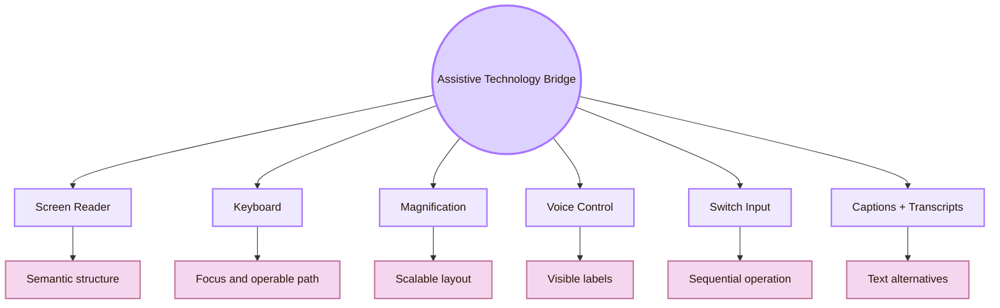

- **Screen reader:** Semantic HTML, headings, landmarks, labels, link text, table structure
- **Keyboard navigation:** Focus management, interaction design, component behaviour
- **Magnification:** Responsive design, layout, typography, zoom support
- **Voice control:** Visible labels, commandable controls, predictable UI
- **Switch devices:** Sequential navigation and low-complexity interaction
- **Captions and transcripts:** Multimedia design, education, public communication
- **Braille display:** Semantic structure, text clarity, and language support

## Web Standards Bridge

Web accessibility connects HCI to W3C standards. WCAG gives accessibility success criteria. WAI-ARIA can add semantics for complex widgets when native HTML is not enough. The ARIA Authoring Practices Guide gives patterns for accessible widgets and interactions. WCAG-EM gives a structured method for evaluating WCAG conformance.

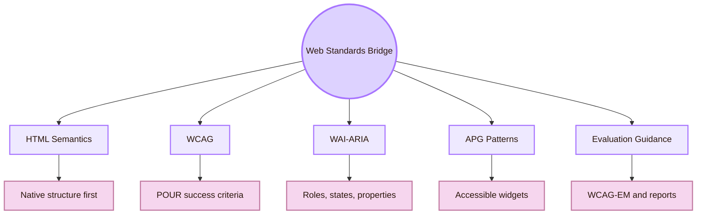

- **HTML semantics:** Gives structure before extra accessibility code is needed
- **WCAG 2.2:** Gives success criteria for accessible web content
- **WAI-ARIA:** Adds accessibility semantics for complex widgets when native semantics are insufficient
- **ARIA Authoring Practices Guide:** Shows accessible design patterns for common widgets
- **W3C WAI evaluation guidance:** Helps structure accessibility checking and reporting
- **WCAG-EM:** Gives a methodology for evaluating WCAG conformance

A useful rule is: **use native structure first**. Add ARIA only when the native element cannot express the interaction correctly.

## Software Engineering Bridge

Accessibility fails when it is treated as a one-time design layer. Software engineering connects accessibility to maintenance, version control, code review, regression checks, design-system governance, continuous integration, and documentation.

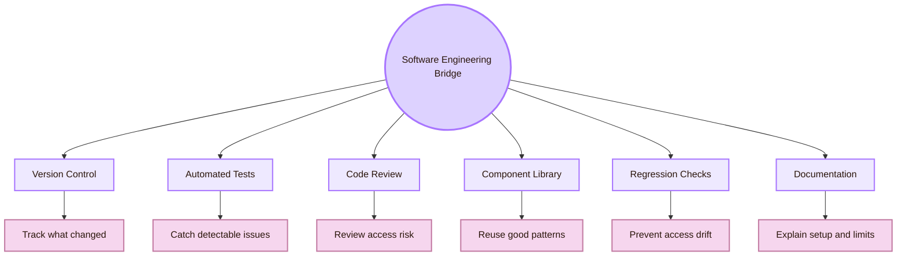

- **Git versioning:** Shows which version was tested and which change introduced a barrier
- **Pull request review:** Allows accessibility checks before changes merge
- **Automated accessibility tests:** Catch repeated detectable issues early
- **Manual regression checklist:** Catches focus, keyboard, semantics, and visual barriers that automation misses
- **Component library:** Fixes one pattern once, then reuses it
- **Documentation:** Helps users and contributors understand setup, dependencies, and limits
- **Issue tracking:** Makes barriers visible as concrete repair tasks

## Design Systems Bridge

Design systems connect accessibility to reusable decisions. Instead of repairing access separately on every page, a design system encodes accessible colour pairs, typography, focus styles, spacing, component states, error patterns, and documentation.

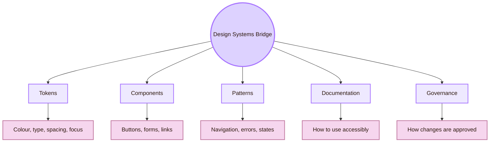

- **Colour token:** Reduces accidental low contrast
- **Typography token:** Supports readability, scaling, and long reading
- **Focus style:** Makes keyboard location visible
- **Component pattern:** Preserves semantics and behaviour
- **Error pattern:** Gives clear, local, recoverable feedback
- **Documentation:** Teaches contributors how not to break access
- **Governance:** Prevents inaccessible variants from spreading

## Law and Policy Bridge

Accessibility is not only a design preference. It is also connected to rights, public-sector duties, procurement, and compliance. In Europe, digital accessibility connects to the Web Accessibility Directive, EN 301 549, and the European Accessibility Act.

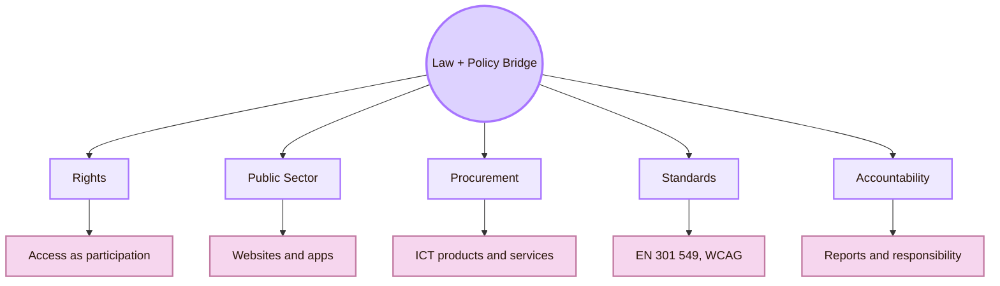

- **Web Accessibility Directive:** EU public-sector web and mobile accessibility requirements
- **EN 301 549:** Accessibility requirements for ICT products and services
- **European Accessibility Act:** EU accessibility rules for selected products and services
- **WCAG:** Technical web accessibility standard used by many policies
- **Institutional policy:** Local procedures for students, staff, services, teaching, and assessment
- **Procurement:** Accessibility becomes a requirement when choosing or building systems

## Education Bridge

Accessibility and Inclusive Design connects strongly to education. Students need access to readings, slides, platforms, code repositories, assessments, classrooms, software tools, and teacher communication.

## Ethics and Accountability Bridge

Accessibility is ethical because exclusion shifts burden onto users. A design can force users to ask for help, reveal disability, spend extra time, or fail a task through no fault of their own.

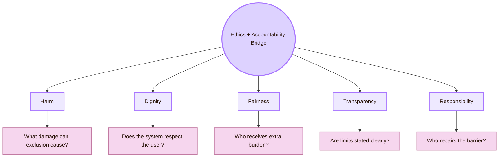

- **Harm:** A user cannot complete a task, submit work, or access information
- **Dignity:** A user must ask for special help because the system ignored them
- **Fairness:** Some users need more effort for the same outcome
- **Transparency:** The report hides what was not tested
- **Responsibility:** The designer treats access failure as a user problem
- **Repair:** The team fixes the barrier and retests it

This bridge connects directly to CS2023 Accountability. Inclusive Design is incomplete if it does not report exclusions and repairs.

## Health and Public Services Bridge

Accessibility also matters in health and public services, where interaction failures can have serious consequences. A system that is confusing in a low-stakes context may become harmful when users need medical information, social services, public forms, or emergency support.

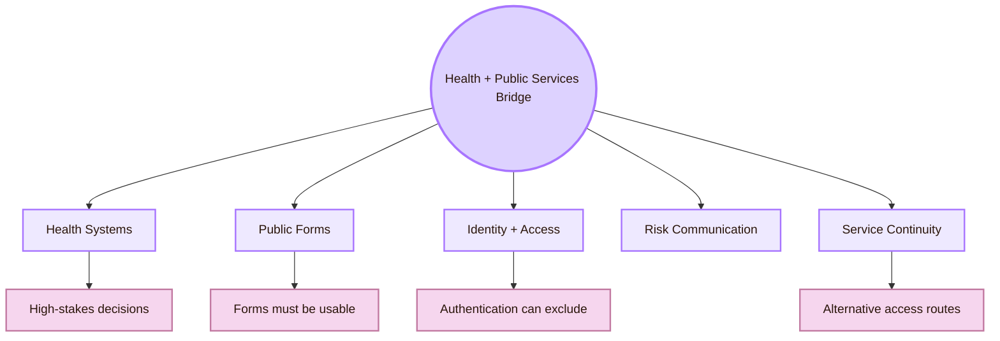

- **Public form:** Users must complete steps without inaccessible fields or time pressure
- **Identity verification:** Authentication can exclude users with cognitive, sensory, or motor barriers
- **E-health monitoring:** Data must be interpretable and not create false trust
- **Public university service:** Students must access information without needing private workarounds

This bridge connects to UVT because the local Computer Science context includes AI, medical informatics, e-health, data, and software systems. Accessibility is therefore relevant to local technical work, not only to web pages.

## Human Factors Bridge

Human factors connects accessibility to perception, attention, workload, fatigue, safety, and human performance. It helps explain why a technically accessible interface can still be too demanding for real use.

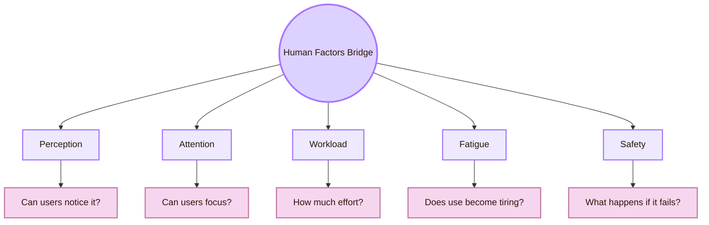

| Human factors concept | Accessibility link |
|---|---|
| Perception | Contrast, typography, icons, spacing, diagram readability |
| Attention | Clear hierarchy and reduced visual clutter |
| Workload | Fewer memory demands and simpler recovery paths |
| Fatigue | Avoid repeated precision tasks, dense scanning, and long unstructured pages |
| Safety | High-stakes systems need stricter access and error handling |
| Context of use | Real devices, lighting, classroom settings, and stress change access |

## AI and Data Systems Bridge

AI can support accessibility, but it can also introduce new barriers. It can generate captions, descriptions, summaries, code, and alternative formats. It can also hallucinate, misread images, create biased predictions, hide uncertainty, or produce inaccessible interfaces.

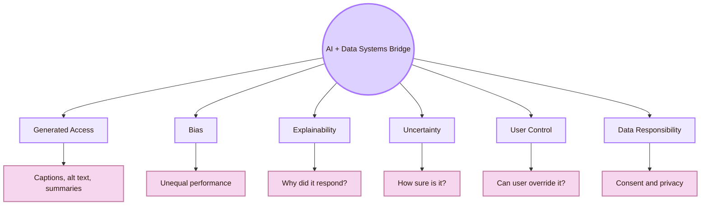

- **Generated alt text:** Is the description accurate enough for the user’s task?
- **Speech recognition:** Does performance vary across speech patterns, accents, or disabilities?
- **AI summarisation:** Does the summary remove information needed for access or safety?
- **Adaptive interface:** Can users understand and control the adaptation?
- **Prediction system:** Does the system explain uncertainty and avoid overtrust?
- **Dataset bias:** Which users were absent or misrepresented in the data?
- **AI-created code:** Does generated UI code preserve accessibility semantics?

## Local to Global Repair Path

Connections are useful only when they change design decisions. A local problem should be linked to the field that can explain it and to a repair that can be tested.

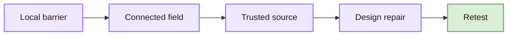

## Connection Reliability Ladder

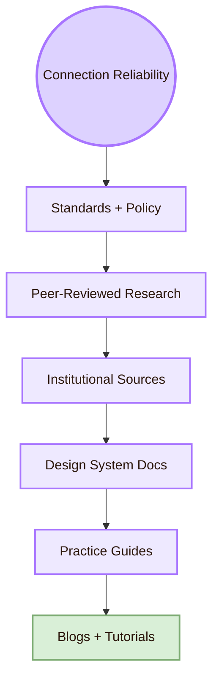

| Source type | Use it for | Caution |
|---|---|---|
| Standards and policy | WCAG, EN 301 549, institutional duties, conformance | Standards still need interpretation in real use |
| Peer-reviewed research | Concepts, evidence, open problems, HCI arguments | Papers may be narrow or advanced |
| Institutional sources | Local UVT context and official support information | They may not explain HCI theory |
| Design-system documentation | Practical component rules and accessible patterns | Product-specific rules may not fully generalise |
| Practice guides | Learning, checklists, implementation steps | Not always peer-reviewed |
| Blogs and tutorials | Quick tool help | Not enough for academic grounding alone |

## Study Route

## Academic Anchors

| Route | Source |
|---|---|
| CS2023 HCI Accessibility basis | [CS2023 HCI Version Gamma](https://csed.acm.org/wp-content/uploads/2023/09/HCI-Version-Gamma.pdf) |
| CS2023 Knowledge Areas | [CS2023 Knowledge Areas](https://csed.acm.org/knowledge-areas/) |
| WCAG 2.2 standard | [W3C WCAG 2.2](https://www.w3.org/TR/WCAG22/) |
| WCAG overview | [W3C WCAG Overview](https://www.w3.org/WAI/standards-guidelines/wcag/) |
| WAI accessibility principles | [W3C Accessibility Principles](https://www.w3.org/WAI/fundamentals/accessibility-principles/) |
| WAI-ARIA overview | [W3C WAI-ARIA Overview](https://www.w3.org/WAI/standards-guidelines/aria/) |
| ARIA Authoring Practices | [WAI-ARIA Authoring Practices Guide](https://www.w3.org/WAI/ARIA/apg/) |
| Accessibility evaluation | [W3C Evaluating Web Accessibility](https://www.w3.org/WAI/test-evaluate/) |
| WCAG conformance evaluation | [W3C WCAG-EM Overview](https://www.w3.org/WAI/test-evaluate/conformance/wcag-em/) |
| Inclusive design method | [Microsoft Inclusive Design](https://inclusive.microsoft.design/) |
| Inclusive design toolkit | [Microsoft Inclusive 101 Guidebook](https://inclusive.microsoft.design/articles/inclusive-101-guidebook) |
| Universal Design principles | [The Center for Universal Design](https://design.ncsu.edu/research/center-for-universal-design/) |
| Ability-Based Design paper | [Ability-Based Design: Concept, Principles and Examples](https://kgajos.seas.harvard.edu/papers/wobbrock11abd.pdf) |
| Ability-Based Design ACM record | [ACM Transactions on Accessible Computing: Ability-Based Design](https://dl.acm.org/doi/10.1145/1952383.1952384) |
| European Accessibility Act | [European Commission: European Accessibility Act](https://commission.europa.eu/strategy-and-policy/policies/justice-and-fundamental-rights/disability/european-accessibility-act-eaa_en) |
| EN 301 549 | [AccessibleEU: EN 301 549](https://accessible-eu-centre.ec.europa.eu/content-corner/digital-library/en-3015492021-accessibility-requirements-ict-products-and-services_en) |
| Accessibility research community | [ACM SIGACCESS](https://www.sigaccess.org/) |
| ACM SIGACCESS description | [ACM SIGACCESS](https://www.acm.org/special-interest-groups/sigs/sigaccess) |
| Accessibility conference | [ACM ASSETS](https://dl.acm.org/conference/assets) |
| Web accessibility conference | [Web4All](https://www.w4a.info/) |
| Practical accessibility resource | [WebAIM](https://webaim.org/) |
| WebAIM resources | [WebAIM Resources](https://webaim.org/resources/) |
| Apple accessibility guidance | [Apple HIG: Accessibility](https://developer.apple.com/design/human-interface-guidelines/accessibility) |
| Material accessibility | [Material Design Accessibility](https://m2.material.io/design/usability/accessibility.html) |
| Carbon accessibility | [Carbon Design System Accessibility](https://carbondesignsystem.com/guidelines/accessibility/overview/) |
| GOV.UK accessible services | [GOV.UK: Making your service accessible](https://www.gov.uk/service-manual/helping-people-to-use-your-service/making-your-service-accessible-an-introduction) |
| UVT accessibility for students with disabilities | [UVT: Accessibility for students with disabilities](https://uvt.ro/en/educatie/info-studenti-proces-educational/accesibilitate-pentru-studentii-cu-dizabilitati/) |
| UVT social inclusion | [UVT actively promotes social inclusion](https://www.uvt.ro/en/blog/uvt-promoveaza-activ-incluziunea-sociala/) |
| UVT tactile accessibility initiative | [UVT tactile models accessibility initiative](https://uvt.ro/en/comunicate-presa/in-cadrul-strategiei-institutionale-orientata-spre-accesibilizare-uvt-instaleaza-machetele-tactile-in-toate-spatiile-principale-din-sediul-principal/) |
| UVT Faculty of Informatics | [Faculty of Informatics UVT](https://info.uvt.ro/en/) |

^connections-accessibility-inclusive-design-end
