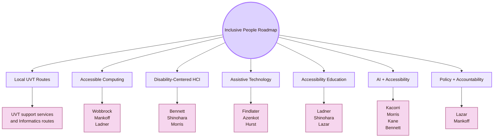
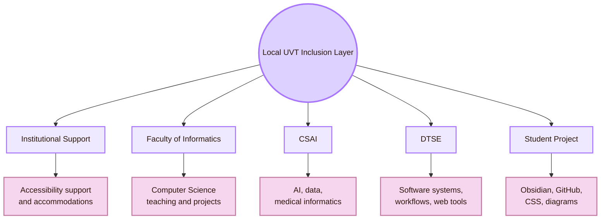
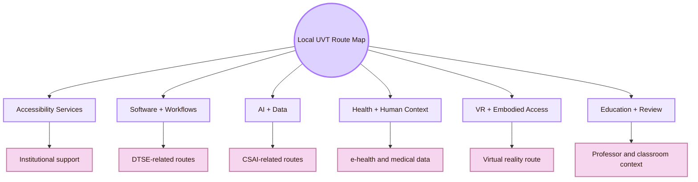
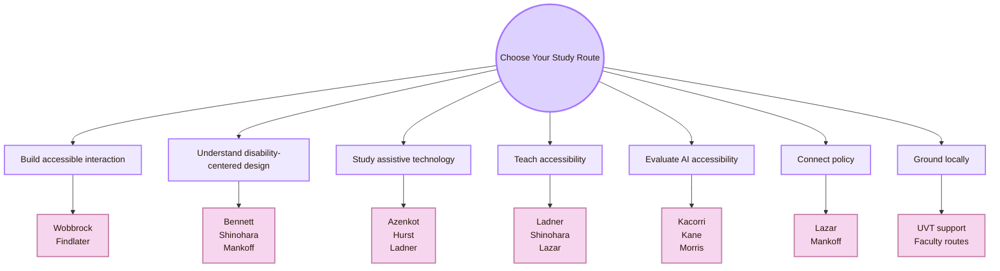

![[turtle.jpg|1000]]
# Important People

Back to [[Overview|The Inclusive Gate]].

> [!abstract] Inclusive People Roadmap
> This page maps reliable routes into **Accessibility and Inclusive Design**. It starts with the local UVT context, then moves to international researchers and labs in accessible computing, disability-centered HCI, assistive technology, accessibility education, AI accessibility, and policy.

The fantasy name is **Inclusive People Roadmap**.  
The real CS2023 label is **HCI-Accessibility: Accessibility and Inclusive Design**.  
The connected responsibility route is **HCI-Accountability: Accountability and Responsibility in Design**.  
The real-life meaning is **knowing who and what to study when the question is how technology can include more people instead of creating barriers**.

This page is not a celebrity list. It is not a list of confirmed supervisors. It is a learning map. A person is included only when their public work gives a useful route into one part of accessibility: accessible computing, assistive technology, disability-centered design, accessibility education, AI and accessibility, or policy.

## People Map

| Route | What it teaches | Start with |
|---|---|---|
| Local UVT routes | How accessibility appears in this project’s real university context | UVT accessibility support, Faculty of Informatics, CSAI, DTSE |
| Accessible computing | How HCI designs and evaluates systems for disabled people | Jacob Wobbrock, Jennifer Mankoff, Richard Ladner |
| Disability-centered HCI | How disabled people’s agency and experience change HCI research | Cynthia L. Bennett, Kristen Shinohara, Meredith Ringel Morris |
| Assistive technology | How tools support access in real settings | Leah Findlater, Shiri Azenkot, Amy Hurst |
| Accessibility education | How accessibility becomes part of computing education | Richard Ladner, Kristen Shinohara, Jonathan Lazar |
| AI and accessibility | How AI can support access or reproduce barriers | Hernisa Kacorri, Shaun K. Kane, Meredith Ringel Morris, Cynthia L. Bennett |
| Policy and accountability | How institutions, law, and responsibility shape accessibility | Jonathan Lazar, Jennifer Mankoff |

## How to read this page

Use the page as a route map, not as a directory of guaranteed contacts.

| Label in this page | Meaning |
|---|---|
| Local route | A UVT institutional, department, or research route that can connect to accessibility questions |
| Global researcher | A person with public work in accessible computing, disability-centered HCI, assistive technology, or related areas |
| Public basis | A profile, lab page, publication route, or institutional page that supports the inclusion |
| Best use | The kind of question a student can study through this person’s work |

## Local Route First: UVT Accessibility and Informatics Context

The local dimension for this project is **UVT**, especially the **Faculty of Informatics / Computer Science context**. Accessibility also connects to the wider university context: student support, accommodations, assistive technologies, accessible educational materials, teaching adaptation, and institutional inclusion.

> UVT provides institutional accessibility routes, and the Faculty of Informatics provides local Computer Science routes. These can support accessibility-related thinking, but they should not be described as a dedicated HCI accessibility lab unless an official source says so.

| Local route | Public basis | Why it belongs here |
|---|---|---|
| UVT accessibility support | UVT describes services for students with disabilities and institutional support procedures | Gives the local accessibility context for students, materials, teaching, and assessment |
| Faculty of Informatics | UVT Faculty of Informatics is the local Computer Science home of the project | Places the vault inside a real CS learning environment |
| CSAI department | UVT lists the Department of Computational Sciences and Artificial Intelligence | Connects accessibility to AI, data, medical informatics, recommender systems, and human-related data |
| DTSE department | UVT lists the Department of Digital Technologies and Software Engineering | Connects accessibility to software systems, workflows, web technologies, robustness, and maintainability |
| Cognishire project route | The vault uses Markdown, Obsidian, GitHub, CSS, and Mermaid | Provides a concrete artifact for local accessibility testing |

## Local UVT People and Routes

Use this table carefully. It is not a list of “UVT accessibility professors.” It is a list of public UVT routes that may help a student think about accessibility-adjacent problems in software, AI, web systems, health systems, VR, data, or educational access.

| Local person or route | Public information used | Accessibility-related question it can support |
|---|---|---|
| UVT Psychopedagogical Assistance and Integration Center | UVT describes support for students with disabilities | What institutional support exists for access, accommodations, and adapted materials? |
| Teodor Florin Fortiș | UVT research route lists workflows, web technologies, and ontologies | How can an information system or workflow remain understandable and accessible? |
| Cristina Mîndruță | UVT research route lists workflows, web services, and ontologies | How can structured web services and workflows support accessible digital processes? |
| Dana Petcu | UVT research route lists distributed, grid, cloud, and parallel computing | How can infrastructure, portability, and system reliability affect access? |
| Ciprian Pungilă | UVT research route lists intelligent systems and anomaly detection | How can system errors and reliability problems become access barriers? |
| Ioan Drăgan | UVT research route lists cloud computing, formal verification, first-order logic, and automated theorem proving | How can correctness and reliability matter in access-sensitive software? |
| Daniel Pop | UVT research route lists knowledge discovery, big data, and high-performance computing | How can data-heavy systems be evaluated without hiding accessibility patterns? |
| Daniela Zaharie | UVT research route lists evolutionary computing, machine learning, and data mining | How can adaptive systems and metrics be evaluated responsibly? |
| Darian Onchiș | UVT research route lists signal and image processing, bioinformatics, and machine learning | How can image, signal, and medical systems support access and interpretation? |
| Sebastian Ștefănigă | UVT research route lists image processing, high-performance computing, medical informatics, and machine learning | How can visual and medical computing systems be evaluated in high-stakes contexts? |
| Todor Ivașcu | UVT research route lists multi-agent systems, e-health systems, and machine learning | How can e-health systems support trust, monitoring, and accessible interaction? |
| Horia Popa | UVT research route lists knowledge discovery and recommender systems | How can recommender systems be checked for access, personalisation, and bias? |
| Alexandru Vlasiu | UVT research route lists machine learning, data mining, and applications in psychology | How can accessibility connect to cognition, behaviour, and user characteristics? |
| Bogdan Butunoi | UVT research route lists computational intelligence, prediction models, and diabetes monitoring systems | How can prediction systems present health-related information accessibly? |
| Codruț Chiș | UVT research route lists virtual reality | How can VR be evaluated for spatial usability, comfort, and embodied access? |
| Eduard Hogea, Fabian Galiș, Flavia Costi | UVT research route lists explainable AI topics for these names | How can explainability help users judge AI behaviour, limits, and trust? |

## Global Route I: Accessible Computing Foundations

This route is useful when you want to understand accessible computing as a research field. It focuses on interaction techniques, assistive technologies, accessible systems, disability inclusion in computing, and rigorous HCI methods.

### Jacob O. Wobbrock

| Field | Details |
|---|---|
| Public route | University of Washington Information School and personal page |
| Stable description | HCI researcher associated with mobile and accessible computing, input techniques, human performance measurement, and accessible interaction |
| Why he matters | His work is central for ability-based design, accessible interaction techniques, and rigorous HCI evaluation methods |
| Study first | Ability-Based Design; accessible interaction techniques; HCI statistics and empirical methods |
| Good student question | “How should I evaluate an accessible interaction technique instead of only describing it?” |
| Caution | Use official UW pages for current role and contact details |

### Jennifer Mankoff

| Field | Details |
|---|---|
| Public route | University of Washington Allen School, UW CREATE |
| Stable description | Accessibility researcher whose work connects disability, agency, advocacy, intersectionality, and accessible technology |
| Why she matters | Her work is a strong route into accessibility as both technical and social responsibility |
| Study first | Accessibility, disability studies in HCI, environmental sustainability and access, AI accessibility concerns |
| Good student question | “How can disabled people have more agency in the design and evaluation of technology?” |
| Caution | Avoid reducing her work to “assistive tools.” It is also about structure, agency, and power |

### Richard E. Ladner

| Field | Details |
|---|---|
| Public route | University of Washington Allen School, AccessComputing, CREATE |
| Stable description | Professor Emeritus known for accessible computing research and for promoting inclusion of disabled people in computing education |
| Why he matters | His route is important for accessibility education and for access to computing fields, especially for blind, deaf, deaf-blind, and hard-of-hearing people |
| Study first | AccessComputing, AccessCSforAll, accessibility technology, computing education inclusion |
| Good student question | “How can accessibility become part of computing education instead of a small optional topic?” |
| Caution | Describe him as professor emeritus unless an official source says otherwise |

## Global Route II: Disability-Centered and Justice-Oriented HCI

This route is for learning how disabled people’s lived experience, creativity, agency, and critique reshape HCI. It is useful when the project must avoid treating disabled users as passive test subjects.

### Cynthia L. Bennett

| Field | Details |
|---|---|
| Public route | Google Research profile, Google Scholar, published work |
| Stable description | Researcher working across accessibility, disability, design, responsible AI, and disability justice-oriented technology questions |
| Why she matters | Her work helps students understand that accessibility is about power, representation, and participation, not only interface repair |
| Study first | Disability and AI justice; accessible prototyping; community-led evaluation; image description and disability representation |
| Good student question | “How can accessibility research avoid speaking for disabled people without their agency?” |
| Caution | Role titles can change in industry research. Use current official Google Research or Scholar pages before citing a role |

### Kristen Shinohara

| Field | Details |
|---|---|
| Public route | Rochester Institute of Technology profile and personal research page |
| Stable description | Accessibility and HCI researcher working on disability, computing education, accessible prototyping, and disabled student experiences |
| Why she matters | Her work is useful for connecting accessibility to computing education and to the barriers disabled students face in academic environments |
| Study first | Accessibility in computing education; accessibility of prototyping tools; disabled graduate student barriers |
| Good student question | “How can a computing course teach accessibility without treating it as a late checklist?” |
| Caution | Use official RIT profile for current title and contact details |

### Meredith Ringel Morris

| Field | Details |
|---|---|
| Public route | UW iSchool profile, personal page, Google Scholar |
| Stable description | HCI researcher working across accessibility, social technologies, human-centered AI, and human-AI interaction |
| Why she matters | Her route is useful for accessibility in social platforms, intelligent systems, and AI-mediated interaction |
| Study first | AI and accessibility; accessibility in social technologies; generative AI and HCI |
| Good student question | “How can AI systems be evaluated for accessibility without assuming automation is always helpful?” |
| Caution | Industry and academic affiliations may change. Cite the profile you actually checked |

## Global Route III: Assistive Technology and Inclusive Systems

This route focuses on systems that support access in practice. It includes mobile devices, wearables, fabrication, adaptive interfaces, information access, and everyday assistive technology.

### Leah Findlater

| Field | Details |
|---|---|
| Public route | UW Human Centered Design & Engineering, UW CREATE, Inclusive Design Lab |
| Stable description | HCI and accessibility researcher working on inclusive technologies, adaptive interaction, accessible computing, and human-centered AI |
| Why she matters | Her work is useful for studying how interfaces can adapt to user needs while still preserving access and control |
| Study first | Inclusive Design Lab projects, adaptive interaction, accessible technologies, human-centered machine learning |
| Good student question | “How can a system adapt to different users without becoming confusing or excluding?” |
| Caution | Use official UW or lab pages for current role and affiliations |

### Shiri Azenkot

| Field | Details |
|---|---|
| Public route | Cornell Bowers / Cornell Tech profile, personal page, XR Access route |
| Stable description | HCI and accessibility researcher focused on mobile, wearable, AR/VR, orientation, information access, education, and employment for people with disabilities |
| Why she matters | Her route is strong for accessible emerging technology, especially blind and low-vision access in mobile, wearable, and XR settings |
| Study first | XR accessibility, smart glasses, mobile accessibility, orientation and mobility |
| Good student question | “What does accessibility mean when the interface is spatial, wearable, or immersive?” |
| Caution | Do not generalise all visual impairment experiences from one technology area |

### Amy Hurst

| Field | Details |
|---|---|
| Public route | NYU Tandon profile, personal research route |
| Stable description | Accessibility researcher working with end users on accessibility challenges and novel assistive technologies, including DIY and fabrication routes |
| Why she matters | Her work helps students see assistive technology as something users may adapt, make, personalise, and repair |
| Study first | DIY assistive technology, digital fabrication, accessible design tools, end-user empowerment |
| Good student question | “How can users be supported to adapt or build assistive tools for their own needs?” |
| Caution | Study the user-centred and participatory aspect, not only the devices |

## Global Route IV: AI, Data, and Accessibility

This route is for AI systems that can support access or create new barriers. It matters because AI can generate descriptions, recommendations, captions, adaptations, and explanations. It can also hallucinate, bias decisions, expose disability data, and create misplaced trust.

### Hernisa Kacorri

| Field | Details |
|---|---|
| Public route | University of Maryland College of Information, IAM Lab, TRACE-related projects |
| Stable description | Researcher working on accessibility and human-centered AI, often using participatory and experimental methods |
| Why she matters | Her work is a strong route into accessibility datasets, AI-infused systems, disability data, and the evaluation of AI tools for disabled users |
| Study first | Human-centered AI for accessibility, teachable AI, audio description, accessibility datasets, privacy and participation |
| Good student question | “How can AI accessibility systems be evaluated with disabled people’s data without creating new risks?” |

### Shaun K. Kane

| Field | Details |
|---|---|
| Public route | Personal site, Google Research profile, ACM profile |
| Stable description | Accessibility and HCI researcher whose public site describes work using HCI, AI, and machine learning to support people with disabilities |
| Why he matters | His route is useful for accessible AI, wearable accessibility, tactile and nonvisual interaction, and accessibility in emerging systems |
| Study first | AI for accessibility, wearable accessibility, nonvisual interaction, public touchscreens, accessible VR or emerging interfaces |
| Good student question | “How can AI support independence without replacing user agency?” |
| Caution | Use his personal site or Google Research profile for current role, because affiliations can change |

### Meredith Ringel Morris

| Field | Details |
|---|---|
| Evaluation role | Accessibility, social technology, human-centered AI, generative AI, and human-AI interaction |
| Why repeated here | Her work bridges accessibility and AI, so she belongs both in disability-centered HCI and AI accessibility |
| Study direction | Use this route when the system includes AI-generated content, recommendations, or social interaction |
| Caution | Do not treat AI output quality as accessibility unless real access tasks are tested |

### Cynthia L. Bennett

| Field | Details |
|---|---|
| Evaluation role | Disability, responsible AI, justice-oriented design, community-led evaluation |
| Study direction | Use this route when evaluating AI systems that describe, represent, classify, or support disabled users |
| Caution | Avoid “AI solves accessibility” framing. Use evidence and user agency |

## Global Route V: Policy, Law, and Institutional Responsibility

This route explains why accessibility is not only a design preference. It is also connected to rights, law, institutional responsibility, procurement, education, and public accountability.

### Jonathan Lazar

| Field | Details |
|---|---|
| Public route | University of Maryland College of Information, Maryland Initiative for Digital Accessibility, HCIL |
| Stable description | HCI and accessibility researcher working across web accessibility, user-centred design, assistive technology, law, and policy |
| Why he matters | His route is central for understanding accessibility as research, method, law, and institutional responsibility |
| Study first | Research Methods in HCI; web accessibility; accessibility law and policy; MIDA resources |
| Good student question | “How should accessibility evaluation connect to law, policy, and institutional duty?” |
| Caution | Legal context differs by country. Use law-related material carefully outside the U.S. context |

### Jennifer Mankoff

| Field | Details |
|---|---|
| Policy role | Accessibility research, disability agency, structural barriers, AI accessibility concerns |
| Why repeated here | Her work helps connect individual interface barriers to larger structures and accountability |
| Study direction | Use this route when asking how institutions and design systems can avoid placing extra labour on disabled users |
| Caution | Do not reduce structural accessibility to individual accommodation only |

## Study Route by Interest

| If you want to learn... | Start with... | Build this small project |
|---|---|---|
| How to design accessible interaction | Wobbrock, Findlater | Redesign one page so keyboard, structure, and labels work better |
| How disability changes design theory | Bennett, Shinohara, Mankoff | Write a barrier analysis that starts from exclusion, not from the “average user” |
| How assistive technology works | Azenkot, Hurst, Ladner | Test one page with keyboard, zoom, screen reader structure, and fallback Markdown |
| How to teach accessibility in CS | Ladner, Shinohara, Lazar | Make a mini lesson that connects WCAG, HCI, and a local student project |
| How to evaluate AI accessibility | Kacorri, Kane, Morris, Bennett | Test AI-generated descriptions for correctness, context, uncertainty, and user usefulness |
| How to connect access to responsibility | Lazar, Mankoff | Write a short accountability report: what was tested, who was missing, and what remains risky |
| How to ground the project at UVT | UVT accessibility support, Faculty of Informatics, CSAI, DTSE | Create a local evidence log for Obsidian, GitHub, CSS, diagrams, and professor review |

## Contact Protocol

| Email part | What to include |
|---|---|
| Subject | “Question about accessibility research / inclusive design / AI accessibility” |
| Opening | Who you are and what you are studying |
| Specific fit | One sentence connecting your question to their public work |
| Evidence | One paper, project page, lab page, or course route you actually read |
| Your project | A short description of Cognishire or the HCI map |
| Ask | One precise question about a reading path, method, or study direction |
| Close | Thank them and include a GitHub/portfolio link only if relevant |

## Local UVT Contact Protocol

For UVT routes, ask about the connection between your project and a method, not for general approval.

| Local route | Better question |
|---|---|
| Accessibility support | “What should I consider when making digital study materials more accessible?” |
| Faculty of Informatics | “How can I make this Computer Science project easier to inspect, open, and evaluate?” |
| Software/workflow route | “How can I evaluate whether the Obsidian/GitHub workflow remains usable after download?” |
| AI/data route | “What accessibility risks appear when a system uses prediction, recommendation, or generated content?” |
| Health/e-health route | “What makes accessibility stricter when users rely on health or monitoring information?” |
| VR route | “What accessibility barriers should be checked in an immersive or spatial version of this map?” |
| Teaching route | “How can I test whether the map helps students learn without increasing cognitive load?” |

## Academic Anchors

| Route | Source |
|---|---|
| CS2023 HCI Accessibility basis | [CS2023 HCI Version Gamma](https://csed.acm.org/wp-content/uploads/2023/09/HCI-Version-Gamma.pdf) |
| UVT accessibility support | [UVT: Accessibility for students with disabilities](https://uvt.ro/en/educatie/info-studenti-proces-educational/accesibilitate-pentru-studentii-cu-dizabilitati/) |
| UVT Faculty of Informatics | [Faculty of Informatics UVT](https://info.uvt.ro/en/) |
| UVT Faculty departments | [Faculty of Informatics Departments](https://info.uvt.ro/en/departamente/) |
| UVT Research Center researchers | [UVT Informatics Researchers](https://research.info.uvt.ro/researchers/) |
| UVT Cloud/HPC/IoT route | [Cloud Computing, High Performance Computing, and Internet of Things](https://research.info.uvt.ro/cloud-computing-high-performance-computing-and-internet-of-things/) |
| Jacob O. Wobbrock | [UW iSchool profile](https://ischool.uw.edu/people/faculty/profile/wobbrock), [personal page](https://faculty.washington.edu/wobbrock/) |
| Jennifer Mankoff | [UW Allen School profile](https://www.cs.washington.edu/people/faculty/jennifer-mankoff/), [CREATE profile](https://create.uw.edu/people-directors-mankoff/) |
| Richard E. Ladner | [UW Allen School profile](https://www.cs.washington.edu/people/faculty/ladner-richard/), [CREATE profile](https://create.uw.edu/faculty-richard-ladner/) |
| Cynthia L. Bennett | [Google Research profile](https://research.google/people/108223/), [Google Scholar profile](https://scholar.google.com/citations?hl=en&user=K783G5IAAAAJ) |
| Kristen Shinohara | [RIT profile](https://www.rit.edu/directory/kssics-kristen-shinohara), [research page](https://kristenshinohara.com/research.html) |
| Meredith Ringel Morris | [UW iSchool profile](https://ischool.uw.edu/people/faculty/profile/merriem), [personal page](https://cs.stanford.edu/~merrie/) |
| Leah Findlater | [UW HCDE profile](https://www.hcde.washington.edu/findlater), [CREATE profile](https://create.uw.edu/people-directors-findlater/) |
| Shiri Azenkot | [Cornell Bowers profile](https://bowers.cornell.edu/people/shiri-azenkot), [personal page](https://shiriazenkot.wixsite.com/shiri-azenkot) |
| Amy Hurst | [NYU Tandon profile](https://engineering.nyu.edu/faculty/amy-hurst) |
| Hernisa Kacorri | [UMD iSchool profile](https://ischool.umd.edu/directory/hernisa-kacorri/), [IAM Lab / Incluset](https://incluset.com/about) |
| Shaun K. Kane | [personal page](https://shaunkane.com/), [Google Research profile](https://research.google/people/shaunkane/) |
| Jonathan Lazar | [UMD profile](https://ischool.umd.edu/directory/jonathan-lazar/), [MIDA](https://mida.umd.edu/) |
| Accessibility research community | [ACM SIGACCESS](https://www.sigaccess.org/) |
| Accessibility conference | [ACM ASSETS](https://www.sigaccess.org/assets/) |
| Accessibility journal | [ACM Transactions on Accessible Computing](https://dl.acm.org/journal/taccess) |
| Accessibility standards | [W3C WAI](https://www.w3.org/WAI/), [WCAG 2.2](https://www.w3.org/TR/WCAG22/) |

^important-people-accessibility-inclusive-design-end
