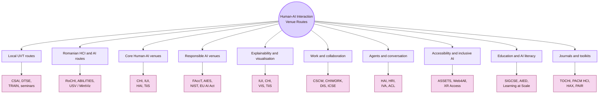
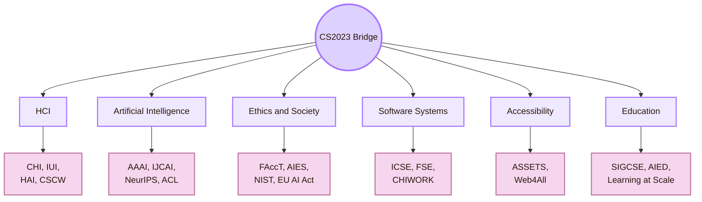

![[fin.jpg|1000]]
# Important Venues

Back to [[Overview|The Oracle Engine]].

## How to use this page

| If your question is about | Start with | Then check |
|---|---|---|
| AI interface behaviour | IUI, CHI, Microsoft HAX, Google PAIR | TiiS, TOCHI |
| Trust, verification, and uncertainty | CHI, IUI, TiiS | FAccT, NIST AI RMF, VIS |
| Explainable AI for users | IUI, CHI, TiiS | VIS, FAccT, AIES |
| AI in work and organisations | CSCW, CHIWORK, CHI | ICSE, DIS |
| Agents, chatbots, robots, assistants | HAI, HRI, IVA, ICMI | ACL, EMNLP, CHI |
| AI accessibility | ASSETS, Web4All, A(I)BILITIES | CHI, IUI, XR Access |
| AI education and AI literacy | SIGCSE, AIED, Learning at Scale | CHI, LAK, EDM |
| Responsible AI and governance | FAccT, AIES, NIST AI RMF, EU AI Act | AI Incident Database, Partnership on AI |
| Local UVT grounding | UVT Faculty of Informatics, CSAI, DTSE, TRAIN | UVT AI/ML routes and seminars |
| Romanian grounding | RoCHI, A(I)BILITIES, USV/MintViz | Romanian accessibility and HCI work |

## Venue route map

| Venue territory | Real meaning | Use it when the question is about |
|---|---|---|
| Local UVT routes | The local university context where AI, ML, software systems, seminars, and student projects exist | Grounding the project in the place where it is built and reviewed |
| Romanian HCI and AI routes | National HCI, AI accessibility, assistive technology, and Romanian-language context | Avoiding a page that is only imported from global examples |
| Core Human-AI venues | International HCI venues focused on AI-facing interfaces | Design, evaluation, trust, explanation, and intelligent interaction |
| Responsible AI venues | Fairness, accountability, transparency, risk, policy, and social impact | Harms, oversight, audit, governance, and power |
| Explainability and visualisation | Explanations, interpretability, evidence displays, and uncertainty | Helping users judge AI output |
| Work and collaboration | AI in teams, organisations, software work, and knowledge work | How AI changes human work practices |
| Agents and conversation | Human-agent, robot, virtual-agent, multimodal, and dialogue interaction | Chatbots, assistants, robots, embodied systems, and agentic AI |
| Accessibility and inclusive AI | AI for disabled users and AI systems that affect access | Whether AI supports or blocks participation |
| Education and AI literacy | AI tutoring, student use, learning analytics, and academic integrity | Whether AI helps students learn or only produce work |
| Journals and toolkits | Long-form research and practical design guidance | Deeper literature and design patterns |

## CS2023 framing

Human-AI Interaction should be treated as a bridge across several CS2023 areas. It belongs to HCI because people interact with the system. It belongs to AI because the system predicts, ranks, recommends, classifies, or generates. It belongs to ethics because AI can affect rights, fairness, privacy, safety, and accountability. It belongs to software engineering because AI systems must be deployed, monitored, updated, and repaired.

| CS2023 route | Best venue route | What to look for |
|---|---|---|
| HCI Design | CHI, IUI, DIS, UIST, HAI | Interface patterns, feedback, prompt design, controls |
| HCI Evaluation | CHI, IUI, CSCW, TiiS, TOCHI | User studies, trust measures, explanation studies, oversight tests |
| Artificial Intelligence | AAAI, IJCAI, NeurIPS, ICML, ICLR, ACL | Model capability, uncertainty, language systems, safety, technical limits |
| Ethics and Accountability | FAccT, AIES, NIST AI RMF, EU AI Act | Risk, harm, fairness, governance, human oversight |
| Software Engineering | ICSE, FSE, CHIWORK, CSCW | AI as deployed software, code assistants, logs, monitoring, reliability |
| Accessibility | ASSETS, Web4All, XR Access, A(I)BILITIES | Inclusive AI, assistive AI, access barriers, disabled-user experience |
| Education | SIGCSE, AIED, Learning at Scale, LAK, EDM | AI literacy, tutoring, student-AI use, learning analytics |

## Local UVT routes

The local layer begins with UVT. These are not all Human-AI research venues in a strict sense. They are local routes that can support Human-AI questions inside the real project context.

| Local UVT route                                          | Why it matters for Human-AI Interaction                                                                                 |
| -------------------------------------------------------- | ----------------------------------------------------------------------------------------------------------------------- |
| UVT Faculty of Informatics                               | Local Computer Science home of the project                                                                              |
| CSAI                                                     | Local route for artificial intelligence, machine learning, intelligent systems, data, prediction, and AI education      |
| DTSE                                                     | Local route for AI as software: workflows, web systems, distributed systems, cloud, implementation, and maintainability |
| UVT AI and ML research route                             | Local map for AI/ML researchers and topics                                                                              |
| TRAIN                                                    | Local AI network route for Timișoara and UVT AI visibility                                                              |
| Scientific seminars                                      | Local academic exchange route, useful when AI or explainable-AI talks appear                                            |
| Artificial Intelligence bachelor programme               | Local teaching route for AI foundations relevant to Human-AI Interaction                                                |
| Artificial Intelligence and Distributed Computing master | Local route for AI, distributed systems, cloud, and reliable intelligent systems                                        |
| Obsidian/GitHub project context                          | Immediate place where AI-assisted source verification, design, and accountability are tested                            |
| Professor review                                         | Local evaluation route where the AI-assisted project must be academically inspectable                                   |

## Romanian routes

The Romanian layer keeps the page grounded in national HCI and accessibility-related AI work. Some routes are direct HCI routes. Some are adjacent routes that become relevant when the topic is AI accessibility, assistive technology, or Romanian-language interaction.

| Romanian route | What it contributes |
|---|---|
| RoCHI proceedings | National HCI route for Romanian interactive systems, usability, accessibility, and HCI education |
| Romanian HCI community | Keeps the project from being only global and imported |
| A(I)BILITIES | Romanian route for generative AI and personalised digital accessibility |
| USV / MintViz | Route for HCI, XR, accessible computing, gesture interaction, and intelligent interaction |
| ASSIST Software A(I)BILITIES page | Applied Romanian project route for generative AI and digital accessibility |
| Romanian accessibility evaluation papers | Evidence route for web accessibility, tools, public systems, and university websites |
| Romanian language context | Localisation, terminology, translation accuracy, and cognitive access |

## Core Human-AI venues

These are the central international routes for Human-AI Interaction.

| Venue | What it contributes | Student use |
|---|---|---|
| ACM IUI | Core conference route for intelligent user interfaces at the intersection of AI and HCI | Search for AI interface patterns, user studies, explanation systems, and adaptive interfaces |
| ACM CHI | Flagship HCI venue for AI interaction, design, evaluation, accessibility, trust, and user studies | Search for broad Human-AI studies and design implications |
| ACM HAI | Human-Agent Interaction route for social agents, software agents, robots, chatbots, and agentic systems | Use when AI behaves like an assistant, agent, teammate, or social actor |
| ACM TiiS | Journal route for interactive systems that use machine intelligence | Use for deeper, longer-form research on intelligent interactive systems |
| Microsoft HAX Toolkit | Practical Human-AI design guidance for user-facing AI products | Use for design patterns, checklists, and failure-aware interface planning |
| Google People + AI Guidebook | Practical guidance for designing human-centered AI products | Use for product-level AI interaction guidance |
| Stanford HAI | Institute route for human-centered AI research, education, policy, and public discussion | Use for broader human-centered AI and policy framing |

## Responsible AI and governance routes

These venues and organisations focus on fairness, accountability, transparency, ethics, governance, harm, risk, and social consequences.

| Venue or body | Use it for | Student use |
|---|---|---|
| ACM FAccT | Fairness, accountability, transparency, sociotechnical systems, and algorithmic harms | Use when the AI system affects people unequally or changes power |
| AIES | AI ethics and society, including social, legal, technical, and policy questions | Use for ethics, responsibility, law, and societal impact |
| NIST AI RMF | AI risk management vocabulary and the Govern, Map, Measure, Manage structure | Use for risk logs and responsible AI evaluation |
| EU AI Act | Risk-based AI regulation in the EU and human-centred AI policy context | Use when discussing regulation, human oversight, and high-risk AI |
| EU AI Act Article 14 | Human oversight for high-risk AI systems | Use when designing human control, override, and monitoring |
| AI Incident Database | Case evidence about AI failures and harms | Use for examples of what can go wrong |
| Partnership on AI | Multi-stakeholder guidance and responsible AI practice | Use for practice-oriented responsible AI discussions |

## Explainable AI and visualisation routes

Explainability is not only a model property. It is also a communication problem. The interface must help the user understand enough to make a better judgement.

| Venue | Best use |
|---|---|
| IUI | Explanations inside intelligent interfaces |
| CHI | User studies of explanation usefulness, trust, mental models, and decision support |
| TiiS | Long-form work on interactive intelligent systems and XAI |
| IEEE VIS | Visual analytics, model interpretation, and uncertainty visualisation |
| IEEE TVCG | Archival visualisation research |
| FAccT | Explanations tied to fairness, accountability, transparency, and social impact |
| AIES | Explanations tied to ethics, policy, and governance |

Use this route when the question is: **how should the system explain itself so a human can make a better decision?**

## Human-AI work and collaboration routes

AI often enters real work: writing, software development, medicine, education, data analysis, design, administration, and teamwork.

| Venue | Use it for |
|---|---|
| ACM CSCW | AI in organisations, collaboration, social systems, teams, and platforms |
| CHIWORK | HCI for work, workplace AI, productivity, and future work |
| CHI | Human-AI work practices, studies, and evaluation |
| DIS | Design theory, critical design, speculative AI systems, and participatory design |
| UIST | AI-powered interaction techniques and interface tools |
| ICSE / FSE | AI-assisted software engineering, developer tools, code generation, and reliability |

Use this route when AI changes how people write, code, make decisions, organise tasks, or cooperate.

## Human-agent and conversational AI routes

When AI appears as an agent, assistant, social robot, chatbot, or embodied system, interaction changes. Users may attribute intention, agency, knowledge, or authority to the system.

| Venue | Best use |
|---|---|
| HAI | Human-agent interaction, social agents, software agents, and human-agent communication |
| HRI | Human-robot interaction and embodied AI |
| IVA | Intelligent virtual agents and embodied conversational agents |
| ICMI | Multimodal interaction, speech, gesture, emotion, and AI-mediated communication |
| ACL / EMNLP | Language models, dialogue systems, summarisation, NLP behaviour, and evaluation |
| CHI | Human-centred evaluation of agents and conversational systems |

Use this route when the AI is not only giving an output, but appearing as a social, conversational, or semi-autonomous actor.

## Accessibility and inclusive AI routes

This section connects Human-AI Interaction to accessibility and inclusive design.

| Venue or route | Use it for |
|---|---|
| ASSETS | AI and accessibility, assistive technology, and disabled-user experiences |
| Web4All | Web accessibility, AI-generated web access, and adaptive interfaces |
| A(I)BILITIES | Romanian generative AI route for adaptive digital accessibility |
| XR Access | AI and accessibility in immersive environments |
| CHI | Human-centred AI accessibility studies |
| IUI | Intelligent interfaces for access, adaptation, and personalisation |

## AI education and AI literacy routes

Human-AI Interaction in a student context needs venues for AI literacy, tutoring, learning support, and academic integrity.

| Venue | Use it for |
|---|---|
| SIGCSE | AI literacy inside computing education |
| Learning at Scale | AI learning systems, online learning, and large-scale tutoring |
| AIED | Artificial intelligence in education, tutoring systems, learner modelling, and educational AI |
| CHI | Student-AI interaction, learning experience, and educational tools |
| LAK | Learning analytics and educational data |
| EDM | Educational data mining and adaptive learning systems |

Use this route when the question is whether AI helps the student learn, reason, verify, and revise, rather than simply complete a task.

## Technical AI venues to use carefully

Large AI venues are useful, but they are not automatically Human-AI venues. Use them for the AI mechanism. Then return to HCI venues to check human use.

| Venue | Use it when | Caution |
|---|---|---|
| AAAI | The AI method, agent design, planning, reasoning, or ethics topic matters | Many papers are not user-facing |
| IJCAI | The AI method has human-facing implications | HCI evidence may be weak or absent |
| NeurIPS | Model behaviour, datasets, safety, robustness, or evaluation matters | Technical performance is not the same as usability |
| ICML | ML uncertainty, learning, or robustness matters | User studies are often not central |
| ICLR | Language models, representation, and generative systems matter | Interface design may be missing |
| ACL / EMNLP | LLMs, dialogue, summarisation, translation, and language interaction matter | NLP benchmarks do not prove good Human-AI Interaction |

## Journal and archive routes

Journals and archival venues are useful for deeper theory, stronger literature reviews, and more stable references.

| Journal or archive | Why it matters |
|---|---|
| ACM Transactions on Interactive Intelligent Systems | Strong archive for systems that combine interaction and machine intelligence |
| ACM Transactions on Computer-Human Interaction | Core archival HCI journal |
| Proceedings of the ACM on Human-Computer Interaction | Major HCI proceedings journal, including CSCW and other HCI communities |
| Human-Computer Interaction | Long-form HCI research journal |
| International Journal of Human-Computer Interaction | Broad HCI journal including AI interaction, UX, usability, and human factors |
| AI & Society | Social, ethical, philosophical, and policy dimensions of AI |
| Interacting with Computers | HCI research methods, theory, and applied interaction |
| Behaviour & Information Technology | Human factors, usability, and technology in real contexts |

## Toolkits and institutes

These are not conference venues, but they are important sources for applied Human-AI design. Use them to translate research into interface rules.

| Toolkit or institute | Use it for |
|---|---|
| Microsoft HAX Toolkit | Human-AI design guidelines, checklists, cards, and failure-aware design |
| Google PAIR Guidebook | Practical patterns for human-centered AI products |
| Stanford HAI | Research, policy, education, and public reports about human-centered AI |
| NIST AI RMF | Risk management vocabulary and governance structure |
| Partnership on AI | Responsible AI practice and multi-stakeholder guidance |
| AI Incident Database | Concrete cases of AI failure and harm |

## Venue selection guide

| Human-AI question | Best first route | Good second route |
|---|---|---|
| How should an AI answer be displayed? | IUI, CHI | HAX, PAIR |
| How should the system explain uncertainty? | IUI, CHI, VIS | FAccT, TiiS |
| How do users calibrate trust? | CHI, IUI, TiiS | FAccT, AIES |
| How should human oversight work? | EU AI Act, NIST AI RMF | CHI, HAX |
| How does AI affect work? | CSCW, CHIWORK | CHI, ICSE |
| How do agents or assistants interact with users? | HAI, HRI, IVA | CHI, ACL |
| How can AI support accessibility? | ASSETS, Web4All | CHI, IUI |
| How does AI affect learning? | SIGCSE, AIED, Learning at Scale | CHI, LAK |
| How should a local UVT project be grounded? | UVT CSAI, DTSE, AI/ML routes | RoCHI, CHI, IUI |

## Career directions connected to venues

| Career or academic route | Venues to follow | Portfolio evidence to build |
|---|---|---|
| UX researcher for AI products | CHI, IUI, TiiS | Human-AI usability test, trust study, verification task |
| AI product designer | HAX, PAIR, CHI, IUI | AI interface prototype with capability statement and source panel |
| Responsible AI analyst | FAccT, AIES, NIST AI RMF, EU AI Act | Risk register, oversight checklist, accountability map |
| Explainable AI researcher | IUI, TiiS, VIS, CHI | Explanation comparison study and judgement-accuracy results |
| Accessibility researcher | ASSETS, Web4All, A(I)BILITIES | AI accessibility audit, alt-text study, disabled-user issue log |
| Human-agent interaction researcher | HAI, HRI, IVA, ICMI | Chatbot or agent study with trust and control measures |
| AI education researcher | SIGCSE, AIED, Learning at Scale | AI literacy protocol and student source-verification study |
| AI software-tool researcher | ICSE, FSE, CHIWORK, CSCW | Evaluation of AI coding tool or workflow with developer evidence |

## What to save for a portfolio

| Portfolio artifact | Why it matters |
|---|---|
| Venue map | Shows that you know where the field publishes |
| Literature search table | Shows that you can search beyond generic web sources |
| Source quality table | Shows that you can separate venues, standards, toolkits, and policy sources |
| Human-AI prototype | Shows design skill |
| Evaluation protocol | Shows research skill |
| Trust or verification study | Shows Human-AI Interaction focus |
| Responsible AI risk log | Shows governance awareness |
| Accessibility check | Shows inclusive evaluation |

# Application to this HCI map

| Project issue | Best venue route |
|---|---|
| AI helped write content that needs verification | HAX, PAIR, CHI, IUI |
| AI source support is weak | Official source plus IUI/CHI method plus issue log |
| AI role is unclear | Microsoft Human-AI guidelines, Google PAIR |
| AI trust is miscalibrated | CHI, IUI, TiiS, FAccT |
| AI changes student workflow | CHIWORK, CSCW, SIGCSE |
| AI affects accessibility | ASSETS, Web4All, A(I)BILITIES |
| AI output needs local grounding | UVT CSAI/DTSE, TRAIN, RoCHI |
| AI output needs Romanian grounding | RoCHI, USV/MintViz, A(I)BILITIES |
| AI agent might act across files | HAI, software engineering, HAX, NIST AI RMF |
| AI explanation is unclear | IUI, CHI, TiiS, VIS |

## Academic anchors

| Route | Source |
|---|---|
| CS2023 Knowledge Areas | [CS2023 Knowledge Areas](https://csed.acm.org/knowledge-areas/) |
| CS2023 HCI basis | [CS2023 HCI SIGCSE 2022 version](https://csed.acm.org/knowledge-areas-human-computer-interaction-hci-sigcse-2022-version/) |
| CS2023 AI basis | [CS2023 AI SIGCSE 2022 version](https://csed.acm.org/knowledge-areas-intelligent-systems-ai-sigcse-2022-version/) |
| UVT Faculty of Informatics | [Faculty of Informatics UVT](https://info.uvt.ro/en/) |
| UVT Faculty departments | [Faculty of Informatics Departments](https://info.uvt.ro/en/departamente/) |
| UVT CSAI Department | [Department of Computational Sciences and Artificial Intelligence](https://info.uvt.ro/en/departamente/csai/) |
| UVT DTSE Department | [Department of Digital Technologies and Software Engineering](https://info.uvt.ro/en/departamente/dtse/) |
| UVT AI and ML research route | [Artificial Intelligence and Machine Learning](https://research.info.uvt.ro/artificial-intelligence-and-machine-learning/) |
| RoCHI | [RoCHI](https://rochi.utcluj.ro/) |
| ACM IUI | [ACM Intelligent User Interfaces](https://iui.acm.org/) |
| ACM CHI | [ACM CHI](https://dl.acm.org/conference/chi) |
| ACM HAI | [International Conference on Human-Agent Interaction](https://hai-conference.net/) |
| ACM TiiS | [ACM Transactions on Interactive Intelligent Systems](https://dl.acm.org/journal/tiis) |
| ACM FAccT | [ACM FAccT](https://facctconference.org/) |
| AIES | [AAAI/ACM AIES](https://www.aies-conference.com/) |
| NIST AI RMF | [NIST AI Risk Management Framework](https://www.nist.gov/itl/ai-risk-management-framework) |
| EU AI regulation | [EU AI Act overview](https://digital-strategy.ec.europa.eu/en/policies/regulatory-framework-ai) |
| Human oversight | [EU AI Act Article 14](https://artificialintelligenceact.eu/article/14/) |
| Microsoft Human-AI guidelines | [Guidelines for Human-AI Interaction](https://www.microsoft.com/en-us/haxtoolkit/ai-guidelines/) |
| Microsoft HAX Toolkit | [HAX Toolkit](https://www.microsoft.com/en-us/haxtoolkit/) |
| Google People + AI Guidebook | [People + AI Guidebook](https://pair.withgoogle.com/guidebook/) |
| Stanford HAI | [Stanford Institute for Human-Centered AI](https://hai.stanford.edu/) |
| ACM ASSETS | [ACM ASSETS](https://dl.acm.org/conference/assets) |
| Web accessibility | [W3C WAI](https://www.w3.org/WAI/) |
| Accessibility standard | [WCAG 2.2](https://www.w3.org/TR/WCAG22/) |
| ACM CSCW | [ACM CSCW](https://cscw.acm.org/) |
| CHIWORK | [CHIWORK](https://chiwork.org/) |
| Learning at Scale | [ACM Learning at Scale](https://learningatscale.acm.org/) |
| AIED | [International AIED Society](https://iaied.org/) |
| AI Incident Database | [AI Incident Database](https://incidentdatabase.ai/) |
| Partnership on AI | [Partnership on AI](https://partnershiponai.org/) |

^important-venues-human-ai-interaction-end