![[regularShow.jpg|1000]]
# Local and Global

Back to [[Overview|The Inclusive Gate]].

> [!abstract] Local and Global Accessibility Map
> This page explains how **Accessibility and Inclusive Design** connects across three scales: **UVT**, **Romania**, and the **global accessibility field**. It helps a student ground a local HCI project in real institutional context, national research routes, and recognised international standards.

The project nickname is **Local and Global Accessibility Map**.  
The official CS2023 label is **HCI-Accessibility: Accessibility and Inclusive Design**.  
The connected responsibility route is **HCI-Accountability: Accountability and Responsibility in Design**.  
The practical meaning is **learning how accessibility is shaped by local institutions, national research communities, and global HCI standards**.

## Scale Map

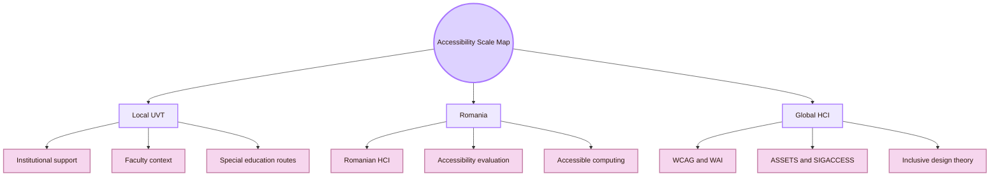

| Scale | What it means here | Main question |
|---|---|---|
| Local UVT | UVT support services, Faculty of Informatics, special education routes, teachers, students, project review, Obsidian, GitHub, CSS, Markdown, and classroom presentation | What does accessibility mean in the real university context where this map is built and assessed? |
| Romania | Romanian HCI, web accessibility evaluation, accessible computing, assistive technology, inclusive education, and emerging AI accessibility work | What national routes can make the project less dependent on only global sources? |
| Global HCI | CS2023, W3C WAI, WCAG, WAI-ARIA, ACM SIGACCESS, ASSETS, TACCESS, Web4All, inclusive design, universal design, and ability-based design | Which recognised standards and research communities should guide the project? |

## Why this page matters

A student project can look accessible because it is readable on the author’s laptop. That is not enough. Accessibility depends on the institution, the users, the tools, the devices, the language, the viewing context, and the evidence collected.

For Cognishire, local and global thinking prevents three common mistakes.

| Mistake | Why it is a problem | Better approach |
|---|---|---|
| Using only global standards | The project may ignore the real UVT context where it is used and judged | Start with UVT users, professor review, and local support context |
| Using only local impressions | A few classmates cannot prove broad accessibility | Interpret local findings through WCAG, WAI, and HCI research |
| Ignoring Romanian routes | The project may look detached from its national academic context | Add Romanian HCI, accessibility evaluation, and accessible-computing routes carefully |

## CS2023 Grounding

CS2023 places Accessibility and Inclusive Design inside Human-Computer Interaction. That makes accessibility part of Computer Science education, interface design, software engineering, evaluation, and accountability.

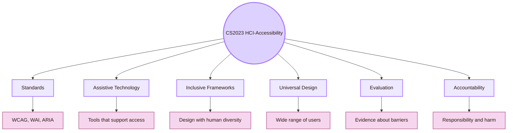

| CS2023 idea | Local UVT interpretation | Romanian interpretation | Global interpretation |
|---|---|---|---|
| Standards | Use WCAG/WAI logic to make the vault readable, navigable, and technically stable | Learn from Romanian website accessibility studies | Use W3C WAI, WCAG 2.2, WAI-ARIA, and WCAG-EM |
| Assistive technology | Connect the map to UVT support services and assistive-technology teaching routes | Study Romanian work on assistive systems and accessible interaction | Use ASSETS, SIGACCESS, RESNA, CREATE, and related research |
| Inclusive frameworks | Design for real students, professors, and viewers with varied needs | Connect to inclusive education and national HCI examples | Use inclusive design, universal design, and ability-based design |
| Evaluation | Test the vault locally and report the limits of the evidence | Compare with Romanian accessibility evaluation work | Use audits, assistive-technology checks, user tests, and standards mapping |
| Accountability | State what was tested, what was not tested, and who may still be excluded | Connect the project to institutional and national responsibility | Connect accessibility to ethics, disability rights, procurement, and policy |

## Local UVT Institutional Layer

The first local anchor is UVT’s institutional accessibility context. UVT publicly describes support for students with disabilities through the **Psychopedagogical Assistance and Integration Center**. UVT also describes access as a shared institutional responsibility, including adapted teaching and assessment methods, assistive technologies, accessible educational spaces, and support for educational participation.

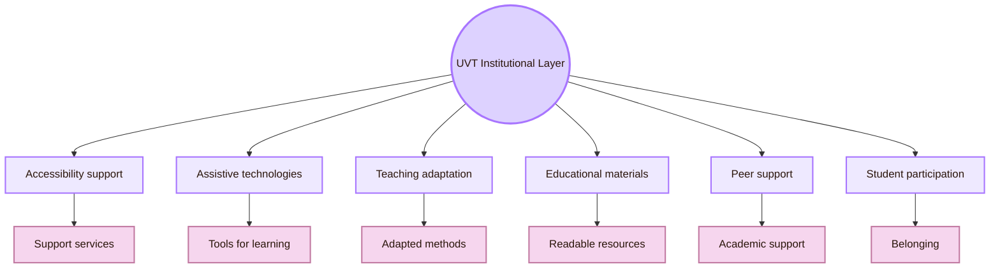

| UVT institutional route | How it supports this project |
|---|---|
| Accessibility for students with disabilities | Gives the official local support context for students who may need accommodations or assistive tools |
| Psychopedagogical Assistance and Integration Center | Shows that accessibility is part of academic support, not only interface design |
| Assistive technologies in teaching | Connects accessibility to learning materials, classroom participation, and practical tools |
| Teaching and assessment adaptation | Shows that access includes how students are taught and evaluated |
| Accessible educational resources | Connects directly to the Obsidian/GitHub vault as a digital learning artifact |
| Peer support and tutoring | Shows that accessibility also has a social and institutional layer |
| Inclusion initiatives | Connects access to participation, belonging, and dignity |

## Local UVT Academic Routes

Accessibility at UVT should not be mapped only through Informatics. The local academic picture has at least two layers.

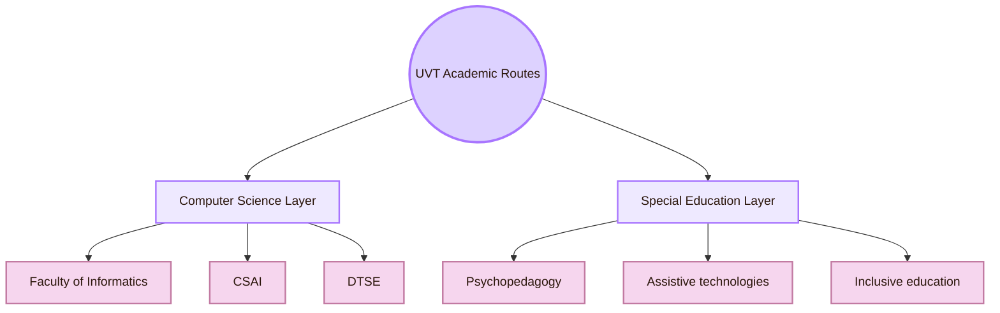

| UVT layer | What it contributes |
|---|---|
| Faculty of Informatics | The local Computer Science home of the project |
| CSAI: Computational Sciences and Artificial Intelligence | AI, data, medical informatics, e-health, recommender systems, image processing, and user-related prediction systems |
| DTSE: Digital Technologies and Software Engineering | Software systems, workflows, web technologies, cloud systems, repositories, and implementation reliability |
| Faculty of Sociology and Psychology / special education routes | Disability, psychopedagogy, assistive technologies, inclusive education, learning support, and communication needs |
| UVT accessibility services | Local procedures, support, accommodations, assistive technology, and teaching adaptation |
| Project presentation context | The real place where readability, academic clarity, and accessibility are judged |

## Local UVT Accessibility-Specific Routes

The strongest UVT accessibility-specific routes found for this page are linked to institutional accessibility support and special education / psychopedagogy. These routes are relevant because Accessibility and Inclusive Design is not only technical. It also concerns disability, learning access, communication, assistive technologies, and educational support.

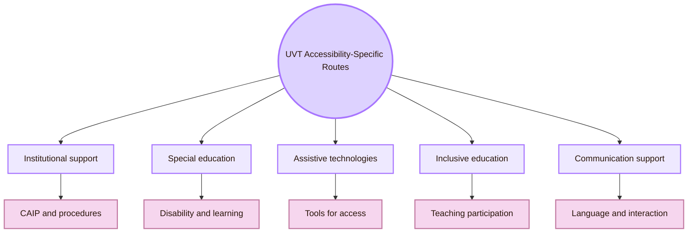

| Local route | Evidence type | Safe way to use it |
|---|---|---|
| UVT Psychopedagogical Assistance and Integration Center | UVT public accessibility pages describe services for students with disabilities | Use as the main local institutional accessibility anchor |
| Claudia-Vasilica Borca | UVT public staff and DPPD-related documents show an education / special-education route | Use as an education-focused route connected to special education, communication, and assistive-technology-adjacent topics |
| Anca Luștrea | Public UVT/DPPD documents show inclusive-education and disability-related education topics | Use as an inclusion and educational-support route |
| Mihai-Florin Predescu | Public UVT/DPPD documents show special-education and communication/learning-related topics | Use as a special-education and learner-context route |

## Local UVT Curriculum Routes

UVT curriculum and public documents show local routes that can inform Accessibility and Inclusive Design. Keep the course names in Romanian when the official source uses Romanian.

| Local curriculum route | Why it matters for this HCI map |
|---|---|
| Tehnologii asistive și de acces pentru persoanele cu deficiențe | Direct route to assistive technologies and access |
| TIC pentru persoane cu nevoi speciale / accesibilitatea digitală | Direct bridge between digital technologies and accessibility |
| Evaluarea accesibilității | Direct route to accessibility evaluation |
| Educația incluzivă a copiilor cu CES | Local route to inclusive education and learning access |
| Advocacy pentru persoane cu dizabilități | Connects accessibility to rights, representation, and responsibility |
| Intervenții specifice în tulburări de neurodezvoltare | Connects accessibility to neurodiversity and cognitive access |
| Psihodiagnosticul persoanelor cu dizabilități | Gives context for disability-related assessment, but it should not be treated as interface evaluation |

## Local UVT Informatics Routes

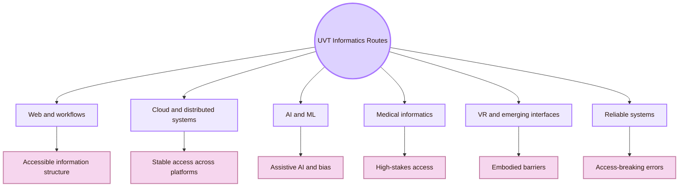

| UVT Informatics route | Possible accessibility connection |
|---|---|
| Workflows and web technologies | Accessible information systems, GitHub/Obsidian workflows, semantic web structure |
| Cloud and distributed systems | Robust access, remote learning, availability, and platform stability |
| AI and machine learning | Assistive AI, accessibility bias, image descriptions, user modelling, and personalisation |
| Medical informatics and e-health | Patient-facing access, trust, safety, and high-stakes interpretation |
| VR and emerging interaction | Accessible XR, spatial barriers, sensory access, motor access, and comfort |
| Formal verification and reliable systems | Preventing implementation errors that can break access |
| Recommender systems | Adaptive access, hidden bias, user control, and transparency |

## Romania Layer: HCI and Accessibility Routes

The Romanian layer expands beyond UVT. It is useful because this is a Romanian student HCI project. The national route should make visible Romanian HCI, accessible computing, web accessibility evaluation, assistive technology, and emerging AI accessibility work.

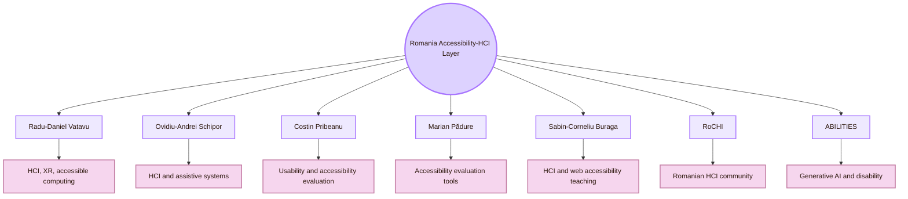

| Romania route | Public basis | Safe relevance statement |
|---|---|---|
| Radu-Daniel Vatavu | Public pages and ACM profile connect his work to HCI, gestural input, XR, ambient intelligence, and accessibility | Strong Romania-based route for HCI, accessible computing, and emerging interaction |
| Ovidiu-Andrei Schipor | Public CV/project pages connect him to Computer Science, HCI-related work, assistive technology, and speech-therapy systems | Relevant route for assistive technology, speech/language systems, and accessible interaction |
| Costin Pribeanu | Romanian HCI and Informatica Economică routes connect his work to usability and accessibility evaluation | Useful route for accessibility evaluation and Romanian university/public website studies |
| Marian Pădure | Co-authored work comparing accessibility evaluation tools and studying Romanian websites | Useful route for accessibility evaluation tools and web accessibility evidence |
| Sabin-Corneliu Buraga | Public HCI teaching materials include WAI/WCAG accessibility content | Useful Romanian route for HCI education and web-accessibility teaching |
| RoCHI / Romanian Journal of Human-Computer Interaction | National HCI conference and publication routes | National route for HCI, usability, accessibility, interaction methods, and Romanian case studies |
| A(I)BILITIES | Public project pages describe generative AI for personalised interactive solutions for users with disabilities | Current Romanian route for AI accessibility, adaptive interfaces, and ability-centered design |

## Romania Route I: Radu-Daniel Vatavu

| Field | Details |
|---|---|
| Institution | “Ștefan cel Mare” University of Suceava |
| Public route | Personal academic homepage, publication list, and ACM profile |
| Main topics | Human-computer interaction, gesture input, ambient intelligence, augmented/mixed/extended reality, and accessible computing routes |
| Why he matters here | His work gives a strong Romanian bridge between HCI, emerging interaction, XR, and accessibility |
| How to use this route | For accessible XR, gesture interaction, motor access, ambient systems, and Romanian HCI research |
| Safe study question | How can new interaction techniques create access for some users and barriers for others? |
| Source route | [Radu-Daniel Vatavu homepage](https://raduvatavu.usv.ro/) |

## Romania Route II: Ovidiu-Andrei Schipor

| Field | Details |
|---|---|
| Institution | “Ștefan cel Mare” University of Suceava |
| Public route | CV and project pages |
| Main topics | Computer Science, HCI-related work, assistive technology, wearable accessibility routes, and computer-assisted speech therapy systems |
| Why he matters here | His route connects accessibility to communication, therapy support, affective interaction, and assistive systems |
| How to use this route | For assistive technology, speech/language systems, child-focused therapeutic systems, and accessible interaction |
| Safe study question | How can an interactive system support communication or therapy without increasing exclusion or frustration? |
| Source route | [Ovidiu-Andrei Schipor projects](https://www.eed.usv.ro/~schipor/projects.php) |

## Romania Route III: Costin Pribeanu and Marian Pădure

| Field | Details |
|---|---|
| Public route | Romanian HCI, Informatica Economică, and website-accessibility evaluation papers |
| Main topics | Accessibility evaluation, usability evaluation, accessibility tools, Romanian public and university websites |
| Why they matter here | They provide a Romanian route for evaluating accessibility with tools and WCAG-oriented evidence |
| How to use this route | For comparing accessibility tools, studying Romanian university websites, and avoiding overconfidence in automated checking |
| Safe study question | How can accessibility tools be used responsibly when different tools report different results? |
| Source routes | [Comparing Six Free Accessibility Evaluation Tools](https://www.revistaie.ase.ro/content/93/02%20-%20padure%2C%20pribeanu.pdf), [RoCHI 2018 accessibility article listing](https://rochi.utcluj.ro/rrioc/en/rrioc-2018-4.html) |

## Romania Route IV: RoCHI Community

RoCHI is the Romanian HCI community route. It matters because Cognishire is a Romanian student project about HCI. RoCHI gives national context for user interfaces, usability, accessibility, empirical evaluation, HCI education, and interactive systems.

| Romanian venue / route | Why it matters |
|---|---|
| RoCHI Conference | National HCI conference route for Romania |
| Romanian Journal of Human-Computer Interaction | National HCI publication route |
| RoCHI proceedings | Useful place to search for Romanian HCI case studies and teaching reports |
| Accessibility and usability papers | Useful national examples for evaluation and local context |
| Community route | Makes the project less dependent on global sources alone |

## Romania Route V: ABILITIES

A(I)BILITIES is a Romanian route connecting generative AI and disability. Public project pages describe generative AI for personalised interactive solutions for users with sensory and motor disabilities. Public pages also connect the project to ability-centered design, digital accessibility, and cloud-based services.

| Project element | Why it matters for the Inclusive Gate |
|---|---|
| Generative AI for users with disabilities | Direct bridge to accessibility and future Oracle Engine work |
| Personalised interactive solutions | Connects to ability-centered design and adaptive interfaces |
| Cloud-based platform | Connects accessibility to infrastructure and deployment |
| Romanian project context | Gives a current national example beyond theory |
| Team route | Connects Romanian HCI/accessibility researchers and applied development |

## Global Layer

The global layer gives the project recognised standards and research communities. It should guide local and Romanian work, but it should not replace local testing.

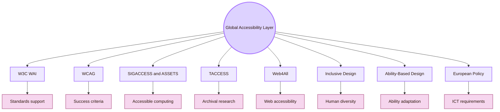

| Global route | Why it matters |
|---|---|
| W3C WAI | Standards and educational resources for web accessibility |
| WCAG 2.2 | Technical accessibility baseline for web content |
| WAI-ARIA and APG | Semantics and widget patterns for interactive components |
| ACM SIGACCESS and ASSETS | Core accessible-computing research community and conference |
| ACM TACCESS | Archival journal for accessible computing |
| Web4All | Web accessibility research venue |
| Microsoft Inclusive Design | Framework for recognising exclusion and learning from diversity |
| Ability-Based Design | HCI theory for adapting systems to what users can do |
| Universal Design | Broad design tradition for usability by a wide range of people |
| EN 301 549 and European Accessibility Act | European policy context for ICT accessibility |

## Local-to-Romania-to-Global Bridge

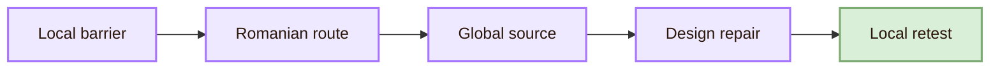

| Local UVT issue | Romanian route | Global route | Repair |
|---|---|---|---|
| Student cannot read a Mermaid diagram | RoCHI accessibility/evaluation route | WCAG, WebAIM, ASSETS | Improve contrast, reduce node text, add table explanation |
| GitHub/Obsidian setup fails | UVT Informatics workflow route | Robustness, WAI, software accessibility | Add fallback Markdown and setup notes |
| Student may need adapted material | UVT accessibility support and special education routes | Inclusive Design, Universal Design, WCAG | Provide readable structure, alternative formats, and clear source paths |
| AI guide may produce wrong accessibility advice | A(I)BILITIES and Romanian AI accessibility route | CHI, ASSETS, IUI, FAccT | Verify generated content and cite trusted sources |
| Professor asks why the local layer matters | UVT Faculty context and RoCHI | CS2023 and global HCI | Add local UVT and Romanian research anchors |

## Local and Global Comparison Matrix

| Dimension | Local UVT | Romania | Global HCI |
|---|---|---|---|
| Main role | Project context and institutional responsibility | National research and practice context | International standards and research field |
| People and routes | UVT accessibility support, special education routes, Informatics routes | Vatavu, Schipor, Pribeanu, Pădure, Buraga, RoCHI, A(I)BILITIES | Wobbrock, Mankoff, Ladner, Lazar, Findlater, Bennett, Kacorri, Morris, and accessibility communities |
| Methods | Local accessibility trial, professor review, student comprehension task, clone/setup test | Accessibility evaluation of Romanian websites, Romanian HCI case studies, assistive-system projects | WCAG evaluation, assistive-technology studies, disability-centered HCI, inclusive design research |
| Venues | UVT services, Faculty of Informatics, seminars, project presentation | RoCHI, Romanian Journal of HCI, USV/MintViz, A(I)BILITIES | ASSETS, SIGACCESS, TACCESS, Web4All, CHI, W3C WAI |
| Risks | Treating accessibility as decoration | Treating Romania as invisible in HCI | Treating global standards as enough without local evidence |
| Best use | Test and ground the map locally | Add national relevance and examples | Anchor the project in recognised standards and peer-reviewed work |

## Contact Protocol

For local and Romanian routes, contact should be precise and respectful. Do not write generic messages. Read one official page or paper first.

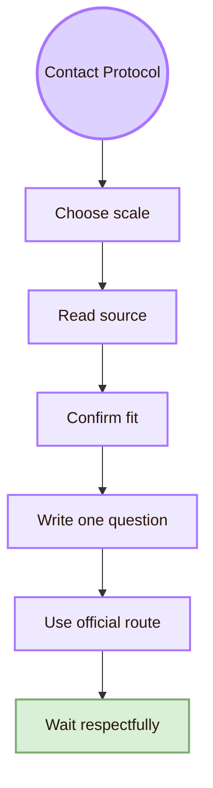

| Contact target | Good question |
|---|---|
| UVT accessibility support | “Which local accessibility practices should a student digital project respect?” |
| UVT special education route | “What should a CS project consider when it uses assistive technologies or accessible learning materials?” |
| UVT Informatics route | “How can this GitHub/Obsidian project remain technically stable and accessible after sharing?” |
| Romanian HCI researcher | “Which Romanian accessibility evaluation paper or RoCHI route should I read first?” |
| Romanian AI/accessibility route | “How can AI support users with disabilities without producing unreliable accessibility advice?” |
| Global researcher | “Which method should I use to evaluate one specific accessibility barrier in my project?” |

### Example local email

## Cognishire Application

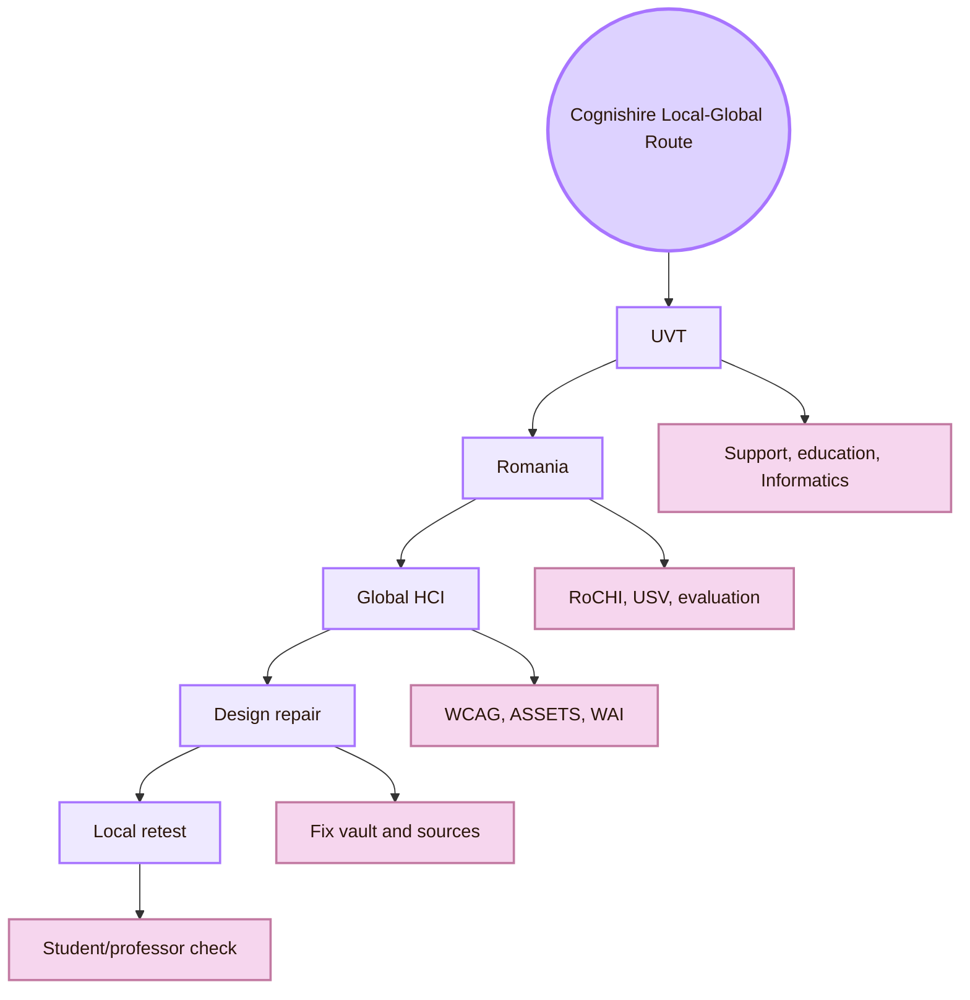

| Cognishire element | Local UVT source | Romanian route | Global route |
|---|---|---|---|
| Accessibility explanation | UVT accessibility support and special education routes | RoCHI accessibility studies | W3C WAI, WCAG, Inclusive Design |
| Mermaid diagrams | Local student readability test | Romanian HCI evaluation route | WCAG, WebAIM, ASSETS |
| GitHub sharing | UVT Informatics software/workflow routes | RoCHI / software usability route | Robustness, accessibility testing, reproducibility |
| AI future | UVT AI/Informatics routes | A(I)BILITIES, Vatavu, Schipor | CHI, ASSETS, IUI, FAccT |
| Academic credibility | UVT Faculty context | Romanian HCI Journal / RoCHI | CS2023, SIGACCESS, TACCESS |
| Inclusive learning | UVT special education and CAIP context | Romanian education/accessibility studies | Universal Design, Ability-Based Design |

## Student Portfolio Use

A student should not only say that the vault is accessible. They should collect evidence that shows what was checked.

| Portfolio artifact | What it proves |
|---|---|
| Local UVT accessibility note | Shows that the project was grounded in the real university context |
| Romanian source map | Shows that national HCI/accessibility routes were searched |
| WCAG-oriented issue log | Shows structured accessibility thinking |
| Keyboard and zoom check | Shows basic access testing |
| GitHub/Obsidian fallback test | Shows robustness thinking |
| Revision log | Shows that accessibility findings changed the design |

## Academic Anchors

| Route | Source |
|---|---|
| CS2023 HCI Accessibility basis | [CS2023 HCI Version Gamma](https://csed.acm.org/wp-content/uploads/2023/09/HCI-Version-Gamma.pdf) |
| UVT accessibility for students with disabilities | [UVT: Accessibility for students with disabilities](https://uvt.ro/en/educatie/info-studenti-proces-educational/accesibilitate-pentru-studentii-cu-dizabilitati/) |
| UVT social inclusion | [UVT actively promotes social inclusion](https://www.uvt.ro/en/blog/uvt-promoveaza-activ-incluziunea-sociala/) |
| UVT Faculty of Informatics | [Faculty of Informatics UVT](https://info.uvt.ro/en/) |
| UVT Faculty departments | [Faculty of Informatics Departments](https://info.uvt.ro/en/departamente/) |
| UVT CSAI Department | [Department of Computational Sciences and Artificial Intelligence](https://info.uvt.ro/en/departamente/csai/) |
| UVT DTSE Department | [Department of Digital Technologies and Software Engineering](https://info.uvt.ro/en/departamente/dtse/) |
| UVT research routes | [Research Center in Computer Science: Researchers](https://research.info.uvt.ro/researchers/) |
| UVT special education / education staff route | [UVT Faculty of Sociology and Psychology: Education Sciences staff](https://fsp.uvt.ro/facultate/conducere-departament/cadre-didactice-stiinte-ale-educatiei/) |
| UVT DPPD allocation routes | [UVT DPPD public allocation document](https://dppd.uvt.ro/wp-content/uploads/2025/02/Copie-a-P-P-S-SITE.pdf) |
| Radu-Daniel Vatavu | [Radu-Daniel Vatavu homepage](https://raduvatavu.usv.ro/) |
| Radu-Daniel Vatavu ACM profile | [ACM profile](https://dl.acm.org/profile/81343507895) |
| Ovidiu-Andrei Schipor | [Ovidiu-Andrei Schipor projects](https://www.eed.usv.ro/~schipor/projects.php) |
| Ovidiu-Andrei Schipor CV route | [Ovidiu-Andrei Schipor CV](https://fiesc.usv.ro/wp-content/uploads/sites/17/2022/09/CV_en_2022.pdf) |
| A(I)BILITIES project | [A(I)BILITIES](https://aibilities.ro/en/about/) |
| A(I)BILITIES MintViz project route | [MintViz A(I)BILITIES](https://mintviz.usv.ro/projects/A%28I%29BILITIES/index.php) |
| Costin Pribeanu research route | [Informatica Economică author details](https://revistaie.ase.ro/author_details.aspx?aid=5148) |
| Pădure and Pribeanu accessibility tools | [Comparing Six Free Accessibility Evaluation Tools](https://www.revistaie.ase.ro/content/93/02%20-%20padure%2C%20pribeanu.pdf) |
| Romanian university website accessibility | [RoCHI / RRIoC 2018 accessibility article listing](https://rochi.utcluj.ro/rrioc/en/rrioc-2018-4.html) |
| Romanian HCI conference | [RoCHI proceedings](https://rochi.utcluj.ro/proceedings/en/) |
| RoCHI conference description | [RoCHI EasyChair page](https://easychair.org/cfp/RoCHI-2023) |
| Sabin-Corneliu Buraga HCI accessibility teaching route | [UAIC HCI Design Methodologies slides](https://profs.info.uaic.ro/sabin.buraga/teach/courses/hci/presentations/hci03-DesignMethodologies.pdf) |
| W3C WAI | [Web Accessibility Initiative](https://www.w3.org/WAI/) |
| WCAG 2.2 | [Web Content Accessibility Guidelines 2.2](https://www.w3.org/TR/WCAG22/) |
| WAI-ARIA Authoring Practices | [ARIA APG](https://www.w3.org/WAI/ARIA/apg/) |
| ACM SIGACCESS | [ACM SIGACCESS](https://www.sigaccess.org/) |
| ACM ASSETS | [ASSETS Conference](https://www.sigaccess.org/assets/) |
| ACM TACCESS | [ACM Transactions on Accessible Computing](https://dl.acm.org/journal/taccess) |
| Web4All | [International Web for All Conference](https://www.w4a.info/) |
| Microsoft Inclusive Design | [Microsoft Inclusive Design](https://inclusive.microsoft.design/) |
| Ability-Based Design paper | [Ability-Based Design](https://kgajos.seas.harvard.edu/papers/wobbrock11abd.pdf) |
| European Accessibility Act | [European Commission: European Accessibility Act](https://commission.europa.eu/strategy-and-policy/policies/justice-and-fundamental-rights/disability/european-accessibility-act-eaa_en) |
| EN 301 549 | [Accessibility requirements for ICT products and services](https://accessible-eu-centre.ec.europa.eu/content-corner/digital-library/en-3015492021-accessibility-requirements-ict-products-and-services_en) |

^local-global-accessibility-inclusive-design-end
