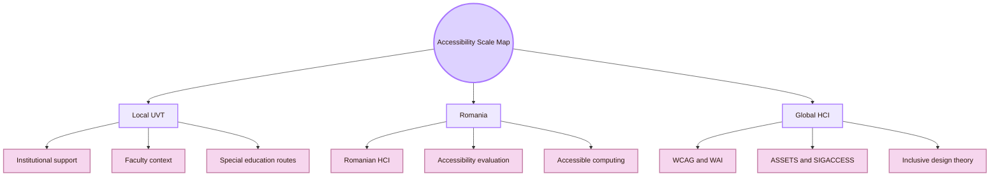
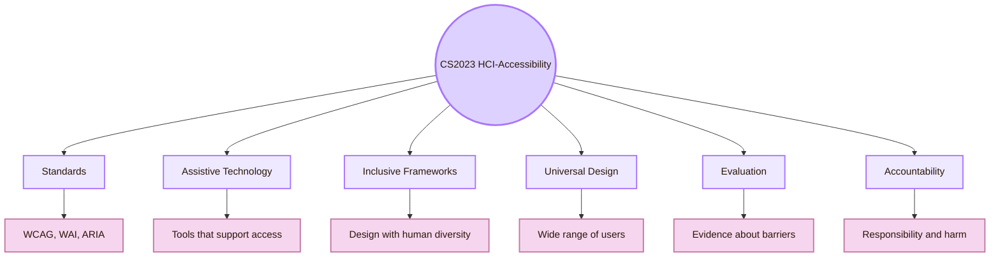
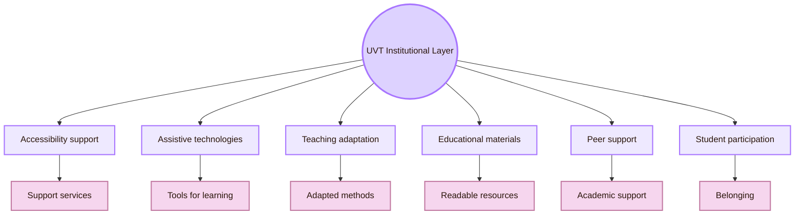
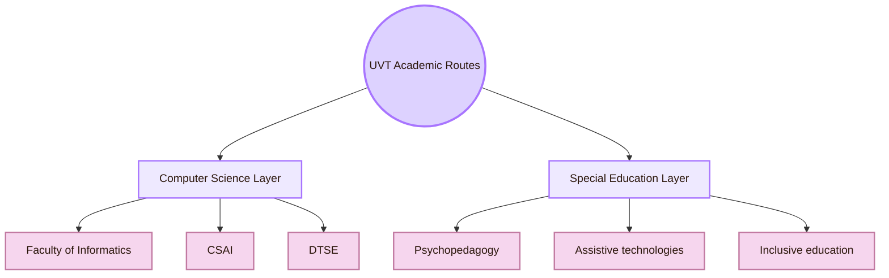
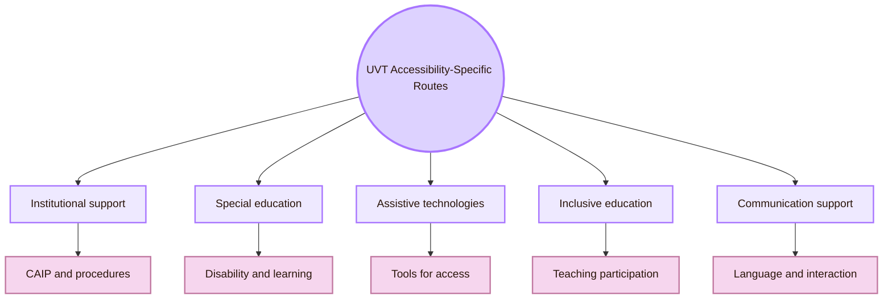
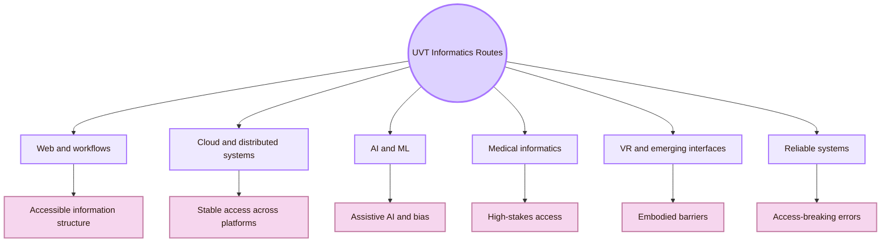
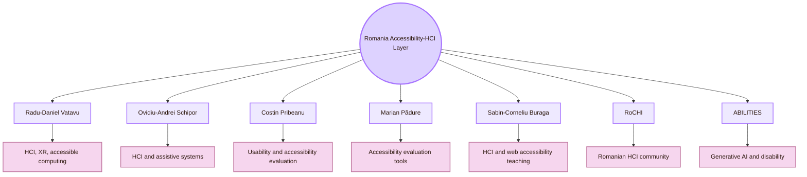
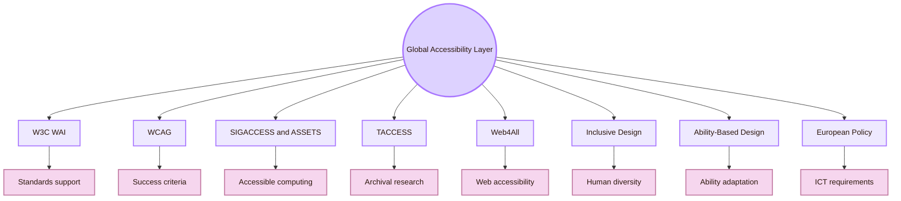
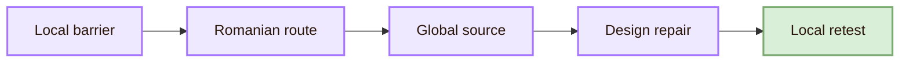
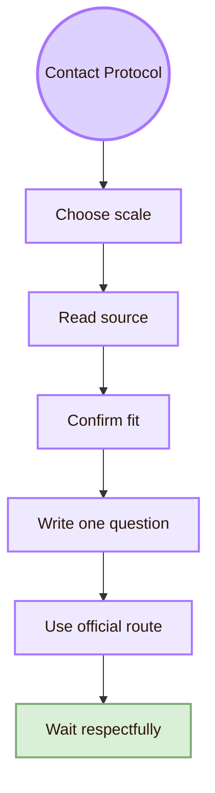

![[scenary.png|1000]]
# Local and Global

> [!abstract] Local and Global Accessibility Map
> This page explains how **Accessibility and Inclusive Design** connects across three scales: **UVT**, **Romania**, and the **global accessibility field**. It helps a student ground a local HCI study in real institutional context, national research routes, and recognised international standards.

## Scale Map

## Common mistakes

## CS2023 Grounding

CS2023 places Accessibility and Inclusive Design inside Human-Computer Interaction. That makes accessibility part of Computer Science education, interface design, software engineering, evaluation, and accountability.

## Local UVT Institutional Layer

The first local anchor is UVT’s institutional accessibility context. UVT publicly describes support for students with disabilities through the **Psychopedagogical Assistance and Integration Center**. UVT also describes access as a shared institutional responsibility, including adapted teaching and assessment methods, assistive technologies, accessible educational spaces, and support for educational participation.

## Local UVT Academic Routes

Accessibility at UVT should not be mapped only through Informatics. The local academic picture has at least two layers.

- **Faculty of Informatics:** The local Computer Science home of the study
- **CSAI: Computational Sciences and Artificial Intelligence:** AI, data, medical informatics, e-health, recommender systems, image processing, and user-related prediction systems
- **DTSE: Digital Technologies and Software Engineering:** Software systems, workflows, web technologies, cloud systems, repositories, and implementation reliability
- **Faculty of Sociology and Psychology / special education routes:** Disability, psychopedagogy, assistive technologies, inclusive education, learning support, and communication needs
- **UVT accessibility services:** Local procedures, support, accommodations, assistive technology, and teaching adaptation
- **Project presentation context:** The real place where readability, academic clarity, and accessibility are judged

## Local UVT Accessibility-Specific Routes

The strongest UVT accessibility-specific routes found for this page are linked to institutional accessibility support and special education / psychopedagogy. These routes are relevant because Accessibility and Inclusive Design is not only technical. It also concerns disability, learning access, communication, assistive technologies, and educational support.

- **UVT Psychopedagogical Assistance and Integration Center:** evidence type: UVT public accessibility pages describe services for students with disabilities; safe way to use it: Use as the main local institutional accessibility anchor
- **Claudia-Vasilica Borca:** evidence type: UVT public staff and DPPD-related documents show an education / special-education route; safe way to use it: Use as an education-focused route connected to special education, communication, and assistive-technology-adjacent topics
- **Anca Luștrea:** evidence type: Public UVT/DPPD documents show inclusive-education and disability-related education topics; safe way to use it: Use as an inclusion and educational-support route
- **Mihai-Florin Predescu:** evidence type: Public UVT/DPPD documents show special-education and communication/learning-related topics; safe way to use it: Use as a special-education and learner-context route

## Local UVT Curriculum Routes

UVT curriculum and public documents show local routes that can inform Accessibility and Inclusive Design. Keep the course names in Romanian when the official source uses Romanian.

- **Tehnologii asistive și de acces pentru persoanele cu deficiențe:** Direct route to assistive technologies and access
- **TIC pentru persoane cu nevoi speciale / accesibilitatea digitală:** Direct bridge between digital technologies and accessibility
- **Evaluarea accesibilității:** Direct route to accessibility evaluation
- **Educația incluzivă a copiilor cu CES:** Local route to inclusive education and learning access
- **Advocacy pentru persoane cu dizabilități:** Connects accessibility to rights, representation, and responsibility
- **Intervenții specifice în tulburări de neurodezvoltare:** Connects accessibility to neurodiversity and cognitive access
- **Psihodiagnosticul persoanelor cu dizabilități:** Gives context for disability-related assessment, but it should not be treated as interface evaluation

## Local UVT Informatics Routes

## Romania Layer: HCI and Accessibility Routes

The Romanian layer expands beyond UVT. It is useful because this is a Romanian student HCI study. The national route should make visible Romanian HCI, accessible computing, web accessibility evaluation, assistive technology, and emerging AI accessibility work.

- **Radu-Daniel Vatavu:** public basis: Public pages and ACM profile connect his work to HCI, gestural input, XR, ambient intelligence, and accessibility; safe relevance statement: Strong Romania-based route for HCI, accessible computing, and emerging interaction
- **Ovidiu-Andrei Schipor:** public basis: Public CV/research pages connect him to Computer Science, HCI-related work, assistive technology, and speech-therapy systems; safe relevance statement: Relevant route for assistive technology, speech/language systems, and accessible interaction
- **Costin Pribeanu:** public basis: Romanian HCI and Informatica Economică routes connect his work to usability and accessibility evaluation; safe relevance statement: Useful route for accessibility evaluation and Romanian university/public website studies
- **Marian Pădure:** public basis: Co-authored work comparing accessibility evaluation tools and studying Romanian websites; safe relevance statement: Useful route for accessibility evaluation tools and web accessibility evidence
- **Sabin-Corneliu Buraga:** public basis: Public HCI teaching materials include WAI/WCAG accessibility content; safe relevance statement: Useful Romanian route for HCI education and web-accessibility teaching
- **RoCHI / Romanian Journal of Human-Computer Interaction:** public basis: National HCI conference and publication routes; safe relevance statement: National route for HCI, usability, accessibility, interaction methods, and Romanian case studies
- **A(I)BILITIES:** public basis: Public research pages describe generative AI for personalised interactive solutions for users with disabilities; safe relevance statement: Current Romanian route for AI accessibility, adaptive interfaces, and ability-centered design

## Romania Route I: Radu-Daniel Vatavu

- **Institution:** “Ștefan cel Mare” University of Suceava
- **Public route:** Personal academic homepage, publication list, and ACM profile
- **Main topics:** Human-computer interaction, gesture input, ambient intelligence, augmented/mixed/extended reality, and accessible computing routes
- **Why he matters here:** His work gives a strong Romanian bridge between HCI, emerging interaction, XR, and accessibility
- **How to use this route:** For accessible XR, gesture interaction, motor access, ambient systems, and Romanian HCI research
- **Safe study question:** How can new interaction techniques create access for some users and barriers for others?
- **Source route:** [Radu-Daniel Vatavu homepage](https://raduvatavu.usv.ro/)

## Romania Route II: Ovidiu-Andrei Schipor

- **Institution:** “Ștefan cel Mare” University of Suceava
- **Public route:** CV and research pages
- **Main topics:** Computer Science, HCI-related work, assistive technology, wearable accessibility routes, and computer-assisted speech therapy systems
- **Why he matters here:** His route connects accessibility to communication, therapy support, affective interaction, and assistive systems
- **How to use this route:** For assistive technology, speech/language systems, child-focused therapeutic systems, and accessible interaction
- **Safe study question:** How can an interactive system support communication or therapy without increasing exclusion or frustration?
- **Source route:** [Ovidiu-Andrei Schipor projects](https://www.eed.usv.ro/~schipor/projects.php)

## Romania Route III: Costin Pribeanu and Marian Pădure

- **Public route:** Romanian HCI, Informatica Economică, and website-accessibility evaluation papers
- **Main topics:** Accessibility evaluation, usability evaluation, accessibility tools, Romanian public and university websites
- **Why they matter here:** They provide a Romanian route for evaluating accessibility with tools and WCAG-oriented evidence
- **How to use this route:** For comparing accessibility tools, studying Romanian university websites, and avoiding overconfidence in automated checking
- **Safe study question:** How can accessibility tools be used responsibly when different tools report different results?
- **Source routes:** [Comparing Six Free Accessibility Evaluation Tools](https://www.revistaie.ase.ro/content/93/02%20-%20padure%2C%20pribeanu.pdf), [RoCHI 2018 accessibility article listing](https://rochi.utcluj.ro/rrioc/en/rrioc-2018-4.html)

## Romania Route IV: RoCHI Community

| Romanian venue / route | Why it matters |
|---|---|
| RoCHI Conference | National HCI conference route for Romania |
| Romanian Journal of Human-Computer Interaction | National HCI publication route |
| RoCHI proceedings | Useful place to search for Romanian HCI case studies and teaching reports |
| Accessibility and usability papers | Useful national examples for evaluation and local context |
| Community route | Makes the study less dependent on global sources alone |

## Romania Route V: ABILITIES

A(I)BILITIES is a Romanian route connecting generative AI and disability. Public research pages describe generative AI for personalised interactive solutions for users with sensory and motor disabilities. Public pages also connect the study to ability-centered design, digital accessibility, and cloud-based services.

## Global Layer

The global layer gives the study recognised standards and research communities. It should guide local and Romanian work, but it should not replace local testing.

- **W3C WAI:** Standards and educational resources for web accessibility
- **WCAG 2.2:** Technical accessibility baseline for web content
- **WAI-ARIA and APG:** Semantics and widget patterns for interactive components
- **ACM SIGACCESS and ASSETS:** Core accessible-computing research community and conference
- **ACM TACCESS:** Archival journal for accessible computing
- **Web4All:** Web accessibility research venue
- **Microsoft Inclusive Design:** Framework for recognising exclusion and learning from diversity
- **Ability-Based Design:** HCI theory for adapting systems to what users can do
- **Universal Design:** Broad design tradition for usability by a wide range of people
- **EN 301 549 and European Accessibility Act:** European policy context for ICT accessibility

## Local-to-Romania-to-Global Bridge

## Local and Global Comparison Matrix

## Contact Protocol

For local and Romanian routes, contact should be precise and respectful. Do not write generic messages. Read one official page or paper first.

### Example local email

## Student Portfolio Use

## Academic Anchors

| Route | Source |
|---|---|
| CS2023 HCI Accessibility basis | [CS2023 HCI Version Gamma](https://csed.acm.org/wp-content/uploads/2023/09/HCI-Version-Gamma.pdf) |
| UVT accessibility for students with disabilities | [UVT: Accessibility for students with disabilities](https://uvt.ro/en/educatie/info-studenti-proces-educational/accesibilitate-pentru-studentii-cu-dizabilitati/) |
| UVT social inclusion | [UVT actively promotes social inclusion](https://www.uvt.ro/en/blog/uvt-promoveaza-activ-incluziunea-sociala/) |
| UVT Faculty of Informatics | [Faculty of Informatics UVT](https://info.uvt.ro/en/) |
| UVT Faculty departments | [Faculty of Informatics Departments](https://info.uvt.ro/en/departamente/) |
| UVT CSAI Department | [Department of Computational Sciences and Artificial Intelligence](https://info.uvt.ro/en/departamente/csai/) |
| UVT DTSE Department | [Department of Digital Technologies and Software Engineering](https://info.uvt.ro/en/departamente/dtse/) |
| UVT research routes | [Research Center in Computer Science: Researchers](https://research.info.uvt.ro/researchers/) |
| UVT special education / education staff route | [UVT Faculty of Sociology and Psychology: Education Sciences staff](https://fsp.uvt.ro/facultate/conducere-departament/cadre-didactice-stiinte-ale-educatiei/) |
| UVT DPPD allocation routes | [UVT DPPD public allocation document](https://dppd.uvt.ro/wp-content/uploads/2025/02/Copie-a-P-P-S-SITE.pdf) |
| Radu-Daniel Vatavu | [Radu-Daniel Vatavu homepage](https://raduvatavu.usv.ro/) |
| Radu-Daniel Vatavu ACM profile | [ACM profile](https://dl.acm.org/profile/81343507895) |
| Ovidiu-Andrei Schipor | [Ovidiu-Andrei Schipor projects](https://www.eed.usv.ro/~schipor/projects.php) |
| Ovidiu-Andrei Schipor CV route | [Ovidiu-Andrei Schipor CV](https://fiesc.usv.ro/wp-content/uploads/sites/17/2022/09/CV_en_2022.pdf) |
| A(I)BILITIES route | [A(I)BILITIES](https://aibilities.ro/en/about/) |
| A(I)BILITIES MintViz research route | [MintViz A(I)BILITIES](https://mintviz.usv.ro/projects/A%28I%29BILITIES/index.php) |
| Costin Pribeanu research route | [Informatica Economică author details](https://revistaie.ase.ro/author_details.aspx?aid=5148) |
| Pădure and Pribeanu accessibility tools | [Comparing Six Free Accessibility Evaluation Tools](https://www.revistaie.ase.ro/content/93/02%20-%20padure%2C%20pribeanu.pdf) |
| Romanian university website accessibility | [RoCHI / RRIoC 2018 accessibility article listing](https://rochi.utcluj.ro/rrioc/en/rrioc-2018-4.html) |
| Romanian HCI conference | [RoCHI proceedings](https://rochi.utcluj.ro/proceedings/en/) |
| RoCHI conference description | [RoCHI EasyChair page](https://easychair.org/cfp/RoCHI-2023) |
| Sabin-Corneliu Buraga HCI accessibility teaching route | [UAIC HCI Design Methodologies slides](https://profs.info.uaic.ro/sabin.buraga/teach/courses/hci/presentations/hci03-DesignMethodologies.pdf) |
| W3C WAI | [Web Accessibility Initiative](https://www.w3.org/WAI/) |
| WCAG 2.2 | [Web Content Accessibility Guidelines 2.2](https://www.w3.org/TR/WCAG22/) |
| WAI-ARIA Authoring Practices | [ARIA APG](https://www.w3.org/WAI/ARIA/apg/) |
| ACM SIGACCESS | [ACM SIGACCESS](https://www.sigaccess.org/) |
| ACM ASSETS | [ASSETS Conference](https://www.sigaccess.org/assets/) |
| ACM TACCESS | [ACM Transactions on Accessible Computing](https://dl.acm.org/journal/taccess) |
| Web4All | [International Web for All Conference](https://www.w4a.info/) |
| Microsoft Inclusive Design | [Microsoft Inclusive Design](https://inclusive.microsoft.design/) |
| Ability-Based Design paper | [Ability-Based Design](https://kgajos.seas.harvard.edu/papers/wobbrock11abd.pdf) |
| European Accessibility Act | [European Commission: European Accessibility Act](https://commission.europa.eu/strategy-and-policy/policies/justice-and-fundamental-rights/disability/european-accessibility-act-eaa_en) |
| EN 301 549 | [Accessibility requirements for ICT products and services](https://accessible-eu-centre.ec.europa.eu/content-corner/digital-library/en-3015492021-accessibility-requirements-ict-products-and-services_en) |

^local-global-accessibility-inclusive-design-end
