![[samurai.jpg|1000]]
# Open Problems

Back to [[Overview|The Inclusive Gate]].

> [!abstract] Inclusive Frontier Map

The fantasy name is **Inclusive Frontier Map**.  
The real CS2023 label is **HCI-Accessibility: Accessibility and Inclusive Design**.  
The connected responsibility route is **HCI-Accountability: Accountability and Responsibility in Design**.  

This page is not a checklist. A checklist says what to inspect. An open-problems page asks why accessibility still fails even when designers know that accessibility matters. It examines why accessible design can become late, partial, under-tested, over-automated, compliance-only, or disconnected from disabled people’s lived experience.

> [!quote] Frontier law
> Accessibility becomes an open problem when a design says “everyone can use this,” but the evidence does not yet show who can enter, act, understand, trust, recover, and participate.

## Frontier Map

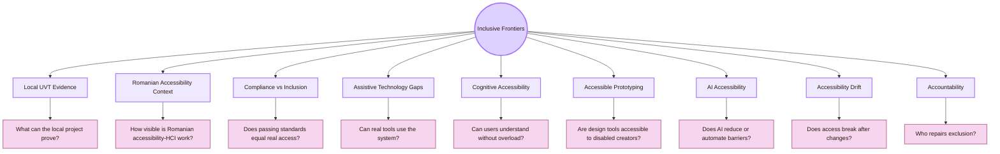

| Frontier | Core unresolved question | Why it matters |
|---|---|---|
| Local UVT evidence | What can a UVT student project honestly prove about accessibility? | Local tests are necessary but limited |
| Romanian accessibility context | How do Romanian HCI, accessibility evaluation, AI, and assistive-technology routes connect? | The map should not ignore national research routes |
| Compliance vs inclusion | Does meeting criteria mean users can really participate? | Standards are necessary but not sufficient |
| Assistive technology gaps | Does the system work with real access tools and strategies? | Visual usability does not prove technical access |
| Cognitive accessibility | Can users understand, remember, and recover without overload? | Many barriers are cognitive, not only visual |
| Accessible prototyping | Can disabled people participate in making the design, not only testing it? | Design tools and methods can exclude contributors |
| AI accessibility | Does AI help disabled users or create new risks? | AI can assist, mislead, bias, or hide uncertainty |
| Accessibility drift | Does accessibility break after updates, CSS changes, or platform changes? | Access is not stable without maintenance |
| Accountability | Who owns the barrier, the evidence, and the repair? | Accessibility without responsibility becomes symbolic access |

## How to read this page

| Use this page when... | What to do |
|---|---|
| A tool reports a high accessibility score | Check what the tool cannot detect |
| A design follows WCAG criteria | Test whether users can complete real tasks |
| A local UVT test looks positive | state the local limits of the evidence |
| AI produces accessibility advice | verify the advice with standards and human judgement |
| A page looks visually polished | check whether the polish creates access barriers |

## CS2023 Frontier Gate

CS2023 places Accessibility and Inclusive Design inside HCI. That means the open problems are not outside Computer Science. They belong to interface design, software engineering, AI, evaluation, education, data systems, and accountability.

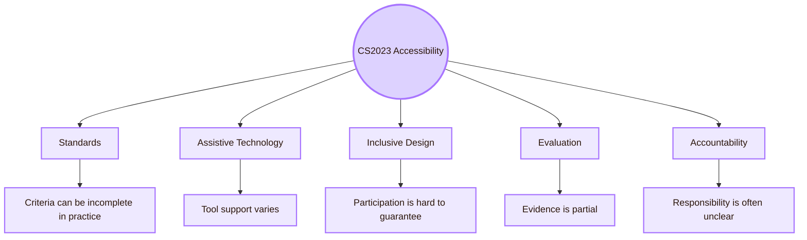

| CS2023 accessibility element | Open problem |
|---|---|
| Standards | Standards define criteria, but lived access can still fail |
| Assistive technologies | Tools differ, users differ, and testing access is resource-heavy |
| Inclusive frameworks | Inclusion can become branding unless excluded users shape the design |
| Universal design | One design rarely works perfectly for everyone without tradeoffs |
| Accessibility evaluation | Automated checks miss many real barriers |
| Accountability | Institutions and designers often report access as solved too early |

## Local Frontier I: UVT Evidence Is Necessary but Limited

The first open problem is local. The Cognishire HCI map is built and evaluated in a UVT context. UVT has institutional accessibility routes, students with diverse needs, teachers, digital materials, project assessment, and support services. That local context matters, but it does not prove global accessibility by itself.

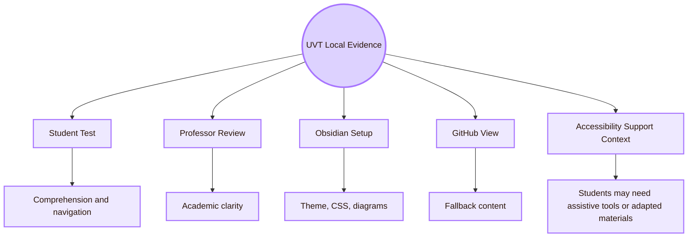

| Local UVT open problem | Why it is difficult | What evidence is needed |
|---|---|---|
| Does the map work for students with different access needs? | A normal classmate test may not include disabled users or assistive technologies | Keyboard check, zoom check, readable structure, local feedback |
| Does the professor see the accessibility logic? | Fantasy names and visual style can hide the official CS2023 meaning | Professor review of labels, sources, and route structure |
| Does the vault survive setup changes? | Obsidian themes, CSS, Mermaid, and GitHub views can behave differently | Clone test and fallback Markdown inspection |
| Does the map respect UVT accessibility context? | Local accessibility services are institutional, not only technical | Local source anchoring and cautious wording |

## Local Frontier II: Accessibility Is Not Only Informatics

For this area, the local UVT map must not look only inside the Faculty of Informatics. Accessibility also connects to psychopedagogy, special education, assistive technologies, inclusive education, institutional support, teaching adaptation, and student services.

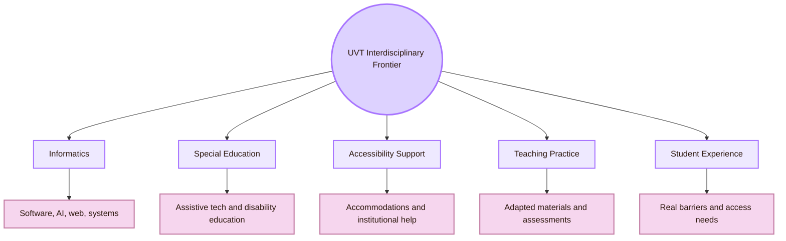

| UVT layer | Open problem |
|---|---|
| Informatics | How can CS projects build accessibility into code, systems, repositories, and AI? |
| Special education | How can disability and assistive-technology knowledge inform HCI design? |
| Accessibility support | How can local support practices be represented without turning them into token references? |
| Teaching practice | How should digital materials and assessments be adapted responsibly? |
| Student experience | How do students actually experience access, stigma, extra effort, and support? |

This is an open problem because accessibility crosses departments. A Computer Science project may understand code but miss disability education. A special education route may understand access needs but not software implementation. The Inclusive Gate must connect both.

## Romania Frontier: National Visibility and Research Connection

The Romanian layer matters because the map should not depend only on global sources. Publicly visible Romanian routes include RoCHI, the Romanian Journal of Human-Computer Interaction, Suceava HCI and accessible-computing work, web-accessibility evaluation studies, and emerging AI-accessibility projects. This list should be treated as a starting point, not as a complete national survey.

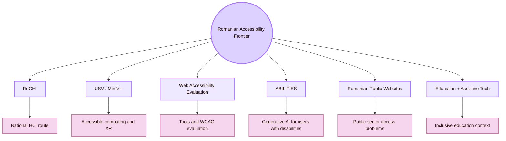

| Romanian open problem | Why it matters | Possible route |
|---|---|---|
| Romanian HCI accessibility work is fragmented | A student may miss national researchers and venues | RoCHI, RRIoC, USV/MintViz |
| Web accessibility evaluation remains difficult | Automated tools disagree and cover different criteria | Pădure and Pribeanu accessibility-tool studies |
| Romanian public/university website accessibility needs monitoring | Public access requires systematic evidence | Romanian web accessibility evaluation papers |
| AI accessibility is emerging | Generative AI may support or mislead users with disabilities | A(I)BILITIES, CHI, ASSETS, IUI, FAccT |
| Accessibility in education requires local practice | Digital learning materials need support, adaptation, and alternative formats | UVT and Romanian special education routes |
| Romanian language accessibility is under-discussed | Language, terminology, and cognitive access differ by context | Romanian HCI and education studies |

## Frontier I: Compliance Does Not Equal Inclusion

WCAG is essential. It gives a common structure for perceivable, operable, understandable, and robust web content. But meeting selected success criteria does not automatically prove that a user can complete real tasks comfortably, understand meaning, feel included, or participate without extra burden.

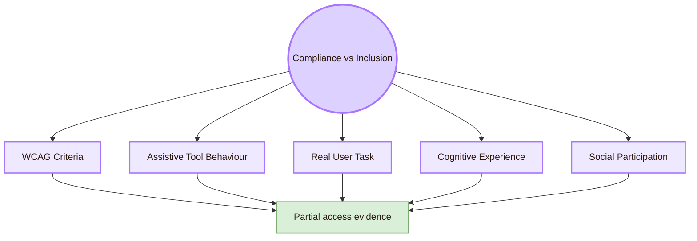

| Compliance can show | Compliance may miss |
|---|---|
| Some contrast, label, keyboard, and semantic failures | Whether the content is understandable |
| Whether criteria are met in tested pages | Whether the full task is possible |
| Whether a web page follows formal rules | Whether users trust or feel safe using it |
| Whether automated tools detect known issues | Whether disabled users experience fatigue or stigma |
| Whether a component has correct markup | Whether the whole workflow is accessible |

The open problem is not whether standards matter. They do. The problem is treating standards as the end of accessibility instead of the baseline.

## Frontier II: Automated Tools Are Partial

Automated accessibility tools are useful for scanning pages, but they cannot detect all barriers. They can miss cognitive problems, misleading labels, bad alt text, confusing workflows, keyboard traps in some contexts, and whether the design actually helps people complete goals.

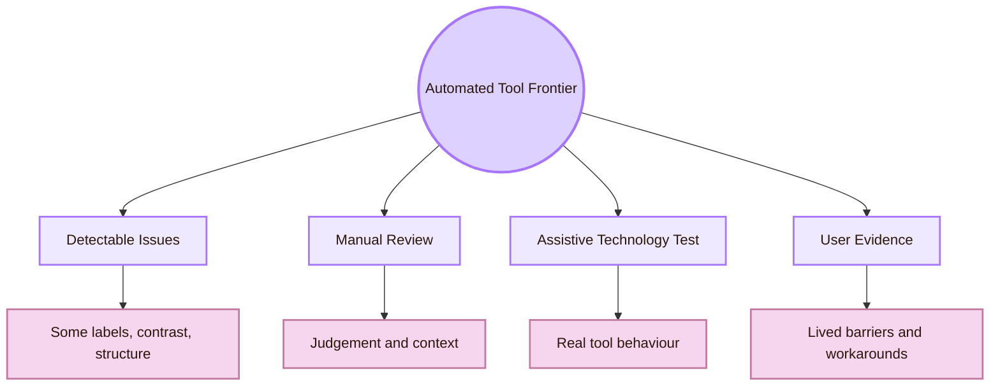

| Tool problem | Example |
|---|---|
| Coverage varies | Different tools check different WCAG criteria |
| False confidence | Passing a scan is mistaken for full accessibility |
| Context blindness | Tool cannot know whether a label makes sense in the task |
| Workflow blindness | Tool may inspect one page, not the whole process |
| Cognitive blindness | Tool cannot judge whether a concept is understandable |
| Assistive-technology difference | A checker may not show how a screen reader announces the page |

For the Cognishire vault, automated scanning is useful only if there is also manual review, keyboard testing, structure checking, and local comprehension evidence.

## Frontier III: Cognitive Accessibility Is Under-Measured

Many accessibility discussions focus on visual, motor, or screen reader access. Those are crucial, but cognitive accessibility is often weaker in student projects. A page can have good contrast and still be inaccessible because it is too dense, metaphor-heavy, inconsistent, or difficult to navigate.

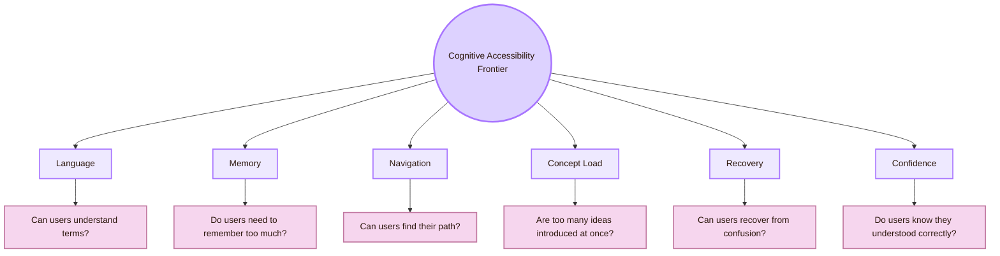

| Cognitive open problem | Local Cognishire example | Repair direction |
|---|---|---|
| Metaphor confusion | “Inclusive Gate” sounds poetic but may hide the academic meaning | Pair fantasy title with CS2023 label |
| Source overload | Too many links without grouping | Group sources by role |
| Diagram overload | Flowcharts look cool but may not teach | Add small diagrams only where needed and explain them |
| Long-page fatigue | Large pages become hard to scan | Add route maps, summaries, and shorter sections |
| Academic language | First-year students may not understand all terms | Add real-life translations and examples |
| Confidence gap | Users may finish a task but feel unsure | Add comprehension checks and confidence rating |

The open problem is measurement. Cognitive accessibility often needs tasks such as explanation, recall, paraphrase, and navigation, not only visual inspection.

## Frontier IV: Accessible Prototyping Is Still Hard

Inclusive design asks disabled people to participate early, but many design and prototyping tools are themselves inaccessible. This creates a contradiction: disabled users may be invited into design while the design tools, whiteboards, sticky notes, Figma boards, or prototyping workflows exclude them.

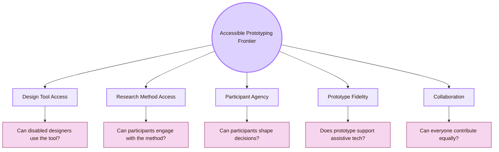

| Prototyping barrier | Why it matters |
|---|---|
| Visual canvas dependency | Some users cannot access spatial design boards easily |
| Drag-and-drop dependency | Motor access and keyboard operation may be limited |
| Low-fidelity prototype not screen-reader friendly | Early feedback may exclude assistive technology users |
| Workshop tools inaccessible | Co-design becomes symbolic rather than real |
| Prototype lacks semantic structure | Accessibility cannot be tested until late |
| Research method excludes | Disabled participants are asked for feedback through inaccessible methods |

For the HCI map, the practical version is this: if Obsidian, Mermaid, CSS, or GitHub makes participation difficult, the project’s own method becomes part of the accessibility problem.

## Frontier V: Cross-Disability Tradeoffs

Accessibility problems are not always solved by one universal repair. A choice that helps one group may create friction for another. Large text helps low-vision users but can increase scrolling. Extra explanation helps first-time users but can overload some readers. More automation can help some users but reduce control for others.

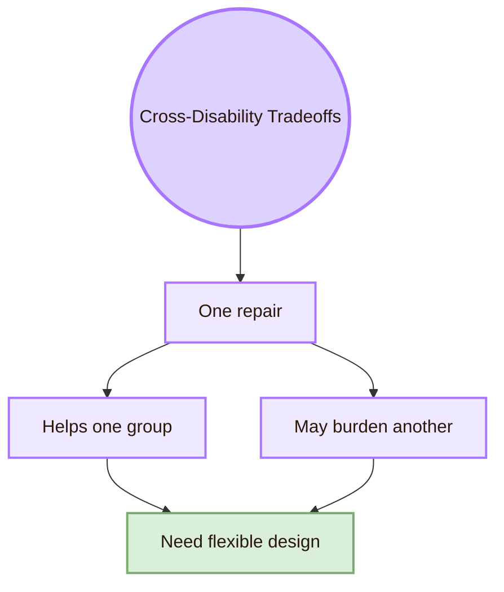

| Design choice | Helps | Possible tension |
|---|---|---|
| Larger text | Low vision, projector use | More scrolling and longer pages |
| More explanations | Beginners, language learners | More cognitive load for some users |
| Animation | Orientation and feedback for some | Motion sensitivity or distraction for others |
| Simplified interface | Cognitive accessibility | May hide advanced controls |
| Personalisation | User fit | Privacy, predictability, or control concerns |
| AI assistance | Faster access to summaries or descriptions | Incorrect output, overtrust, or bias |
| Dense source anchors | Academic credibility | Reading overload |

The open problem is flexibility. Good inclusive design often gives user control instead of forcing one “accessible” mode on everyone.

## Frontier VI: Accessibility Drift

Accessibility drift happens when a design starts accessible but becomes less accessible after updates. This can happen when CSS changes, components are reused incorrectly, Mermaid diagrams expand, links break, plugins fail, or AI-generated content is added without structure.

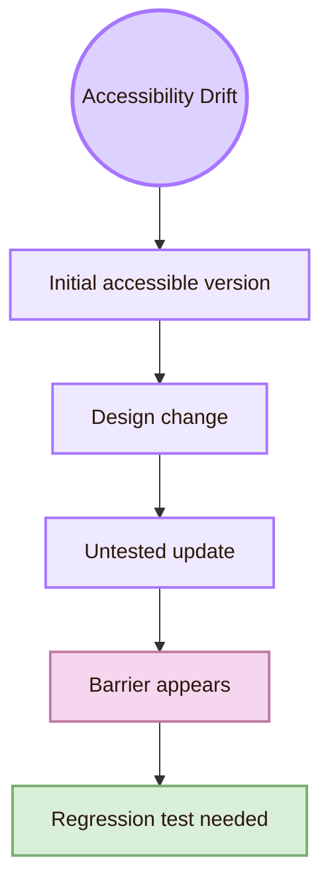

| Drift source | Cognishire example | Prevention |
|---|---|---|
| CSS update | Dark readable text becomes low contrast after theme change | Recheck contrast after CSS edits |
| Mermaid expansion | Diagram becomes too wide and unreadable | Keep diagrams compact |
| New page template | Missing CS2023 label or backlink | Use page checklist |
| GitHub restructure | Relative links break | Run link test after moving files |
| Plugin dependency | Page works only on author’s Obsidian setup | Add Markdown fallback |
| AI-generated text | Headings, links, and source categories become inconsistent | Review structure manually |
| Image addition | Missing alt text or context | Add description or nearby explanation |

Accessibility is not a one-time status. It is a maintenance responsibility.

## Frontier VII: AI Accessibility Is Double-Edged

Generative AI and machine learning can help accessibility by generating captions, summaries, image descriptions, adaptive interfaces, text simplification, and personal support. But AI can also hallucinate, misdescribe, expose sensitive disability-related information, encode ableist assumptions, produce inaccessible code, or make decisions that users cannot challenge.

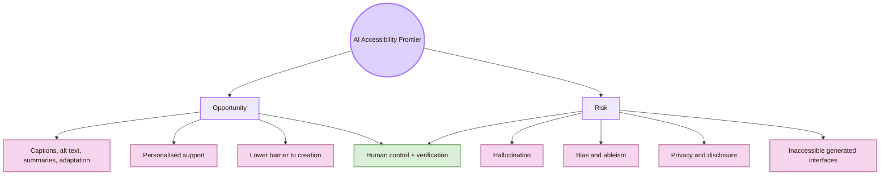

| AI accessibility open problem | Why it matters |
|---|---|
| Verifiability | Users need to know whether AI descriptions, summaries, and recommendations are correct |
| Bias | Disabled people may be underrepresented or misrepresented in training data |
| Privacy | Disability-related data can be sensitive |
| Overtrust | Fluent AI output can sound reliable even when wrong |
| Agency | AI should support users, not take control away |
| Generated code | AI can produce interfaces that look fine but are inaccessible |
| Local language | Romanian accessibility support from AI may be weaker than English support |
| Accountability | It may be unclear who repairs AI-caused exclusion |

## Frontier VIII: Accessible XR and Spatial Interfaces

The Romanian layer makes this frontier relevant because publicly available profiles connect Radu-Daniel Vatavu’s research to HCI, AR/XR, Ambient Intelligence, and Accessible Computing, and other Romanian routes include VR-related work. XR accessibility is still an open problem because the interface is no longer only a flat screen.

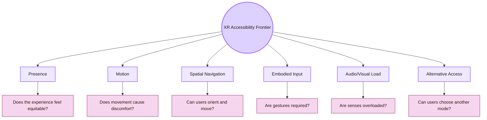

| XR problem | Why it is difficult |
|---|---|
| Required gestures | Some users cannot perform or sustain them |
| Spatial orientation | Navigation can become disorienting |
| Motion sickness | Visual motion can create discomfort or exclusion |
| Sensory overload | VR/AR can overload vision, sound, and attention |
| Device access | Headsets may not fit all bodies or assistive devices |
| Experience equity | Access should include presence and enjoyment, not only task completion |
| Safety | Physical movement introduces environmental risk |

If Cognishire ever becomes a spatial map or game-like interface, accessibility must be redesigned, not merely transferred from the web version.

## Frontier IX: Language, Localisation, and Romanian Access

Accessibility depends on language. A clear English HCI explanation may still be hard for a Romanian student, and Romanian accessibility terminology may not map neatly to English CS2023 concepts. Localisation is not just translation. It includes examples, institutional terms, legal terms, educational context, and cognitive load.

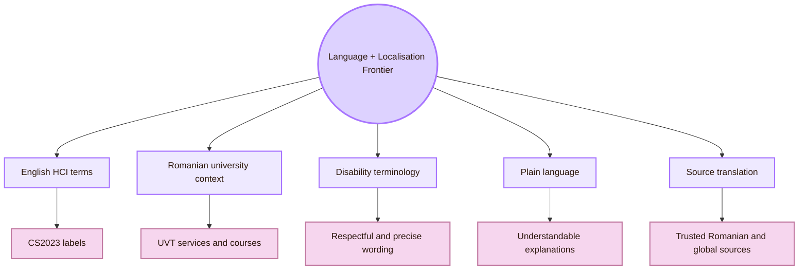

| Language problem | Example | Repair |
|---|---|---|
| Academic English overload | “Ability-Based Design” is not obvious to beginners | Add short explanation and example |
| Fantasy metaphor ambiguity | “Inclusive Gate” may sound decorative | Add real CS2023 label |
| Romanian institutional terms | UVT support services may have specific local names | Link official UVT sources |
| Disability wording | Terminology can become outdated or disrespectful | Use careful, source-grounded language |
| Mixed-language sources | English standards and Romanian local sources differ in framing | State both clearly |
| AI translation | AI may simplify incorrectly or use poor terminology | Verify with trusted sources |

## Frontier X: Institutional Accountability and Disclosure Burden

Accessibility often forces users to disclose disability, ask for exceptions, or request help. This creates a burden. A design is more responsible when it reduces the need for users to reveal personal information just to access normal content.

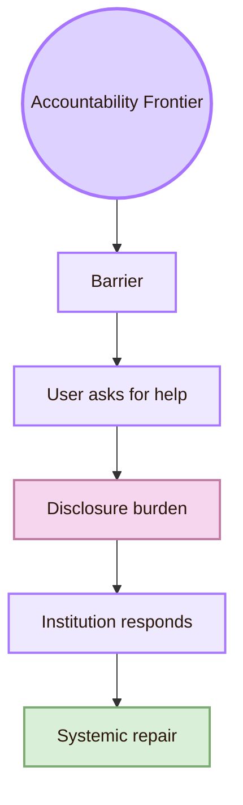

| Accountability problem | Why it matters |
|---|---|
| User must request special help | The system failed to provide baseline access |
| User must reveal disability | Access becomes tied to personal disclosure |
| Teacher must improvise | Accessibility becomes inconsistent |
| Institution lacks clear process | Users may not know where to go |
| Project reports “accessible” without evidence | Responsibility is hidden |
| Barriers are fixed only case-by-case | The next user faces the same problem |

For the HCI map, accountability means documenting what was tested, what was not tested, what barriers remain, and what repair comes next.

## Frontier XI: Inclusive Education and Assessment

Because this is a student project, accessibility must include education and assessment. A digital project can be visually impressive and still fail if the professor cannot inspect it, if students cannot open it, or if the format creates unfair barriers.

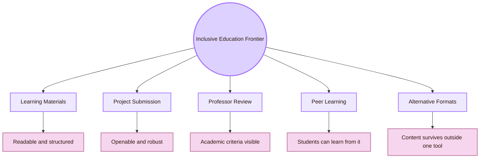

| Education open problem | Cognishire version |
|---|---|
| Access to materials | The vault must be readable in Obsidian and fallback views |
| Fair project review | The professor should not need special setup to understand the academic structure |
| Learning accessibility | First-year students need understandable labels and examples |
| Assessment format | A GitHub/Obsidian project must not hide content behind plugins |
| Alternative formats | Markdown, HTML, screenshots, and exports may be needed |
| Revision visibility | Improvements should be traceable through Git or changelog |

## Frontier XII: Metrics for Inclusion Are Weak

Accessibility metrics are often narrow: number of WCAG violations, contrast ratio, scan score, keyboard success, screen reader announcements. These are useful, but inclusion is broader. It includes effort, dignity, confidence, participation, fatigue, control, belonging, and trust.

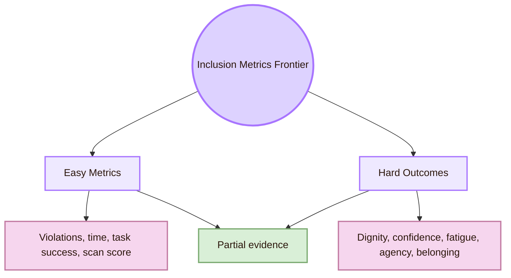

| Metric | What it captures | What it misses |
|---|---|---|
| WCAG violation count | Detectable standards problems | User meaning and lived access |
| Keyboard task success | Basic operability | Fatigue, speed, confidence |
| Screen reader heading check | Structure | Whether content is understandable |
| Contrast ratio | Visual legibility baseline | Visual fatigue and page complexity |
| Time on task | Efficiency | Stress, guessing, uncertainty |
| Satisfaction rating | User impression | Specific barrier location |
| Number of users included | Breadth | Whether they had influence |

The open problem is building evidence that respects both technical access and human experience.

## Cognishire Open Problems

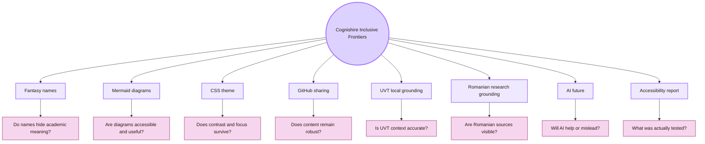

| Cognishire open problem | Evaluation question | Next repair |
|---|---|---|
| Fantasy names | Can first-time users translate each room into CS2023 language? | Add official labels and real-life meaning |
| Mermaid diagrams | Can users read and understand them without relying only on colour? | Compact diagrams, dark readable text, table explanation |
| CSS theme | Does the theme preserve contrast, focus, and readability? | Create accessible design tokens and retest |
| GitHub sharing | Does the project work outside the author’s Obsidian setup? | Test clone and plain Markdown fallback |
| UVT grounding | Does the page represent UVT accessibility support accurately? | Use official UVT sources and cautious wording |
| Romania grounding | Does the page include Romanian HCI/accessibility routes? | Add RoCHI, Vatavu, Schipor, Pădure, Pribeanu, A(I)BILITIES |
| AI future | Does AI output support access without hallucination? | Require verification, citations, and user control |
| Reporting | Does the project say what was and was not tested? | Add accessibility evidence log |

## Frontier Log Template

Use this table after each accessibility repair.

| Open problem | Local evidence | Romanian route | Global route | Current risk | Next test |
|---|---|---|---|---|---|
| Diagram readability | UVT student cannot read node text | RoCHI accessibility evaluation route | WCAG, WebAIM, ASSETS | Diagram is decorative but not accessible | Readability and explanation test |
| CSS contrast | Theme looks good on author’s screen | Romanian web accessibility evaluation route | WCAG 2.2 contrast criteria | Contrast fails on other screens | Contrast and projector test |
| AI accessibility | AI generates accessibility advice | A(I)BILITIES | CHI, ASSETS, IUI, FAccT | Hallucination or biased advice | Source verification task |
| Local support context | UVT page mentions assistive tools and adaptations | UVT special education route | Universal Design, inclusive education | Local context is treated superficially | Local source review |
| GitHub robustness | Clone loses style or links | Software accessibility route | Robustness, reproducibility | Professor cannot open project easily | Clone and fallback test |
| Cognitive access | Student cannot explain room name | HCI education / RoCHI route | Cognitive accessibility, inclusive design | Metaphor hides meaning | Explanation task |

## Research Route for Each Open Problem

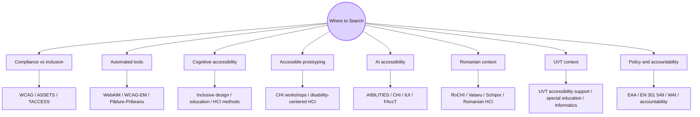

| Open problem                  | Best search route                                                             |
| ----------------------------- | ----------------------------------------------------------------------------- |
| Compliance versus inclusion   | W3C WAI, WCAG, ASSETS, TACCESS, disability-centered HCI                       |
| Automated accessibility tools | WebAIM, WCAG-EM, Pădure and Pribeanu, W4A                                     |
| Cognitive accessibility       | Inclusive design, education accessibility, plain language, HCI user studies   |
| Accessible prototyping        | CHI accessibility workshops, disability-centered design, participatory design |
| Cross-disability tradeoffs    | ASSETS, TACCESS, Universal Design, Ability-Based Design                       |
| Accessibility drift           | Software engineering, design systems, regression testing, WCAG monitoring     |
| AI accessibility              | A(I)BILITIES, CHI, ASSETS, IUI, FAccT, AI accessibility papers                |
| XR accessibility              | Vatavu, XR Access, ASSETS, CHI, IEEE VR, ISMAR                                |
| UVT local grounding           | UVT accessibility support, DPPD/PPS routes, Faculty of Informatics            |
| Romanian national grounding   | RoCHI, RRIoC, USV/MintViz, web accessibility evaluation papers                |

## Evidence Quality Ladder

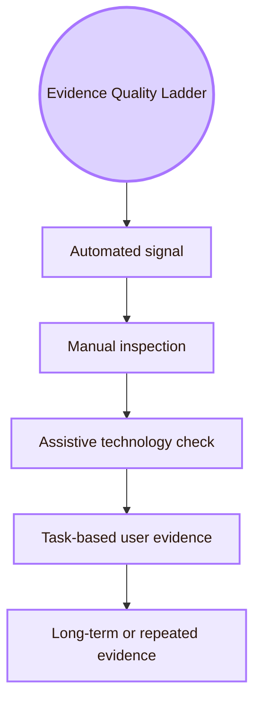

| Evidence level | What it supports | What it does not support alone |
|---|---|---|
| Automated signal | Some detectable issues were found or not found | Full accessibility |
| Manual inspection | Structure, labels, focus, contrast, and content logic were checked | Lived access for all users |
| Assistive technology check | The tested tools can or cannot use the page structure | All assistive technologies |
| Long-term or repeated evidence | Accessibility survives some updates and repeated use | Permanent accessibility |

## What to avoid in the final project report

|---|---|
| “The vault is fully accessible.” | “The tested pages were checked for selected accessibility barriers.” |
| “WCAG passed, so inclusion is solved.” | “WCAG is a baseline; task evidence and user experience still matter.” |
| “The AI can handle accessibility.” | “AI output must be verified against standards, sources, and user needs.” |
| “Romania has no accessibility-HCI work.” | “Romanian routes are more scattered and require careful searching.” |
| “The UVT test proves global accessibility.” | “The UVT test gives local formative evidence.” |
| “Disabled users can ask for help.” | “The design should reduce the need for extra disclosure and special requests.” |

## Academic Anchors

These anchors mix official standards, institutional pages, peer-reviewed venues, Romanian routes, and emerging preprints. Preprints and project pages should be used as research leads, not as final proof.

| Frontier route | Source |
|---|---|
| CS2023 HCI Accessibility basis | [CS2023 HCI Version Gamma](https://csed.acm.org/wp-content/uploads/2023/09/HCI-Version-Gamma.pdf) |
| WCAG 2.2 standard | [W3C WCAG 2.2](https://www.w3.org/TR/WCAG22/) |
| WCAG overview | [W3C WCAG Overview](https://www.w3.org/WAI/standards-guidelines/wcag/) |
| WAI accessibility principles | [W3C Accessibility Principles](https://www.w3.org/WAI/fundamentals/accessibility-principles/) |
| Accessibility evaluation | [W3C Evaluating Web Accessibility](https://www.w3.org/WAI/test-evaluate/) |
| WCAG conformance evaluation | [W3C WCAG-EM Overview](https://www.w3.org/WAI/test-evaluate/conformance/wcag-em/) |
| ARIA Authoring Practices | [WAI-ARIA Authoring Practices Guide](https://www.w3.org/WAI/ARIA/apg/) |
| UVT accessibility support | [UVT: Accessibility for students with disabilities](https://uvt.ro/en/educatie/info-studenti-proces-educational/accesibilitate-pentru-studentii-cu-dizabilitati/) |
| UVT educational management regulation | [UVT DME regulation](https://www.uvt.ro/wp-content/uploads/2024/10/Anexa-6.-Regulamentul-de-Organizare-si-Functionare-DME.pdf) |
| UVT social inclusion | [UVT actively promotes social inclusion](https://www.uvt.ro/en/blog/uvt-promoveaza-activ-incluziunea-sociala/) |
| UVT Faculty of Informatics | [Faculty of Informatics UVT](https://info.uvt.ro/en/) |
| UVT Faculty departments | [Faculty of Informatics Departments](https://info.uvt.ro/en/departamente/) |
| UVT special education plan | [UVT PPS plan with assistive technologies](https://fsp.uvt.ro/wp-content/uploads/2025/02/pps_3_24-25.pdf) |
| Radu-Daniel Vatavu | [Radu-Daniel Vatavu homepage](https://raduvatavu.usv.ro/) |
| Ovidiu-Andrei Schipor | [Ovidiu-Andrei Schipor CV](https://fiesc.usv.ro/wp-content/uploads/sites/17/2022/09/CV_en_2022.pdf) |
| A(I)BILITIES project | [A(I)BILITIES project](https://aibilities.ro/en/about/) |
| A(I)BILITIES technical route | [ASSIST Software A(I)BILITIES](https://assist-software.net/project/aibilities) |
| Pădure and Pribeanu accessibility tools | [Comparing Six Free Accessibility Evaluation Tools](https://revistaie.ase.ro/content/93/02%20-%20padure%2C%20pribeanu.pdf) |
| Romanian municipal web accessibility | [A Review of Municipal Web Sites for Accessibility](https://sic.ici.ro/vol-20-no-3-2011/a-review-of-municipal-web-sites-for-accessibility-a-computer-aided-evaluation-approach/) |
| Romanian HCI conference | [RoCHI proceedings](https://rochi.utcluj.ro/proceedings/en/) |
| ACM SIGACCESS | [ACM SIGACCESS](https://www.sigaccess.org/) |
| ACM ASSETS | [ASSETS Conference](https://www.sigaccess.org/assets/) |
| ACM TACCESS | [ACM Transactions on Accessible Computing](https://dl.acm.org/journal/taccess) |
| Web4All | [International Web for All Conference](https://www.w4a.info/) |
| WebAIM | [WebAIM](https://webaim.org/) |
| Microsoft Inclusive Design | [Microsoft Inclusive Design](https://inclusive.microsoft.design/) |
| Ability-Based Design | [Ability-Based Design: Concept, Principles and Examples](https://kgajos.seas.harvard.edu/papers/wobbrock11abd.pdf) |
| Access InContext workshop | [Access InContext: Futuring Accessible Prototyping Tools and Methods](https://arxiv.org/abs/2506.24057) |
| AI accessibility action plan | [Accessibility Considerations in the Development of an AI Action Plan](https://arxiv.org/abs/2503.14522) |
| Generative AI accessibility case study | [Generative AI Utility for Accessibility](https://arxiv.org/abs/2308.09924) |
| Disability inclusion in AI product organisations | [Accessibility and Responsible AI Product Organisations](https://arxiv.org/abs/2508.16607) |
| VR accessibility conceptual problem | [An Equitable Experience? VR Accessibility and Disability](https://arxiv.org/abs/2411.04489) |
| European Accessibility Act | [European Commission: European Accessibility Act](https://commission.europa.eu/strategy-and-policy/policies/justice-and-fundamental-rights/disability/european-accessibility-act-eaa_en) |
| EN 301 549 | [Accessibility requirements for ICT products and services](https://accessible-eu-centre.ec.europa.eu/content-corner/digital-library/en-3015492021-accessibility-requirements-ict-products-and-services_en) |

^open-problems-accessibility-inclusive-design-end
