![[fin.jpg|1000]]
# Open Problems

> [!abstract] Inclusive Frontier Map

The real CS2023 label is **HCI-Accessibility: Accessibility and Inclusive Design**.  
The connected responsibility route is **HCI-Accountability: Accountability and Responsibility in Design**.  

This page is not a checklist. A checklist says what to inspect. An open-problems page asks why accessibility still fails even when designers know that accessibility matters. It examines why accessible design can become late, partial, under-tested, over-automated, compliance-only, or disconnected from disabled people’s lived experience.

> [!quote] Frontier law
> Accessibility becomes an open problem when a design says “everyone can use this,” but the evidence does not yet show who can enter, act, understand, trust, recover, and participate.

## Frontier Map

## How to read this page

- **A tool reports a high accessibility score:** Check what the tool cannot detect
- **A design follows WCAG criteria:** Test whether users can complete real tasks
- **A local UVT test looks positive:** state the local limits of the evidence
- **AI produces accessibility advice:** verify the advice with standards and human judgement
- **A page looks visually polished:** check whether the polish creates access barriers

## CS2023 Frontier Gate

CS2023 places Accessibility and Inclusive Design inside HCI. That means the open problems are not outside Computer Science. They belong to interface design, software engineering, AI, evaluation, education, data systems, and accountability.

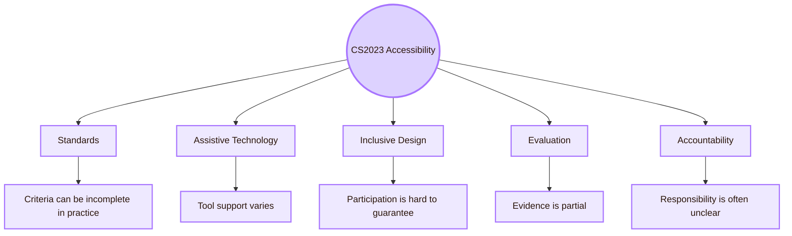

- **Standards:** Standards define criteria, but lived access can still fail
- **Assistive technologies:** Tools differ, users differ, and testing access is resource-heavy
- **Inclusive frameworks:** Inclusion can become branding unless excluded users shape the design
- **Universal design:** One design rarely works perfectly for everyone without tradeoffs
- **Accessibility evaluation:** Automated checks miss many real barriers
- **Accountability:** Institutions and designers often report access as solved too early

## Local Frontier I: UVT Evidence Is Necessary but Limited

## Local Frontier II: Accessibility Is Not Only Informatics

For this area, the local UVT map must not look only inside the Faculty of Informatics. Accessibility also connects to psychopedagogy, special education, assistive technologies, inclusive education, institutional support, teaching adaptation, and student services.

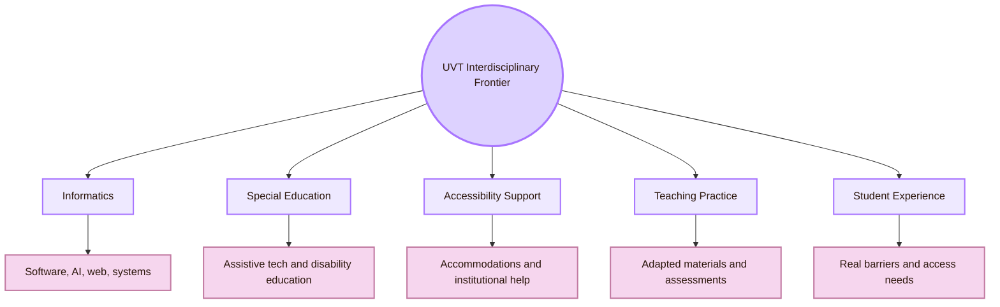

- **Informatics:** How can CS projects build accessibility into code, systems, repositories, and AI?
- **Special education:** How can disability and assistive-technology knowledge inform HCI design?
- **Accessibility support:** How can local support practices be represented without turning them into token references?
- **Teaching practice:** How should digital materials and assessments be adapted responsibly?
- **Student experience:** How do students actually experience access, stigma, extra effort, and support?

## Romania Frontier: National Visibility and Research Connection

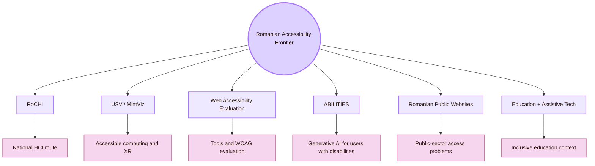

- **Romanian HCI accessibility work is fragmented:** A student may miss national researchers and venues (route: RoCHI, RRIoC, USV/MintViz)
- **Web accessibility evaluation remains difficult:** Automated tools disagree and cover different criteria (route: Pădure and Pribeanu accessibility-tool studies)
- **Romanian public/university website accessibility needs monitoring:** Public access requires systematic evidence (route: Romanian web accessibility evaluation papers)
- **AI accessibility is emerging:** Generative AI may support or mislead users with disabilities (route: A(I)BILITIES, CHI, ASSETS, IUI, FAccT)
- **Accessibility in education requires local practice:** Digital learning materials need support, adaptation, and alternative formats (route: UVT and Romanian special education routes)
- **Romanian language accessibility is under-discussed:** Language, terminology, and cognitive access differ by context (route: Romanian HCI and education studies)

## Frontier I: Compliance Does Not Equal Inclusion

WCAG is essential. It gives a common structure for perceivable, operable, understandable, and robust web content. But meeting selected success criteria does not automatically prove that a user can complete real tasks comfortably, understand meaning, feel included, or participate without extra burden.

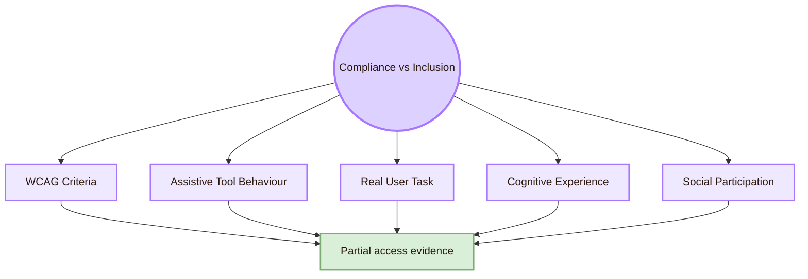

- **Some contrast, label, keyboard, and semantic failures:** Whether the content is understandable
- **Whether criteria are met in tested pages:** Whether the full task is possible
- **Whether a web page follows formal rules:** Whether users trust or feel safe using it
- **Whether automated tools detect known issues:** Whether disabled users experience fatigue or stigma
- **Whether a component has correct markup:** Whether the whole workflow is accessible

The open problem is not whether standards matter. They do. The problem is treating standards as the end of accessibility instead of the baseline.

## Frontier II: Automated Tools Are Partial

Automated accessibility tools are useful for scanning pages, but they cannot detect all barriers. They can miss cognitive problems, misleading labels, bad alt text, confusing workflows, keyboard traps in some contexts, and whether the design actually helps people complete goals.

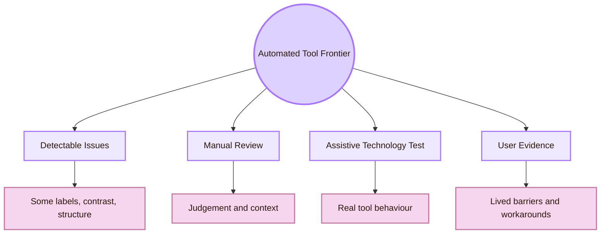

- **Coverage varies:** Different tools check different WCAG criteria
- **False confidence:** Passing a scan is mistaken for full accessibility
- **Context blindness:** Tool cannot know whether a label makes sense in the task
- **Workflow blindness:** Tool may inspect one page, not the whole process
- **Cognitive blindness:** Tool cannot judge whether a concept is understandable
- **Assistive-technology difference:** A checker may not show how a screen reader announces the page

## Frontier III: Cognitive Accessibility Is Under-Measured

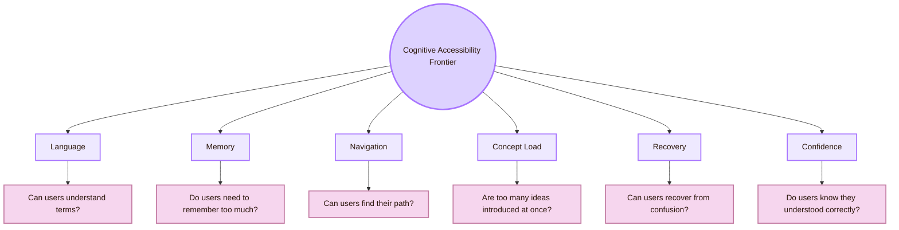

The open problem is measurement. Cognitive accessibility often needs tasks such as explanation, recall, paraphrase, and navigation, not only visual inspection.

## Frontier IV: Accessible Prototyping Is Still Hard

Inclusive design asks disabled people to participate early, but many design and prototyping tools are themselves inaccessible. This creates a contradiction: disabled users may be invited into design while the design tools, whiteboards, sticky notes, Figma boards, or prototyping workflows exclude them.

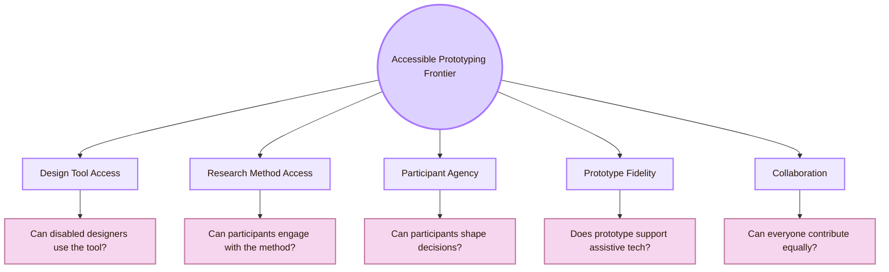

- **Visual canvas dependency:** Some users cannot access spatial design boards easily
- **Drag-and-drop dependency:** Motor access and keyboard operation may be limited
- **Low-fidelity prototype not screen-reader friendly:** Early feedback may exclude assistive technology users
- **Workshop tools inaccessible:** Co-design becomes symbolic rather than real
- **Prototype lacks semantic structure:** Accessibility cannot be tested until late
- **Research method excludes:** Disabled participants are asked for feedback through inaccessible methods

## Frontier V: Cross-Disability Tradeoffs

Accessibility problems are not always solved by one universal repair. A choice that helps one group may create friction for another. Large text helps low-vision users but can increase scrolling. Extra explanation helps first-time users but can overload some readers. More automation can help some users but reduce control for others.

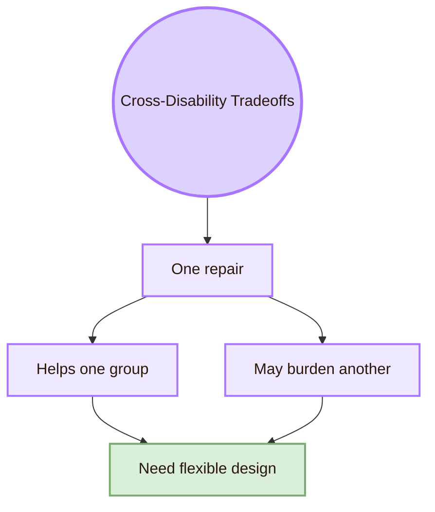

- **Larger text:** helps: Low vision, projector use; possible tension: More scrolling and longer pages
- **More explanations:** helps: Beginners, language learners; possible tension: More cognitive load for some users
- **Animation:** helps: Orientation and feedback for some; possible tension: Motion sensitivity or distraction for others
- **Simplified interface:** helps: Cognitive accessibility; possible tension: May hide advanced controls
- **Personalisation:** helps: User fit; possible tension: Privacy, predictability, or control concerns
- **AI assistance:** helps: Faster access to summaries or descriptions; possible tension: Incorrect output, overtrust, or bias
- **Dense source anchors:** helps: Academic credibility; possible tension: Reading overload

The open problem is flexibility. Good inclusive design often gives user control instead of forcing one “accessible” mode on everyone.

## Frontier VI: Accessibility Drift

Accessibility drift happens when a design starts accessible but becomes less accessible after updates. This can happen when CSS changes, components are reused incorrectly, Mermaid diagrams expand, links break, plugins fail, or AI-generated content is added without structure.

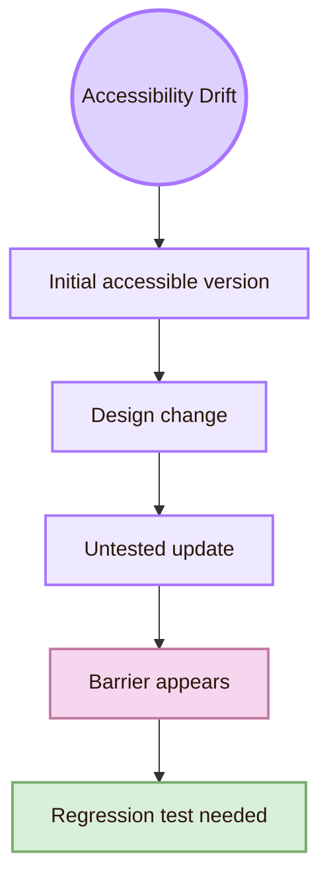

Accessibility is not a one-time status. It is a maintenance responsibility.

## Frontier VII: AI Accessibility Is Double-Edged

Generative AI and machine learning can help accessibility by generating captions, summaries, image descriptions, adaptive interfaces, text simplification, and personal support. But AI can also hallucinate, misdescribe, expose sensitive disability-related information, encode ableist assumptions, produce inaccessible code, or make decisions that users cannot challenge.

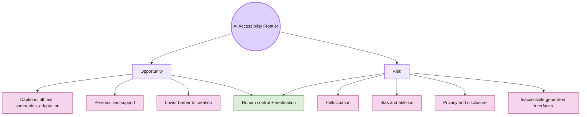

- **Verifiability:** Users need to know whether AI descriptions, summaries, and recommendations are correct
- **Bias:** Disabled people may be underrepresented or misrepresented in training data
- **Privacy:** Disability-related data can be sensitive
- **Overtrust:** Fluent AI output can sound reliable even when wrong
- **Agency:** AI should support users, not take control away
- **Generated code:** AI can produce interfaces that look fine but are inaccessible
- **Local language:** Romanian accessibility support from AI may be weaker than English support
- **Accountability:** It may be unclear who repairs AI-caused exclusion

## Frontier VIII: Accessible XR and Spatial Interfaces

The Romanian layer makes this frontier relevant because publicly available profiles connect Radu-Daniel Vatavu’s research to HCI, AR/XR, Ambient Intelligence, and Accessible Computing, and other Romanian routes include VR-related work. XR accessibility is still an open problem because the interface is no longer only a flat screen.

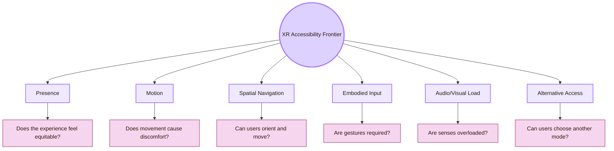

- **Required gestures:** Some users cannot perform or sustain them
- **Spatial orientation:** Navigation can become disorienting
- **Motion sickness:** Visual motion can create discomfort or exclusion
- **Sensory overload:** VR/AR can overload vision, sound, and attention
- **Device access:** Headsets may not fit all bodies or assistive devices
- **Experience equity:** Access should include presence and enjoyment, not only task completion
- **Safety:** Physical movement introduces environmental risk

## Frontier IX: Language, Localisation, and Romanian Access

Accessibility depends on language. A clear English HCI explanation may still be hard for a Romanian student, and Romanian accessibility terminology may not map neatly to English CS2023 concepts. Localisation is not just translation. It includes examples, institutional terms, legal terms, educational context, and cognitive load.

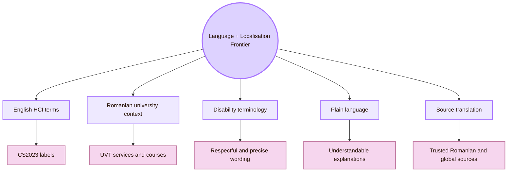

## Frontier X: Institutional Accountability and Disclosure Burden

Accessibility often forces users to disclose disability, ask for exceptions, or request help. This creates a burden. A design is more responsible when it reduces the need for users to reveal personal information just to access normal content.

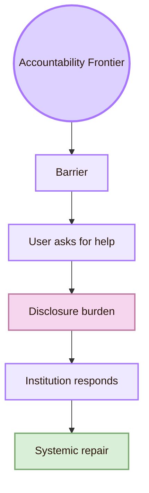

- **User must request special help:** The system failed to provide baseline access
- **User must reveal disability:** Access becomes tied to personal disclosure
- **Teacher must improvise:** Accessibility becomes inconsistent
- **Institution lacks clear process:** Users may not know where to go
- **Project reports “accessible” without evidence:** Responsibility is hidden
- **Barriers are fixed only case-by-case:** The next user faces the same problem

## Frontier XI: Inclusive Education and Assessment

## Frontier XII: Metrics for Inclusion Are Weak

Accessibility metrics are often narrow: number of WCAG violations, contrast ratio, scan score, keyboard success, screen reader announcements. These are useful, but inclusion is broader. It includes effort, dignity, confidence, participation, fatigue, control, belonging, and trust.

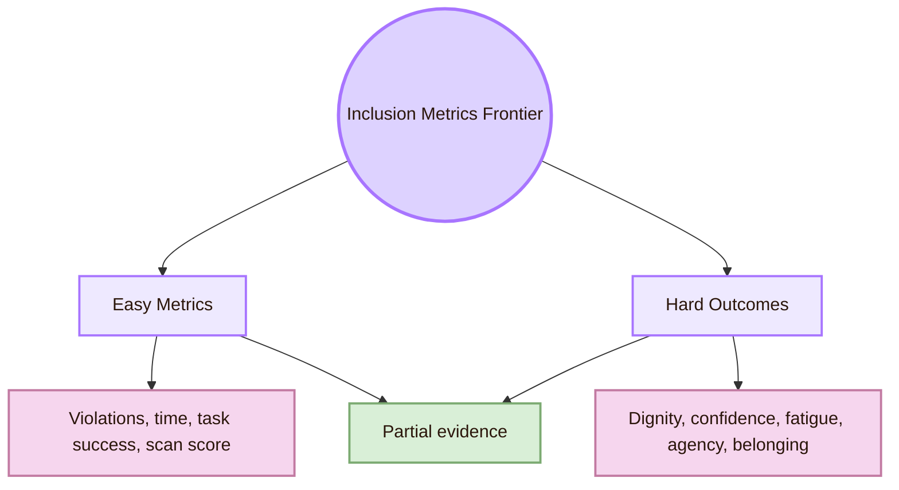

- **WCAG violation count:** what it captures: Detectable standards problems; what it misses: User meaning and lived access
- **Keyboard task success:** what it captures: Basic operability; what it misses: Fatigue, speed, confidence
- **Screen reader heading check:** what it captures: Structure; what it misses: Whether content is understandable
- **Contrast ratio:** what it captures: Visual legibility baseline; what it misses: Visual fatigue and page complexity
- **Time on task:** what it captures: Efficiency; what it misses: Stress, guessing, uncertainty
- **Satisfaction rating:** what it captures: User impression; what it misses: Specific barrier location
- **Number of users included:** what it captures: Breadth; what it misses: Whether they had influence

The open problem is building evidence that respects both technical access and human experience.

## Frontier Log Template

Use this table after each accessibility repair.

## Research Route for Each Open Problem

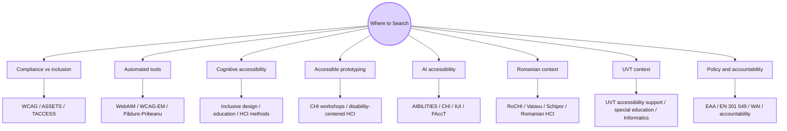

- **Compliance versus inclusion:** W3C WAI, WCAG, ASSETS, TACCESS, disability-centered HCI
- **Automated accessibility tools:** WebAIM, WCAG-EM, Pădure and Pribeanu, W4A
- **Cognitive accessibility:** Inclusive design, education accessibility, plain language, HCI user studies
- **Accessible prototyping:** CHI accessibility workshops, disability-centered design, participatory design
- **Cross-disability tradeoffs:** ASSETS, TACCESS, Universal Design, Ability-Based Design
- **Accessibility drift:** Software engineering, design systems, regression testing, WCAG monitoring
- **AI accessibility:** A(I)BILITIES, CHI, ASSETS, IUI, FAccT, AI accessibility papers
- **XR accessibility:** Vatavu, XR Access, ASSETS, CHI, IEEE VR, ISMAR
- **UVT local grounding:** UVT accessibility support, DPPD/PPS routes, Faculty of Informatics
- **Romanian national grounding:** RoCHI, RRIoC, USV/MintViz, web accessibility evaluation papers

## Evidence Quality Ladder

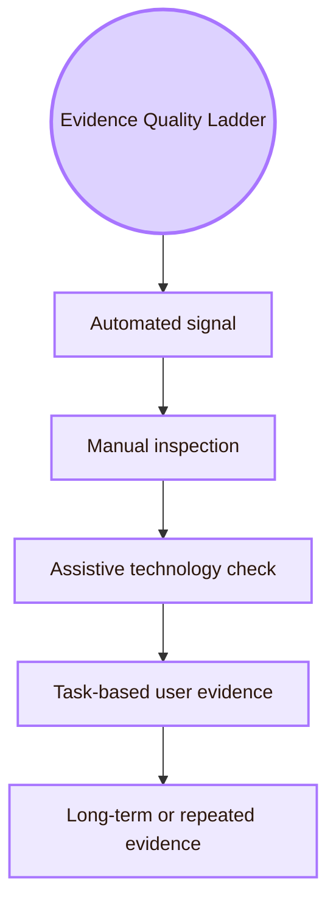

- **Automated signal:** what it supports: Some detectable issues were found or not found; what it does not support alone: Full accessibility
- **Manual inspection:** what it supports: Structure, labels, focus, contrast, and content logic were checked; what it does not support alone: Lived access for all users
- **Assistive technology check:** what it supports: The tested tools can or cannot use the page structure; what it does not support alone: All assistive technologies
- **Long-term or repeated evidence:** what it supports: Accessibility survives some updates and repeated use; what it does not support alone: Permanent accessibility

## What to avoid in the final study report

## Academic Anchors

These anchors mix official standards, institutional pages, peer-reviewed venues, Romanian routes, and emerging preprints. Preprints and research pages should be used as research leads, not as final proof.

| Frontier route | Source |
|---|---|
| CS2023 HCI Accessibility basis | [CS2023 HCI Version Gamma](https://csed.acm.org/wp-content/uploads/2023/09/HCI-Version-Gamma.pdf) |
| WCAG 2.2 standard | [W3C WCAG 2.2](https://www.w3.org/TR/WCAG22/) |
| WCAG overview | [W3C WCAG Overview](https://www.w3.org/WAI/standards-guidelines/wcag/) |
| WAI accessibility principles | [W3C Accessibility Principles](https://www.w3.org/WAI/fundamentals/accessibility-principles/) |
| Accessibility evaluation | [W3C Evaluating Web Accessibility](https://www.w3.org/WAI/test-evaluate/) |
| WCAG conformance evaluation | [W3C WCAG-EM Overview](https://www.w3.org/WAI/test-evaluate/conformance/wcag-em/) |
| ARIA Authoring Practices | [WAI-ARIA Authoring Practices Guide](https://www.w3.org/WAI/ARIA/apg/) |
| UVT accessibility support | [UVT: Accessibility for students with disabilities](https://uvt.ro/en/educatie/info-studenti-proces-educational/accesibilitate-pentru-studentii-cu-dizabilitati/) |
| UVT educational management regulation | [UVT DME regulation](https://www.uvt.ro/wp-content/uploads/2024/10/Anexa-6.-Regulamentul-de-Organizare-si-Functionare-DME.pdf) |
| UVT social inclusion | [UVT actively promotes social inclusion](https://www.uvt.ro/en/blog/uvt-promoveaza-activ-incluziunea-sociala/) |
| UVT Faculty of Informatics | [Faculty of Informatics UVT](https://info.uvt.ro/en/) |
| UVT Faculty departments | [Faculty of Informatics Departments](https://info.uvt.ro/en/departamente/) |
| UVT special education plan | [UVT PPS plan with assistive technologies](https://fsp.uvt.ro/wp-content/uploads/2025/02/pps_3_24-25.pdf) |
| Radu-Daniel Vatavu | [Radu-Daniel Vatavu homepage](https://raduvatavu.usv.ro/) |
| Ovidiu-Andrei Schipor | [Ovidiu-Andrei Schipor CV](https://fiesc.usv.ro/wp-content/uploads/sites/17/2022/09/CV_en_2022.pdf) |
| A(I)BILITIES route | [A(I)BILITIES](https://aibilities.ro/en/about/) |
| A(I)BILITIES technical route | [ASSIST Software A(I)BILITIES](https://assist-software.net/project/aibilities) |
| Pădure and Pribeanu accessibility tools | [Comparing Six Free Accessibility Evaluation Tools](https://revistaie.ase.ro/content/93/02%20-%20padure%2C%20pribeanu.pdf) |
| Romanian municipal web accessibility | [A Review of Municipal Web Sites for Accessibility](https://sic.ici.ro/vol-20-no-3-2011/a-review-of-municipal-web-sites-for-accessibility-a-computer-aided-evaluation-approach/) |
| Romanian HCI conference | [RoCHI proceedings](https://rochi.utcluj.ro/proceedings/en/) |
| ACM SIGACCESS | [ACM SIGACCESS](https://www.sigaccess.org/) |
| ACM ASSETS | [ASSETS Conference](https://www.sigaccess.org/assets/) |
| ACM TACCESS | [ACM Transactions on Accessible Computing](https://dl.acm.org/journal/taccess) |
| Web4All | [International Web for All Conference](https://www.w4a.info/) |
| WebAIM | [WebAIM](https://webaim.org/) |
| Microsoft Inclusive Design | [Microsoft Inclusive Design](https://inclusive.microsoft.design/) |
| Ability-Based Design | [Ability-Based Design: Concept, Principles and Examples](https://kgajos.seas.harvard.edu/papers/wobbrock11abd.pdf) |
| Access InContext workshop | [Access InContext: Futuring Accessible Prototyping Tools and Methods](https://arxiv.org/abs/2506.24057) |
| AI accessibility action plan | [Accessibility Considerations in the Development of an AI Action Plan](https://arxiv.org/abs/2503.14522) |
| Generative AI accessibility case study | [Generative AI Utility for Accessibility](https://arxiv.org/abs/2308.09924) |
| Disability inclusion in AI product organisations | [Accessibility and Responsible AI Product Organisations](https://arxiv.org/abs/2508.16607) |
| VR accessibility conceptual problem | [An Equitable Experience? VR Accessibility and Disability](https://arxiv.org/abs/2411.04489) |
| European Accessibility Act | [European Commission: European Accessibility Act](https://commission.europa.eu/strategy-and-policy/policies/justice-and-fundamental-rights/disability/european-accessibility-act-eaa_en) |
| EN 301 549 | [Accessibility requirements for ICT products and services](https://accessible-eu-centre.ec.europa.eu/content-corner/digital-library/en-3015492021-accessibility-requirements-ict-products-and-services_en) |

^open-problems-accessibility-inclusive-design-end
