# The Inclusive Gate

> [!abstract] CS2023 Accessibility and Inclusive Design
> **The Inclusive Gate** is the map name for **CS2023 HCI-Accessibility: Accessibility and Inclusive Design**. This room studies how interactive systems can be designed, built, checked, and repaired so that people with different abilities, tools, bodies, languages, contexts, and needs can perceive information, operate controls, understand meaning, recover from problems, and participate with dignity.

The official academic area is **Human-Computer Interaction**.  
The official CS2023 unit is **HCI-Accessibility: Accessibility and Inclusive Design**.  
The connected responsibility unit is **HCI-Accountability: Accountability and Responsibility in Design**.  
The map name is **Inclusive Gate**. The name is useful only as a light orientation label. The real topic is accessibility, inclusion, disability, assistive technology, standards, evaluation, and design responsibility.

This page is an overview. It gives the reader the main routes through this room. It does not replace the detailed pages on [[Activities/Theory|Theory]], [[Activities/Design|Design]], [[Activities/Experiment|Experiment]], [[Connections|Connections]], [[Important People|Important People]], [[Important Venues|Important Venues]], [[Local and Global|Local and Global]], and [[Open Problems|Open Problems]].

The local dimension is **UVT**: accessibility support, the Faculty of Informatics, Computer Science projects, special education routes, assistive technologies, students, professors, Obsidian, GitHub, CSS, Markdown, Mermaid, and classroom review.

The Romanian dimension includes national HCI and accessibility routes such as **RoCHI**, Romanian HCI publications, web accessibility evaluation studies, accessible computing research, assistive technology work, and inclusive AI projects. Names and projects should be treated as routes to verify through public profiles and publications, not as a fixed canon.

The global dimension includes **CS2023**, **W3C WAI**, **WCAG**, **WAI-ARIA**, **ACM SIGACCESS**, **ASSETS**, **TACCESS**, **Web4All**, inclusive design, universal design, ability-based design, accessibility policy, and disability-centered HCI.

> [!quote] Gate rule
> Accessibility is not a decoration added after the interface is finished. It is the design question of who can enter, act, understand, recover, trust the system, and belong.

## What this room is about

Accessibility and Inclusive Design asks a direct question: **who is blocked by the system, and what design decision creates that barrier?**

The answer is rarely a single item. A barrier may come from colour contrast, font size, link text, keyboard access, reading order, missing captions, unclear language, broken source structure, inaccessible diagrams, plugin dependence, poor error recovery, or an AI feature that gives unreliable help.

In this Cognishire vault, the Inclusive Gate has a practical job. It checks whether the HCI map can be read, opened, navigated, understood, shared, and repaired by real students and evaluators. It also checks whether the academic claims are grounded in recognised standards and research.

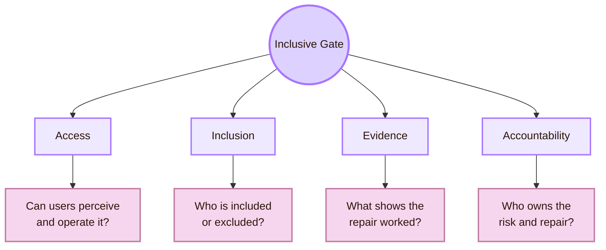

| Core idea | Simple meaning | Project example |
|---|---|---|
| Access | People can reach and use the content | Links, headings, diagrams, and sources can be used by keyboard and read clearly |
| Inclusion | Human variation is expected from the start | The vault does not assume perfect vision, perfect English, perfect Git knowledge, or mouse-only use |
| Evidence | Claims need checks, tests, or observations | A local user can explain the page and complete navigation tasks |
| Accountability | Barriers must be recorded and repaired | The project keeps an issue log and states what was not tested |

## Gate Entrance

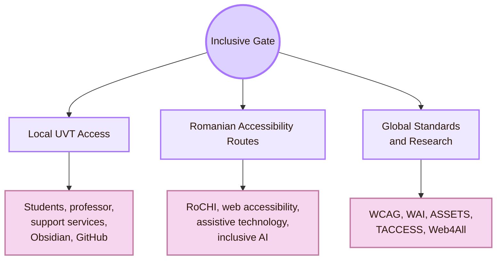

| Gate layer | Real meaning | Main question |
|---|---|---|
| Local UVT Access | The project must work inside the real university context where it will be read, opened, judged, and possibly reused | Can UVT students and the professor access, understand, and inspect the map? |
| Romanian Accessibility Routes | The map should connect to Romanian HCI, accessible computing, web accessibility evaluation, assistive technology, and inclusive AI where reliable sources exist | What national work can help a student understand accessibility in Romania? |
| Global Standards and Research | The project must be grounded in recognised accessibility standards, venues, theories, and methods | What do WCAG, WAI, ASSETS, TACCESS, Web4All, and inclusive design say about the barrier? |

## Room Identity

The Inclusive Gate sits after understanding users, designing systems, and evaluating designs. It also prepares the map for Human-AI Interaction, because AI can either support access or create new barriers.

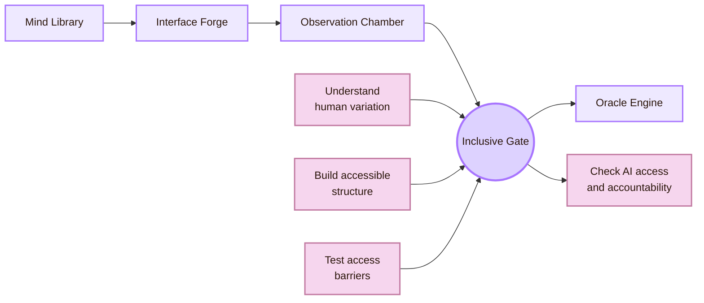

| Connected room | What it gives to the Inclusive Gate | What the Inclusive Gate gives back |
|---|---|---|
| [[../01_Understanding_the_User/Overview|Mind Library]] | User diversity, cognitive load, language, mental models, context | A stricter definition of user diversity, disability, access needs, and exclusion |
| [[../02_System_Design/Overview|Interface Forge]] | Interface structure, components, CSS, links, diagrams, interaction patterns | Accessibility rules for structure, contrast, focus, fallbacks, and implementation |
| [[../03_Evaluating_the_Design/Overview|Observation Chamber]] | Methods, evidence, validity, local testing, issue logs | Accessibility-specific evaluation through keyboard tests, screen reader checks, WCAG mapping, and cognitive access tasks |
| [[../05_Human_AI_Interaction/Overview|Oracle Engine]] | AI, prediction, generation, uncertainty, trust | A warning that AI can support access or automate new barriers |

## What this room protects

Accessibility is often reduced to contrast or screen readers. Those are important, but this room protects more than that. It protects the user’s ability to enter the system, act inside it, understand it, trust it, participate in it, and recover when something goes wrong.

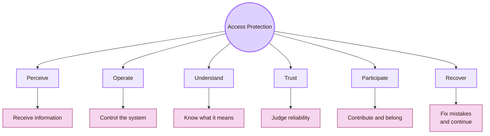

| Access dimension | Design meaning | Example in this project |
|---|---|---|
| Perceive | Information must be available through readable, visible, audible, or alternative forms | Mermaid diagrams need readable text and nearby explanations |
| Operate | Users must be able to move, click, tab, open, and complete tasks | Pages and links should work by keyboard |
| Understand | Labels, instructions, sources, and metaphors must be clear | “Inclusive Gate” must be paired with “Accessibility and Inclusive Design” |
| Trust | Users must know what sources, claims, and AI outputs are reliable | Academic anchors separate standards, research, practice, UVT, and Romanian routes |
| Participate | Users should not be silently excluded from learning, reviewing, or contributing | GitHub and Obsidian setup must not hide the content |
| Recover | Users need fallback routes when something breaks | Plain Markdown should remain useful even if CSS or Mermaid fails |

## The POUR core

WCAG organises web accessibility around four principles: **Perceivable**, **Operable**, **Understandable**, and **Robust**. These are often shortened to **POUR**. POUR is a useful baseline for this whole room.

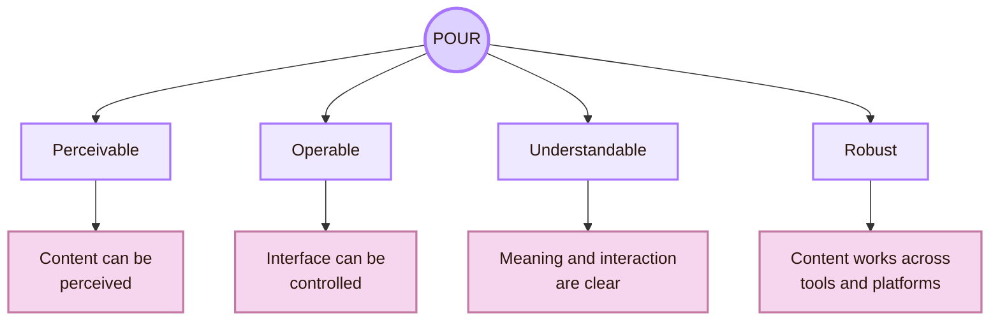

| POUR principle | Local Cognishire version | Global accessibility version |
|---|---|---|
| Perceivable | Text, diagrams, links, and sources must be readable in Obsidian, GitHub, and classroom view | Users need alternatives for visual, audio, and sensory information |
| Operable | Keyboard users must reach pages, links, and source routes | Users need more than one way to control the system |
| Understandable | Fantasy room names must have academic translations | Content, instructions, errors, and navigation must be clear |
| Robust | Markdown, links, CSS, and diagrams must survive different setups | Content should work with current and future user agents and assistive technologies |

## Local, Romanian, and global route

The Inclusive Gate should start from the local project. Then it should connect that project to Romanian routes and global standards. This prevents two weak extremes: a page that is local but unsourced, and a page that is global but disconnected from the real UVT project.

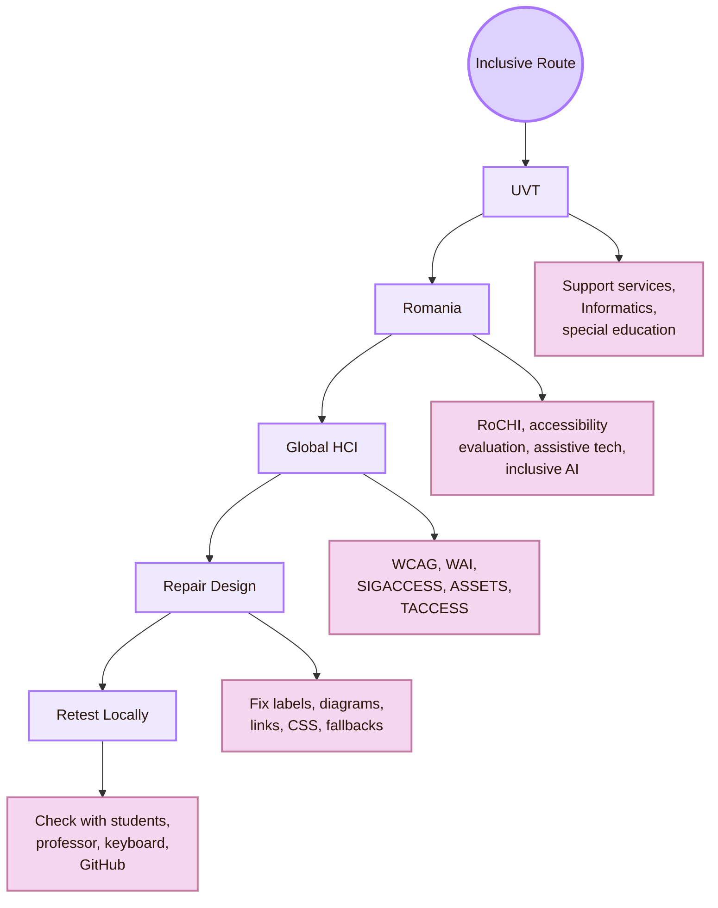

| Scale | What belongs here | Why it matters |
|---|---|---|
| UVT | Accessibility services, Faculty of Informatics, CSAI, DTSE, special education routes, support services, classroom review | The project must answer to its real local environment |
| Romania | RoCHI, Romanian HCI publications, web accessibility evaluation, accessible computing researchers, assistive technology projects, inclusive AI routes | The project should not ignore national context when reliable sources exist |
| Global HCI | WCAG, WAI, ARIA, ASSETS, TACCESS, Web4All, SIGACCESS, inclusive design, universal design, ability-based design | The project needs recognised standards and research routes |
| Repair | Changes to content, structure, diagrams, CSS, links, fallbacks, sources, and setup | Accessibility must become concrete design work |
| Retest | Local keyboard checks, comprehension tasks, source-finding tasks, and setup checks | A repair is stronger when it is tested again |

## Page route board

Use this board to choose the next page. Each page answers a different accessibility question.

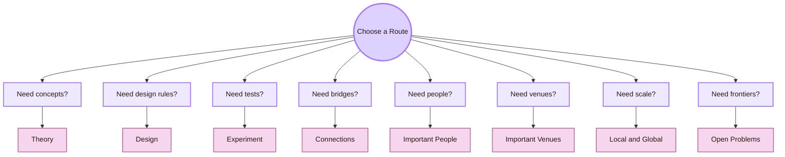

| Page | Gate role | Use it when the question is... |
|---|---|---|
| [[Activities/Theory|Theory]] | Concepts: disability as mismatch, POUR, inclusive design, universal design, ability-based design, accountability | What does accessibility mean, and why does it matter? |
| [[Activities/Design|Design]] | Interface rules: structure, contrast, keyboard paths, components, diagrams, fallback content | How do I build the system so barriers are less likely to appear? |
| [[Activities/Experiment|Experiment]] | Evidence: scans, keyboard checks, screen reader structure, cognitive tasks, local trials | How do I test whether the design actually works? |
| [[Connections|Connections]] | Bridges: disability studies, law, education, assistive technology, software engineering, AI | What other fields support accessibility? |
| [[Important People|Important People]] | Researcher and practitioner routes | Whose work can guide a specific accessibility question? |
| [[Important Venues|Important Venues]] | Conferences, journals, standards bodies, and organisations | Where should I search for reliable accessibility work? |
| [[Local and Global|Local and Global]] | UVT, Romania, and global HCI scale | How does local evidence connect to national and international routes? |
| [[Open Problems|Open Problems]] | Frontiers and unresolved issues | Where does accessibility still fail or remain difficult? |

## Core theory in one table

This room uses several theories together. None of them is enough alone.

| Theory or framework | Main idea | How it helps this project |
|---|---|---|
| Disability as mismatch | Barriers appear when a system demands something a person, tool, or context cannot provide | Moves the project away from blaming users when access fails |
| WCAG and POUR | Content should be perceivable, operable, understandable, and robust | Gives a technical baseline for pages, links, diagrams, and structure |
| Inclusive Design | Find exclusion early and learn from human diversity | Helps the map treat access needs as design knowledge |
| Universal Design | Design for the widest practical range of users | Supports flexible routes, readable content, and recovery |
| Ability-Based Design | Focus on what users can do in context, then adapt the interface | Helps avoid treating disabled users as one fixed group |
| Accountability | Designers and institutions must own risks, exclusions, and repairs | Forces the project to record limits and not overclaim |

## The Inclusive Evidence Stack

A single check is not enough. Accessibility evidence becomes stronger when several layers are combined.

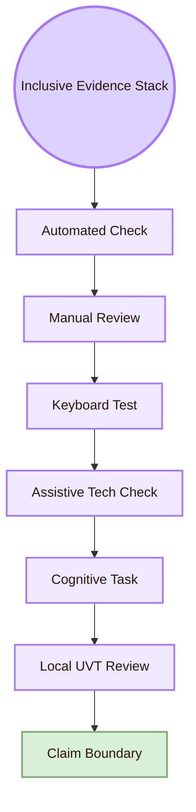

| Evidence layer | What it contributes | What it cannot prove alone |
|---|---|---|
| Automated check | Some detectable technical barriers | Full accessibility |
| Manual review | Structure, labels, focus, contrast, source clarity | Lived access for every user |
| Keyboard test | Operability without mouse | All motor or assistive technology access |
| Assistive technology check | Real tool behaviour for selected tools | All disabled-user experiences |
| Cognitive task | Understanding, memory load, label clarity | Full population-level generalisation |
| Local UVT review | Project-specific evidence from students and professor context | Global accessibility |
| Claim boundary | Honest statement of limits | It must be updated after changes |

## What this room must fix in Cognishire

The Inclusive Gate should not stay abstract. It should improve the actual HCI vault.

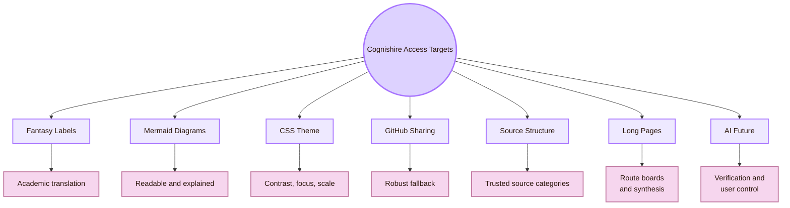

| Cognishire element | Inclusive Gate requirement |
|---|---|
| Fantasy labels | Every metaphor must include the academic CS2023 label |
| Mermaid diagrams | Diagrams must be compact, readable, high-contrast, and explained in text |
| CSS theme | The theme must preserve contrast, focus visibility, and readable type |
| GitHub sharing | Content must remain usable if custom Obsidian settings fail |
| Source structure | Users must distinguish UVT, Romania, global standards, venues, and practice sources |
| Long pages | The page must provide route boards, synthesis, and structured sections |
| AI future | AI content must be checked for correctness, bias, accessibility, and uncertainty |

## Minimal local trial

This local trial is small enough for a student project, but it still produces useful evidence.

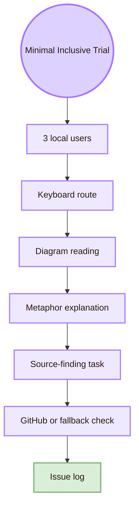

| Trial part | Concrete task |
|---|---|
| Local users | Ask three UVT students or classmates to test selected pages |
| Keyboard route | Navigate from Overview to Theory or Experiment without mouse |
| Diagram reading | Read one Mermaid diagram and explain the concept |
| Metaphor explanation | Explain “Inclusive Gate” in academic words |
| Source-finding task | Find one WCAG/WAI source, one UVT source, and one Romanian source |
| GitHub or fallback check | Open the page outside the author’s preferred setup |
| Issue log | Record barrier, evidence, affected user, severity, repair, and retest status |

## Source compass

This page uses different source types for different purposes. Keep them separate so the reader can see what kind of evidence supports each claim.

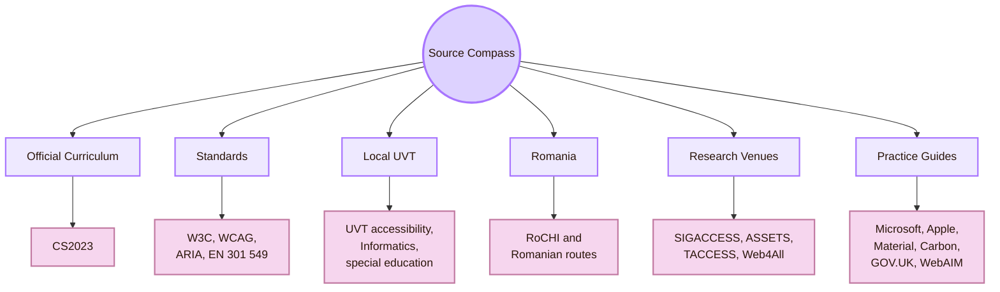

| Source type | Use it for |
|---|---|
| CS2023 | Official computer science curriculum grounding |
| W3C, WCAG, WAI-ARIA | Accessibility standards and technical criteria |
| UVT | Local institutional accessibility and project context |
| Romania | National HCI and accessibility grounding, when sources are reliable |
| SIGACCESS, ASSETS, TACCESS, Web4All | Peer-reviewed accessibility research |
| Design-system guides | Practical accessible component and service design |
| WebAIM | Practical accessibility explanation and checking |

## Student career routes

Accessibility and Inclusive Design can lead to several academic and professional routes.

| Route | Skills to build | Portfolio evidence |
|---|---|---|
| Accessibility evaluator | WCAG, keyboard testing, screen reader basics, issue reporting | Accessibility audit, issue log, repair and retest notes |
| Inclusive UX researcher | Interviews, usability testing, disability-aware recruitment, cognitive access tasks | Protocol, participant tasks, findings report, claim-boundary table |
| Front-end accessibility developer | Semantic HTML, ARIA when needed, focus management, responsive layout | Accessible component examples and before/after fixes |
| Design systems contributor | Tokens, component states, documentation, accessibility rules | Accessible button, link, table, form, and diagram patterns |
| Assistive technology researcher | AT use, human abilities, interaction adaptation, user studies | Small prototype or literature map connected to ASSETS/TACCESS |
| Human-AI accessibility researcher | AI bias, explanations, uncertainty, verification, user control | AI accessibility evaluation protocol and source-check tasks |
| Education technology evaluator | Learning access, cognitive load, accessible materials, classroom use | Local learning task, accessibility checklist, revision report |

## What not to claim

This room should be careful with wording. Strong accessibility claims need strong evidence.

| Do not claim | Safer wording |
|---|---|
| “The map is accessible for everyone.” | “The map was checked for selected accessibility barriers in the tested context.” |
| “WCAG compliance proves full inclusion.” | “WCAG is a baseline. Real access may need assistive technology checks and user evidence.” |
| “A classmate test proves accessibility.” | “A classmate test can reveal local barriers, but it cannot represent all disabled users.” |
| “The CSS looks readable, so it is accessible.” | “Readability needs contrast, zoom, keyboard, structure, and device checks.” |
| “Romanian accessibility research is fully covered here.” | “This page gives selected Romanian routes that should be expanded with further search.” |
| “AI automatically improves accessibility.” | “AI may support access, but it also needs checks for correctness, bias, uncertainty, and user control.” |

## Local and global synthesis

The Inclusive Gate exists to keep the HCI map from being beautiful but exclusionary. It asks whether the project can actually be read, navigated, understood, trusted, shared, and repaired by people with different abilities, devices, contexts, and needs.

Locally, this means UVT accessibility support, the Faculty of Informatics, students, professor review, special education routes, Obsidian, GitHub, CSS, Markdown, Mermaid, and classroom presentation.

Nationally, this means connecting cautiously to Romanian HCI and accessibility routes, including RoCHI, Romanian accessibility evaluation studies, accessible computing research, assistive technology work, and inclusive AI projects.

Globally, this means using CS2023, W3C/WCAG, WAI-ARIA, SIGACCESS, ASSETS, TACCESS, Web4All, inclusive design, universal design, ability-based design, accessibility policy, and disability-centered HCI.

The central question of this room is:

> Who is excluded by this design, what barrier excludes them, and what evidence shows that the repair worked?

Back to [[00_Index/Human-Computer Interaction|The five rooms of HCI]].

## Academic Anchors

| Route | Source |
|---|---|
| CS2023 HCI Accessibility basis | [CS2023 HCI Version Gamma](https://csed.acm.org/wp-content/uploads/2023/09/HCI-Version-Gamma.pdf) |
| CS2023 Knowledge Areas | [CS2023 Knowledge Areas](https://csed.acm.org/knowledge-areas/) |
| UVT accessibility for students with disabilities | [UVT: Accessibility for students with disabilities](https://uvt.ro/en/educatie/info-studenti-proces-educational/accesibilitate-pentru-studentii-cu-dizabilitati/) |
| UVT educational management regulation | [UVT DME regulation](https://www.uvt.ro/wp-content/uploads/2024/10/Anexa-6.-Regulamentul-de-Organizare-si-Functionare-DME.pdf) |
| UVT social inclusion | [UVT actively promotes social inclusion](https://www.uvt.ro/en/blog/uvt-promoveaza-activ-incluziunea-sociala/) |
| UVT Faculty of Informatics | [Faculty of Informatics UVT](https://info.uvt.ro/en/) |
| UVT Faculty departments | [Faculty of Informatics Departments](https://info.uvt.ro/en/departamente/) |
| UVT special education plan | [UVT PPS plan with assistive technologies](https://fsp.uvt.ro/wp-content/uploads/2025/02/pps_3_24-25.pdf) |
| Romanian HCI conference route | [RoCHI Proceedings](https://rochi.utcluj.ro/proceedings/en/) |
| Romanian HCI research route | [Romanian Journal of Human-Computer Interaction](https://rochi.utcluj.ro/rrioc/en/) |
| Radu-Daniel Vatavu public profile | [Radu-Daniel Vatavu homepage](https://raduvatavu.usv.ro/) |
| Ovidiu-Andrei Schipor public projects | [Ovidiu-Andrei Schipor projects](https://www.eed.usv.ro/~schipor/projects.php) |
| A(I)BILITIES project | [A(I)BILITIES](https://aibilities.ro/en/about/) |
| Romanian accessibility-tool study | [Comparing Six Free Accessibility Evaluation Tools](https://revistaie.ase.ro/content/93/02%20-%20padure%2C%20pribeanu.pdf) |
| W3C WAI | [Web Accessibility Initiative](https://www.w3.org/WAI/) |
| WCAG 2.2 | [Web Content Accessibility Guidelines 2.2](https://www.w3.org/TR/WCAG22/) |
| WAI-ARIA Authoring Practices | [ARIA Authoring Practices Guide](https://www.w3.org/WAI/ARIA/apg/) |
| Accessibility evaluation | [W3C Evaluating Web Accessibility](https://www.w3.org/WAI/test-evaluate/) |
| WCAG conformance evaluation | [WCAG-EM Overview](https://www.w3.org/WAI/test-evaluate/conformance/wcag-em/) |
| ACM SIGACCESS | [ACM SIGACCESS](https://www.sigaccess.org/) |
| ACM ASSETS | [ASSETS Conference](https://www.sigaccess.org/assets/) |
| ACM TACCESS | [ACM Transactions on Accessible Computing](https://dl.acm.org/journal/taccess) |
| Web4All | [International Web for All Conference](https://www.w4a.info/) |
| WebAIM | [WebAIM](https://webaim.org/) |
| Microsoft Inclusive Design | [Microsoft Inclusive Design](https://inclusive.microsoft.design/) |
| Ability-Based Design paper | [Ability-Based Design](https://kgajos.seas.harvard.edu/papers/wobbrock11abd.pdf) |
| European Accessibility Act | [European Commission: European Accessibility Act](https://commission.europa.eu/strategy-and-policy/policies/justice-and-fundamental-rights/disability/european-accessibility-act-eaa_en) |
| EN 301 549 | [Accessibility requirements for ICT products and services](https://accessible-eu-centre.ec.europa.eu/content-corner/digital-library/en-3015492021-accessibility-requirements-ict-products-and-services_en) |

^overview-accessibility-inclusive-design-end
