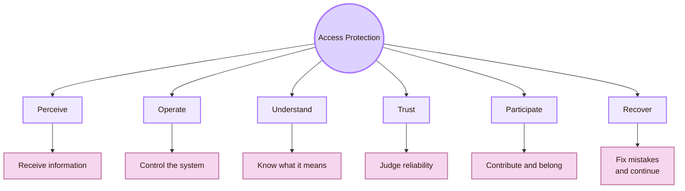
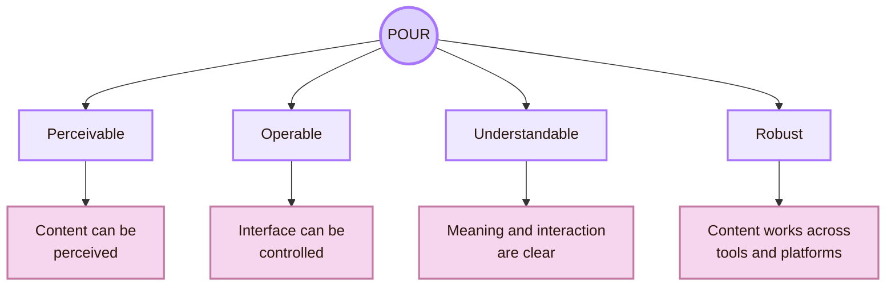
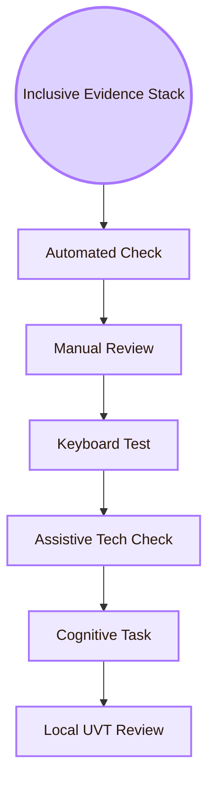
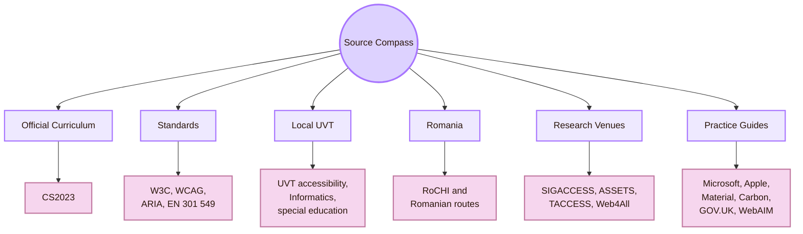

![[wild.png|1000]]
# Accessibility and Inclusive Design

This page is an overview. It gives the reader the main routes through this area. It does not replace the detailed pages on [[Activities/Theory|Theory]], [[Activities/Design|Design]], [[Activities/Experiment|Experiment]], [[Connections|Connections]], [[Important People|Important People]], [[Important Venues|Important Venues]], [[Local and Global|Local and Global]], and [[Open Problems|Open Problems]].

The Romanian dimension includes national HCI and accessibility routes such as **RoCHI**, Romanian HCI publications, web accessibility evaluation studies, accessible computing research, assistive technology work, and inclusive AI projects. Names and projects should be treated as routes to verify through public profiles and publications, not as a fixed canon.

The global dimension includes **CS2023**, **W3C WAI**, **WCAG**, **WAI-ARIA**, **ACM SIGACCESS**, **ASSETS**, **TACCESS**, **Web4All**, inclusive design, universal design, ability-based design, accessibility policy, and disability-centered HCI.

> [!quote] Gate rule
> Accessibility is not a decoration added after the interface is finished. It is the design question of who can enter, act, understand, recover, trust the system, and belong.

## What this area is about

Accessibility and Inclusive Design asks a direct question: **who is blocked by the system, and what design decision creates that barrier?**

The answer is rarely a single item. A barrier may come from colour contrast, font size, link text, keyboard access, reading order, missing captions, unclear language, broken source structure, inaccessible diagrams, plugin dependence, poor error recovery, or an AI feature that gives unreliable help.

## Gate Entrance

## Area Identity

## What this area protects

Accessibility is often reduced to contrast or screen readers. Those are important, but this area protects more than that. It protects the user’s ability to enter the system, act inside it, understand it, trust it, participate in it, and recover when something goes wrong.

## The POUR core

WCAG organises web accessibility around four principles: **Perceivable**, **Operable**, **Understandable**, and **Robust**. These are often shortened to **POUR**. POUR is a useful baseline for this whole area.

## Local, Romanian, and global route

- **UVT:** what belongs here: Accessibility services, Faculty of Informatics, CSAI, DTSE, special education routes, support services, classroom review (why: The study must answer to its real local environment)
- **Romania:** what belongs here: RoCHI, Romanian HCI publications, web accessibility evaluation, accessible computing researchers, assistive technology projects, inclusive AI routes (why: The study should not ignore national context when reliable sources exist)
- **Global HCI:** what belongs here: WCAG, WAI, ARIA, ASSETS, TACCESS, Web4All, SIGACCESS, inclusive design, universal design, ability-based design (why: The study needs recognised standards and research routes)
- **Repair:** what belongs here: Changes to content, structure, diagrams, CSS, links, fallbacks, sources, and setup (why: Accessibility must become concrete design work)
- **Retest:** what belongs here: Local keyboard checks, comprehension tasks, source-finding tasks, and setup checks (why: A repair is stronger when it is tested again)

## Core theory in one table

This area uses several theories together. None of them is enough alone.

## The Inclusive Evidence Stack

A single check is not enough. Accessibility evidence becomes stronger when several layers are combined.

- **Automated check:** what it contributes: Some detectable technical barriers; what it cannot prove alone: Full accessibility
- **Manual review:** what it contributes: Structure, labels, focus, contrast, source clarity; what it cannot prove alone: Lived access for every user
- **Keyboard test:** what it contributes: Operability without mouse; what it cannot prove alone: All motor or assistive technology access
- **Assistive technology check:** what it contributes: Real tool behaviour for selected tools; what it cannot prove alone: All disabled-user experiences
- **Cognitive task:** what it contributes: Understanding, memory load, label clarity; what it cannot prove alone: Full population-level generalisation
- **Local UVT review:** what it contributes: Project-specific evidence from students and professor context; what it cannot prove alone: Global accessibility

## Minimal local trial

## Source compass

| Source type | Use it for |
|---|---|
| CS2023 | Official computer science curriculum grounding |
| W3C, WCAG, WAI-ARIA | Accessibility standards and technical criteria |
| UVT | Local institutional accessibility and study context |
| Romania | National HCI and accessibility grounding, when sources are reliable |
| SIGACCESS, ASSETS, TACCESS, Web4All | Peer-reviewed accessibility research |
| Design-system guides | Practical accessible component and service design |
| WebAIM | Practical accessibility explanation and checking |

## Student career routes

Accessibility and Inclusive Design can lead to several academic and professional routes.

## Academic Anchors

| Route | Source |
|---|---|
| CS2023 HCI Accessibility basis | [CS2023 HCI Version Gamma](https://csed.acm.org/wp-content/uploads/2023/09/HCI-Version-Gamma.pdf) |
| CS2023 Knowledge Areas | [CS2023 Knowledge Areas](https://csed.acm.org/knowledge-areas/) |
| UVT accessibility for students with disabilities | [UVT: Accessibility for students with disabilities](https://uvt.ro/en/educatie/info-studenti-proces-educational/accesibilitate-pentru-studentii-cu-dizabilitati/) |
| UVT educational management regulation | [UVT DME regulation](https://www.uvt.ro/wp-content/uploads/2024/10/Anexa-6.-Regulamentul-de-Organizare-si-Functionare-DME.pdf) |
| UVT social inclusion | [UVT actively promotes social inclusion](https://www.uvt.ro/en/blog/uvt-promoveaza-activ-incluziunea-sociala/) |
| UVT Faculty of Informatics | [Faculty of Informatics UVT](https://info.uvt.ro/en/) |
| UVT Faculty departments | [Faculty of Informatics Departments](https://info.uvt.ro/en/departamente/) |
| UVT special education plan | [UVT PPS plan with assistive technologies](https://fsp.uvt.ro/wp-content/uploads/2025/02/pps_3_24-25.pdf) |
| Romanian HCI conference route | [RoCHI Proceedings](https://rochi.utcluj.ro/proceedings/en/) |
| Romanian HCI research route | [Romanian Journal of Human-Computer Interaction](https://rochi.utcluj.ro/rrioc/en/) |
| Radu-Daniel Vatavu public profile | [Radu-Daniel Vatavu homepage](https://raduvatavu.usv.ro/) |
| Ovidiu-Andrei Schipor public projects | [Ovidiu-Andrei Schipor projects](https://www.eed.usv.ro/~schipor/projects.php) |
| A(I)BILITIES route | [A(I)BILITIES](https://aibilities.ro/en/about/) |
| Romanian accessibility-tool study | [Comparing Six Free Accessibility Evaluation Tools](https://revistaie.ase.ro/content/93/02%20-%20padure%2C%20pribeanu.pdf) |
| W3C WAI | [Web Accessibility Initiative](https://www.w3.org/WAI/) |
| WCAG 2.2 | [Web Content Accessibility Guidelines 2.2](https://www.w3.org/TR/WCAG22/) |
| WAI-ARIA Authoring Practices | [ARIA Authoring Practices Guide](https://www.w3.org/WAI/ARIA/apg/) |
| Accessibility evaluation | [W3C Evaluating Web Accessibility](https://www.w3.org/WAI/test-evaluate/) |
| WCAG conformance evaluation | [WCAG-EM Overview](https://www.w3.org/WAI/test-evaluate/conformance/wcag-em/) |
| ACM SIGACCESS | [ACM SIGACCESS](https://www.sigaccess.org/) |
| ACM ASSETS | [ASSETS Conference](https://www.sigaccess.org/assets/) |
| ACM TACCESS | [ACM Transactions on Accessible Computing](https://dl.acm.org/journal/taccess) |
| Web4All | [International Web for All Conference](https://www.w4a.info/) |
| WebAIM | [WebAIM](https://webaim.org/) |
| Microsoft Inclusive Design | [Microsoft Inclusive Design](https://inclusive.microsoft.design/) |
| Ability-Based Design paper | [Ability-Based Design](https://kgajos.seas.harvard.edu/papers/wobbrock11abd.pdf) |
| European Accessibility Act | [European Commission: European Accessibility Act](https://commission.europa.eu/strategy-and-policy/policies/justice-and-fundamental-rights/disability/european-accessibility-act-eaa_en) |
| EN 301 549 | [Accessibility requirements for ICT products and services](https://accessible-eu-centre.ec.europa.eu/content-corner/digital-library/en-3015492021-accessibility-requirements-ict-products-and-services_en) |

^overview-accessibility-inclusive-design-end
