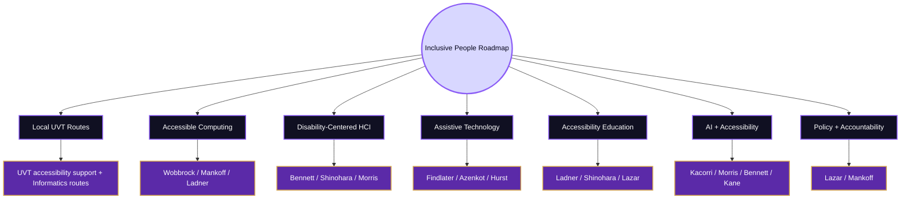
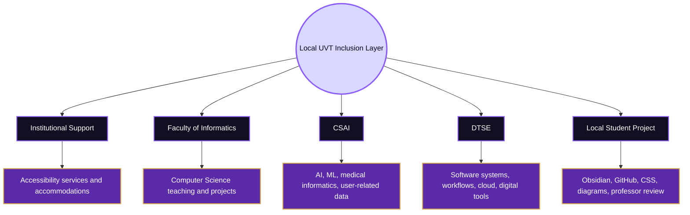
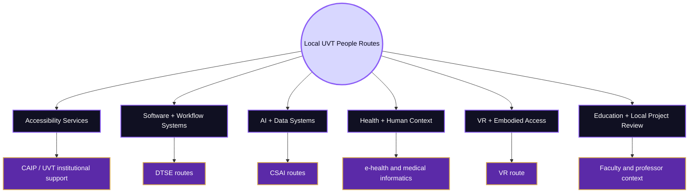
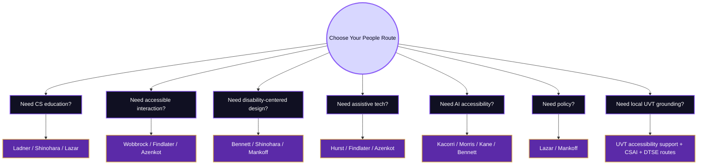
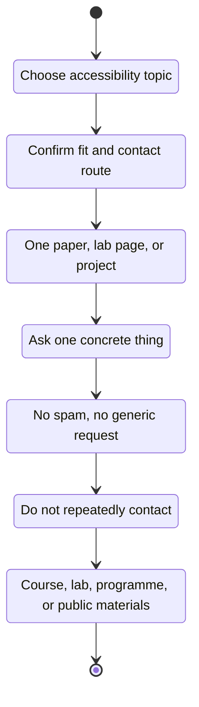
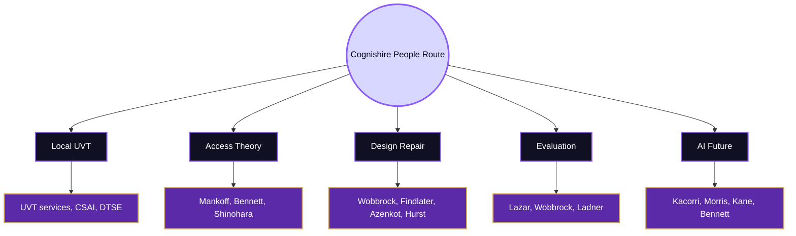

# Important People

Back to [[Overview|The Inclusive Gate]].

> [!abstract] Inclusive People Roadmap
> This page maps people, labs, and local routes connected to **Accessibility and Inclusive Design**. It starts locally from the **UVT Faculty of Informatics / Computer Science context**, then expands globally to major researchers in accessible computing, inclusive design, disability-centered HCI, assistive technology, accessibility education, and AI accessibility.

The fantasy name is **Inclusive People Roadmap**.  
The real CS2023 label is **HCI-Accessibility: Accessibility and Inclusive Design**.  
The connected responsibility route is **HCI-Accountability: Accountability and Responsibility in Design**.  
The real-life meaning is **knowing who to learn from when the question is how to design technology that more people can actually use**.

This page is not a celebrity list. It is a route map. Each person is included because their work can help answer a specific accessibility question: how to design with disabled people, how to build assistive technology, how to evaluate accessibility, how to teach accessibility in computing, how to connect accessibility to law and policy, and how to prevent AI from reproducing barriers.

> [!warning] Contact rule
> Public emails are included only where official institutional pages clearly expose them. Do not mass email. Read one paper, lab page, or project first. Then ask one precise question.

## People Map

| Route | What it teaches | Start with |
|---|---|---|
| Local UVT routes | How accessibility appears in the project’s real institutional context | UVT accessibility support, Faculty of Informatics, CSAI, DTSE |
| Accessible computing | How to design, build, and evaluate systems for people with disabilities | Jacob Wobbrock, Jennifer Mankoff, Richard Ladner |
| Disability-centered HCI | How disabled people’s experience and agency reshape HCI | Cynthia Bennett, Kristen Shinohara, Meredith Ringel Morris |
| Assistive technology | How tools such as screen readers, wearables, fabrication, and adaptive systems support access | Leah Findlater, Shiri Azenkot, Amy Hurst |
| Accessibility education | How accessibility becomes part of computing curricula and student training | Richard Ladner, Kristen Shinohara, Jonathan Lazar |
| AI and accessibility | How AI can support or harm disabled users | Hernisa Kacorri, Meredith Ringel Morris, Cynthia Bennett, Shaun Kane |
| Policy and accountability | How law, rights, procurement, and responsibility shape accessibility | Jonathan Lazar, Jennifer Mankoff |

## Local Route First: UVT Accessibility and Informatics Context

The local dimension for this project is **UVT**, especially the **Faculty of Informatics / Computer Science context**. Local people here should be understood carefully. The point is not to claim that UVT has a dedicated HCI accessibility lab. The point is to identify institutional and Computer Science routes that can make the Inclusive Gate locally meaningful.

UVT publicly describes accessibility support for students with disabilities through the **Psychopedagogical Assistance and Integration Center**, with services such as learning advisory services, individual counseling, a mimic-gestural interpreter, accessible reading-room support, accessible educational spaces, assistive technologies, screen-reading software, Braille printing, RoboBraille, and accommodation-related procedures. UVT also frames support for students with disabilities as an institutional responsibility and has projects aimed at increasing access and retention of students with disabilities.

| Local route | Public basis | Why it belongs in this page |
|---|---|---|
| UVT accessibility support | UVT accessibility pages describe services for students with disabilities, assistive technologies, accessible spaces, accessible reading-room support, screen-reading software, Braille printing, and accommodation routes | It gives the local institutional context for accessibility, beyond HCI theory |
| Faculty of Informatics | UVT Faculty of Informatics trains students in Computer Science and lists its departments publicly | It is the local academic home of the project |
| Department of Computational Sciences and Artificial Intelligence | Public staff and research routes include machine learning, data mining, medical informatics, recommender systems, image processing, e-health, and AI | These topics connect to AI accessibility, health systems, data bias, image descriptions, and adaptive systems |
| Department of Digital Technologies and Software Engineering | Public staff and research routes include software systems, workflows, web technologies, cloud systems, and distributed systems | These topics connect to accessible software engineering, robust systems, GitHub workflows, and maintainable accessibility |
| Local student project route | The Cognishire vault is built with Obsidian, GitHub, CSS, Markdown, Mermaid, and academic sources | This is the first real accessibility artifact that can be tested locally |

## Local UVT People and Routes

Use this table as a local map, not as proof that every person listed is an accessibility researcher. These are **local Computer Science routes that can support Accessibility and Inclusive Design questions**.

| Local person / route | Public UVT information | Accessibility connection |
|---|---|---|
| UVT Psychopedagogical Assistance and Integration Center | UVT describes this center as offering academic support services for students with disabilities | Start here for the local institutional accessibility context |
| Teodor Florin Fortiș | UVT researchers page lists workflows, web technologies, and ontologies | Useful local route for accessible workflows, web information structures, and robust digital materials |
| Cristina Mîndruță | UVT researchers page lists workflows, web services, and ontologies | Useful local route for accessible web services and structured digital processes |
| Dana Petcu | UVT researchers page lists distributed, grid, cloud, and parallel computing | Useful local route for accessibility as infrastructure, portability, and robust system access |
| Ciprian Pungilă | UVT DTSE staff list gives public contact; UVT researchers page lists intelligent systems and anomaly detection | Useful local route for evaluating system reliability, errors, and technical barriers |
| Ioan Drăgan | UVT researchers page lists cloud computing, formal verification, first-order logic, and automated theorem proving | Useful local route for reliable systems and correctness in access-sensitive software |
| Daniel Pop | UVT researchers page lists knowledge discovery, big data, and high-performance computing | Useful local route for analysing user data and accessibility-related patterns carefully |
| Daniela Zaharie | UVT researchers page lists evolutionary computing, machine learning, and data mining | Useful local route for adaptive systems, optimisation, and accessibility metrics |
| Darian Onchiș | UVT researchers page lists signal and image processing, bioinformatics, and machine learning | Useful local route for image accessibility, medical systems, and human-related data |
| Sebastian Ștefănigă | UVT researchers page lists image processing, high-performance computing, medical informatics, and machine learning | Useful local route for medical informatics, visual systems, and high-stakes access |
| Todor Ivașcu | UVT researchers page lists multi-agent systems, e-health systems, and machine learning | Useful local route for e-health accessibility, monitoring systems, and user trust |
| Horia Popa | UVT researchers page lists knowledge discovery and recommender systems | Useful local route for recommender accessibility, personalisation, and user modelling |
| Alexandru Vlasiu | UVT researchers page lists machine learning, data mining, and applications in psychology | Useful local route for cognitive and behavioural dimensions of accessibility |
| Bogdan Butunoi | UVT researchers page lists computational intelligence, prediction models, and diabetes monitoring systems | Useful local route for health monitoring and accessible interpretation of predictions |
| Codruț Chiș | UVT researchers page lists virtual reality | Useful local route for accessible VR, spatial interaction, and embodied access |
| Eduard Hogea / Fabian Galiș / Flavia Costi | UVT researchers page lists explainable AI routes | Useful local route for explainability, trust, and accessibility in AI systems |

> [!warning] Local people note
> This is a local route table, not a list of official HCI accessibility supervisors. Before contacting anyone, verify current role, course fit, and research relevance through official UVT pages.

## Global Route I: Accessible Computing Foundations

This route is for learning how accessibility became a serious computing and HCI research area.

### Jacob O. Wobbrock

| Field | Details |
|---|---|
| University | University of Washington |
| Public email | `wobbrock@uw.edu` |
| Current role | Professor of Human-Computer Interaction in the Information School; founding co-director of CREATE; director of ACE Lab |
| Main connection | Accessible computing, ability-based design, interaction techniques, performance measurement, HCI methods |
| Why he matters | His work connects accessibility to rigorous HCI methods, input techniques, interaction design, and ability-based design |
| How to study with this route | Read Ability-Based Design, then study accessibility inspection methods, accessible input techniques, and HCI evaluation methods |
| Best question to ask | “How should I evaluate whether an interaction technique adapts to user ability rather than assuming a default user?” |
| Official sources | [UW iSchool profile](https://ischool.uw.edu/people/faculty/profile/wobbrock), [CREATE profile](https://create.uw.edu/people-directors-wobbrock/) |

### Jennifer Mankoff

| Field | Details |
|---|---|
| University | University of Washington |
| Public email | `jmankoff@cs.uw.edu` |
| Current role | Richard E. Ladner Professor in Computer Science & Engineering; director/founding co-director route through UW CREATE |
| Main connection | Accessibility, disability studies, fabrication, ethics and fairness, DIY accessibility, higher education, health |
| Why she matters | Her work connects accessibility to agency, structural barriers, fabrication, policy, disability studies, and inclusive research practice |
| How to study with this route | Read about accessible fabrication, disability-centered HCI, intersectionality, and accessibility as structural participation |
| Best question to ask | “How can accessibility research give disabled people more agency instead of treating them as passive recipients?” |
| Official sources | [UW Allen School profile](https://www.cs.washington.edu/people/faculty/jennifer-mankoff/), [CREATE profile](https://create.uw.edu/people-directors-mankoff/) |

### Richard E. Ladner

| Field | Details |
|---|---|
| University | University of Washington |
| Public email | `ladner@cs.washington.edu` |
| Current role | Professor Emeritus; founder of AccessComputing and AccessCSforAll route; director for education at UW CREATE |
| Main connection | Accessibility technology, computing education, inclusion of disabled people in computing fields |
| Why he matters | Strong route for learning how accessibility belongs inside Computer Science education, not outside it |
| How to study with this route | Study AccessComputing, AccessCSforAll, and accessibility education materials |
| Best question to ask | “How can a Computer Science project include accessibility as a normal part of the curriculum?” |
| Official sources | [UW Allen School profile](https://www.cs.washington.edu/people/faculty/ladner-richard/), [CREATE education profile](https://create.uw.edu/faculty-richard-ladner/) |

## Global Route II: Disability-Centered and Justice-Oriented HCI

This route is for understanding accessibility as lived experience, participation, power, representation, and design justice.

### Cynthia L. Bennett

| Field | Details |
|---|---|
| Organisation | Google Research; former CMU HCII postdoctoral route |
| Public contact route | Use official Google Research or professional profile route |
| Main connection | Accessibility, disability studies, responsible AI, human-centred HCI, disabled people’s creativity and agency |
| Why she matters | Her work is important for moving from “accessibility as compliance” toward disability-centered and justice-oriented design |
| How to study with this route | Read work on social accessibility, disability inclusion in AI product organisations, and accessible prototyping |
| Best question to ask | “How can disabled people shape the research method, not only appear as participants at the end?” |
| Official sources | [Google Research profile](https://research.google/people/108223/), [CMU Accessibility page](https://accessibility.cs.cmu.edu/) |

### Kristen Shinohara

| Field | Details |
|---|---|
| University | Rochester Institute of Technology |
| Public email | `kristen.shinohara@rit.edu` |
| Current role | Associate Professor, School of Information; Graduate Program Director route |
| Main connection | Accessibility, HCI, computing education, disability inclusion, social accessibility |
| Why she matters | Strong route for accessibility education and for thinking about how computing curricula include or exclude accessibility |
| How to study with this route | Read “Who Teaches Accessibility?” and work on social accessibility and accessibility across contexts |
| Best question to ask | “How can accessibility be included in computing courses without treating it as a side topic?” |
| Official sources | [RIT profile](https://www.rit.edu/directory/kssics-kristen-shinohara), [Personal site](https://www.kristenshinohara.com/) |

### Meredith Ringel Morris

| Field | Details |
|---|---|
| Organisation | Google DeepMind; affiliate professor route at University of Washington |
| Public contact route | Use official personal/organisation route |
| Current role | Director for Human-AI Interaction Research at Google DeepMind |
| Main connection | HCI, accessibility, social computing, human-centered AI, responsible AI |
| Why she matters | Strong route for understanding how AI and accessibility interact, including ethical risks, bias, privacy, and expectation setting |
| How to study with this route | Read work on AI and accessibility, image descriptions, human-AI interaction, and social computing |
| Best question to ask | “When does AI remove an accessibility barrier, and when does it create a new one?” |
| Official sources | [Personal page](https://cs.stanford.edu/~merrie/), [AI and Accessibility paper](https://arxiv.org/abs/1908.08939) |

## Global Route III: Assistive Technology and Inclusive Systems

This route is for people who want to build actual tools, prototypes, interfaces, wearables, fabrication systems, and adaptive technologies.

### Leah Findlater

| Field | Details |
|---|---|
| University | University of Washington |
| Public email | `leahkf@uw.edu` |
| Current role | Professor in Human Centered Design & Engineering; director of Inclusive Design Lab; research scientist route at Apple |
| Main connection | Accessible technologies, human side of human-centered machine learning, inclusive design, AI and accessibility |
| Why she matters | Strong route for accessibility at the intersection of HCI, ML, adaptive systems, and real user needs |
| How to study with this route | Read work on accessible technologies, voice interfaces, human-centered ML, and inclusive interaction |
| Best question to ask | “How can machine learning support accessibility without taking control away from the user?” |
| Official sources | [UW HCDE profile](https://www.hcde.washington.edu/findlater), [Inclusive Design Lab](https://inclusivedesignlabuw.github.io/) |

### Shiri Azenkot

| Field | Details |
|---|---|
| University | Cornell Tech |
| Public contact route | Use Cornell Tech profile or XR Access contact route |
| Current role | Associate Professor at the Jacobs Technion-Cornell Institute, Cornell Tech |
| Main connection | Accessibility, mobile and wearable devices, blind and low-vision access, smart glasses, orientation and mobility, education and employment |
| Why she matters | Strong route for emerging accessibility through mobile, wearable, and immersive technologies |
| How to study with this route | Read work on blind/low-vision access, smart glasses, accessible wearables, and XR accessibility |
| Best question to ask | “How can emerging devices support access to information without creating new barriers?” |
| Official sources | [Cornell Tech profile](https://tech.cornell.edu/people/shiri-azenkot/), [XR Access](https://xraccess.org/) |

### Amy Hurst

| Field | Details |
|---|---|
| University | New York University |
| Public email | `amyhurst@nyu.edu` |
| Current role | Professor; Director of Ability Project |
| Main connection | Disability and technology, assistive and rehabilitation technologies, occupational therapy, responsible AI, accessible making |
| Why she matters | Strong route for accessibility that bridges computing, occupational therapy, fabrication, assistive technology, and real-world empowerment |
| How to study with this route | Study the NYU Ability Project, assistive tech prototyping, and accessible making |
| Best question to ask | “How can technical prototypes become useful assistive tools in real life?” |
| Official sources | [NYU profile](https://engineering.nyu.edu/faculty/amy-hurst), [NYU Ability Project](https://ability.nyu.edu/) |

## Global Route IV: AI, Data, and Accessibility

This route is essential for the future Oracle Engine part of the map.

### Hernisa Kacorri

| Field | Details |
|---|---|
| University | University of Maryland |
| Public email | `hernisa@umd.edu` |
| Current role | Associate Professor, College of Information; joint UMIACS appointment; affiliate CS appointment; Trace RERC core faculty route |
| Main connection | Human-centered AI, HCI, accessibility, machine learning, data work with disabled communities |
| Why she matters | Strong route for accessible AI, data access, consent, blind users, image data, and responsible dataset practices |
| How to study with this route | Read work on blind users, data access, AI-infused applications, and responsible data practices |
| Best question to ask | “How can data contribution and AI systems be made accessible to disabled users?” |
| Official sources | [UMD iSchool profile](https://ischool.umd.edu/directory/hernisa-kacorri/), [UMD CS profile](https://www.cs.umd.edu/people/hernisa) |

### Shaun K. Kane

| Field | Details |
|---|---|
| Organisation | Google Research; former University of Colorado Boulder route |
| Public contact route | Use personal website / current organisation route |
| Main connection | Accessibility, HCI, AI, machine learning, equality, independence, health, creativity |
| Why he matters | Strong route for accessibility with AI, ability-based design, and technologies that support independence |
| How to study with this route | Read accessible technology work, ability-based design routes, and AI/disability talks |
| Best question to ask | “How can AI-powered systems support disabled users without replacing their agency?” |
| Official sources | [Personal site](https://shaunkane.com/), [ACM profile](https://dl.acm.org/profile/81329489903) |

### Meredith Ringel Morris

| Field | Details |
|---|---|
| Why repeated here | Her work directly connects accessibility to AI ethics, bias, image descriptions, social computing, and human-AI interaction |
| Study direction | Use this route when your project discusses AI-generated descriptions, accessibility data, trust, and disability bias |
| Official sources | [Personal page](https://cs.stanford.edu/~merrie/), [AI and Accessibility paper](https://arxiv.org/abs/1908.08939) |

### Cynthia L. Bennett

| Field | Details |
|---|---|
| Why repeated here | Her work connects disability studies, responsible AI, disabled-user participation, accessible prototyping, and AI product organisations |
| Study direction | Use this route when the question is not just “Can AI help?” but “Who is included in designing AI accessibility?” |
| Official sources | [Google Research profile](https://research.google/people/108223/), [Accessibility at CMU](https://accessibility.cs.cmu.edu/) |

## Global Route V: Policy, Law, and Institutional Responsibility

This route is for accessibility as accountability, rights, and institutional duty.

### Jonathan Lazar

| Field | Details |
|---|---|
| University | University of Maryland |
| Public contact route | Use UMD iSchool / MIDA route |
| Current role | Professor in the College of Information; Executive Director of Maryland Initiative for Digital Accessibility |
| Main connection | ICT accessibility, user-centered design methods, assistive technologies, accessibility law and public policy |
| Why he matters | Strong route for connecting accessibility to HCI research methods, legal responsibility, public policy, libraries, and institutional systems |
| How to study with this route | Read *Research Methods in Human-Computer Interaction* and accessibility policy work |
| Best question to ask | “How do accessibility laws and policies shape what designers and institutions are responsible for?” |
| Official sources | [UMD iSchool profile](https://ischool.umd.edu/directory/jonathan-lazar/), [MIDA](https://mida.umd.edu/) |

### Jennifer Mankoff

| Field | Details |
|---|---|
| Why repeated here | Her work connects technical accessibility to agency, higher education, health, policy, and structural barriers |
| Study direction | Use this route when accessibility is connected to institutions, not only interface widgets |
| Official sources | [UW Allen School profile](https://www.cs.washington.edu/people/faculty/jennifer-mankoff/), [Make4All Group](https://make4all.org/) |

## Study Route by Interest

| If you want to learn... | Start with... | Build this small project |
|---|---|---|
| How accessibility belongs in CS education | Richard Ladner, Kristen Shinohara, Jonathan Lazar | Add an accessibility mini-module to the HCI map |
| How to evaluate accessible interaction | Jacob Wobbrock, Leah Findlater, Jonathan Lazar | Run a keyboard and screen-reader structure test |
| How to include disabled people in design | Cynthia Bennett, Jennifer Mankoff, Kristen Shinohara | Write a barrier-and-agency analysis of the map |
| How to build assistive technology | Amy Hurst, Shiri Azenkot, Leah Findlater | Prototype an alternative route for reading diagrams |
| How AI can help or harm accessibility | Hernisa Kacorri, Meredith Morris, Shaun Kane, Cynthia Bennett | Evaluate AI-generated alt text or summaries for accuracy and context |
| How accessibility connects to policy | Jonathan Lazar, Jennifer Mankoff | Map WCAG, EN 301 549, and UVT institutional responsibility |
| How to ground the project locally | UVT accessibility services, Faculty of Informatics, CSAI, DTSE | Test the vault with local users and report access barriers |

## Contact Protocol

| Email part | What to include |
|---|---|
| Subject | “Question about accessibility and inclusive design in an HCI student project” |
| Opening | Who you are and what you are building |
| Specific fit | One sentence linking your question to their official work |
| Evidence | One paper, lab page, project, or method you actually read |
| Your project | One sentence about the Cognishire HCI map |
| Ask | One precise question about reading path, evaluation method, or local/global framing |
| Close | Thank them and keep it short |

### Minimal email template

> [!example] Accessibility-method email
> Dear Professor [Name],  
> I am building a CS2023-based HCI map for a student project. I am currently working on **Accessibility and Inclusive Design**, and I read your work/page on [specific topic].  
>  
> My local project is an Obsidian/GitHub HCI map, and I want to make its structure, diagrams, and source routes more accessible. Would you recommend one paper, method, or checklist that would help me evaluate [specific issue]?  
>  
> Best regards,  
> [Name]

## Local UVT Contact Protocol

For local UVT routes, the question should be even more concrete.

| Local route | Better question |
|---|---|
| UVT accessibility support | “Which local accessibility services or procedures should a student project mention carefully?” |
| DTSE / web technologies | “How can this GitHub/Obsidian project stay usable when styling or setup changes?” |
| CSAI / ML | “How should accessibility be considered when a system uses data, prediction, or recommendation?” |
| Medical informatics / e-health | “What access and trust issues matter in high-stakes digital systems?” |
| VR route | “What makes accessibility different in immersive or spatial interaction?” |
| Education route | “How can a digital learning map be accessible to first-year students with different needs?” |

## What Not to Claim

| Do not claim | Safer wording |
|---|---|
| “These UVT people are accessibility HCI professors.” | “These are local UVT CS routes that can connect to accessibility and inclusive design questions.” |
| “Accessibility is handled only by the disability support center.” | “Accessibility is institutional, educational, technical, and design-related.” |
| “Global researchers solve the local UVT problem directly.” | “Global researchers provide concepts and methods that can guide the local project.” |
| “A public email means I should contact everyone.” | “Use public emails sparingly, only after reading specific work and forming a precise question.” |
| “AI automatically improves accessibility.” | “AI may reduce barriers or automate new ones; it needs evaluation.” |
| “WCAG alone equals inclusion.” | “WCAG is a baseline; lived experience, context, and design responsibility still matter.” |

## Cognishire Application

The Inclusive Gate should use the people map as a learning route for the whole project.

| Cognishire problem | Best people route |
|---|---|
| The fantasy names may exclude first-time readers | Shinohara, Bennett, Mankoff, local UVT student feedback |
| The Mermaid diagrams may be inaccessible | Wobbrock, WebAIM route, W3C route, local keyboard/screen-reader check |
| The GitHub/Obsidian setup may fail | DTSE/workflow routes, software engineering accessibility thinking |
| The project may ignore local UVT accessibility context | UVT accessibility support, Faculty of Informatics, local project review |
| The future AI guide may create incorrect or inaccessible content | Kacorri, Morris, Kane, Bennett |
| The project needs academic credibility | CS2023, Lazar, Ladner, Wobbrock, CHI/ASSETS routes |

## Synthesis

Important People for **Accessibility and Inclusive Design** is a local-global roadmap. Locally, the map must begin with UVT: institutional accessibility support, Faculty of Informatics, CSAI, DTSE, local students, professor review, and the real Obsidian/GitHub project context. Globally, the map expands to accessible computing, disability-centered HCI, assistive technology, accessibility education, AI accessibility, and policy.

The central lesson is that accessibility is not owned by one kind of expert. It needs disabled people’s lived experience, HCI researchers, assistive-technology builders, software engineers, educators, policy specialists, local institutions, and students who test real barriers.

The central question is:

> Whose work helps us understand, design, test, and repair access barriers?

This page connects to [[Activities/Theory]] because the researchers define key concepts. It connects to [[Activities/Design]] because their work shapes accessible components and methods. It connects to [[Activities/Experiment]] because accessibility must be tested with evidence. It connects to [[Connections]] because every person route crosses multiple fields. It connects to [[Local and Global]] because UVT context and global HCI must both be visible.

## Academic Anchors

| Route | Source |
|---|---|
| CS2023 HCI basis | [CS2023 HCI Version Gamma](https://csed.acm.org/wp-content/uploads/2023/09/HCI-Version-Gamma.pdf) |
| UVT accessibility support | [UVT: Accessibility for students with disabilities](https://uvt.ro/en/educatie/info-studenti-proces-educational/accesibilitate-pentru-studentii-cu-dizabilitati/) |
| UVT social inclusion | [UVT actively promotes social inclusion](https://www.uvt.ro/en/blog/uvt-promoveaza-activ-incluziunea-sociala/) |
| UVT accessibility project | [UVT recruitment services for students with disabilities](https://www.uvt.ro/en/blog/imbunatatirea-serviciilor-de-recrutare-a-studentilor-cu-dizabilitati-prin-masuri-active-de-orientare-si-consiliere-profesionala/) |
| UVT Faculty of Informatics | [Faculty of Informatics UVT](https://info.uvt.ro/en/) |
| UVT departments | [Faculty of Informatics Departments](https://info.uvt.ro/en/departamente/) |
| UVT CSAI Department | [Department of Computational Sciences and Artificial Intelligence](https://info.uvt.ro/en/departamente/csai/) |
| UVT DTSE Department | [Department of Digital Technologies and Software Engineering](https://info.uvt.ro/en/departamente/dtse/) |
| UVT Informatics researchers | [Research Center in Computer Science: Researchers](https://research.info.uvt.ro/researchers/) |
| Jacob Wobbrock | [UW iSchool profile](https://ischool.uw.edu/people/faculty/profile/wobbrock) |
| Jennifer Mankoff | [UW Allen School profile](https://www.cs.washington.edu/people/faculty/jennifer-mankoff/) |
| Richard Ladner | [UW Allen School profile](https://www.cs.washington.edu/people/faculty/ladner-richard/) |
| Leah Findlater | [UW HCDE profile](https://www.hcde.washington.edu/findlater) |
| Jonathan Lazar | [UMD iSchool profile](https://ischool.umd.edu/directory/jonathan-lazar/) |
| Hernisa Kacorri | [UMD iSchool profile](https://ischool.umd.edu/directory/hernisa-kacorri/) |
| Amy Hurst | [NYU Tandon profile](https://engineering.nyu.edu/faculty/amy-hurst) |
| Kristen Shinohara | [RIT profile](https://www.rit.edu/directory/kssics-kristen-shinohara) |
| Shiri Azenkot | [Cornell Tech profile](https://tech.cornell.edu/people/shiri-azenkot/) |
| Meredith Ringel Morris | [Personal research page](https://cs.stanford.edu/~merrie/) |
| Shaun Kane | [Personal research page](https://shaunkane.com/) |
| Cynthia Bennett | [Google Research profile](https://research.google/people/108223/) |
| UW CREATE | [Center for Research and Education on Accessible Technology and Experiences](https://create.uw.edu/) |
| ACM SIGACCESS | [ACM SIGACCESS](https://www.sigaccess.org/) |
| ACM ASSETS | [ACM ASSETS](https://dl.acm.org/conference/assets) |
| Web4All | [Web4All](https://www.w4a.info/) |

^important-people-accessibility-inclusive-design-end
