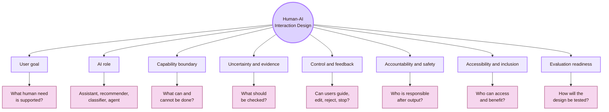
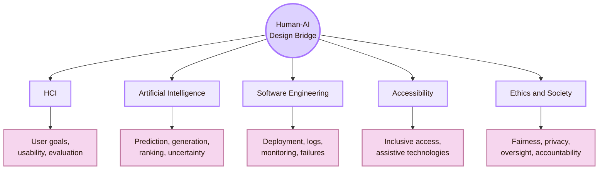
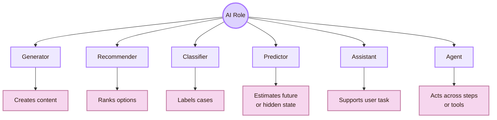
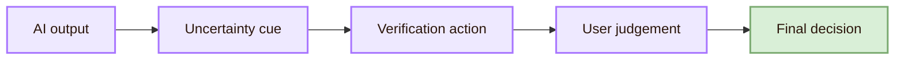
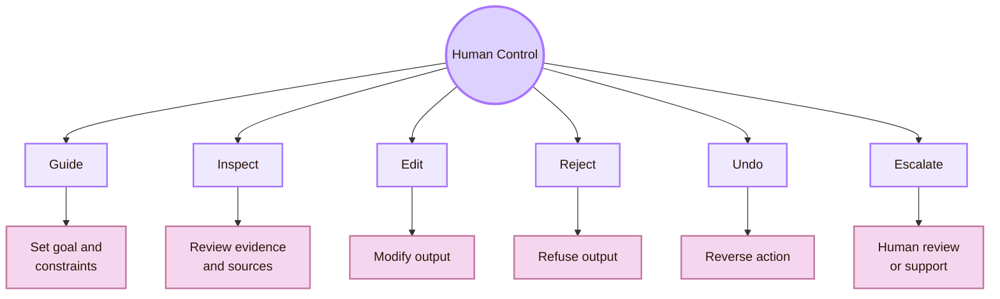
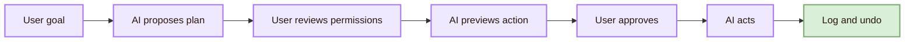
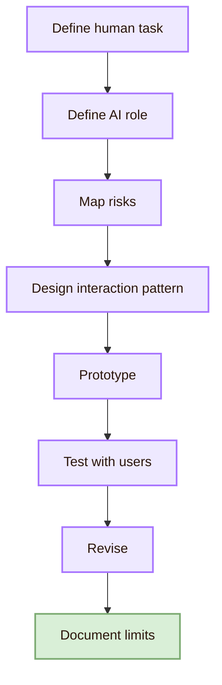

![[dojo.gif|1000]]
# Design

Back to [[Overview|The Oracle Engine]].

> [!abstract] Human-AI Interaction Design
> **Design** in **Human-AI Interaction** means designing how people understand, guide, verify, correct, trust, reject, and remain responsible for AI systems. The design problem is not only “make an AI feature.” The design problem is to make the human-AI relationship understandable, controllable, useful, safe, accessible, and accountable.

## Why this page matters for a student

| Student goal | How this page helps |
|---|---|
| Design better AI products | Shows how AI-specific interface patterns differ from normal UI patterns |
| Build a research project | Turns broad AI problems into designable interaction questions |
| Prepare for UX or HCI work | Connects AI product design to usability, trust, explanation, control, and accessibility |
| Build a portfolio | Suggests concrete artifacts: flows, prototypes, verification panels, risk logs, and evaluation plans |
| Prepare for responsible AI work | Connects design to oversight, privacy, fairness, and accountability |

## Design route map

| Design layer | Main question | Example artifact |
|---|---|---|
| User goal | What human task is the AI supposed to support? | User scenario or task statement |
| AI role | What is the AI doing in the interaction? | Role description: assistant, recommender, classifier, generator |
| Capability boundary | What can the AI do well, poorly, or not at all? | Capability and limits panel |
| Input design | What information does the user provide? | Prompt form, constraints, examples |
| Output design | How is AI output presented? | Answer, recommendation, evidence card, alternatives |
| Control design | How can the user guide, edit, reject, or stop the system? | Accept, revise, reject, undo, stop, override |
| Accountability design | How are responsibility and traceability handled? | Decision log, audit trail, human review marker |
| Accessibility design | Who can use the AI support? | Keyboard path, screen reader structure, plain language, alternatives |
| Evaluation design | How will the interaction be tested? | Usability test, trust study, source-checking task |

## CS2023 bridge

Human-AI Interaction is best treated as a bridge. It uses HCI to study interaction, AI to understand model behaviour, software engineering to deploy and monitor systems, accessibility to include diverse users, and ethics to handle risk and responsibility.

| CS route | Human-AI design implication |
|---|---|
| HCI | Design around user goals, comprehension, feedback, control, and evaluation |
| AI | Understand model uncertainty, errors, data limits, output variability, and automation limits |
| Software Engineering | Design for versioning, monitoring, rollback, logging, and failure recovery |
| Accessibility | Design AI support that works across abilities, devices, assistive technologies, and languages |
| Ethics and Society | Design with privacy, fairness, risk, responsibility, and human oversight in mind |

## Design principle 1: Start from the human task

Human-AI design should start from the human task, not from the model. The first question is not “What can the model do?” The first question is “What human goal needs support, and what kind of support is appropriate?”

| Weak starting point | Stronger starting point |
|---|---|
| “Add AI to this app.” | “Which user task becomes easier, safer, or more understandable with AI support?” |
| “Use a chatbot.” | “Does conversation actually fit the user goal?” |
| “Generate an answer.” | “What decision will the user make with the generated output?” |
| “Predict something.” | “How will the user interpret and verify the prediction?” |
| “Automate the workflow.” | “Which parts should remain under human control?” |

### Design questions

| Question | Why it matters |
|---|---|
| Who is the user? | AI systems often fail when “the user” is treated as one average person |
| What is the task? | The AI role depends on the actual goal |
| What is at stake? | High-stakes tasks need stronger control, evidence, and oversight |
| What does the user already know? | AI literacy affects trust and verification |
| What should the user still do? | Good AI design preserves human judgement where needed |

## Design principle 2: Define the AI role

A Human-AI system should make the AI role clear. A recommender, classifier, tutor, chatbot, agent, search assistant, summariser, and generator create different expectations.

| AI role | Main design risk | Needed interface support |
|---|---|---|
| Recommender | User may not know why options are ranked | Explanation, alternatives, user preference controls |
| Classifier | User may treat labels as objective facts | Confidence, appeal, examples, human review |
| Predictor | User may overtrust uncertain forecasts | Uncertainty, range, history, verification |
| Assistant | User may misunderstand what help is available | Capability guidance, examples, correction path |
| Agent | User may not know what actions the AI can take | Permissions, step preview, stop, undo, audit log |

## Design principle 3: Show capability boundaries

Users need to know what the AI can do, what it cannot do, and when caution is needed. This should be visible before the user relies on the system.

| Boundary type | Interface pattern |
|---|---|
| Supported tasks | “This assistant can summarise, compare, and draft.” |
| Unsupported tasks | “This assistant does not verify legal, medical, or financial correctness.” |
| Data limits | “This answer is based only on the provided document.” |
| Time limits | “The system may not know recent changes unless sources are provided.” |
| Context limits | “The model does not understand your institution’s policy unless you provide it.” |

### Capability boundary component

| Component | Purpose |
|---|---|
| What this AI can help with | Sets correct expectations |
| What it should not be used for | Prevents unsafe reliance |
| What users must verify | Encourages responsible use |
| Examples of good prompts | Helps users ask better questions |
| Examples of risky prompts | Teaches limits |
| How to report problems | Creates feedback and repair path |

## Design principle 4: Design the input carefully

Prompt boxes and input forms are not neutral. They shape what users ask, what data they reveal, and how the AI responds.

| Input design problem | Better design pattern |
|---|---|
| Empty prompt box | Provide structured fields, examples, or templates |
| Users ask vague questions | Ask for goal, context, constraints, and desired format |
| Users do not know what the AI needs | Show input requirements |
| Users cannot revise easily | Allow prompt editing, history, and comparison |
| Users provide too much context | Support document selection and scoped context |

### Structured input template

| Field | Purpose |
|---|---|
| Goal | What the user wants to accomplish |
| Context | What the AI needs to know |
| Constraints | What the answer must respect |
| Sources | Documents or links the AI should use |
| Output type | Summary, explanation, checklist, comparison, draft |
| Risk level | Low-stakes, academic, personal, professional, high-stakes |
| Verification requirement | Whether sources or review are required |

## Design principle 5: Design output as evidence, not only text

AI output should not be presented as an unquestioned final answer. In many systems, output should be shown with evidence, alternatives, uncertainty, next actions, and revision controls.

| Output pattern | Use it when |
|---|---|
| Answer plus evidence | The user needs to verify facts |
| Recommendation plus rationale | The user compares options |
| Multiple alternatives | The task is creative or judgement-based |
| Draft plus revision controls | The user must remain author or decision-maker |
| Prediction plus uncertainty | The output is probabilistic |
| Summary plus source links | The answer is based on documents |
| Action preview | The AI is about to do something outside the current page |

### Output card structure

| Section | Purpose |
|---|---|
| Main output | Gives the useful answer or recommendation |
| Why this output | Explains reasoning or factors where appropriate |
| Evidence or source | Shows what supports the output |
| Confidence or uncertainty | Shows where caution is needed |
| Alternatives | Prevents single-answer tunnel vision |
| Required user action | Accept, revise, verify, compare, reject |
| Feedback control | Lets users report wrong, harmful, irrelevant, or unclear output |

## Design principle 6: Make uncertainty visible

| Uncertainty pattern | Use carefully because |
|---|---|
| Confidence score | Users may misunderstand numerical confidence |
| Source requirement | Sources may be weak or irrelevant |
| Alternative answers | Too many alternatives can increase cognitive load |
| “Needs review” badge | Users may ignore it if review is inconvenient |
| Scope statement | Users may skip it if hidden or too long |

### Good uncertainty wording

| Weak wording | Better wording |
|---|---|
| “Use with caution.” | “This answer uses only the uploaded text and may miss recent information.” |
| “I am not sure.” | “The available evidence does not distinguish between these two explanations.” |

## Design principle 7: Support verification

Human-AI systems should make it easier to check AI output. Verification should be part of the workflow, not an extra burden hidden outside the interface.

| Verification pattern | What it helps users do |
|---|---|
| Comparison view | Compare AI output with original source |
| Checklist | Remind users what to verify before final use |
| Date marker | Show whether information may be outdated |

### Verification checklist

| Before accepting AI output, check | Why |
|---|---|
| Are sources official or appropriate? | Prevents weak evidence |
| Are quotes accurate? | Prevents fabricated quotation |
| Did a human revise the final version? | Preserves responsibility |

## Design principle 8: Calibrate trust

The design should help users trust AI output when it is reliable and question it when it is uncertain, incomplete, or risky.

| Trust problem | Design response |
|---|---|
| Overtrust | Show limits, uncertainty, source gaps, and verification steps |
| Undertrust | Show evidence, examples, performance history, and clear explanations |
| Blind acceptance | Require review before high-stakes use |
| False authority | Avoid overconfident wording and human-like authority cues |
| Inappropriate reliance | Add friction for risky contexts |
| Confusing confidence | Explain what confidence means and what it does not mean |

### Trust calibration design pattern

| Interface element | Function |
|---|---|
| Capability boundary | Sets expectation before use |
| Evidence panel | Lets users judge support |
| Confidence explanation | Clarifies uncertainty |
| Alternatives | Prevents one-output fixation |
| Review requirement | Keeps human judgement active |
| Feedback and correction | Lets users teach the system or report problems |
| Performance history | Shows where the system has succeeded or failed before |

## Design principle 9: Design explanations for action

An explanation should help the user decide what to do next. If an explanation does not improve judgement, control, verification, or learning, it may only create the feeling of transparency.

| Explanation goal | Better design question |
|---|---|
| Understanding | Does the user understand why this output appeared? |
| Verification | Can the user check whether the explanation is supported? |
| Control | Can the user change input or preferences based on the explanation? |
| Trust calibration | Does the explanation help the user rely appropriately? |
| Learning | Does the explanation help the user improve their own understanding? |
| Appeal | Can the user challenge or correct the output? |

| Explanation type | Useful for | Risk |
|---|---|---|
| Factor explanation | Showing important inputs | Can oversimplify model behaviour |
| Example explanation | Showing similar cases | Similarity can mislead |
| Counterfactual explanation | Showing what would change the output | May imply false control |
| Natural-language explanation | Easy to read | Can sound plausible without being accurate |
| Visual explanation | Pattern recognition | Can increase cognitive load |

## Design principle 10: Provide real human control

Human control should be concrete. A user needs actual options to guide, edit, reject, undo, stop, appeal, or escalate. Human oversight is weak if the user only clicks “OK.”

| Control pattern | Use it when |
|---|---|
| Accept / revise / reject | AI generates text, decisions, classifications, or recommendations |
| Preview before action | AI sends, deletes, purchases, publishes, or changes something |
| Undo | AI action can be reversed |
| Stop button | AI runs a long or autonomous process |
| Permission screen | AI can access tools, files, messages, or external systems |
| Appeal route | AI affects people’s opportunities or outcomes |
| Human review queue | AI output is high-stakes or uncertain |

## Design principle 11: Design for failures

AI systems fail differently from normal deterministic software. They can produce plausible falsehoods, irrelevant outputs, biased results, unsafe suggestions, privacy leaks, or actions that go beyond user intent.

| Failure type | Interface response |
|---|---|
| Incorrect output | Report, correct, regenerate with constraints |
| Harmful suggestion | Block, warn, redirect, or escalate |
| Bias or unfairness | Allow reporting and review |
| Privacy risk | Warn before sensitive input and limit storage |
| Tool misuse | Require permission and action preview |
| Repeated poor results | Suggest changing goal, source, or input |
| Model uncertainty | Show limits and alternatives |

### Failure message pattern

A good AI failure message should include:

| Part | Example |
|---|---|
| Why it matters | “Using them without sources may make the document inaccurate.” |
| How to continue safely | “Continue only after human review.” |

## Design principle 12: Protect privacy and data boundaries

Human-AI systems often invite users to paste sensitive information. The design must make data boundaries visible.

| Privacy design question | Interface pattern |
|---|---|
| What data is needed? | Data minimisation prompt |
| Where does the data go? | Plain-language data flow note |
| Is data stored? | Memory or history control |
| Can the user delete it? | Clear deletion option |
| Does the AI use external tools? | Tool permission screen |
| Does the system use uploaded files? | File scope indicator |

|---|---|
| “Be careful with data.” | “Do not paste passwords, private medical details, confidential business data, or personal records unless your institution allows it and you understand where the data goes.” |
| “Your data may be used.” | “This system may process your input to generate an answer. Check the privacy policy before entering private or confidential information.” |

## Design principle 13: Design for fairness and representation

Human-AI design must ask who benefits, who is misunderstood, who is excluded, and who carries the risk when the system fails.

| Fairness design issue | Design response |
|---|---|
| The system works better for some users | Test with diverse users and contexts |
| The interface language is too advanced | Use plain language and localised terms |
| The AI output reflects stereotypes | Add reporting, review, and dataset/model limitation notes |
| The system excludes assistive technology users | Test keyboard, screen reader, captions, and alternatives |
| User feedback is ignored | Show how corrections are used |
| The harm is invisible in average metrics | Segment findings carefully and report limitations |

Fairness is not only a model metric. It is also an interaction question: how people experience, challenge, repair, or suffer from AI output.

## Design principle 14: Design for accessibility

AI features must be accessible as interfaces and as outputs. An AI assistant is not accessible if screen reader users cannot operate it, if generated summaries remove essential structure, or if AI-generated alt text is inaccurate.

| Accessibility design area | What to check |
|---|---|
| Keyboard access | Can all AI controls be reached and operated? |
| Focus order | Does the interaction flow make sense? |
| Text alternatives | Are generated images, charts, and diagrams described accurately? |
| Captions and transcripts | Are audio/video AI outputs accessible? |
| Cognitive load | Are outputs chunked, structured, and not overwhelming? |
| Personalisation | Can users adjust complexity, length, and format? |

### AI accessibility risk

| AI feature | Accessibility risk |
|---|---|
| Auto-summary | Removes necessary detail |
| AI alt text | Describes the wrong thing |
| Voice assistant | Fails for accents, speech differences, or noisy contexts |
| Dynamic suggestions | Confuse screen reader order |
| Personalisation | Changes interface unexpectedly |
| Image generation | Produces inaccessible content without descriptions |

## Design principle 15: Design for learning and AI literacy

Many users need to learn how to work with AI. The interface can teach better AI use through examples, feedback, and reflection.

| AI literacy goal | Design pattern |
|---|---|
| Understand capability | Show what the AI can and cannot do |
| Ask better questions | Provide prompt examples and templates |
| Revise output | Make edits visible |
| Learn from feedback | Explain why a prompt failed or worked |
| Avoid overreliance | Ask users to explain, compare, or verify before final use |
| Preserve skill | Require user reflection in learning contexts |

### Learning-focused design pattern

| Step | User action |
|---|---|
| Ask | User provides goal and context |
| Review | User reads AI output with source and uncertainty cues |
| Explain | User writes what they understood |
| Revise | User edits output in their own words |
| Reflect | User records what AI helped with and what needed correction |

## Design principle 16: Design for agentic AI carefully

Agentic AI can act across tools, files, messages, calendars, repositories, or external systems. This increases design risk because the AI is not only producing text. It may act.

| Agent design requirement | Why |
|---|---|
| Plan preview | User sees what the AI intends to do |
| Permission boundary | User knows what the AI can access |
| Step confirmation | High-impact actions require approval |
| Action log | User can inspect what happened |
| Undo or rollback | User can recover from mistakes |
| Stop control | User can interrupt the process |
| Risk escalation | Risky actions require stronger human review |

## Human-AI design process

A useful process for student projects:

| Step | Student output |
|---|---|
| Define human task | Scenario and user goal |
| Define AI role | Clear statement of what the AI does |
| Map risks | Risk table: error, overtrust, privacy, bias, access |
| Design pattern | Capability, uncertainty, verification, control, feedback |
| Prototype | Figma, HTML, mockup, or paper prototype |
| Test with users | Small usability or trust-calibration study |
| Revise | Before/after design changes |

## Design patterns library

| Pattern | Problem solved | Example use |
|---|---|---|
| Capability card | Users do not know what AI can do | AI tutor, writing assistant |
| Limits statement | Users overestimate AI | Medical, legal, academic, technical domains |
| Source panel | Users need factual verification | Search, summarisation, research assistant |
| Confidence explanation | Users need uncertainty guidance | Prediction, classification |
| Alternative suggestions | One answer creates tunnel vision | Recommendations, planning |
| Human review gate | Output is high-stakes | Hiring, grading, health, finance |
| Accept / revise / reject | User remains final author | Writing, design, coding |
| Undo and rollback | AI may act incorrectly | Agentic tools |
| Permission screen | AI accesses files or tools | Agents, automation |
| Error report button | User discovers wrong output | Any AI product |
| Interaction log | Need traceability | Professional or academic work |
| Plain-language mode | Output is too complex | Education, accessibility |
| Accessibility mode | Users need format control | AI summaries, diagrams, captions |

## Example design: AI academic assistant

This example is generic. It is not tied to one project.

| Design layer | Design decision |
|---|---|
| User goal | Help students understand and improve academic text |
| AI role | Drafting and explanation assistant, not final authority |
| Capability boundary | Can summarise, suggest structure, and improve wording |
| Limits | Cannot guarantee factual correctness without sources |
| Input | Student provides text, task, audience, and source requirement |
| Control | Student can accept, revise, reject, or ask for simpler explanation |
| Accountability | Final version includes a human revision note |
| Accessibility | Plain-language mode and screen-reader-friendly structure |

## Example design: AI recommender

| Design layer | Design decision |
|---|---|
| User goal | Help users choose between options |
| AI role | Recommender, not decision-maker |
| Capability boundary | Can rank options based on stated criteria |
| Limits | Recommendation depends on available data and user preferences |
| Input | User chooses priorities and constraints |
| Output | Top options, reasons, tradeoffs, and alternatives |
| Verification | Shows which data supports each recommendation |
| Control | User can change priorities and compare alternatives |
| Accountability | System records recommendation factors |
| Accessibility | Options are readable, sortable, and keyboard accessible |
| Evaluation | Test whether users understand why one option was recommended |

## Example design: AI agent

| Design layer | Design decision |
|---|---|
| User goal | Complete a multi-step task with assistance |
| AI role | Agent that proposes and executes steps after approval |
| Capability boundary | Can draft, organise, search, and prepare actions |
| Limits | Cannot take high-impact actions without confirmation |
| Input | User goal, constraints, allowed tools |
| Output | Plan preview with steps and risks |
| Verification | User checks each step before execution |
| Control | Approve, edit, skip, stop, undo |
| Accountability | Action log with timestamps and human approvals |
| Accessibility | Plan and controls are screen-reader and keyboard accessible |
| Evaluation | Test whether users understand what the agent can access and do |

## Evaluation-ready design

A Human-AI interface should be designed so it can be tested. If the design has no measurable user task, no visible controls, and no clear output states, it will be difficult to evaluate.

| Design feature | Evaluation question |
|---|---|
| Capability statement | Do users form more accurate expectations? |
| Uncertainty cue | Does trust become better calibrated? |
| Explanation | Does user judgement improve? |
| Accept/revise/reject controls | Do users remain active decision-makers? |
| Permission screen | Do users understand what the AI can access? |
| Error report | Can users recover from incorrect output? |
| Accessibility structure | Can users with assistive technologies operate the feature? |
| Interaction log | Can responsibility and revision be traced? |

## Design checklist

Use this checklist before calling a Human-AI design “ready.”

| Check | Question |
|---|---|
| Human goal | Is the user task clearly defined? |
| AI role | Is the AI role visible and understandable? |
| Capability boundary | Does the interface show what the AI can and cannot do? |
| Input scope | Does the user know what information to provide and what not to provide? |
| Output evidence | Does the output show support, source, rationale, or uncertainty when needed? |
| Trust calibration | Does the design reduce both overtrust and undertrust? |
| Control | Can the user accept, revise, reject, undo, stop, or escalate? |
| Privacy | Are data boundaries visible? |
| Fairness | Does the design consider who may be harmed or excluded? |
| Accessibility | Can diverse users perceive, operate, understand, and use the system? |
| Accountability | Is the final human decision and AI contribution traceable? |
| Evaluation | Can the design be tested with realistic tasks? |

## Career directions connected to design

| Career or academic route | Design skills to build | Portfolio evidence |
|---|---|---|
| AI product designer | Capability boundaries, prompts, output cards, controls | Figma prototype of an AI feature with risk-aware states |
| UX researcher for AI | Trust, verification, usability, explanation studies | User study testing trust or source checking |
| Human-AI interaction researcher | Mental models, oversight, uncertainty, human control | Research question plus prototype and evaluation protocol |
| Responsible AI designer | Risk, fairness, privacy, accountability, oversight | Risk log, data boundary design, audit trail |
| Accessibility specialist | AI accessibility, screen reader support, alt text quality | Accessibility evaluation of AI-generated content |
| AI education designer | AI literacy, learning scaffolds, reflection | Student AI workflow with verification and reflection |
| Explainable AI designer | Explanation, evidence, uncertainty, alternatives | Comparison of explanation styles |
| Agentic AI designer | Permissions, preview, stop, undo, action logs | Agent workflow prototype with control states |

## What to save for a portfolio

| Portfolio artifact | Why it matters |
|---|---|
| Human-AI design brief | Shows the human goal and AI role |
| User flow | Shows interaction structure |
| Capability and limits card | Shows expectation-setting |
| Prompt/input design | Shows how the user guides the AI |
| Output card | Shows evidence, uncertainty, and next actions |
| Control states | Shows accept, revise, reject, undo, stop, and escalation |
| Failure states | Shows what happens when AI is wrong or uncertain |
| Accessibility notes | Shows inclusive design |
| Risk log | Shows responsible AI awareness |
| Evaluation plan | Shows how the design can be tested |
| Before/after revision | Shows evidence-based iteration |

## Academic anchors

| Route | Source |
|---|---|
| CS2023 Knowledge Areas | [CS2023 Knowledge Areas](https://csed.acm.org/knowledge-areas/) |
| CS2023 Body of Knowledge | [CS2023 Body of Knowledge PDF](https://csed.acm.org/wp-content/uploads/2024/04/3.1-Body-of-Knowledge-1.pdf) |
| Human-AI interaction guidelines | [Microsoft Guidelines for Human-AI Interaction](https://www.microsoft.com/en-us/haxtoolkit/ai-guidelines/) |
| Human-AI experience toolkit | [Microsoft HAX Toolkit](https://www.microsoft.com/en-us/haxtoolkit/) |
| Human-AI design patterns | [Microsoft HAX Design Patterns](https://www.microsoft.com/en-us/haxtoolkit/library/) |
| Human-centred AI product guide | [Google People + AI Guidebook](https://pair.withgoogle.com/guidebook/) |
| People + AI Research | [Google PAIR](https://pair.withgoogle.com/) |
| AI risk management | [NIST AI Risk Management Framework](https://www.nist.gov/itl/ai-risk-management-framework) |
| AI RMF core functions | [NIST AI RMF Core](https://airc.nist.gov/airmf-resources/airmf/5-sec-core/) |
| EU AI regulation | [EU AI Act overview](https://digital-strategy.ec.europa.eu/en/policies/regulatory-framework-ai) |
| Human oversight | [EU AI Act Article 14](https://artificialintelligenceact.eu/article/14/) |
| Intelligent user interfaces | [ACM IUI](https://iui.acm.org/) |
| HCI research venue | [ACM CHI](https://dl.acm.org/conference/chi) |
| Human-agent interaction | [ACM HAI](https://hai-conference.net/) |
| Interactive intelligent systems | [ACM TiiS](https://dl.acm.org/journal/tiis) |
| Fairness and accountability | [ACM FAccT](https://facctconference.org/) |
| AI ethics and society | [AIES](https://www.aies-conference.com/) |
| Accessibility research | [ACM ASSETS](https://dl.acm.org/conference/assets) |
| Web accessibility | [W3C WAI](https://www.w3.org/WAI/) |
| Accessibility standard | [WCAG 2.2](https://www.w3.org/TR/WCAG22/) |
| Computing ethics | [ACM Code of Ethics](https://www.acm.org/code-of-ethics) |

^design-human-ai-interaction-end
