# Design

Back to [[../Overview|The Oracle Engine]].

> [!abstract] Oracle Design Forge
> Design in the **Oracle Engine** means designing AI interfaces that help people understand, question, verify, correct, and control AI output. The goal is not to make the AI look powerful. The goal is to make the human-AI loop inspectable, usable, and responsible.

The fantasy name is **Oracle Design Forge**.  
The real academic topic is **Human-AI Interaction**.  
The CS2023 connection is a bridge between **Human-Computer Interaction**, **Artificial Intelligence**, **Software Engineering**, **Accessibility**, and **Society, Ethics, and Professionalism**.  
The real-life meaning is **designing AI systems so users know what the AI can do, where it may fail, how to check it, and how to stay responsible for final decisions**.

> [!warning] Scope note
> This vault uses `HCI-Human-AI-Interaction` as an internal project label. The safer academic wording is that Human-AI Interaction is a bridge across HCI, AI, software systems, accessibility, and responsible computing. Do not present it as a confirmed standalone CS2023 knowledge unit unless the curriculum source explicitly does so.

This page is about design. The [[Experiment]] page tests whether users understand, trust, verify, and correct AI output. This page defines the interface patterns that should exist before testing begins.

> [!quote] Design law
> An AI interface must not make uncertainty look like authority. It should make capability, evidence, limits, controls, and responsibility visible.

## Design problem

A normal interface usually shows the user a stable set of actions. An AI interface is harder. It may generate different outputs, use hidden data or model behaviour, answer with false confidence, adapt over time, and create outputs that users treat as facts.

That means Human-AI design has a specific responsibility: it must help the user judge the AI. The interface should not only ask, “Can the user get an answer?” It should also ask:

| Design question | Why it matters |
|---|---|
| What does the user think the AI is doing? | Wrong mental models lead to misuse |
| What can the AI actually do? | Capability must be visible before use |
| What is uncertain or unsupported? | Fluent text can hide weak evidence |
| What should the user verify? | Academic and professional work needs source checking |
| What can the user change or reject? | Human oversight needs real controls |
| Who is responsible for the final action? | Responsibility cannot disappear into “the AI said it” |

## Oracle Design Map

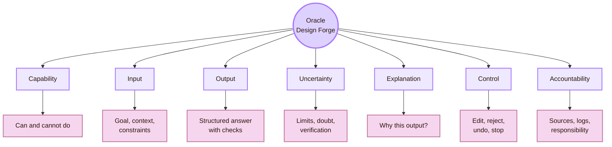

| Design layer | Real design question | Failure if ignored |
|---|---|---|
| Capability | Does the user know what the AI can and cannot do? | The user expects truth, intention, or current knowledge the system may not have |
| Input | Does the system help the user give useful context and constraints? | Weak prompts produce weak outputs |
| Output | Is the answer structured for checking and editing? | The user receives a polished block that is hard to inspect |
| Uncertainty | Does the interface show where doubt remains? | Guesses look like facts |
| Explanation | Does the explanation help judgement? | The explanation becomes decoration |
| Control | Can the user edit, reject, undo, stop, or override? | Human oversight becomes symbolic |
| Accountability | Are sources, prompts, versions, and decisions traceable? | Responsibility becomes unclear |

## Fact-checked design anchors

| Design claim used on this page | Source route |
|---|---|
| Human-AI interfaces need design guidance for expectation-setting, interaction, failure, and change over time | Microsoft Guidelines for Human-AI Interaction and HAX Toolkit |
| Human-centered AI design should support human needs, values, and well-being | Stanford Human-Centered AI and Google People + AI Guidebook |
| AI risk management should be treated as an ongoing process | NIST AI Risk Management Framework: Govern, Map, Measure, Manage |
| Generative AI needs extra attention to confabulation, harmful content, information integrity, privacy, security, and intellectual-property risks | NIST Generative AI Profile |
| High-risk AI systems in the EU AI Act must be designed for human oversight through appropriate human-machine interface tools | EU AI Act Article 14 |
| Romanian grounding should be added carefully through verified sources such as RoCHI, A(I)BILITIES, UVT, and USV/MintViz | Official UVT, RoCHI, A(I)BILITIES, and Radu-Daniel Vatavu sources |

## CS2023 Design Gate

Human-AI design is not only model design. It is also HCI design, evaluation design, software design, accessibility design, and accountability design.

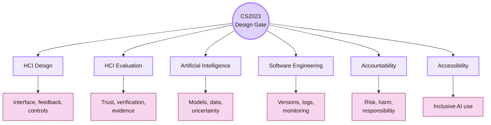

| CS2023 route | Human-AI design translation |
|---|---|
| HCI Design | Design prompts, outputs, explanations, feedback, verification paths, and correction controls |
| HCI Evaluation | Make trust, understanding, verification, and oversight testable |
| Artificial Intelligence | Represent model limits, uncertainty, data limits, and likely error modes |
| Software Engineering | Track prompts, model versions, sources, logs, updates, and failures |
| Accountability | Define review, responsibility, risk, and claim boundaries |
| Accessibility | Ensure AI tools and AI-generated outputs do not exclude users |

## Local UVT Design Layer

The local dimension is the **UVT Faculty of Informatics / Computer Science context**. In this project, the Oracle Engine supports a real student workflow: using AI to build the Cognishire HCI map while preserving learning, source verification, academic clarity, local relevance, and professor trust.

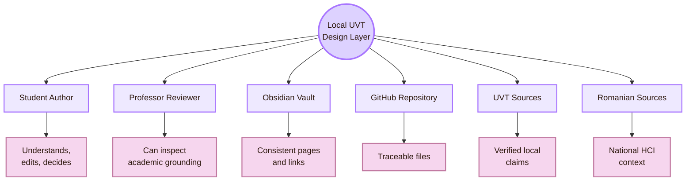

| Local design target | Oracle design requirement |
|---|---|
| Student author | AI should guide, question, structure, and critique. It should not replace understanding |
| Professor reviewer | The page should show sources, official labels, local context, and claim limits |
| Obsidian vault | AI-assisted pages should keep consistent structure, links, diagrams, and frontmatter |
| GitHub repository | File names, links, setup instructions, and versions should remain traceable |
| UVT sources | Local claims should be checked through official UVT pages |
| Romanian sources | National claims should use verified Romanian HCI, AI, and accessibility routes |
| Academic integrity | The student should be able to explain every AI-assisted section |

## Romania Design Layer

The Romanian layer keeps the Oracle Engine from becoming only a global AI design page. It connects the design to Romanian HCI, AI accessibility, assistive technology, university contexts, and Romanian-language interaction.

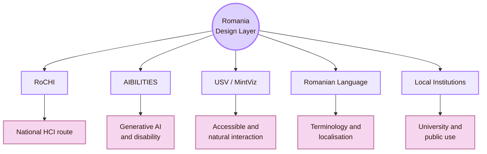

| Romanian route | How it shapes the page |
|---|---|
| RoCHI | Adds national HCI grounding instead of only international sources |
| A(I)BILITIES | Connects generative AI to adaptive interaction for users with disabilities |
| Radu-Daniel Vatavu / USV / MintViz | Connects HCI, XR, ambient intelligence, accessible computing, and visual interaction |
| Ovidiu-Andrei Schipor | Connects assistive technology and speech-related interaction routes |
| Romanian language | Makes terminology, translation, examples, and source checking part of design |
| Romanian institutions | Prevents the page from ignoring local education and public-service contexts |

## Design Principle I: State the AI role

Users need to know what role the AI is playing. The system should not pretend to be a teacher, judge, researcher, or final authority unless that role is explicit and justified.

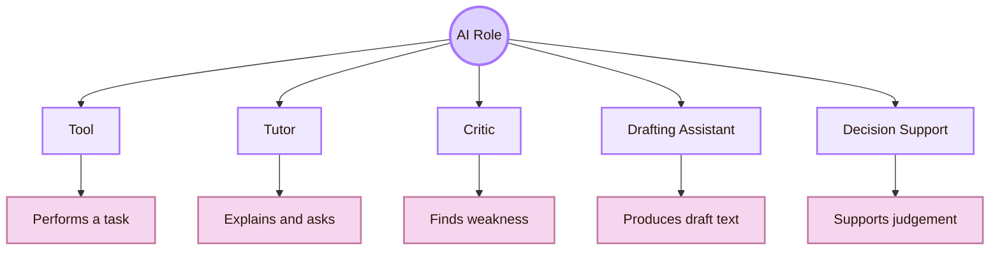

| AI role | Interface wording | Risk |
|---|---|---|
| Tool | “Use this to transform or format content.” | User may ignore judgement and context |
| Tutor | “This explains and asks you to reason.” | User may accept explanations without checking |
| Critic | “This points out possible problems.” | User may treat critique as objective truth |
| Drafting assistant | “This creates editable draft material.” | User may submit without understanding |
| Decision support | “This gives evidence for a human decision.” | User may let the system decide |

For Cognishire, the safest design label is:

> AI is a drafting, critique, and source-checking assistant. The student remains the author and is responsible for verification.

## Design Principle II: Set expectations before output

Expectation-setting should happen before the AI produces an answer. A user should not learn about limits only after a mistake.

| Expectation to state | Example interface text |
|---|---|
| Knowledge boundary | “This answer may need current source verification.” |
| Source boundary | “Claims about people, institutions, laws, and current tools must be checked.” |
| Draft boundary | “This is a draft. Edit before using it in academic work.” |
| Uncertainty boundary | “The system may be incomplete or wrong even when fluent.” |
| Responsibility boundary | “You decide what to keep, remove, cite, or reject.” |

## Design Principle III: Design the prompt space

Prompt design is part of interface design. The system should help users ask better questions without forcing them to become prompt engineers.

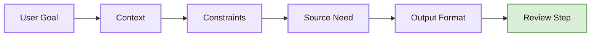

| Prompt part | Purpose | Example |
|---|---|---|
| Goal | Tells the AI what task to solve | “Improve this Markdown page academically.” |
| Context | Gives the project situation | “This is an Obsidian HCI vault for first-year students.” |
| Constraints | Prevents bad style or wrong scope | “Keep YAML and Obsidian links. Do not overclaim.” |
| Source need | Defines verification | “Check current role and institution claims.” |
| Output format | Makes result usable | “Return a downloadable `.md` file.” |
| Review step | Forces human judgement | “Mark uncertain claims for removal or softening.” |

## Prompt template for this project

> [!example] Source-aware page improvement prompt
> Improve this Markdown file for the Cognishire HCI vault. Preserve YAML frontmatter, Obsidian links, and page purpose. Make the language clear for first-year students. Reduce fantasy style to light orientation only. Fact-check claims about current people, institutions, venues, laws, and tools. Use official sources where possible. Soften or remove uncertain claims. Clean Mermaid diagrams with light nodes and dark brown text. Return the improved `.md` file.

This prompt is useful because it defines the role of the AI, the audience, the constraints, the verification task, and the file output. It also protects against generic AI writing.

## Output Card Design

AI output should not appear as one solid block. It should be divided into parts the user can inspect.

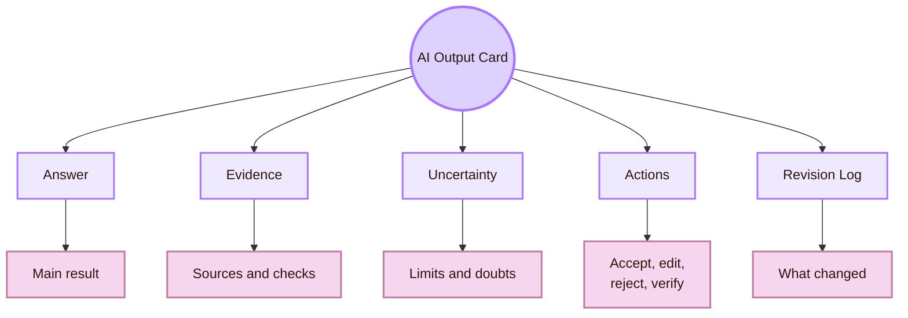

| Output card part | Design purpose |
|---|---|
| Answer | Shows the main output |
| Evidence | Shows source basis, file basis, or reasoning basis |
| Uncertainty | Shows what may be incomplete, current, contested, or unsupported |
| Actions | Lets the user edit, verify, reject, copy, regenerate, or ask for clarification |
| Revision log | Shows what changed between versions |
| Responsibility note | Reminds the user that final use requires human judgement |

## Source Panel Design

Source panels are central for academic Human-AI work. The user needs to see whether a claim came from an uploaded file, official source, academic paper, documentation, public web page, or the model’s general knowledge.

| Source type | How to label it | Trust use |
|---|---|---|
| Uploaded file | “From current project file” | Good for project continuity |
| Official curriculum | “Official CS2023 / ACM source” | Strong for curriculum scope |
| Official institution | “Official UVT / university page” | Strong for local claims |
| Standard or law | “W3C / NIST / EU legal source” | Strong for rules and definitions |
| Academic paper | “Peer-reviewed or preprint research” | Good for research claims, but check scope |
| Practice guide | “Professional design guidance” | Useful for patterns, not always peer-reviewed |
| Model inference | “AI synthesis, needs verification” | Weak unless supported by sources |

## Claim Status Design

Every important AI-generated claim should have a status. This is especially important for pages about people, institutions, laws, and current technology.

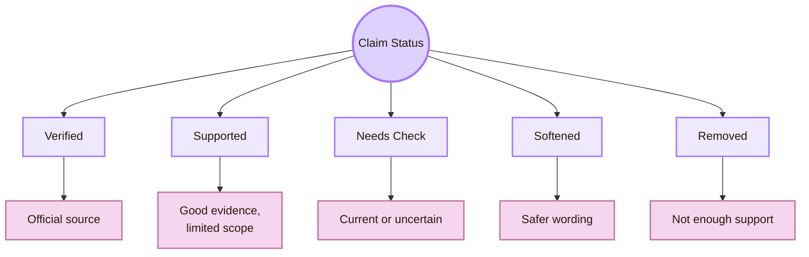

| Status | Meaning | Example |
|---|---|---|
| Verified | Directly supported by official source | “NIST AI RMF uses Govern, Map, Measure, Manage.” |
| Supported | Supported by a reliable source but needs scope limits | “A(I)BILITIES is relevant to AI accessibility.” |
| Needs check | Might have changed or needs a better source | “Current role of a researcher.” |
| Softened | Claim is plausible but should be careful | “This UVT route can support Human-AI questions.” |
| Removed | Claim was not supported enough | “This professor is a Human-AI Interaction supervisor.” |

## Uncertainty Signal Design

Uncertainty should be visible and specific. Vague warnings such as “AI can be wrong” are too weak. The interface should show where the uncertainty comes from.

| Uncertainty type | Interface signal | User action |
|---|---|---|
| Source uncertainty | “No direct source found for this claim.” | Search official source |
| Date uncertainty | “This may have changed after publication.” | Check current page |
| Model uncertainty | “Output may vary across prompts or model versions.” | Retest or compare |
| Interpretation uncertainty | “This is an inference from sources, not a direct statement.” | Keep wording cautious |
| Scope uncertainty | “This applies to the tested context only.” | Avoid broad claim |
| Legal uncertainty | “This is not legal advice.” | Consult official legal text or expert |

## Explanation Layer Design

An explanation should help the user make a better decision. It should not be a decorative paragraph attached to a result.

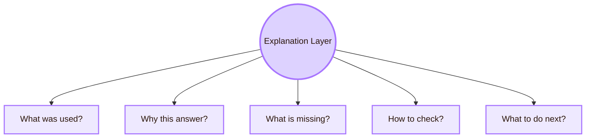

| Explanation question | Good answer |
|---|---|
| What was used? | “The answer used your uploaded Markdown file and official NIST guidance.” |
| Why this answer? | “The claim was reworded because the source supports a route, not a direct current role.” |
| What is missing? | “No direct official source was found for this person’s current project.” |
| How to check? | “Use the official university profile or lab page.” |
| What to do next? | “Keep the claim as a route, not as a supervision claim.” |

## Control Panel Design

Human control must be built into the interface. It should not be only a slogan.

| Control | Why it matters |
|---|---|
| Edit | Lets the user repair output instead of accepting it |
| Reject | Lets the user discard unsupported or unsafe output |
| Regenerate with constraints | Lets the user correct style, scope, or source use |
| Compare versions | Shows what changed |
| Verify sources | Opens the evidence path |
| Undo | Protects against unwanted changes |
| Stop | Lets the user interrupt unsafe or irrelevant generation |
| Report issue | Creates a repair path for repeated failure |

## Human Oversight Design

Human oversight is effective only when the human has enough information, enough time, and enough authority to intervene.

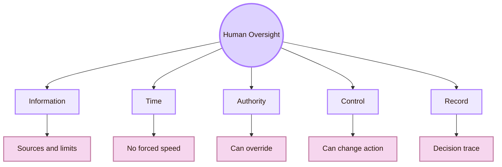

| Weak oversight | Stronger design |
|---|---|
| “Human in the loop” label only | User can inspect, stop, edit, reject, and document |
| User sees only final AI answer | User sees source, prompt, claim status, and uncertainty |
| User must decide quickly | Interface supports review before action |
| Override exists but is hidden | Override is visible and easy to use |
| No record of decision | Prompt, source, output, and final edit are logged |

## Agentic AI Design

Agentic AI systems can plan, call tools, modify files, browse, run code, or act across steps. This creates extra design risk.

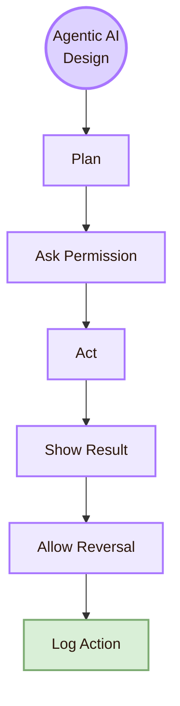

| Agentic risk | Design response |
|---|---|
| Tool acts without consent | Ask before destructive or external actions |
| File is changed invisibly | Show diff or revision summary |
| Source is opened or sent wrongly | Show source path and permission boundary |
| Prompt injection changes behaviour | Treat external content as untrusted |
| Multi-step action hides error | Show plan, step status, and failure state |
| User cannot reverse action | Provide undo, backup, or confirmation |

## Failure State Design

AI systems will fail. Design should make failure recoverable.

| Failure type | User-visible message | Repair path |
|---|---|---|
| No source found | “I could not verify this claim from a reliable source.” | Remove or soften claim |
| Outdated information | “This may have changed. Check official source.” | Search current source |
| Hallucinated citation | “Source does not support the claim.” | Replace with supported claim |
| Weak prompt | “The instruction is too broad.” | Ask for goal, audience, and constraints |
| Unsafe automation | “This action needs confirmation.” | Show plan before acting |
| Conflicting sources | “Sources disagree.” | Present both and state uncertainty |
| Tool failure | “The file could not be edited.” | Preserve original and report failure |

## AI Literacy Support

Human-AI design should teach users how to work with AI critically. This matters in a student project.

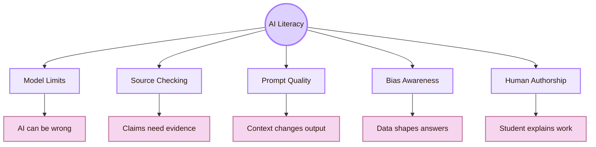

| AI literacy design | Example in Cognishire |
|---|---|
| Explain the AI role | “This draft must be checked and edited by the student.” |
| Show source basis | Academic anchors separate official, research, practice, UVT, and Romanian sources |
| Ask verification questions | “Which claims need current source checking?” |
| Support comparison | “Compare this AI rewrite with the original page.” |
| Prevent passive copying | “Explain the section in your own words before finalising.” |
| Teach uncertainty | “Mark which claims are verified, softened, or removed.” |

## Human-AI Design System Components

A design system for AI should contain reusable patterns. These patterns help the project stay consistent across pages.

| Component | Purpose | Required fields |
|---|---|---|
| Capability card | Explains what the AI can and cannot do | Role, limits, expected input, unsafe uses |
| Prompt helper | Helps the user give context | Goal, audience, source needs, format |
| Output card | Makes answer inspectable | Answer, evidence, uncertainty, actions |
| Source panel | Shows source basis | Source type, link, claim supported |
| Claim status badge | Marks evidence strength | Verified, supported, needs check, softened, removed |
| Explanation layer | Explains reasoning path | What was used, what changed, what is missing |
| Control panel | Preserves user agency | Edit, reject, undo, regenerate, verify |
| Oversight log | Keeps accountability | Prompt, model/tool, source, change, final decision |

## Obsidian Pattern for AI-Assisted Pages

For this vault, an AI-assisted page should follow a stable pattern.

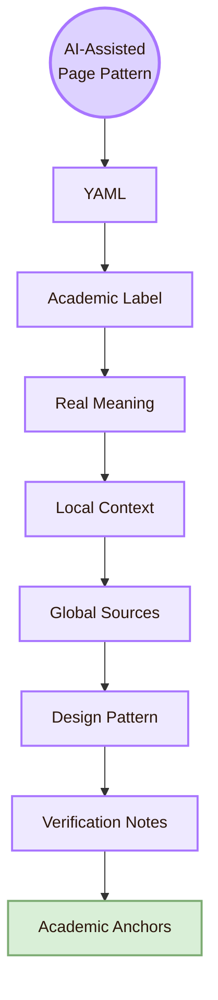

| Page part | Design reason |
|---|---|
| YAML frontmatter | Keeps Obsidian structure stable |
| Academic label | Prevents fantasy names from hiding the topic |
| Real-life meaning | Gives immediate comprehension |
| Local context | Connects the page to UVT and project use |
| Global sources | Prevents local claims from floating without academic grounding |
| Design pattern | Turns theory into usable interface structure |
| Verification notes | Shows where claims were checked or softened |
| Academic anchors | Gives the reader a source trail |

## Design for Verification

Verification should be designed as a task, not as an afterthought.

| Verification target | Interface support |
|---|---|
| Current person or role | Link to official profile and date-sensitive wording |
| Institution claim | Link to official institution page |
| Law or standard | Link to official legal or standards source |
| Academic theory | Link to paper, official project page, or recognised guide |
| Local UVT claim | Link to official UVT page |
| Romanian research claim | Link to RoCHI, USV, A(I)BILITIES, or official project page |
| AI-generated source | Check that the source actually supports the sentence |

## Design for Learning

AI can help students learn, but only if the interface supports thinking rather than copying.

| Learning risk | Design response |
|---|---|
| Student copies polished text | Ask for explanation in the student’s own words |
| Student cannot defend sources | Attach source panel and claim status |
| Student loses project structure | Keep route boards and consistent page templates |
| Student trusts fluent falsehoods | Require verification for names, venues, laws, and current facts |
| Student becomes passive | Use critique, questions, and revision tasks |
| Professor cannot inspect authorship | Keep drafts, revisions, and source notes visible |

## Design for Accessibility

Human-AI systems can improve access, but they can also create new barriers. Accessibility should be designed into AI interaction.

| Accessibility issue | AI design response |
|---|---|
| AI output too dense | Offer shorter version, headings, and summary |
| AI-generated alt text inaccurate | Allow user correction and source image inspection |
| Screen reader cannot follow output | Use semantic headings, lists, and tables |
| User cannot operate controls | Provide keyboard access and visible focus |
| Generated UI is inaccessible | Check structure, labels, contrast, and keyboard path |
| AI misunderstands disability context | Use cautious language and avoid stereotypes |
| User needs different format | Provide table, text, checklist, or step-by-step version |

## Design for Bias and Representation

AI design should make bias inspection possible. The user needs to see who is represented, who is missing, and how claims may affect different groups.

| Bias risk | Design question |
|---|---|
| Dataset bias | What data shaped this output? |
| Language bias | Does the AI handle Romanian and English equally well? |
| Cultural bias | Does the design assume only US/UK examples? |
| Accessibility bias | Does the AI ignore disabled users or assistive technologies? |
| Authority bias | Does fluent language make unsupported claims sound credible? |
| Local invisibility | Does the page ignore UVT or Romanian routes? |
| Stereotyping | Does the output reduce groups to simple labels? |

## Privacy and Data Design

Human-AI design must protect user data, project data, and institutional data.

| Data type | Design rule |
|---|---|
| Personal data | Do not paste unnecessary private information |
| Student work | Keep authorship and revision responsibility clear |
| Uploaded files | Treat as project material, not public data |
| Institutional claims | Use official public sources |
| Prompts | Avoid secrets, credentials, private emails, and sensitive details |
| Logs | Record enough for accountability, but avoid unnecessary exposure |
| AI outputs | Check before publishing or pushing to GitHub |

## AI Design Pattern for Source-Based Academic Work

This pattern is useful whenever the AI helps create academic material.

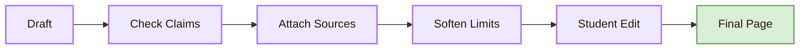

| Step | What the student does |
|---|---|
| Draft | Uses AI to produce structure or wording |
| Check claims | Finds names, roles, laws, standards, and dates |
| Attach sources | Adds official or academic anchors |
| Soften limits | Replaces overclaims with careful wording |
| Student edit | Makes the text understandable and defendable |
| Final page | Publishes only what the student can explain |

## Cognishire Design System

The Oracle Engine should protect the whole Cognishire map whenever AI is used.

| Cognishire element | Human-AI design rule |
|---|---|
| Room names | AI must keep fantasy names paired with academic labels |
| Mermaid diagrams | AI must use readable light nodes and short labels |
| Academic anchors | AI must use sources that match the claim |
| UVT sections | AI must verify local claims through official pages |
| Romanian sections | AI must avoid inventing national routes |
| People pages | AI must not overstate roles or supervision links |
| Venue pages | AI must separate conferences, journals, toolkits, laws, and practice sources |
| GitHub files | AI must preserve filenames, links, and Markdown portability |
| Student learning | AI must produce material the student can explain |

## Human-AI Design Checklist

| Check | Pass condition |
|---|---|
| AI role is stated | User knows whether AI is tutor, critic, assistant, or decision support |
| Capability is bounded | Interface states what the AI can and cannot do |
| Source needs are visible | Claims needing sources are marked |
| Output is inspectable | Answer is divided into answer, evidence, uncertainty, and actions |
| Uncertainty is specific | The interface says what is uncertain and why |
| Human control exists | User can edit, reject, undo, verify, stop, or override |
| Oversight is meaningful | User has information and authority to intervene |
| Accountability is traceable | Prompt, source, output, revision, and final decision can be reviewed |
| Accessibility is considered | Output works with headings, keyboard, readable text, and alternate forms |
| Local claims are checked | UVT and Romanian claims use official or reliable sources |
| No overclaiming | People, institutions, venues, laws, and tools are described cautiously |
| Learning is protected | Student can explain and defend the final page |

## Design Synthesis

Design in **Human-AI Interaction** means designing the conditions under which people can use AI responsibly. The interface should help the user ask better questions, inspect outputs, verify claims, see uncertainty, correct errors, and decide what to keep.

Locally, this means the Oracle Engine must support the real UVT project workflow: Obsidian pages, GitHub files, professor review, CS2023 mapping, source checking, Romanian context, and student learning. Globally, it connects to Microsoft Human-AI guidelines, Google PAIR, Stanford HAI, NIST AI RMF, the EU AI Act, CHI, IUI, HAI, FAccT, ASSETS, and responsible AI design practice.

The central design question is:

> What does the user need to see, check, control, and understand before trusting or using this AI output?

This page connects to [[Theory]] because design decisions depend on concepts such as mental models, uncertainty, trust calibration, explanation, and accountability. It connects to [[Experiment]] because those designs must be tested with real users. It connects to [[../Connections]] because Human-AI design depends on HCI, AI, cognitive science, software engineering, ethics, security, accessibility, and education. It connects to [[../Overview|Overview]] because the Oracle Engine protects the whole map from unverified AI authority.

## Academic Anchors

| Route | Source |
|---|---|
| CS2023 knowledge areas | [CS2023 Knowledge Areas](https://csed.acm.org/knowledge-areas/) |
| Human-AI interaction guidelines | [Microsoft Research: Guidelines for Human-AI Interaction](https://www.microsoft.com/en-us/research/project/guidelines-for-human-ai-interaction/) |
| HAX design guidance | [Microsoft HAX Toolkit: AI Guidelines](https://www.microsoft.com/en-us/haxtoolkit/ai-guidelines/) |
| People + AI design guidance | [Google People + AI Guidebook](https://pair.withgoogle.com/guidebook/) |
| Human-centered AI definition | [Stanford HAI: What is Human-Centered AI?](https://hai.stanford.edu/ai-definitions/what-is-human-centered-ai) |
| AI risk management | [NIST AI Risk Management Framework](https://www.nist.gov/itl/ai-risk-management-framework) |
| Generative AI risk profile | [NIST AI RMF: Generative AI Profile](https://nvlpubs.nist.gov/nistpubs/ai/NIST.AI.600-1.pdf) |
| EU human oversight requirement | [EU AI Act Article 14: Human Oversight](https://artificialintelligenceact.eu/article/14/) |
| EU AI Act service desk | [European Commission AI Act Service Desk: Article 14](https://ai-act-service-desk.ec.europa.eu/en/ai-act/article-14) |
| OECD AI principles | [OECD AI Principles](https://www.oecd.org/en/topics/sub-issues/ai-principles.html) |
| AI incident learning route | [AI Incident Database](https://incidentdatabase.ai/) |
| Local UVT faculty | [Faculty of Informatics UVT](https://info.uvt.ro/en/) |
| UVT departments | [Faculty of Informatics Departments](https://info.uvt.ro/en/departamente/) |
| UVT CSAI Department | [Department of Computational Sciences and Artificial Intelligence](https://info.uvt.ro/en/departamente/csai/) |
| UVT DTSE Department | [Department of Digital Technologies and Software Engineering](https://info.uvt.ro/en/departamente/dtse/) |
| UVT AI and ML research route | [UVT Research Center: Artificial Intelligence and Machine Learning](https://research.info.uvt.ro/artificial-intelligence-and-machine-learning/) |
| Romanian HCI route | [RoCHI Proceedings](https://rochi.utcluj.ro/proceedings/en/) |
| Romanian HCI community route | [Romanian Special Interest Group in HCI](https://cgis.utcluj.ro/rochi_group/) |
| Romanian AI accessibility route | [A(I)BILITIES Project](https://aibilities.ro/en/about/) |
| A(I)BILITIES software route | [ASSIST Software: A(I)BILITIES](https://assist-software.net/project/aibilities) |
| Radu-Daniel Vatavu | [Radu-Daniel Vatavu Homepage](https://raduvatavu.usv.ro/) |
| MintViz Lab route | [Radu-Daniel Vatavu: Team / MintViz Lab](https://raduvatavu.usv.ro/team.php) |
| Ovidiu-Andrei Schipor | [Ovidiu-Andrei Schipor Projects](https://www.eed.usv.ro/~schipor/projects.php) |

^design-human-ai-interaction-end
