![[cyberss.gif|1000]]
# Experiment

The real academic label is **Human-AI Interaction**.  
The CS2023 bridge is **HCI + Artificial Intelligence + Society, Ethics, and Professionalism**.  
The real-life meaning is **collecting evidence about whether an AI system helps people reason better, or whether it makes them overtrust, misunderstand, copy, depend, or lose control**.

> [!quote] Lab law
> A Human-AI experiment is incomplete if it tests the model output but ignores the human reaction to that output.

## Fact-checked basis

|---|---|
| Human-AI design needs interaction-level guidance | Microsoft’s Human-AI Interaction Guidelines describe 18 guidelines for AI systems, including interaction during normal use, failure, and change over time. |
| Human-centered AI design is a recognised design route | Google PAIR describes the People + AI Guidebook as practical guidance for designing human-centered AI products. |
| AI risk should be managed as a process | NIST AI RMF 1.0 organises risk work through Govern, Map, Measure, and Manage. |
| High-risk AI systems in the EU need human oversight | EU AI Act Article 14 requires high-risk AI systems to be designed so they can be effectively overseen by natural persons during use. |
| Human-AI experiments need human behaviour data | HCI evaluation normally studies users, tasks, understanding, errors, confidence, and context, not only system output. |
| Romanian Human-AI grounding should be explicit | RoCHI, A(I)BILITIES, and Romanian HCI/accessibility routes can provide national context when the page discusses Romania. |

## Experiment map

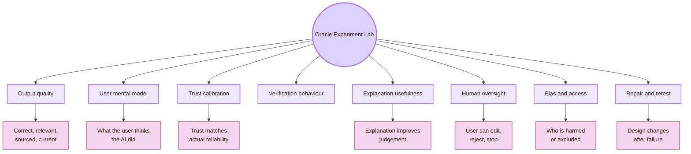

## CS2023 grounding

Human-AI experiments sit between HCI, AI, software engineering, accessibility, and professional responsibility.

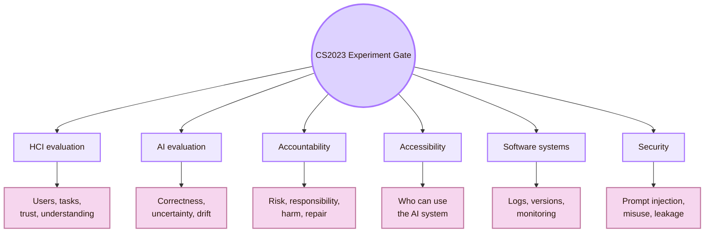

- **HCI Evaluation:** Test task success, comprehension, confidence, trust, correction, and user control
- **Artificial Intelligence:** Test correctness, hallucination, bias, uncertainty, robustness, and drift
- **Software Engineering:** Track prompts, model versions, sources, files, logs, and reproducibility
- **Accessibility:** Check whether AI helps or harms users with different access needs
- **Security:** Test whether prompts, tools, and generated outputs can be manipulated or leak information

## Local UVT experiment layer

## Romania experiment layer

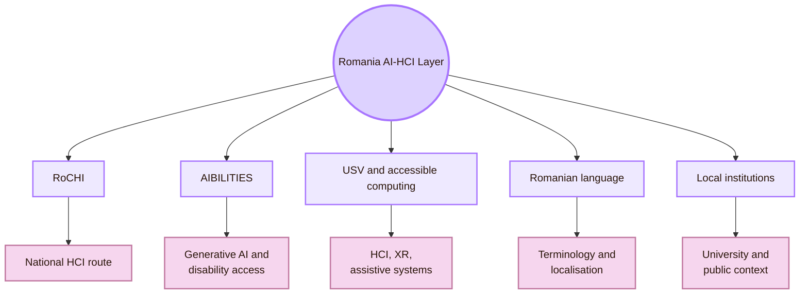

- **RoCHI:** Search for national HCI examples, not only international sources
- **A(I)BILITIES:** Treat generative AI and accessibility as a real Romanian research route
- **USV / MintViz / Radu-Daniel Vatavu:** Connect Human-AI, XR, gestures, accessibility, and interaction research
- **Ovidiu-Andrei Schipor:** Connect assistive technology and speech-related interaction routes
- **Romanian language:** Test whether AI explanations, terminology, and translations remain accurate in Romanian

## Protocol spine

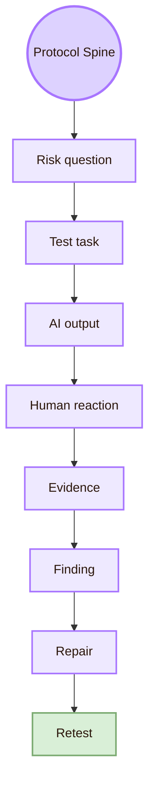

- **Risk question:** Could the AI invent a source, person, role, or venue?
- **AI output:** Save the generated Markdown and the source list
- **Human reaction:** Observe whether the student checks or simply accepts the output
- **Retest:** Run the same task on the next page and compare errors

## Experiment I: Output quality audit

The first experiment tests the AI output itself. This is necessary before studying trust or oversight. If the output is not inspected, the experiment may simply measure how confidently users accept errors.

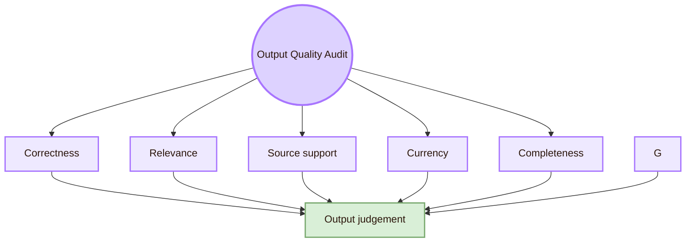

| Quality dimension | What to inspect | Evidence to record |
|---|---|---|
| Relevance | Does the answer fit Human-AI Interaction, not generic AI? | Section kept, moved, or deleted |
| Currency | Could the fact have changed since training or last edit? | Date checked and source date |
| Completeness | Does the output include design, evaluation, accountability, and user behaviour? | Missing route added |

## Experiment II: Hallucination and source-verification test

This experiment checks whether the AI invents or distorts academic facts. It is central for a study that uses AI to polish study notes.

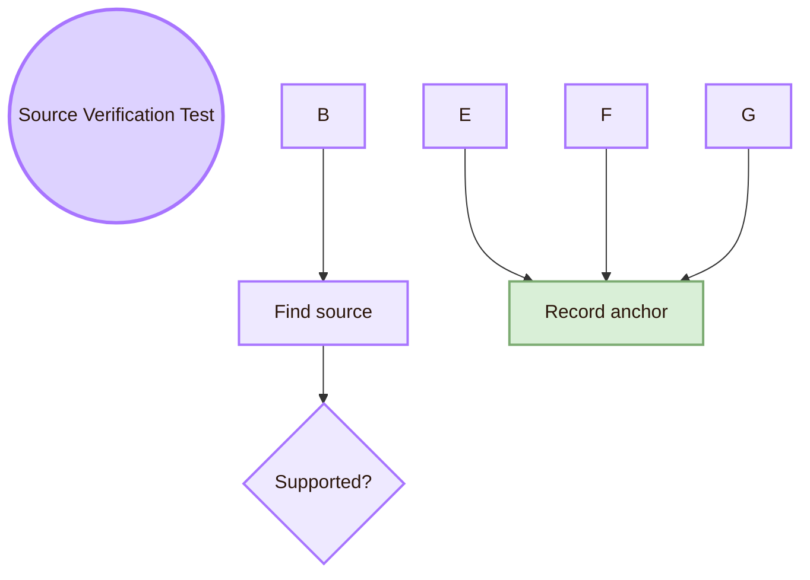

|---|---|---|
| Person | Is this a real person, and is the role current or safely worded? | Use official profile or remove the role |

- **Source used:** Official page, paper, or standards page
- **Result:** Supported, partially supported, unsupported, outdated
- **Repair:** Kept, softened, corrected, removed
- **Note:** Why the decision was made

## Experiment III: User mental model test

A user’s mental model is what the user thinks the AI is doing. A wrong mental model can make a safe-looking interface dangerous.

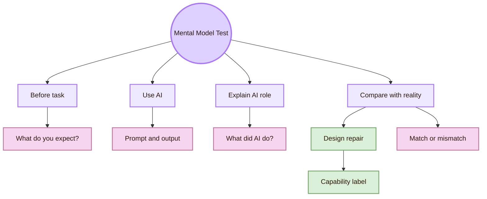

- **“What do you think the AI used to answer this?”:** Whether the user thinks AI searched, remembered, reasoned, or guessed
- **“Which part of the answer would you verify first?”:** Whether the user sees weak points
- **“What can the AI not know unless it searches?”:** Whether the user understands freshness limits
- **“What should you, not the AI, be responsible for?”:** Whether the user understands authorship and accountability

| Mental model error | Interface repair |
|---|---|
| User thinks fluent output means truth | Add source-check prompt and uncertainty label |
| User thinks AI has live knowledge by default | Add “checked source” or “not verified” status |
| User thinks AI is neutral | Add bias and perspective-check task |

## Experiment IV: Trust calibration test

Trust calibration means trust should match actual reliability. The goal is not maximum trust. The goal is appropriate trust.

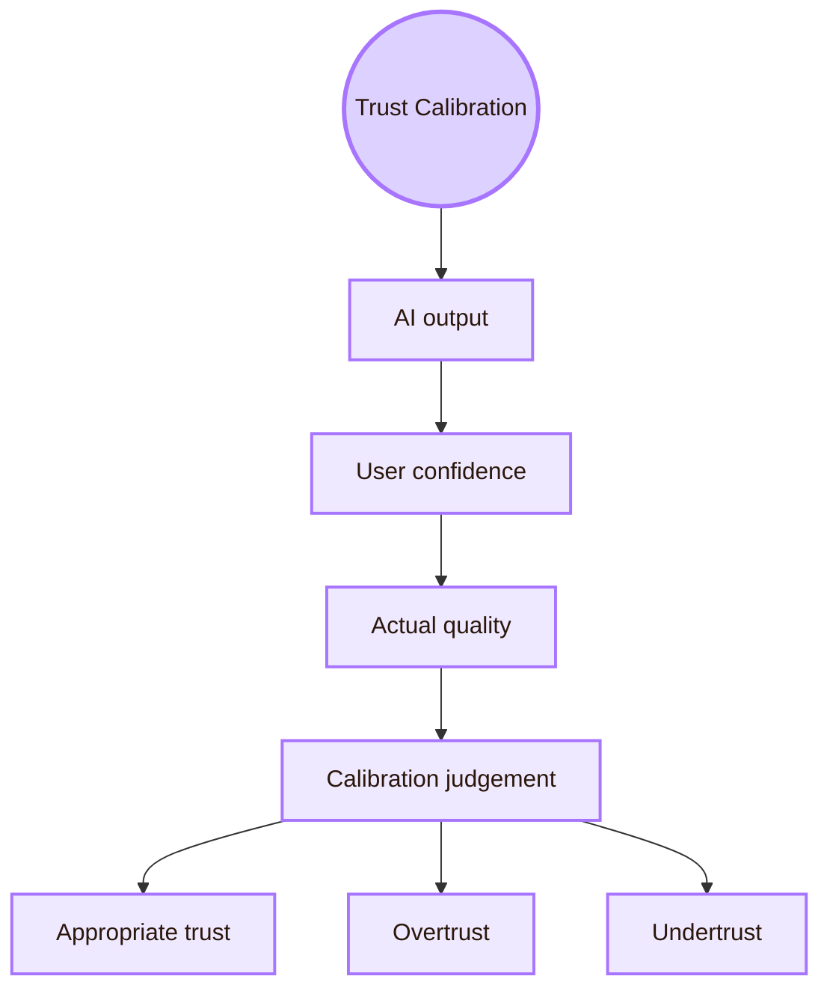

- **User confidence:** Ask for 1–5 confidence after each AI answer
- **Output quality:** Expert/source audit of the same answer
- **Verification action:** Record whether the user opened sources or checked dates
- **Edit behaviour:** Record what the user changed before accepting output
- **Calibration result:** Compare confidence with actual output quality

- **High confidence + weak output:** Overtrust
- **Low confidence + strong output:** Undertrust
- **High confidence + strong output:** Appropriate trust
- **Low confidence + weak output:** Appropriate distrust
- **Confidence without checking:** Risk of automation bias

## Experiment V: Explanation usefulness test

Explanations are useful only when they improve judgement or action. A longer explanation can still be bad if it hides uncertainty, adds jargon, or distracts from evidence.

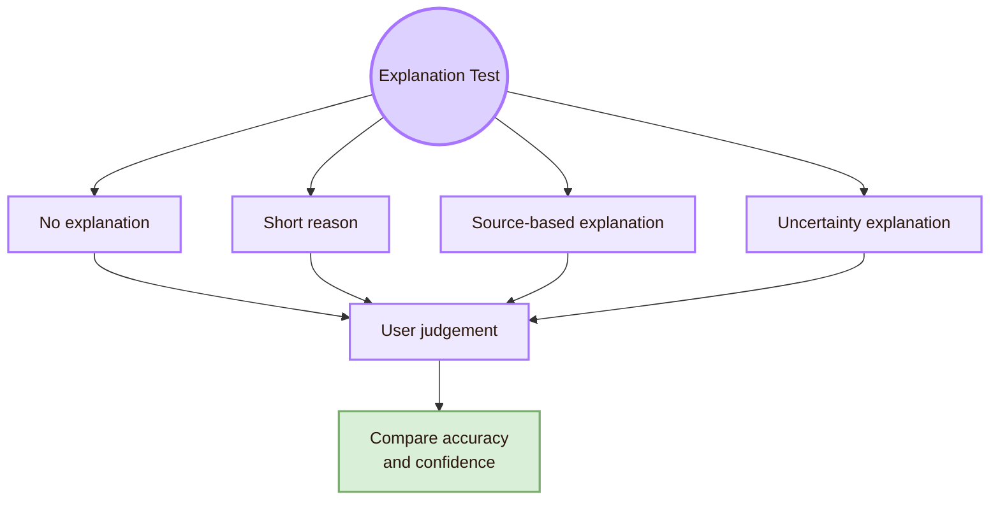

| Explanation condition | Example |
|---|---|
| No explanation | AI gives the revised paragraph only |
| Short reason | AI says why it changed the paragraph |
| Source-based explanation | AI links the change to a source or standard |

- **Better repair:** User makes more appropriate edits
- **Better confidence:** User confidence becomes closer to actual quality
- **Lower cognitive load:** User can explain the decision without being overwhelmed
- **No false reassurance:** Explanation does not make weak output seem stronger

## Experiment VI: Human oversight and control test

Human oversight must be practical. A user is not really in control if the interface only allows “accept” or “regenerate.”

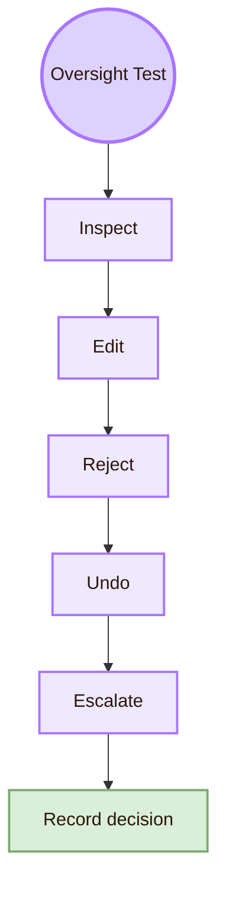

- **Inspect:** Can the user see sources, assumptions, and changed sections?
- **Edit:** Can the user change the AI output before using it?
- **Reject:** Can the user discard a weak output without penalty?
- **Undo:** Can the user return to the previous version?
- **Stop:** Can the user stop AI action before it changes files or decisions?
- **Escalate:** Can the user ask a person, source, or standard when risk is high?
- **Record:** Can the user document why an AI suggestion was accepted or rejected?

## Experiment VII: Prompt sensitivity test

Prompt sensitivity tests how much the output changes when the user changes wording, constraints, examples, or source requirements. This matters because generative AI systems can produce different answers for small prompt changes.

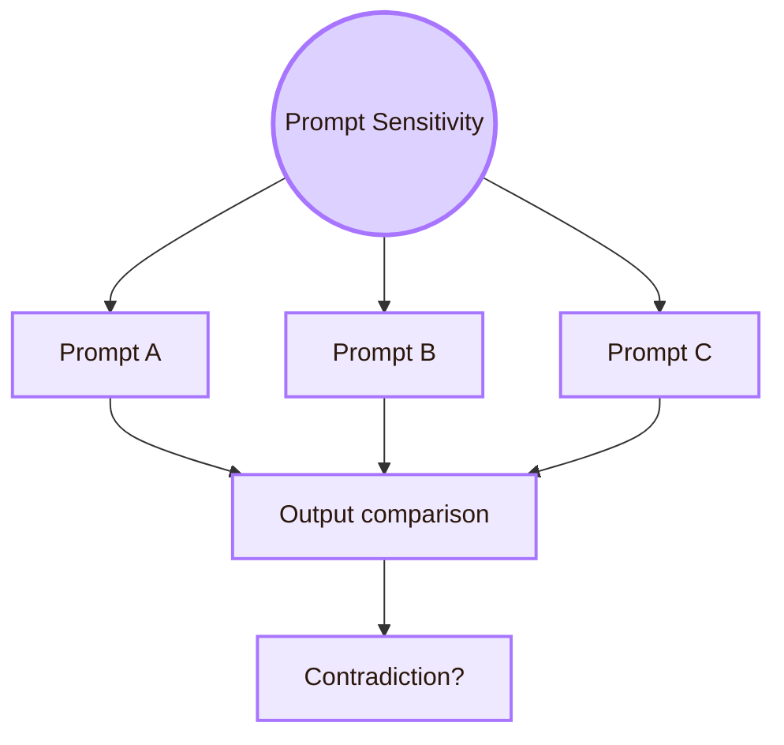

- **Baseline prompt:** See the normal output
- **Skeptical prompt:** Ask AI to find weaknesses, not only improve style
- **Local-context prompt:** Test whether UVT/Romania details are handled carefully
- **Minimal prompt:** See what the AI assumes without guidance
- **Constraint-heavy prompt:** Test whether the AI follows academic and visual rules

- **Output differences:** Shows instability
- **Link changes:** Shows source reliability
- **Style changes:** Shows prompt compliance
- **User preference:** Shows which prompt supports learning better

## Experiment VIII: Automation bias and overreliance test

Automation bias appears when users accept AI suggestions too easily. It is especially dangerous when the output is fluent, confident, or visually well formatted.

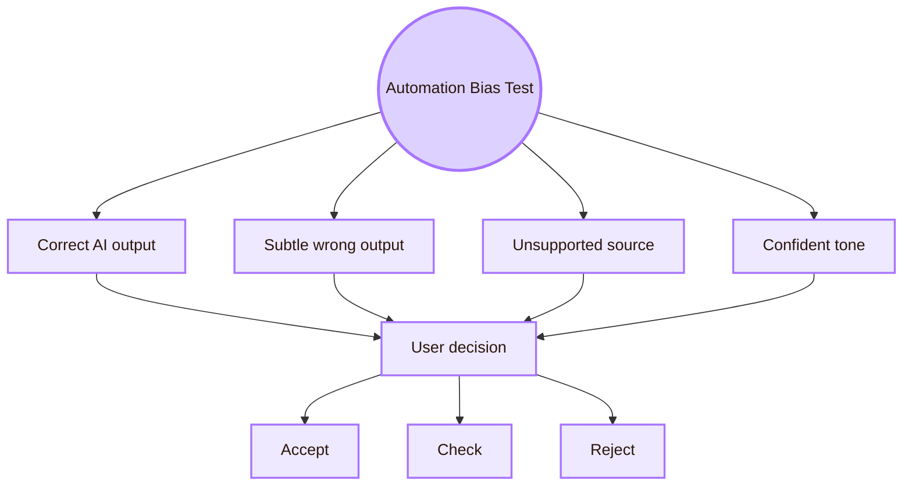

| Test item | Example |
|---|---|
| Subtle wrong role | AI says a person is currently in a role that changed |
| Fake source confidence | AI presents a weak source as decisive |
| Smooth but vague explanation | AI sounds academic but gives no inspectable evidence |

| User behaviour | Interpretation |
|---|---|
| Accepts without checking | Possible overreliance |
| Edits tone but not facts | Style focus may hide factual risk |
| Rejects everything | Undertrust or overload |

## Experiment IX: Learning and AI literacy test

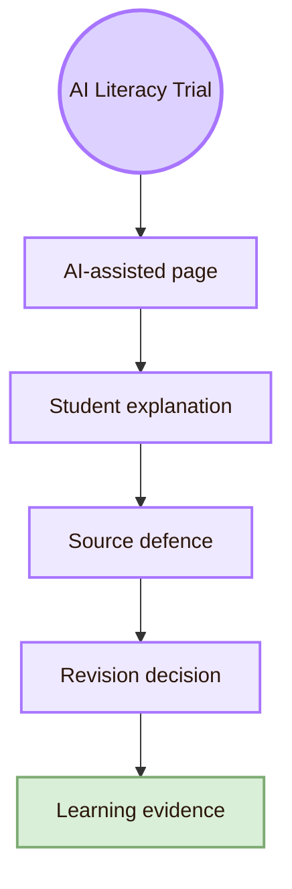

- **Explain one AI-assisted section in your own words:** Concept understanding
- **Identify the strongest source in the section:** Source literacy
- **Explain why one diagram helps or fails:** Design reasoning
- **Decide what to remove from the AI output:** Editorial control

## Experiment X: Accessibility and bias test

Human-AI experiments must ask who benefits and who is disadvantaged. AI can support accessibility, but it can also generate inaccessible text, biased summaries, wrong alternative text, or advice that ignores disabled users.

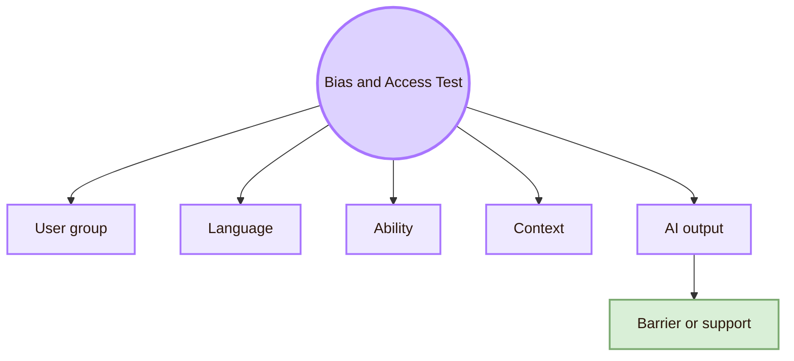

## Experiment XI: Reproducibility and versioning test

AI outputs are hard to reproduce unless the prompt, model, sources, and file version are recorded. This is a serious issue for academic work.

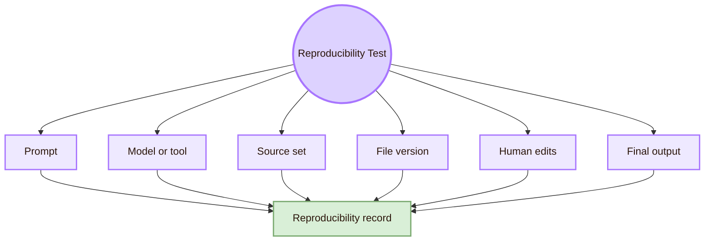

- **Prompt:** Shows what the AI was asked to do
- **Model or tool:** Outputs may differ by tool and version
- **Date:** AI systems and sources change
- **Source list:** Shows what information was available
- **File version or Git commit:** Shows what was edited
- **Human edits:** Shows student authorship and judgement

## Measurement plan

- **Task success:** scale or format: Success / partial / failure; what it supports: Whether users can perform verification and correction tasks
- **Trust before checking:** scale or format: 1–5 rating; what it supports: Initial confidence
- **Trust after checking:** scale or format: 1–5 rating; what it supports: Trust calibration
- **Edit quality:** scale or format: Kept / softened / corrected / removed; what it supports: Human oversight quality
- **Explanation accuracy:** scale or format: Accurate / partial / inaccurate; what it supports: Mental model
- **Time on task:** scale or format: Minutes; what it supports: Effort, not proof of learning
- **Confidence note:** scale or format: Short written reason; what it supports: Why the user trusted or distrusted
- **Observer notes:** scale or format: Behaviour and quotes; what it supports: Qualitative interpretation

## Observation form

## Issue log template

| Issue ID | AI or interaction problem | Evidence | Affected users | Severity | Repair | Retest status |
|---|---|---|---|---|---|---|
| O01 | AI invented or overstated a role | User accepted it before source check | Students, professor, readers | Serious | Require official profile source and cautious wording | Not retested |
| O06 | AI output was too advanced for a first-year reader | User could not explain section in own words | Student readers | Moderate | Simplify language and add example | Not retested |

|---|---|
| “The AI proved the page is correct.” | “The AI-assisted page was checked against selected sources and revised.” |
| “Users trust the AI.” | “In this local trial, participants rated trust under specific task conditions.” |
| “Human oversight is present.” | “Users could inspect, edit, reject, and document AI suggestions in the tested workflow.” |
| “The AI supports all students.” | “The tested workflow supported selected students in a local UVT context.” |
| “The Romanian context is complete.” | “The page includes selected Romanian HCI and AI-accessibility routes.” |
| “The AI is safe.” | “Selected risks were identified, mitigated, and documented; other risks remain untested.” |

## Academic anchors

| Route | Source |
|---|---|
| CS2023 HCI / AI / SEP basis | [CS2023 Knowledge Areas](https://csed.acm.org/knowledge-areas/) |
| Human-AI Interaction guidelines | [Microsoft Research: Guidelines for Human-AI Interaction](https://www.microsoft.com/en-us/research/project/guidelines-for-human-ai-interaction/) |
| HAX design guidance | [Microsoft HAX Toolkit: AI Guidelines](https://www.microsoft.com/en-us/haxtoolkit/ai-guidelines/) |
| Human-centered AI design | [Google People + AI Guidebook](https://pair.withgoogle.com/guidebook/) |
| AI risk framework | [NIST AI Risk Management Framework](https://www.nist.gov/itl/ai-risk-management-framework) |
| AI RMF 1.0 PDF | [NIST AI RMF 1.0](https://nvlpubs.nist.gov/nistpubs/ai/NIST.AI.100-1.pdf) |
| Human oversight requirement | [EU AI Act Article 14: Human Oversight](https://artificialintelligenceact.eu/article/14/) |
| Official AI Act service desk | [AI Act Service Desk: Article 14](https://ai-act-service-desk.ec.europa.eu/en/ai-act/article-14) |
| Responsible AI and fairness venue | [ACM FAccT](https://facctconference.org/) |
| Intelligent user interfaces venue | [ACM IUI](https://iui.acm.org/) |
| Human-agent interaction venue | [ACM HAI](https://hai-conference.net/) |
| HCI venue | [ACM CHI](https://dl.acm.org/conference/chi) |
| Human-AI archival journal | [ACM Transactions on Interactive Intelligent Systems](https://dl.acm.org/journal/tiis) |
| Human-centered AI institute | [Stanford HAI](https://hai.stanford.edu/) |
| UVT Faculty of Informatics | [Faculty of Informatics UVT](https://info.uvt.ro/en/) |
| UVT departments | [Faculty of Informatics Departments](https://info.uvt.ro/en/departamente/) |
| UVT CSAI Department | [Department of Computational Sciences and Artificial Intelligence](https://info.uvt.ro/en/departamente/csai/) |
| UVT DTSE Department | [Department of Digital Technologies and Software Engineering](https://info.uvt.ro/en/departamente/dtse/) |
| UVT AI and ML research route | [Artificial Intelligence and Machine Learning](https://research.info.uvt.ro/artificial-intelligence-and-machine-learning/) |
| UVT research routes | [Research Center in Computer Science: Researchers](https://research.info.uvt.ro/researchers/) |
| Romanian HCI proceedings | [RoCHI Proceedings](https://rochi.utcluj.ro/proceedings/en/) |
| Romanian AI-accessibility route | [A(I)BILITIES](https://aibilities.ro/en/about/) |
| Radu-Daniel Vatavu route | [Radu-Daniel Vatavu homepage](https://raduvatavu.usv.ro/) |
| Ovidiu-Andrei Schipor route | [Ovidiu-Andrei Schipor projects](https://www.eed.usv.ro/~schipor/projects.php) |

^experiment-human-ai-interaction-end
