# Experiment

Back to [[../Overview|The Oracle Engine]].

> [!abstract] Oracle Experiment Lab
> Experiment in the **Oracle Engine** means testing the full human-AI loop. It asks what the user requests, what the AI returns, what the user believes, what the user verifies, what the user changes, and what final decision is made.

The fantasy name is **Oracle Experiment Lab**.  
The real academic label is **Human-AI Interaction**.  
The CS2023 bridge is **HCI + Artificial Intelligence + Society, Ethics, and Professionalism**.  
The real-life meaning is **collecting evidence about whether an AI system helps people reason better, or whether it makes them overtrust, misunderstand, copy, depend, or lose control**.

This page is about experimentation. It does not ask only whether an AI answer is correct. It asks whether the interface and the user workflow make correctness checkable. A fluent answer can still be false. A useful explanation can still be ignored. A warning can still fail if the user treats it as decoration. A human can be “in the loop” and still not have real control.

> [!quote] Lab law
> A Human-AI experiment is incomplete if it tests the model output but ignores the human reaction to that output.

## Fact-checked basis

| Claim used in this page | Grounding |
|---|---|
| Human-AI design needs interaction-level guidance | Microsoft’s Human-AI Interaction Guidelines describe 18 guidelines for AI systems, including interaction during normal use, failure, and change over time. |
| Human-centered AI design is a recognised design route | Google PAIR describes the People + AI Guidebook as practical guidance for designing human-centered AI products. |
| AI risk should be managed as a process | NIST AI RMF 1.0 organises risk work through Govern, Map, Measure, and Manage. |
| High-risk AI systems in the EU need human oversight | EU AI Act Article 14 requires high-risk AI systems to be designed so they can be effectively overseen by natural persons during use. |
| Human-AI experiments need human behaviour data | HCI evaluation normally studies users, tasks, understanding, errors, confidence, and context, not only system output. |
| Local UVT claims need careful wording | UVT can be used as a local Computer Science and project context. Do not claim a dedicated Human-AI Interaction lab unless an official page states it. |
| Romanian Human-AI grounding should be explicit | RoCHI, A(I)BILITIES, and Romanian HCI/accessibility routes can provide national context when the page discusses Romania. |

## Experiment map

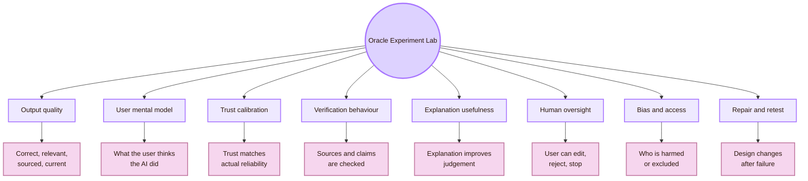

| Experiment route | What it tests | Main risk if ignored |
|---|---|---|
| Output quality | Whether the answer is correct, relevant, sourced, current, and useful | Fluent wrong content enters the project |
| User mental model | What the user thinks the AI can do and how it works | The user treats prediction or generation as authority |
| Trust calibration | Whether trust matches real reliability | The user copies blindly or rejects useful help |
| Verification behaviour | Whether the user checks sources, dates, names, links, and claims | Hallucinations survive into academic work |
| Explanation usefulness | Whether explanations help the user decide, not just feel reassured | Explanations become decorative |
| Human oversight | Whether the user can inspect, edit, reject, override, undo, and stop | Responsibility becomes symbolic |
| Bias and access | Whether outputs exclude, misrepresent, or disadvantage users | AI automates social and accessibility barriers |
| Repair and retest | Whether design changes reduce the observed failure | The same failure repeats with a new interface |

## CS2023 experiment gate

Human-AI experiments sit between HCI, AI, software engineering, accessibility, and professional responsibility.

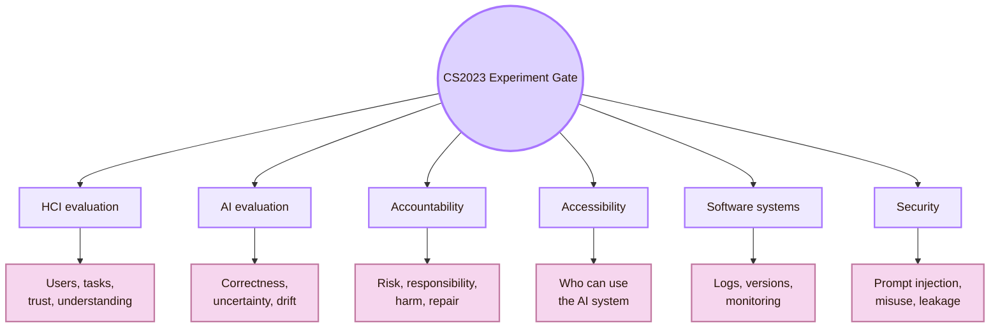

| CS2023 route | Experimental translation |
|---|---|
| HCI Evaluation | Test task success, comprehension, confidence, trust, correction, and user control |
| Artificial Intelligence | Test correctness, hallucination, bias, uncertainty, robustness, and drift |
| Software Engineering | Track prompts, model versions, sources, files, logs, and reproducibility |
| Accountability | Record what failed, who is affected, who repairs it, and what claim is safe |
| Accessibility | Check whether AI helps or harms users with different access needs |
| Security | Test whether prompts, tools, and generated outputs can be manipulated or leak information |

## Local UVT experiment layer

The local dimension is the **UVT Faculty of Informatics / Computer Science context**. For this project, the first Human-AI experiment is the actual workflow of using AI to help build the Cognishire HCI map.

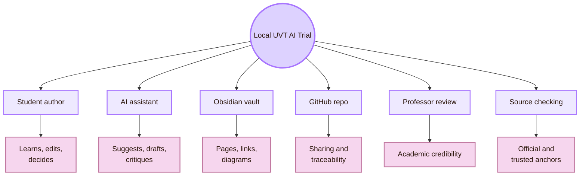

| Local target | Human-AI experiment question |
|---|---|
| Student author | Does AI help the student understand HCI, or only produce text? |
| Professor review | Can the professor see academic grounding and source credibility? |
| Obsidian vault | Does AI-generated structure remain readable, navigable, and consistent? |
| GitHub repository | Can AI help maintain file naming, links, setup, and release notes without creating errors? |
| Local sources | Are UVT and Romanian claims verified through real sources rather than invented? |
| CS2023 mapping | Does the AI correctly connect room names to real HCI/CS2023 areas? |
| Academic writing | Does AI improve clarity without hiding uncertainty, authorship, or evidence limits? |

## Romania experiment layer

The Romanian layer prevents the Oracle Engine from becoming only a generic global AI page. It asks whether Human-AI Interaction is also grounded in Romanian HCI, AI accessibility, assistive technology, education, and language context.

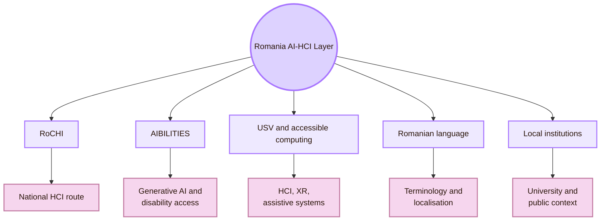

| Romanian route | Experiment implication |
|---|---|
| RoCHI | Search for national HCI examples, not only international sources |
| A(I)BILITIES | Treat generative AI and accessibility as a real Romanian research route |
| USV / MintViz / Radu-Daniel Vatavu | Connect Human-AI, XR, gestures, accessibility, and interaction research |
| Ovidiu-Andrei Schipor | Connect assistive technology and speech-related interaction routes |
| Romanian language | Test whether AI explanations, terminology, and translations remain accurate in Romanian |
| Romanian institutions | Avoid claims that ignore national legal, educational, and public-service context |

## Protocol spine

Every experiment in this page should use the same spine. It keeps the study small enough for a student project but serious enough for academic use.

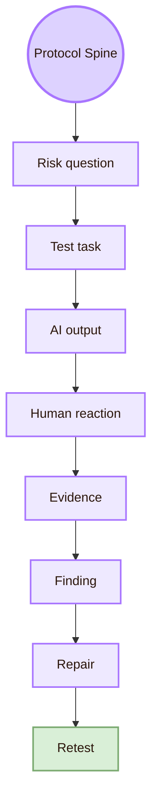

| Protocol part | Example |
|---|---|
| Risk question | Could the AI invent a source, person, role, or venue? |
| Test task | Ask AI to improve one HCI page and verify all claims |
| AI output | Save the generated Markdown and the source list |
| Human reaction | Observe whether the student checks or simply accepts the output |
| Evidence | Record source checks, edits, rejected claims, uncertainty notes, and mistakes found |
| Finding | AI improves structure but may overstate local claims |
| Repair | Add claim-boundary tables and require official source anchors |
| Retest | Run the same task on the next page and compare errors |

## Experiment I: Output quality audit

The first experiment tests the AI output itself. This is necessary before studying trust or oversight. If the output is not inspected, the experiment may simply measure how confidently users accept errors.

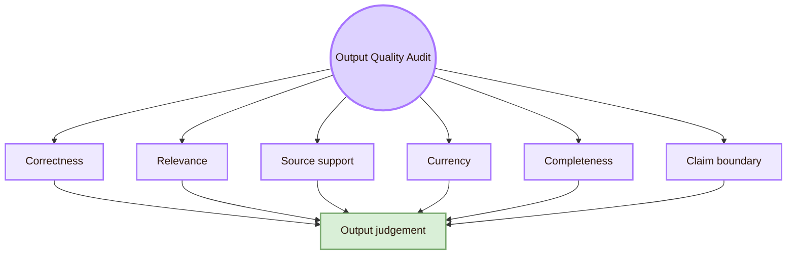

| Quality dimension | What to inspect | Evidence to record |
|---|---|---|
| Correctness | Are names, roles, definitions, and claims accurate? | Verified, corrected, or removed claim |
| Relevance | Does the answer fit Human-AI Interaction, not generic AI? | Section kept, moved, or deleted |
| Source support | Does the source directly support the sentence? | Source URL and supported claim |
| Currency | Could the fact have changed since training or last edit? | Date checked and source date |
| Completeness | Does the output include design, evaluation, accountability, and user behaviour? | Missing route added |
| Claim boundary | Does the page say what the evidence cannot prove? | Boundary statement added |

Use this audit on every Human-AI page. It is especially important for local claims about UVT, Romanian researchers, venues, projects, and current roles.

## Experiment II: Hallucination and source-verification test

This experiment checks whether the AI invents or distorts academic facts. It is central for a project that uses AI to polish study notes.

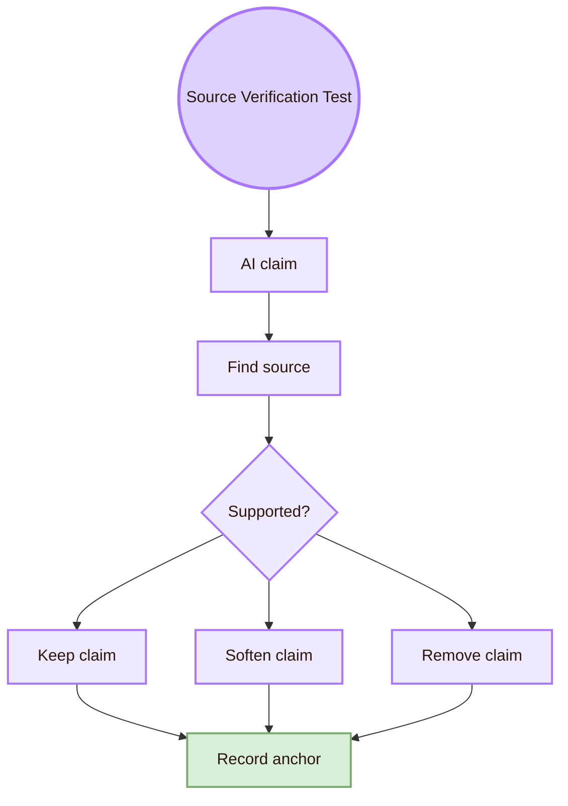

| Claim type | Verification question | Repair rule |
|---|---|---|
| Person | Is this a real person, and is the role current or safely worded? | Use official profile or remove the role |
| Venue | Is this venue real, relevant, and active enough for the claim? | Cite official venue page or archive |
| Local UVT claim | Does an official UVT source support it? | Write “route” if it is only indirectly relevant |
| Romanian claim | Does the source show the national connection directly? | Avoid claiming leadership or specialisation without proof |
| CS2023 claim | Is this exact unit present, or is it a bridge across areas? | Use “bridge” when the unit is not exact |
| AI capability claim | Is the capability general or tool-specific? | State the tested system and conditions |

| Evidence field | What to write |
|---|---|
| Claim ID | Short ID such as S01 |
| Original claim | The sentence before checking |
| Source used | Official page, paper, or standards page |
| Result | Supported, partially supported, unsupported, outdated |
| Repair | Kept, softened, corrected, removed |
| Note | Why the decision was made |

## Experiment III: User mental model test

A user’s mental model is what the user thinks the AI is doing. A wrong mental model can make a safe-looking interface dangerous.

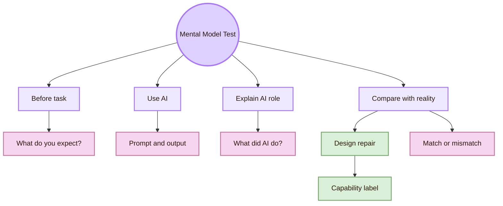

| Task prompt | What it reveals |
|---|---|
| “What do you think the AI used to answer this?” | Whether the user thinks AI searched, remembered, reasoned, or guessed |
| “Which part of the answer would you verify first?” | Whether the user sees weak points |
| “What can the AI not know unless it searches?” | Whether the user understands freshness limits |
| “What should you, not the AI, be responsible for?” | Whether the user understands authorship and accountability |
| “What would make you distrust this answer?” | Whether the user can identify warning signs |

| Mental model error | Interface repair |
|---|---|
| User thinks fluent output means truth | Add source-check prompt and uncertainty label |
| User thinks AI has live knowledge by default | Add “checked source” or “not verified” status |
| User thinks AI owns the final claim | Add authorship and responsibility note |
| User thinks AI is neutral | Add bias and perspective-check task |
| User thinks AI explanation proves correctness | Add “explanation is not proof” warning |

## Experiment IV: Trust calibration test

Trust calibration means trust should match actual reliability. The goal is not maximum trust. The goal is appropriate trust.

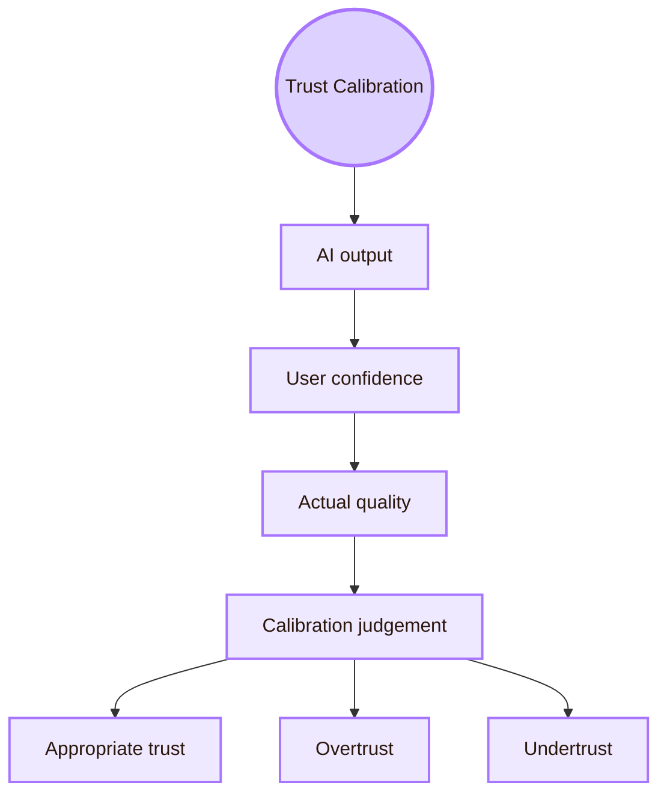

| Measure | How to collect it |
|---|---|
| User confidence | Ask for 1–5 confidence after each AI answer |
| Output quality | Expert/source audit of the same answer |
| Verification action | Record whether the user opened sources or checked dates |
| Edit behaviour | Record what the user changed before accepting output |
| Final decision | Record whether the user kept, softened, or removed the AI claim |
| Calibration result | Compare confidence with actual output quality |

| Pattern | Meaning |
|---|---|
| High confidence + weak output | Overtrust |
| Low confidence + strong output | Undertrust |
| High confidence + strong output | Appropriate trust |
| Low confidence + weak output | Appropriate distrust |
| Confidence without checking | Risk of automation bias |

## Experiment V: Explanation usefulness test

Explanations are useful only when they improve judgement or action. A longer explanation can still be bad if it hides uncertainty, adds jargon, or distracts from evidence.

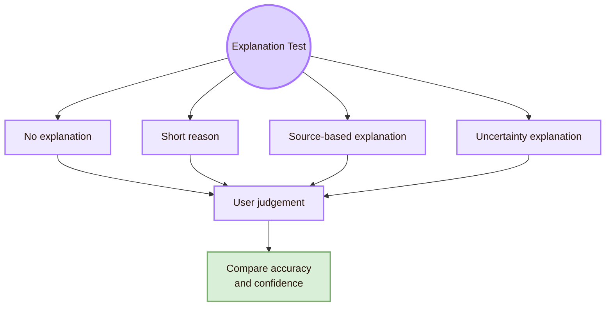

| Explanation condition | Example |
|---|---|
| No explanation | AI gives the revised paragraph only |
| Short reason | AI says why it changed the paragraph |
| Source-based explanation | AI links the change to a source or standard |
| Uncertainty explanation | AI states which claims need checking and why |

| Outcome | What to check |
|---|---|
| Better judgement | User identifies unsupported claims more accurately |
| Better repair | User makes more appropriate edits |
| Better confidence | User confidence becomes closer to actual quality |
| Lower cognitive load | User can explain the decision without being overwhelmed |
| No false reassurance | Explanation does not make weak output seem stronger |

## Experiment VI: Human oversight and control test

Human oversight must be practical. A user is not really in control if the interface only allows “accept” or “regenerate.”

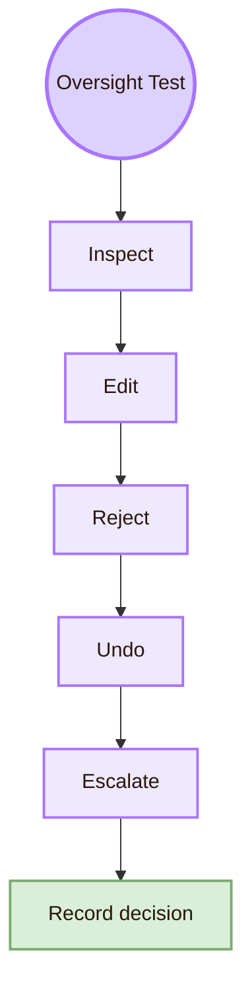

| Control | Test question |
|---|---|
| Inspect | Can the user see sources, assumptions, and changed sections? |
| Edit | Can the user change the AI output before using it? |
| Reject | Can the user discard a weak output without penalty? |
| Undo | Can the user return to the previous version? |
| Stop | Can the user stop AI action before it changes files or decisions? |
| Escalate | Can the user ask a person, source, or standard when risk is high? |
| Record | Can the user document why an AI suggestion was accepted or rejected? |

For the Cognishire vault, oversight means the student must be able to explain every page. If the student cannot explain a section, the section should be rewritten, simplified, or removed.

## Experiment VII: Prompt sensitivity test

Prompt sensitivity tests how much the output changes when the user changes wording, constraints, examples, or source requirements. This matters because generative AI systems can produce different answers for small prompt changes.

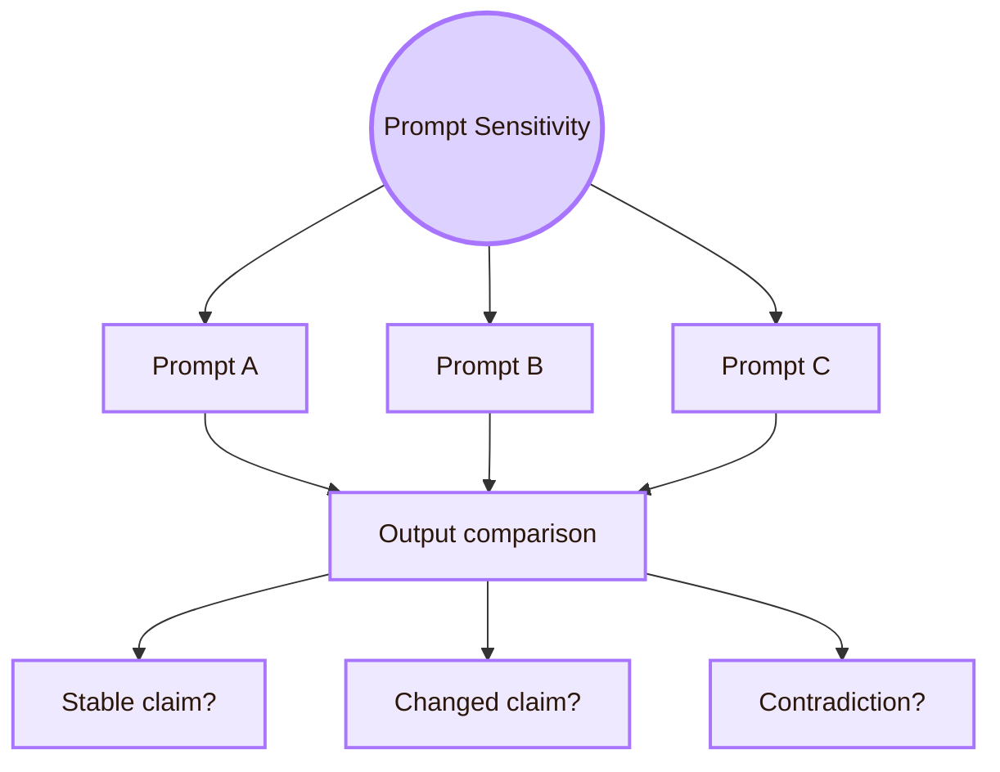

| Prompt condition | Purpose |
|---|---|
| Baseline prompt | See the normal output |
| Source-required prompt | See whether claims become more grounded |
| Skeptical prompt | Ask AI to find weaknesses, not only improve style |
| Local-context prompt | Test whether UVT/Romania details are handled carefully |
| Minimal prompt | See what the AI assumes without guidance |
| Constraint-heavy prompt | Test whether the AI follows academic and visual rules |

| Record | Why |
|---|---|
| Output differences | Shows instability |
| Unsupported claims | Shows hallucination risk |
| Link changes | Shows source reliability |
| Style changes | Shows prompt compliance |
| User preference | Shows which prompt supports learning better |

## Experiment VIII: Automation bias and overreliance test

Automation bias appears when users accept AI suggestions too easily. It is especially dangerous when the output is fluent, confident, or visually well formatted.

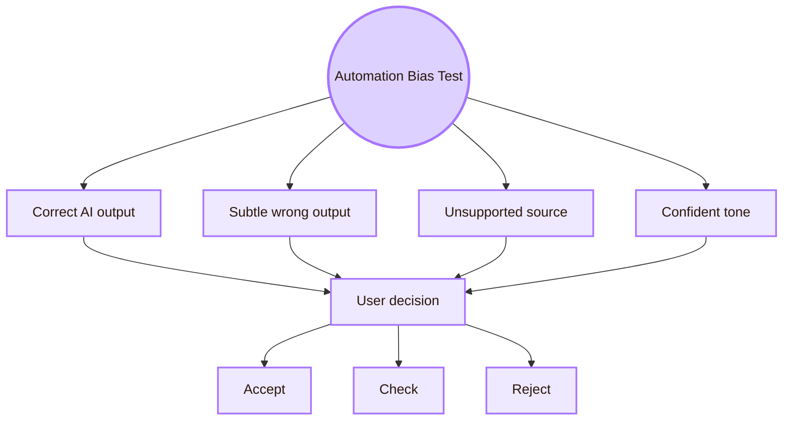

| Test item | Example |
|---|---|
| Subtle wrong role | AI says a person is currently in a role that changed |
| Unsupported local claim | AI says UVT has a specific lab without source proof |
| Fake source confidence | AI presents a weak source as decisive |
| Overgeneralised conclusion | AI turns a local test into a global claim |
| Smooth but vague explanation | AI sounds academic but gives no inspectable evidence |

| User behaviour | Interpretation |
|---|---|
| Accepts without checking | Possible overreliance |
| Checks only easy claims | Partial verification |
| Challenges local/current claims | Better AI literacy |
| Edits tone but not facts | Style focus may hide factual risk |
| Rejects everything | Undertrust or overload |

## Experiment IX: Learning and AI literacy test

For a student project, AI should support learning. It should not replace the student’s thinking. The experiment must therefore test understanding, not only output quality.

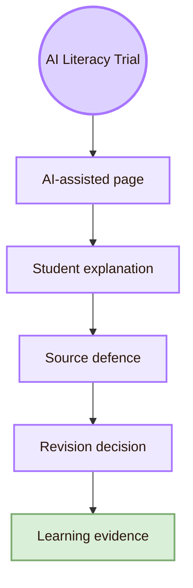

| Task | Evidence |
|---|---|
| Explain one AI-assisted section in your own words | Concept understanding |
| Identify the strongest source in the section | Source literacy |
| Identify one claim that should be softened | Critical judgement |
| Explain why one diagram helps or fails | Design reasoning |
| Decide what to remove from the AI output | Editorial control |
| Write a claim boundary | Academic responsibility |

A good result is not “AI wrote a better page.” A stronger result is: “The student can explain why the page is better, which claims were verified, which claims were softened, and which parts remain uncertain.”

## Experiment X: Accessibility and bias test

Human-AI experiments must ask who benefits and who is disadvantaged. AI can support accessibility, but it can also generate inaccessible text, biased summaries, wrong alternative text, or advice that ignores disabled users.

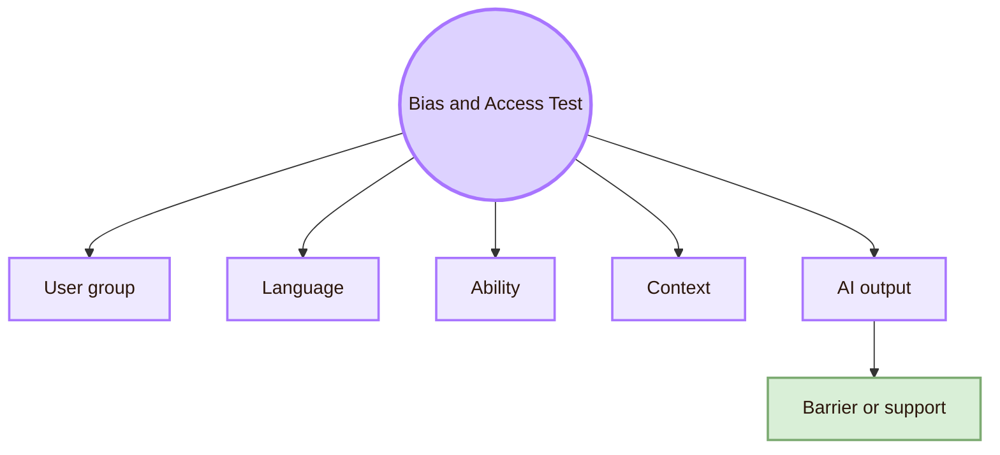

| Test question | Example |
|---|---|
| Does the AI write for only one default user? | It assumes English fluency, perfect vision, or Git knowledge |
| Does the AI ignore accessibility? | It improves visual style but makes diagrams less readable |
| Does the AI handle Romanian terms correctly? | It mistranslates HCI or accessibility vocabulary |
| Does the AI overstate national context? | It claims Romanian leadership without evidence |
| Does the AI produce accessible Markdown? | It keeps headings, meaningful links, readable tables, and diagram explanations |
| Does AI-generated content remain usable in Obsidian and GitHub? | It does not depend only on CSS or plugin rendering |

## Experiment XI: Reproducibility and versioning test

AI outputs are hard to reproduce unless the prompt, model, sources, and file version are recorded. This is a serious issue for academic work.

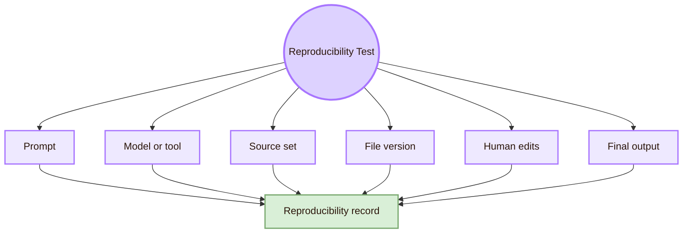

| Record item | Why it matters |
|---|---|
| Prompt | Shows what the AI was asked to do |
| Model or tool | Outputs may differ by tool and version |
| Date | AI systems and sources change |
| Source list | Shows what information was available |
| File version or Git commit | Shows what was edited |
| Human edits | Shows student authorship and judgement |
| Removed claims | Shows critical review |
| Final claim boundary | Shows what the page can safely say |

## Minimal local experiment for Cognishire

This is the recommended first study for the Oracle Engine. It is small enough to run locally and strong enough to support a serious student report.

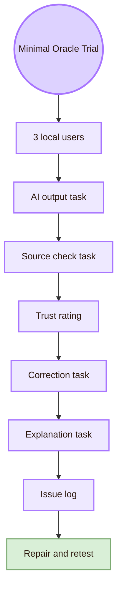

| Trial part | Concrete task |
|---|---|
| Participants | Three UVT students or classmates, ideally with different levels of AI/Git/Obsidian experience |
| AI output task | Give them one AI-assisted paragraph about Human-AI Interaction |
| Source check task | Ask them to mark which claims need verification |
| Trust rating | Ask for 1–5 confidence before and after source checking |
| Correction task | Ask them to edit, soften, or remove weak claims |
| Explanation task | Ask them to explain what the AI did and what the human must still do |
| Output | Issue log with AI failure, user behaviour, repair, and retest status |

### Minimal task sheet

| Task | Instruction to participant | Evidence |
|---|---|---|
| T1 | Read this AI-generated section and underline claims that need sources | Source awareness |
| T2 | Find one unsupported or weakly supported claim | Verification behaviour |
| T3 | Rate how much you trust the answer before checking sources | Initial trust |
| T4 | Check the provided sources and rate trust again | Trust calibration |
| T5 | Rewrite one risky sentence safely | Human oversight |
| T6 | Explain what the AI helped with and what it could not guarantee | Mental model |
| T7 | Decide whether the section should be accepted, edited, or rejected | Final control |

## Measurement plan

| Measure | Scale or format | What it supports |
|---|---|---|
| Task success | Success / partial / failure | Whether users can perform verification and correction tasks |
| Source-check count | Number of claims checked | Verification effort |
| Unsupported-claim detection | Count and examples | Hallucination detection |
| Trust before checking | 1–5 rating | Initial confidence |
| Trust after checking | 1–5 rating | Trust calibration |
| Edit quality | Kept / softened / corrected / removed | Human oversight quality |
| Explanation accuracy | Accurate / partial / inaccurate | Mental model |
| Time on task | Minutes | Effort, not proof of learning |
| Confidence note | Short written reason | Why the user trusted or distrusted |
| Observer notes | Behaviour and quotes | Qualitative interpretation |

## Observation form

| Field | Notes |
|---|---|
| Participant ID | P1, P2, P3 |
| AI experience level | Low, medium, high |
| GitHub/Obsidian experience | Low, medium, high |
| Task attempted | T1–T7 |
| Visible hesitation | Where the user paused |
| Verification action | Which source or claim was checked |
| Missed risk | What the user failed to notice |
| Correct repair | What the user fixed well |
| Trust rating before | 1–5 |
| Trust rating after | 1–5 |
| Key quote | Short quote only |
| Design implication | What the interface/page should change |

## Issue log template

| Issue ID | AI or interaction problem | Evidence | Affected users | Severity | Repair | Retest status |
|---|---|---|---|---|---|---|
| O01 | AI invented or overstated a role | User accepted it before source check | Students, professor, readers | Serious | Require official profile source and cautious wording | Not retested |
| O02 | Source link did not support the claim | User found mismatch between source and sentence | Academic readers | Serious | Replace claim or source | Retest needed |
| O03 | User trusted fluent style too much | Trust rating high before checking, claim later failed | Student author | Serious | Add source-check task and uncertainty label | Not retested |
| O04 | Explanation sounded useful but hid uncertainty | User could repeat explanation but not verify claim | First-year learners | Moderate | Add “what this explanation does not prove” line | Retest needed |
| O05 | Prompt produced inconsistent local details | Different prompt versions gave different UVT/Romania claims | Student author | Serious | Use official source anchors and claim boundary | Retest needed |
| O06 | AI output was too advanced for a first-year reader | User could not explain section in own words | Student readers | Moderate | Simplify language and add example | Not retested |

## Claim-boundary table

| Weak claim | Safer claim |
|---|---|
| “The AI proved the page is correct.” | “The AI-assisted page was checked against selected sources and revised.” |
| “Users trust the AI.” | “In this local trial, participants rated trust under specific task conditions.” |
| “The system prevents hallucinations.” | “The interface includes source-checking steps that may reduce unsupported claims.” |
| “Human oversight is present.” | “Users could inspect, edit, reject, and document AI suggestions in the tested workflow.” |
| “The AI supports all students.” | “The tested workflow supported selected students in a local UVT context.” |
| “The Romanian context is complete.” | “The page includes selected Romanian HCI and AI-accessibility routes.” |
| “The AI is safe.” | “Selected risks were identified, mitigated, and documented; other risks remain untested.” |

## Cognishire application

The Oracle Engine should test AI use inside the map itself. This makes the project honest: it studies Human-AI Interaction while also using AI as part of the workflow.

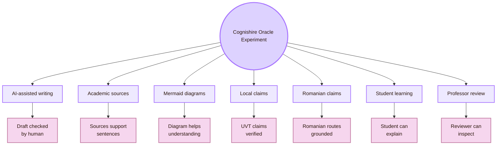

| Cognishire target | Human-AI experiment |
|---|---|
| AI-assisted writing | Compare AI draft, human edits, and final claim boundaries |
| Academic anchors | Check whether each source directly supports the linked claim |
| Mermaid diagrams | Test whether users understand the concept better with the diagram |
| Local UVT claims | Verify through official UVT pages and avoid overclaiming |
| Romanian claims | Verify through RoCHI, A(I)BILITIES, USV, and official project pages |
| Student learning | Ask the student author to explain each AI-assisted section |
| Professor review | Ask whether sources, claim limits, and authorship are clear |
| GitHub workflow | Track file versions, prompt changes, and final edits |

## Experiment synthesis

Experiment in **Human-AI Interaction** is the study of both system behaviour and human response. It checks output quality, mental models, trust, verification, explanation, oversight, prompt sensitivity, automation bias, accessibility, reproducibility, and accountability.

Locally, this means testing the real AI-assisted Cognishire workflow at UVT: prompts, AI drafts, Obsidian pages, GitHub files, source verification, professor review, and student understanding. Nationally, it means using Romanian HCI and AI-accessibility routes where they are relevant. Globally, it means grounding the experiments in Human-AI guidelines, human-centered AI design, risk management, AI oversight, HCI venues, and responsible AI research.

The central question is:

> What did the AI suggest, what did the human believe, what was verified, what changed, and who remains responsible?

This page connects to [[Theory]] because experiments operationalise trust, uncertainty, mental models, and oversight. It connects to [[Design]] because every failure should become an interface repair. It connects to [[../Overview|Overview]] because the Oracle Engine protects the whole HCI map from uncritical AI use. It connects outward to [[../../03_Evaluating_the_Design/Overview|Observation Chamber]] because Human-AI experiments are evaluation methods with extra AI-specific risks.

## Academic anchors

| Route | Source |
|---|---|
| CS2023 HCI / AI / SEP basis | [CS2023 Knowledge Areas](https://csed.acm.org/knowledge-areas/) |
| Human-AI Interaction guidelines | [Microsoft Research: Guidelines for Human-AI Interaction](https://www.microsoft.com/en-us/research/project/guidelines-for-human-ai-interaction/) |
| HAX design guidance | [Microsoft HAX Toolkit: AI Guidelines](https://www.microsoft.com/en-us/haxtoolkit/ai-guidelines/) |
| Human-centered AI design | [Google People + AI Guidebook](https://pair.withgoogle.com/guidebook/) |
| AI risk framework | [NIST AI Risk Management Framework](https://www.nist.gov/itl/ai-risk-management-framework) |
| AI RMF 1.0 PDF | [NIST AI RMF 1.0](https://nvlpubs.nist.gov/nistpubs/ai/NIST.AI.100-1.pdf) |
| Human oversight requirement | [EU AI Act Article 14: Human Oversight](https://artificialintelligenceact.eu/article/14/) |
| Official AI Act service desk | [AI Act Service Desk: Article 14](https://ai-act-service-desk.ec.europa.eu/en/ai-act/article-14) |
| Responsible AI and fairness venue | [ACM FAccT](https://facctconference.org/) |
| Intelligent user interfaces venue | [ACM IUI](https://iui.acm.org/) |
| Human-agent interaction venue | [ACM HAI](https://hai-conference.net/) |
| HCI venue | [ACM CHI](https://dl.acm.org/conference/chi) |
| Human-AI archival journal | [ACM Transactions on Interactive Intelligent Systems](https://dl.acm.org/journal/tiis) |
| Human-centered AI institute | [Stanford HAI](https://hai.stanford.edu/) |
| UVT Faculty of Informatics | [Faculty of Informatics UVT](https://info.uvt.ro/en/) |
| UVT departments | [Faculty of Informatics Departments](https://info.uvt.ro/en/departamente/) |
| UVT CSAI Department | [Department of Computational Sciences and Artificial Intelligence](https://info.uvt.ro/en/departamente/csai/) |
| UVT DTSE Department | [Department of Digital Technologies and Software Engineering](https://info.uvt.ro/en/departamente/dtse/) |
| UVT AI and ML research route | [Artificial Intelligence and Machine Learning](https://research.info.uvt.ro/artificial-intelligence-and-machine-learning/) |
| UVT research routes | [Research Center in Computer Science: Researchers](https://research.info.uvt.ro/researchers/) |
| Romanian HCI proceedings | [RoCHI Proceedings](https://rochi.utcluj.ro/proceedings/en/) |
| Romanian AI-accessibility project | [A(I)BILITIES](https://aibilities.ro/en/about/) |
| Radu-Daniel Vatavu route | [Radu-Daniel Vatavu homepage](https://raduvatavu.usv.ro/) |
| Ovidiu-Andrei Schipor route | [Ovidiu-Andrei Schipor projects](https://www.eed.usv.ro/~schipor/projects.php) |

^experiment-human-ai-interaction-end
