![[stretcyber.gif|1000]]
# Theory

Back to [[../Overview|The Oracle Engine]].

> [!abstract] Human-AI Interaction Theory
> **Human-AI Interaction** studies how people understand, use, question, verify, correct, and remain responsible when they work with systems that use artificial intelligence.

The project name for this room is **Oracle Engine**.  
The academic topic is **Human-AI Interaction**.  
The safest CS2023 grounding is a bridge between **Human-Computer Interaction**, **Artificial Intelligence**, **Software Engineering**, **Accessibility**, and **Society, Ethics, and Professionalism**.

This page treats AI as a technical and social system. It does not treat AI as magic, personality, or authority. An AI system produces outputs through data, models, prompts, inference, deployment choices, and interface design. A human still has to interpret the output and decide what to do with it.

> [!quote] Oracle law
> An AI interface becomes risky when it turns uncertainty into authority. Good Human-AI Interaction makes capability, evidence, limits, control, and responsibility visible.

## Fact-checked basis

|---|---|
| Human-AI design needs explicit interaction guidance | Microsoft Research published **18 Guidelines for Human-AI Interaction**. The HAX Toolkit organises them around initial interaction, interaction over time, AI failure, and system change. |
| Human-centred AI is a recognised design route | Google PAIR gives practical guidance for designing human-centred AI products. Stanford HAI describes human-centred AI as AI that augments people, responds to societal needs, and draws inspiration from humans. |
| AI risk should be managed as a process | NIST AI RMF uses the functions **Govern, Map, Measure, Manage**. |
| The Romanian layer has real HCI and AI-accessibility routes | RoCHI gives a Romanian HCI route. A(I)BILITIES is a Romanian generative AI project for personalised interactive solutions for users with disabilities. |

## Core theory map

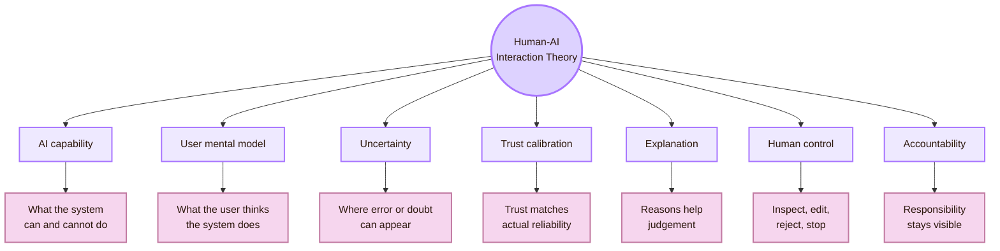

| Concept | Simple meaning | Why it matters |
|---|---|---|
| AI capability | What the AI can actually do | Users may imagine abilities the system does not have |
| Mental model | The user’s idea of how the AI works | Wrong mental models cause misuse |
| Uncertainty | The possibility that an output is wrong, incomplete, biased, outdated, or unstable | AI can fail while sounding fluent |
| Trust calibration | Trust that matches evidence | Overtrust and undertrust both create problems |
| Explanation | Information that helps a user judge an output | Explanations should improve decisions |
| Human control | The user can inspect, edit, reject, override, undo, or stop | Oversight is weak without real controls |
| Accountability | The review chain remains visible | “The AI said it” is not an academic reason |

## CS2023 grounding

Human-AI Interaction is best treated as a bridge topic. It sits between several CS2023 areas instead of belonging to only one unit.

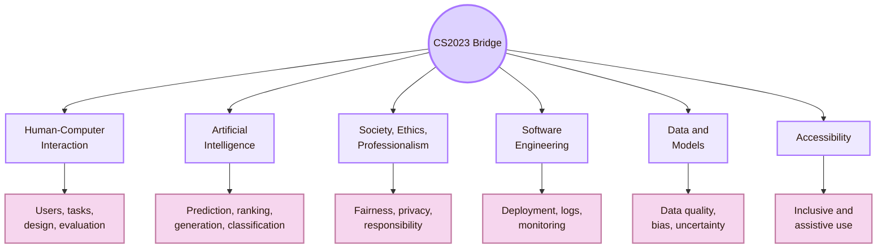

| CS2023 route | Human-AI question |
|---|---|
| HCI | How do people understand and use the AI interface? |
| AI | What does the model do, and where can it fail? |
| Society, Ethics, and Professionalism | Who is affected, and who is responsible? |
| Software Engineering | How are AI outputs logged, tested, deployed, repaired, and rolled back? |
| Data and Models | What data, assumptions, and uncertainty shape the output? |
| Accessibility | Who can use the AI system, and who may be excluded? |

## Local UVT layer

The local context for this project is **UVT Faculty of Informatics**. The relevant local routes are **CSAI**, **DTSE**, AI and ML research routes, software-system routes, professor review, GitHub, and Obsidian.

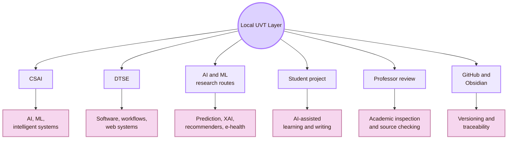

| Local route         | Careful interpretation                                                                            |
| ------------------- | ------------------------------------------------------------------------------------------------- |
| CSAI                | A local AI foundation for model behaviour, prediction, intelligent systems, and AI education      |
| DTSE                | A local software foundation for workflows, deployment, maintainability, and traceability          |
| AI and ML routes    | Relevant to uncertainty, explainability, recommender systems, medical AI, and data-driven systems |
| Student project     | A real Human-AI case: AI helps draft, but the student must verify and understand                  |
| Professor review    | A local accountability point for academic quality                                                 |
| GitHub and Obsidian | Practical infrastructure for versioning, sources, file structure, and repair logs                 |

## Romanian layer

The Romanian layer gives national grounding. It prevents the Oracle Engine from becoming only a global imported topic.

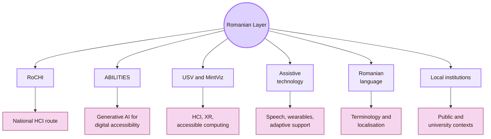

| Romanian route | Use in this theory page |
|---|---|
| RoCHI | National HCI context and Romanian HCI proceedings |
| A(I)BILITIES | Romanian route for generative AI and personalised accessibility |
| Radu-Daniel Vatavu / USV | HCI, XR, ambient intelligence, accessible computing |
| Ovidiu-Andrei Schipor | HCI, assistive technologies, speech therapy systems |
| Romanian language | AI explanation quality, terminology, translation, and comprehension |
| Romanian institutions | Local trust, accountability, public systems, and educational use |

## AI as a sociotechnical system

The user often sees only an answer, recommendation, label, summary, or generated object. The system behind that output has several layers.

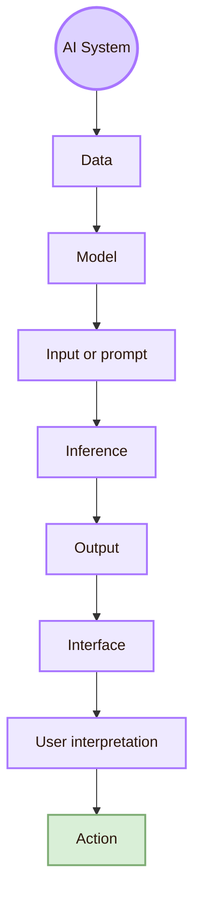

| Layer | Human-AI question |
|---|---|
| Data | What examples, omissions, labels, and biases shaped the system? |
| Model | What pattern has the system learned or approximated? |
| Input or prompt | What did the user ask, and what context was missing? |
| Inference | How is an output produced from the input? |
| Output | Is the answer correct, useful, unsupported, biased, or uncertain? |
| Interface | How is the output framed, explained, and controlled? |
| User interpretation | What does the user believe after seeing it? |
| Action | What happens if the user trusts the output? |

The interface matters because it frames the AI. It can make a guess look like evidence. It can also make doubt, limits, and verification visible.

## Probabilistic interaction

Many AI systems classify, rank, recommend, or generate. Their behaviour may change across prompts, data, settings, model versions, and deployment context.

| Traditional interface | AI-infused interface |
|---|---|
| A button usually has a fixed action | A prompt can produce different outputs |
| Errors are often visible | Errors can be fluent and hidden |
| The user learns stable rules | The user must learn model limits |
| Testing can cover fixed paths | Testing must cover uncertainty and misuse |
| Trust often comes from consistency | Trust must be calibrated to evidence |

This is why Human-AI Interaction needs theory. AI changes what the user must judge.

## Mental models

A mental model is the user’s internal explanation of how a system works. In AI systems, mental models are often incomplete or wrong.

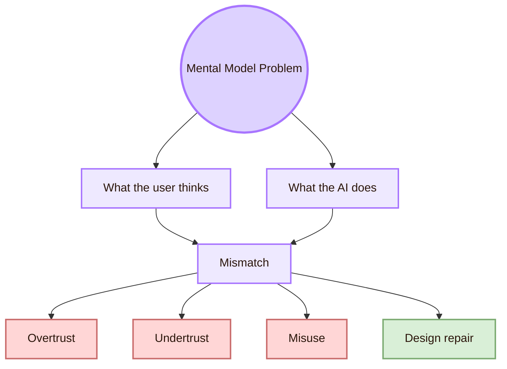

| Wrong mental model | Risk | Design repair |
|---|---|---|
| “The AI understands my full context.” | User expects personal accuracy | Ask for missing context |
| “The AI is neutral.” | User ignores bias | Explain data and representation limits |
| “The AI is a search engine.” | User confuses generation with retrieval | Separate retrieval from generation |
| “The AI is useless because it failed once.” | User misses useful support | Show suitable tasks and unsuitable tasks |
| “The AI is the author.” | Student stops owning the work | Keep human authorship and review visible |

A good AI interface teaches the user what kind of system they are using.

## Trust calibration

Trust calibration means that user trust should match system reliability. The goal is not maximum trust. The goal is justified trust.

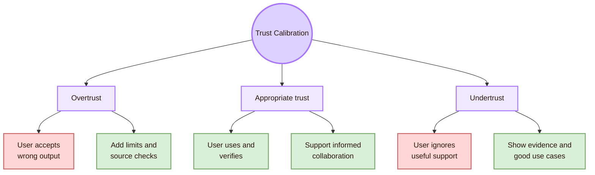

| Trust state | Example | Design response |
|---|---|---|
| Undertrust | The user rejects useful drafting support without checking | Show evidence, scope, and examples of appropriate use |
| Appropriate trust | The user uses AI for drafting but verifies facts | Keep verification easy |
| Trust collapse | One error makes the user reject the whole system | Explain the failure and show the repair path |
| False confidence | A polished answer hides weak evidence | Separate answer, evidence, and uncertainty |

## Automation bias and deskilling

Automation bias means that users rely too much on automated suggestions. Deskilling means users stop practising a skill because the system does too much for them.

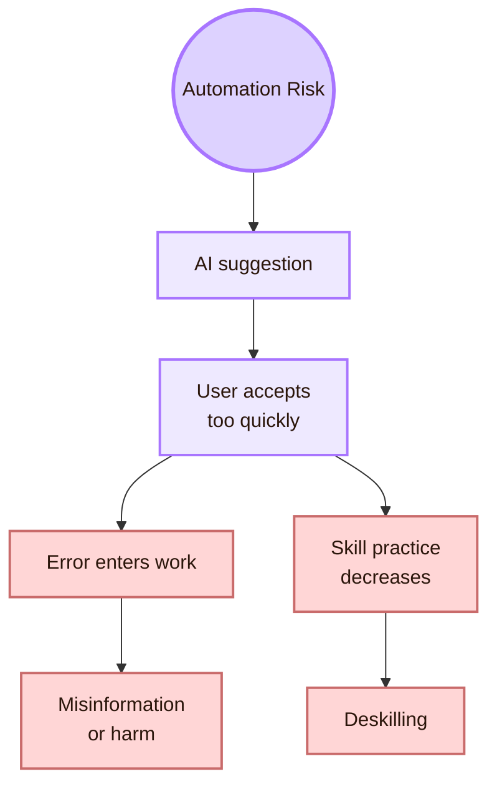

| Risk | Example in Cognishire | Repair |
|---|---|---|
| Automation bias | Student accepts a generated source without checking it | Require source verification |
| Deskilling | Student stops learning how to structure theory pages | Use AI as tutor and critic |
| Shallow understanding | Student can paste content but cannot explain it | Add explanation tasks |
| Hidden error | AI invents a project, venue, or role | Verify with official sources |
| Style over substance | Page looks impressive but lacks accuracy | Test concepts and source support |

AI should support learning and judgement. It should not replace them.

## Explanation, transparency, interpretability, and contestability

These terms are related, but they are not the same.

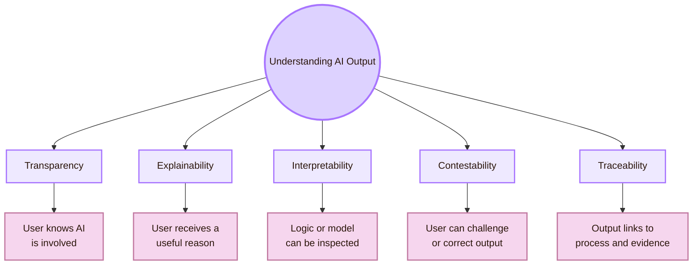

| Concept | Meaning | Interface example |
|---|---|---|
| Transparency | The user knows AI is involved | “This section was AI-assisted and human reviewed.” |
| Explainability | The user gets a reason that helps judgement | “This source is used because it defines Human-AI guidelines.” |
| Interpretability | A human can inspect part of the model or logic | Feature importance, examples, traces, or model card |
| Traceability | The output can be linked to evidence or process | Prompt log, source list, model version, commit history |
| Limitation disclosure | The system states where it may fail | “Current roles must be checked on official pages.” |

A good explanation is not necessarily long. It is useful when it improves the user’s next decision.

## Human oversight

Human oversight must be designed. A human is not truly in control if they cannot understand, intervene, or override.

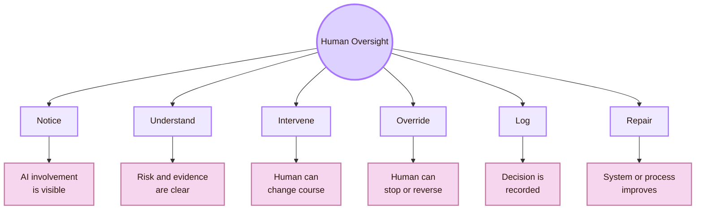

| Oversight problem | Why it fails | Better design |
|---|---|---|
| Rubber-stamp review | Human approves without inspection | Show evidence and risk near the output |
| No authority | Human sees a problem but cannot override | Provide reject, edit, stop, undo, and rollback |
| No time | Human must review too much too quickly | Prioritise risky outputs |
| No expertise | Human cannot judge model limits | Provide explanation, examples, and training |
| No log | Failures disappear | Record issue, version, and repair |
| No accountability | Responsibility is unclear | Define who reviews and who decides |

EU AI Act Article 14 concerns high-risk AI systems. This student project is not described as a high-risk legal system. The useful academic point is narrower: human oversight needs practical controls, not only human presence.

## Human-AI collaboration roles

AI can play different roles. The role must be clear because each role creates different expectations and risks.

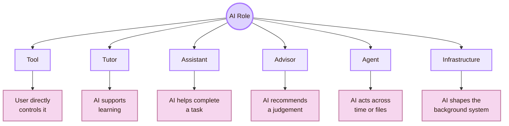

| AI role | User expectation | Main risk |
|---|---|---|
| Tool | User controls directly | User may expect intelligence that is not there |
| Tutor | AI supports learning | Student may let AI do the thinking |
| Assistant | AI helps with work | User may delegate too much |
| Advisor | AI recommends decisions | User may accept advice without checking |
| Agent | AI acts across time or files | User may lose control |
| Infrastructure | AI ranks, filters, or monitors | User may not know AI shaped the experience |

For Cognishire, the safest role is **AI as tutor, critic, and drafting assistant**. It should not be treated as final author or final authority.

## Feedback and adaptation

Human-AI systems often form loops. The user gives input. The AI responds. The user reacts. The system or workflow may adapt.

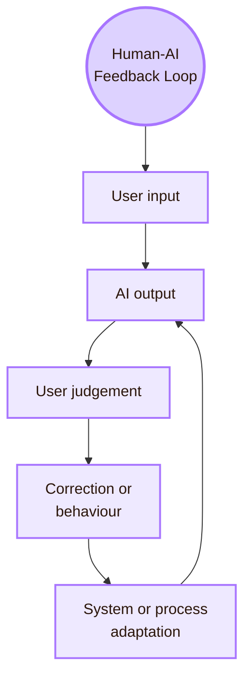

| Loop point | Theory question |
|---|---|
| User input | Did the user provide enough context? |
| AI output | Does the output show evidence and limits? |
| User judgement | Does the user inspect before trusting? |
| Correction | Can the user mark errors easily? |
| Adaptation | Does the system change in a visible and controllable way? |
| Long-term use | Does trust improve, drift, or become misplaced? |

Adaptation is useful only when it remains understandable and controllable.

## Uncertainty design

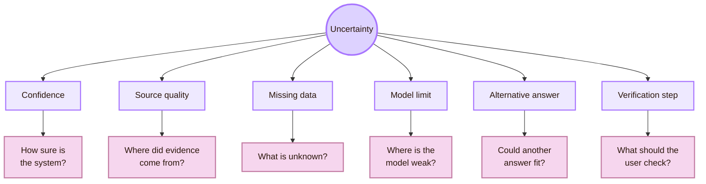

| Signal | Useful when | Risk |
|---|---|---|
| Confidence score | The user understands probability | Can create false precision |
| Alternative output | Several answers are plausible | Too many alternatives can overload the user |
| Clarifying question | The input is ambiguous | Too many questions slow the task |
| Verification checklist | Stakes are academic or factual | Users may skip it if it feels optional |

## Generative AI

Generative AI produces text, code, images, summaries, translations, plans, and explanations. It is useful for drafting. It is not a source of truth by itself.

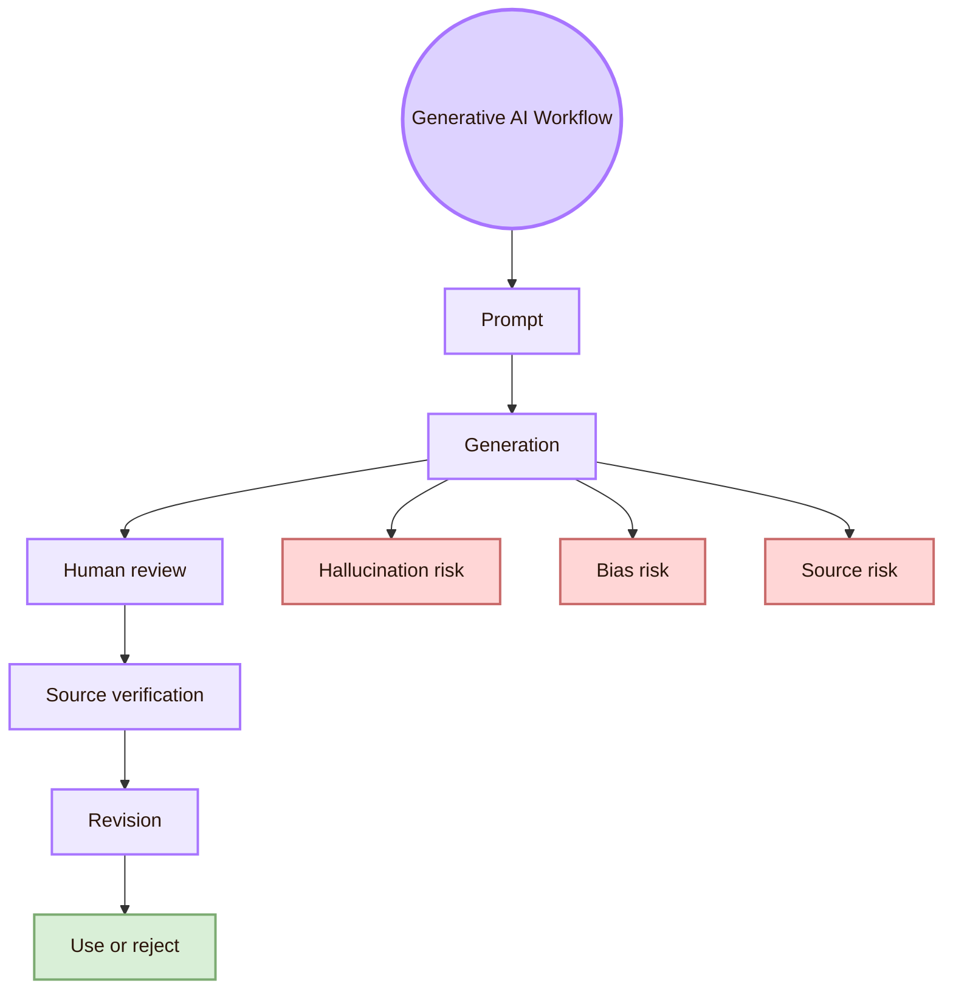

| Issue | Student project version | Repair |
|---|---|---|
| Hallucination | AI invents a source, venue, person, or role | Check official sources |
| Generic output | Page lacks UVT and Romanian relevance | Add local and national grounding |
| Hidden dependency | Student cannot explain the page | Add explanation tasks |
| Prompt sensitivity | Output changes too much with wording | Use stable prompt templates |
| Code risk | AI-generated CSS breaks accessibility | Test before using |

## Prompting as interaction design

A prompt is not just text. It is an interface between the user and the model. The prompt frames the task, context, constraints, output format, and quality criteria.

| Prompt element | What it does | Example for Cognishire |
|---|---|---|
| Task | Defines the work | “Rewrite this as a first-year HCI teaching note.” |
| Context | Gives local and project background | “This is an Obsidian HCI vault called Cognishire.” |
| Output format | Makes review easier | “Return Markdown with frontmatter preserved.” |
| Style rule | Reduces generic AI prose | “Use short academic English.” |

Good prompt design supports good human judgement. It cannot replace checking.

## Human-centred AI

Human-centred AI is a broad approach. It places human needs, human agency, social impact, and responsible deployment at the centre of the system.

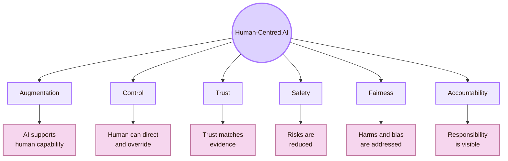

| Principle | Cognishire interpretation |
|---|---|
| Augmentation | AI helps the student structure, compare, and revise |
| Control | Student can edit, reject, and verify |
| Trust | AI output is treated as draft until checked |
| Fairness | Missing groups and local contexts are checked |
| Accountability | Sources, prompts, edits, and limits remain visible |

The goal is not to make AI seem human. The goal is to make AI useful, honest, controllable, and accountable.

## AI in learning

Because Cognishire is a student project, AI should support learning. It should not replace the student’s understanding.

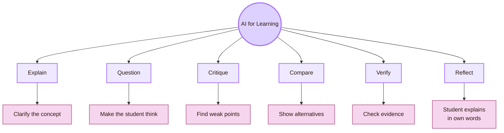

| Weak pattern | Better pattern |
|---|---|
| AI gives the final answer | AI asks questions and explains |
| Student pastes output | Student verifies and rewrites |
| AI replaces reasoning | AI supports reasoning |
| Sources are accepted blindly | Sources are checked |
| Page looks impressive | Student can explain it |
| AI hides process | Prompts, edits, and sources remain visible |

## AI and accessibility

AI can support access, but it can also create new barriers.

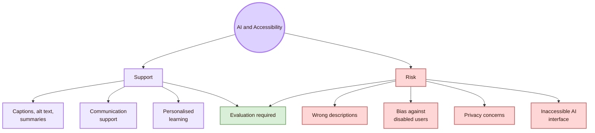

| AI accessibility promise | Risk |
|---|---|
| Generate alt text | It may describe the image incorrectly |
| Summarise long text | It may remove important nuance |
| Caption speech | It may fail with accents, noise, or speech differences |
| Adapt content | It may reduce user control |
| Personalise learning | It may stereotype the user |
| Generate accessible code | It may produce inaccessible interfaces |
| Help disabled users | It may exclude disabled users from design and testing |

## Risk management and accountability

The NIST AI RMF gives a useful risk-management vocabulary: **Govern**, **Map**, **Measure**, and **Manage**. These functions can be translated into Human-AI Interaction.

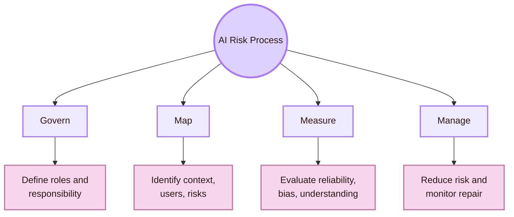

| NIST function | Human-AI translation |
|---|---|
| Govern | Define who owns the system, output, review process, and repair path |
| Map | Identify users, tasks, intended use, misuse, and affected groups |
| Measure | Test correctness, bias, usability, trust, explanation, and accessibility |
| Manage | Reduce risk through design changes, controls, monitoring, and updates |

For Cognishire, this means AI-generated content should be drafted, checked, revised, and logged.

## Cognishire application

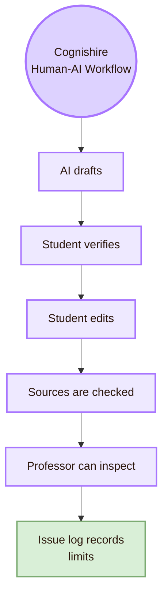

| Cognishire issue | Theory response |
|---|---|
| AI writes academic text | Treat it as draft |
| AI suggests sources | Verify exact source support |
| AI creates diagrams | Test readability and meaning |
| AI maps local people | Use official UVT or university sources |
| AI gives confident wording | Add uncertainty and limits |
| AI helps design | Keep human control |
| Student may not learn | Add explanation in own words |

## Theory checklist

| Question | Good answer |
|---|---|
| What is the AI role? | Tutor, critic, drafting assistant, advisor, agent, or infrastructure |
| What can the AI do? | Specific capability, not vague intelligence |
| What can it not guarantee? | Truth, completeness, current facts, neutrality, or source support |
| Can the user intervene? | Edit, reject, verify, undo, stop, or report |
| Can the student explain it? | Yes, without copying the AI text |
| Is responsibility visible? | Sources, review status, prompt context, and limits are recorded |

## Academic anchors

| Route | Source |
|---|---|
| CS2023 HCI basis | [CS2023 HCI Version Gamma](https://csed.acm.org/wp-content/uploads/2023/09/HCI-Version-Gamma.pdf) |
| CS2023 Artificial Intelligence basis | [CS2023 AI SIGCSE 2022 version](https://csed.acm.org/knowledge-areas-intelligent-systems-ai-sigcse-2022-version/) |
| CS2023 Knowledge Areas | [CS2023 Knowledge Areas](https://csed.acm.org/knowledge-areas/) |
| Microsoft Human-AI guidelines | [Guidelines for Human-AI Interaction](https://www.microsoft.com/en-us/haxtoolkit/ai-guidelines/) |
| Microsoft Human-AI guidelines article | [Eighteen best practices for human-centered AI design](https://www.microsoft.com/en-us/research/group/customer-insights-research/articles/guidelines-for-human-ai-interaction-eighteen-best-practices-for-human-centered-ai-design/) |
| Google People + AI Research | [People + AI Research](https://design.google/library/people-ai-research) |
| Google People + AI Guidebook | [PAIR Guidebook](https://pair.withgoogle.com/guidebook/) |
| Stanford HAI human-centered AI definition | [Brief Definitions of Key Terms in AI](https://hai.stanford.edu/policy/brief-definitions-of-key-terms-in-ai) |
| Stanford HAI institute route | [Stanford HAI](https://hai.stanford.edu/) |
| NIST AI RMF | [NIST AI Risk Management Framework](https://www.nist.gov/itl/ai-risk-management-framework) |
| NIST AI RMF Core | [Govern, Map, Measure, Manage](https://airc.nist.gov/airmf-resources/airmf/5-sec-core/) |
| EU AI Act | [European Commission AI Act](https://digital-strategy.ec.europa.eu/en/policies/regulatory-framework-ai) |
| EU AI Act Article 14 | [Human oversight](https://artificialintelligenceact.eu/article/14/) |
| ACM IUI | [ACM Conference on Intelligent User Interfaces](https://iui.acm.org/) |
| ACM CHI | [ACM CHI](https://dl.acm.org/conference/chi) |
| ACM HAI | [Human-Agent Interaction](https://hai-conference.net/) |
| ACM TiiS | [ACM Transactions on Interactive Intelligent Systems](https://dl.acm.org/journal/TIIS) |
| ACM FAccT | [ACM FAccT](https://facctconference.org/) |
| ACM ASSETS | [ASSETS Conference](https://www.sigaccess.org/assets/) |
| UVT Faculty of Informatics | [Faculty of Informatics UVT](https://info.uvt.ro/en/) |
| UVT Faculty departments | [Faculty of Informatics Departments](https://info.uvt.ro/en/departamente/) |
| UVT CSAI Department | [Department of Computational Sciences and Artificial Intelligence](https://info.uvt.ro/en/departamente/csai/) |
| UVT DTSE Department | [Department of Digital Technologies and Software Engineering](https://info.uvt.ro/en/departamente/dtse/) |
| UVT AI and ML research route | [Artificial Intelligence and Machine Learning](https://research.info.uvt.ro/artificial-intelligence-and-machine-learning/) |
| RoCHI proceedings | [Romanian HCI proceedings](https://rochi.utcluj.ro/proceedings/en/) |
| Romanian HCI community route | [Romanian Special Interest Group in HCI](https://cgis.utcluj.ro/rochi_group/) |
| Radu-Daniel Vatavu | [Radu-Daniel Vatavu homepage](https://raduvatavu.usv.ro/) |
| Ovidiu-Andrei Schipor | [Ovidiu-Andrei Schipor homepage](https://www.eed.usv.ro/~schipor/) |
| A(I)BILITIES project | [A(I)BILITIES](https://aibilities.ro/en/about/) |
| ASSIST Software A(I)BILITIES | [A(I)BILITIES — Generative AI for Digital Accessibility](https://assist-software.net/project/aibilities) |
| MintViz A(I)BILITIES route | [MintViz A(I)BILITIES](https://mintviz.usv.ro/projects/A%28I%29BILITIES/index.php) |

^theory-human-ai-interaction-end
