# Connections

Back to [[Overview|The Oracle Engine]].

> [!abstract] Oracle Connection Map
> This page maps the fields that support **Human-AI Interaction**. AI interaction is not only a model problem. It is also a user problem, an interface problem, a data problem, a software problem, an ethics problem, an accessibility problem, and an institutional problem.

The fantasy name is **Oracle Connection Map**.  
The academic topic is **Human-AI Interaction**.  
The CS2023 grounding is a bridge between **Human-Computer Interaction**, **Artificial Intelligence**, **Software Engineering**, **Security**, **Accessibility**, and **Society, Ethics, and Professionalism**.

The practical meaning is simple: an AI system becomes meaningful only when a person must use it. A model produces an output. The interface frames that output. The user interprets it. Data and deployment shape it. Institutions decide where it is used. Someone must still be responsible for the consequences.

> [!quote] Connection rule
> Human-AI Interaction needs several fields because no single field can explain the whole loop from model output to human judgement.

## Fact-checked basis

| Claim used in this page | Safer grounding |
|---|---|
| Human-AI Interaction is a bridge topic | CS2023 includes HCI, AI, software engineering, security, data, accessibility, and society/ethics areas. This page treats Human-AI Interaction as an interdisciplinary bridge, not as a single isolated CS2023 unit. |
| Human-AI design needs explicit interaction guidance | Microsoft Research published Guidelines for Human-AI Interaction and the HAX Toolkit as practical design resources for AI systems. |
| Human-centered AI design is an established design route | Google PAIR and Stanford HAI both present human-centered AI as a design and research direction. |
| AI risk management needs process and governance | NIST AI RMF organises AI risk work through Govern, Map, Measure, and Manage. |
| Human oversight is a formal concern in AI governance | The EU AI Act includes human oversight requirements for high-risk AI systems. |
| Local UVT claims must be cautious | UVT has public routes in AI, machine learning, software systems, workflows, recommender systems, e-health, XAI-related seminars, and Computer Science. This does not automatically prove a dedicated Human-AI Interaction lab. |
| Romanian grounding exists but should not be overclaimed | RoCHI, USV/MintViz, A(I)BILITIES, and Romanian accessibility/HCI routes give national context. They should be used as routes, not inflated into a complete national field map. |

## Main connection map

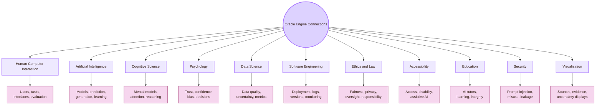

| Field | What it contributes | If ignored |
|---|---|---|
| Human-Computer Interaction | User research, interface design, feedback, usability testing, accessibility | The AI may work technically but fail in real use |
| Artificial Intelligence | Model behaviour, prediction, generation, ranking, classification, uncertainty | The interface may hide what the system can and cannot do |
| Cognitive Science | Mental models, attention, memory, reasoning, cognitive load | Users may misunderstand the AI and still feel confident |
| Psychology | Trust, confidence, automation bias, judgement, decision-making | Users may overtrust or undertrust AI output |
| Data Science | Data provenance, bias, missing data, drift, metrics | Outputs may look neutral while data problems remain hidden |
| Software Engineering | Versioning, logs, testing, deployment, rollback, maintainability | AI errors become difficult to trace and repair |
| Ethics and Law | Fairness, privacy, transparency, contestability, human oversight | Harm is treated as a technical accident rather than a responsibility problem |
| Accessibility | Disabled users, assistive tools, generated accessibility content, inclusive AI | AI may help some users while excluding others |
| Education | AI literacy, tutoring, learning support, academic integrity | Students may copy outputs without understanding them |
| Security | Prompt injection, data leakage, tool misuse, unsafe automation | AI systems become vulnerable through natural-language interaction |
| Visualisation | Source panels, uncertainty displays, alternatives, decision traces | Users cannot inspect why an AI output should be trusted or rejected |

## CS2023 connection gate

Human-AI Interaction sits between several Computer Science areas. This page uses the Oracle Engine as a study route for that intersection.

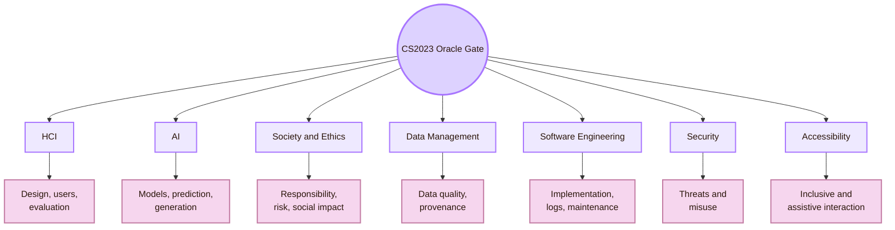

| CS2023 area | Human-AI connection |
|---|---|
| HCI | Prompts, outputs, explanations, feedback, usability, trust, control |
| AI | Training data, inference, prediction, generation, ranking, adaptation |
| Society and Ethics | Fairness, privacy, transparency, accountability, professional responsibility |
| Data Management | Provenance, missing data, bias, evidence quality, data lifecycle |
| Software Engineering | Deployment, logging, monitoring, testing, versioning, rollback |
| Security | Prompt injection, unsafe tool use, adversarial input, data leakage |
| Accessibility | Assistive AI, accessible AI interfaces, inclusive outputs, disabled-user evidence |

## Local UVT layer

The local layer is the **UVT Faculty of Informatics**. The strongest local connection is not a claim that UVT has a dedicated Human-AI Interaction lab. The stronger and safer claim is this:

> UVT has AI, ML, software systems, recommender, e-health, XAI-related, workflow, and Computer Science routes that can support Human-AI Interaction questions.

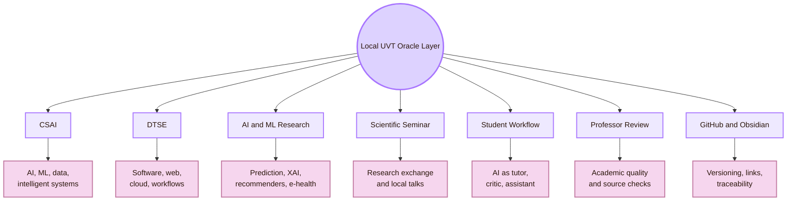

| Local UVT route | Why it matters for Human-AI Interaction |
|---|---|
| CSAI | Gives the local AI and ML foundation for model behaviour, prediction, data, intelligent systems, and AI education |
| DTSE | Gives the local software layer: workflows, web systems, distributed systems, cloud, reliability, and maintainability |
| AI and ML research routes | Connect to prediction, recommender systems, explainability, medical AI, and data-driven systems |
| Scientific Seminar | Gives a route for local research exchange, including XAI-related academic discussion when available |
| Student workflow | Makes Human-AI Interaction concrete: the student uses AI to draft, critique, organise, verify, and learn |
| Professor review | Forces the AI-assisted work to remain academically inspectable |
| GitHub and Obsidian | Provide version history, file traceability, source anchors, and visible revision choices |

## Romanian layer

The Romanian layer prevents the page from becoming only a global literature map. It connects the Oracle Engine to national HCI, accessibility, assistive technology, Romanian-language interaction, and generative AI work.

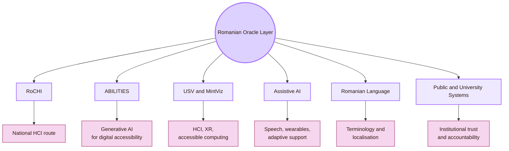

| Romanian route | Use in this room |
|---|---|
| RoCHI | National HCI grounding and Romanian HCI proceedings route |
| A(I)BILITIES | Romanian route for generative AI and digital accessibility |
| Radu-Daniel Vatavu / USV | HCI, XR, ambient intelligence, accessible computing, and interaction research route |
| Ovidiu-Andrei Schipor | Assistive technology, speech therapy systems, wearable or supportive interaction route |
| Romanian language | AI explanations, translation quality, local terminology, and source comprehension |
| Public and university systems | Institutional trust, accessibility, accountability, and AI use in public contexts |

## HCI bridge

Human-AI Interaction remains a branch of HCI because the AI reaches people through an interface. The design must shape what users can ask, see, check, edit, reject, and learn.

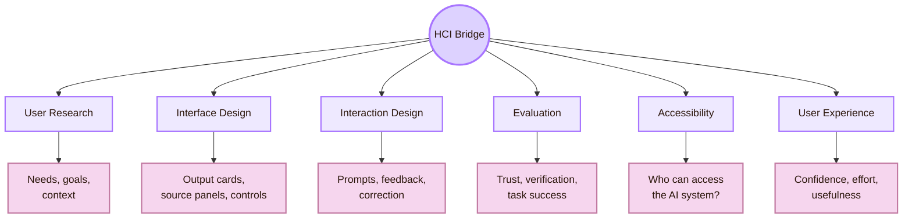

| HCI concept | Human-AI version |
|---|---|
| Affordance | What does the AI invite the user to do? |
| Feedback | Does the user know what the AI did and what changed? |
| Mental model | What does the user believe the AI can do? |
| Error recovery | Can the user correct, reject, undo, or report a wrong output? |
| Usability testing | Can users complete tasks while trusting the system appropriately? |
| Accessibility | Can different users access both the AI interface and AI-generated outputs? |
| User experience | Does AI reduce effort, or does it create anxiety, dependence, or confusion? |

## AI bridge

AI gives the system its behaviour. The interface must represent the type of AI involved because a recommender, a classifier, a generator, and an agent create different risks.

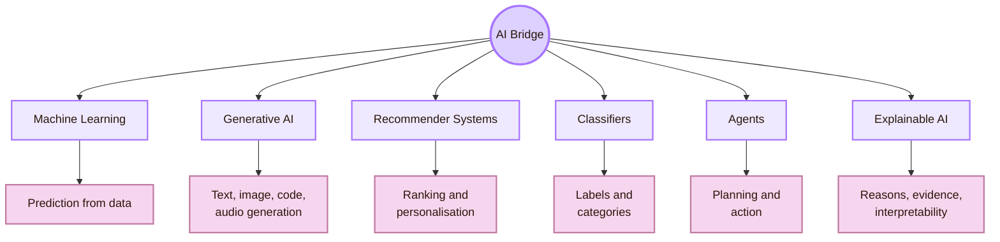

| AI type | Interaction problem | Interface requirement |
|---|---|---|
| Machine learning predictor | Users need to understand probability, limits, and uncertainty | Show confidence carefully, explain input factors, support review |
| Generative AI | Users must verify fluent outputs | Add source routes, claim labels, edit controls, and uncertainty prompts |
| Recommender system | Users need to know why something was ranked | Show reason codes, alternatives, and control over preferences |
| Classifier | Users need to understand label uncertainty | Show ambiguity, allow correction, explain label meaning |
| Agent | Users need permission, preview, undo, and logs | Require confirmation before high-impact actions |
| Explainable AI | Explanations must support decisions | Design explanations around user tasks, not technical display alone |

## Cognitive science and psychology bridge

These fields explain why AI can mislead people even when the output sounds well written. Human-AI systems must be designed for actual human judgement, not ideal judgement.

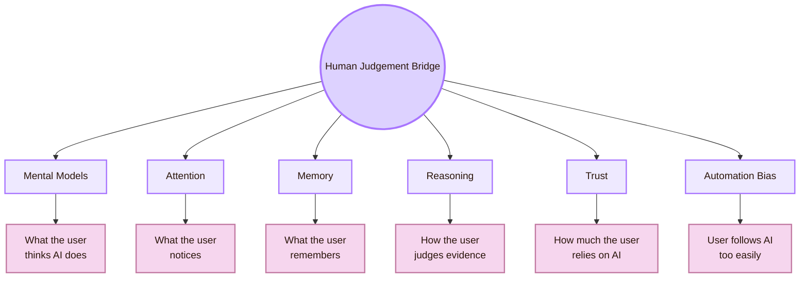

| Human factor | AI risk | Design response |
|---|---|---|
| Fluency bias | Smooth answers feel true | Add source checks and unsupported-claim labels |
| Cognitive overload | Too many outputs confuse the user | Group information and prioritise what needs review |
| Anchoring | The first AI answer dominates thinking | Show alternatives and encourage comparison |
| Automation bias | User accepts AI too quickly | Add verification prompts before high-impact use |
| Memory burden | User forgets assumptions or constraints | Show prompt history, assumptions, and version notes |
| Weak metacognition | User thinks they understand because the AI explained it | Ask the user to explain the idea in their own words |

## Data science bridge

Human-AI systems are shaped by data. The user usually sees the answer, not the dataset, labels, assumptions, or gaps behind it.

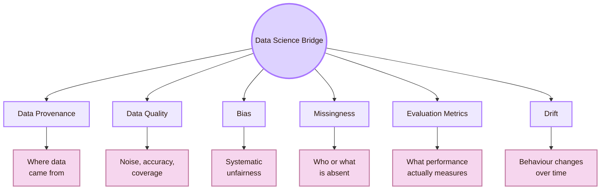

| Data issue | Human-AI consequence |
|---|---|
| Weak provenance | The user cannot judge where knowledge came from |
| Biased data | Output may misrepresent people, groups, or contexts |
| Missing local data | UVT, Romania, Romanian language, and local institutions may disappear from the output |
| Weak labels | Predictions or classifications become unreliable |
| Metric mismatch | Accuracy may improve while usability, fairness, or accessibility worsens |
| Data drift | Reliability changes after the system is deployed |

## Software engineering bridge

AI systems need maintenance. Software engineering makes AI interaction traceable, testable, and repairable.

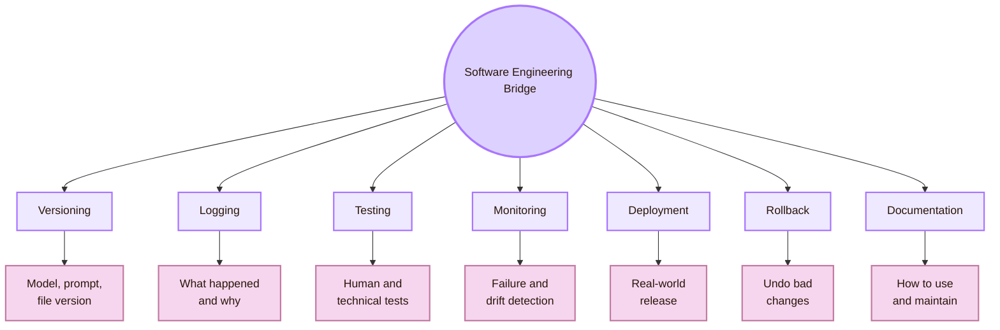

| Practice | Use in Cognishire |
|---|---|
| Version control | Track AI-assisted page changes in GitHub |
| Prompt versioning | Preserve the instruction that shaped a major section |
| Logs | Record source checks, fact checks, and repairs |
| Testing | Evaluate trust, clarity, source support, accessibility, and usability |
| Monitoring | Watch for stale facts, broken links, unsupported claims, and repeated errors |
| Rollback | Undo bad AI edits, broken Mermaid, or broken CSS |
| Documentation | Explain how AI was used responsibly and what remains human-authored or human-verified |

## Ethics, law, and policy bridge

Human-AI Interaction becomes high-stakes when AI affects rights, opportunities, safety, privacy, access, or institutional judgement.

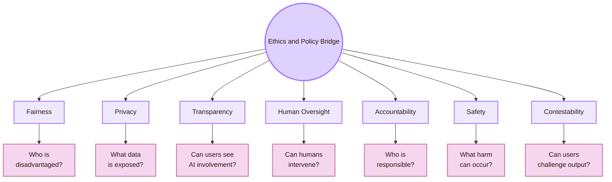

| Route | Design implication |
|---|---|
| NIST AI RMF | Identify, measure, manage, and govern AI risk as a process |
| EU AI Act | Treat human oversight as a real design and governance requirement in high-risk contexts |
| FAccT and AIES | Study fairness, accountability, ethics, and social impact |
| AI Incident Database | Learn from real AI failures and near-failures |
| Responsible AI | Make risk, limits, review, and responsibility visible |
| Contestability | Give users a route to challenge or correct AI output |

## Accessibility bridge

The Oracle Engine connects directly to the [[../04_Accessibility_and_Accountability/Overview|Inclusive Gate]]. AI can support access, but it can also create new barriers.

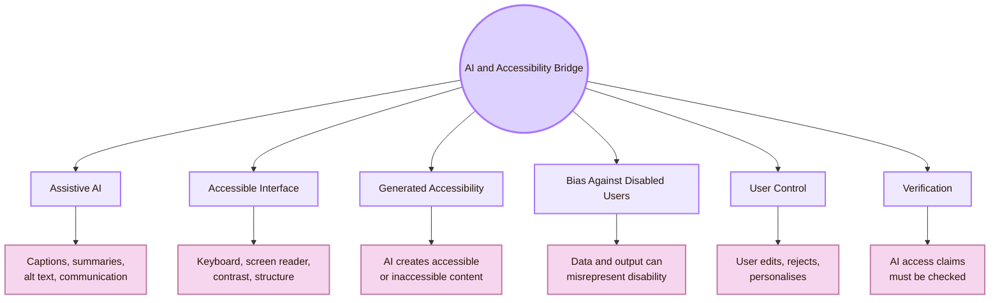

| Accessibility issue | Human-AI connection |
|---|---|
| AI-generated alt text | Useful only if accurate, editable, and checked against the image |
| AI summaries | Helpful only if important meaning is preserved |
| Speech recognition | Must handle accents, noise, speech differences, and language variation |
| Personalisation | Must adapt without stereotyping the user |
| AI interface | Must itself be keyboard-accessible, screen-reader friendly, readable, and understandable |
| Disabled-user involvement | AI for access should be tested with people who have relevant access needs |

## Education bridge

This project is a learning project. The education bridge is therefore central, not optional. AI should support learning, not hide weak understanding.

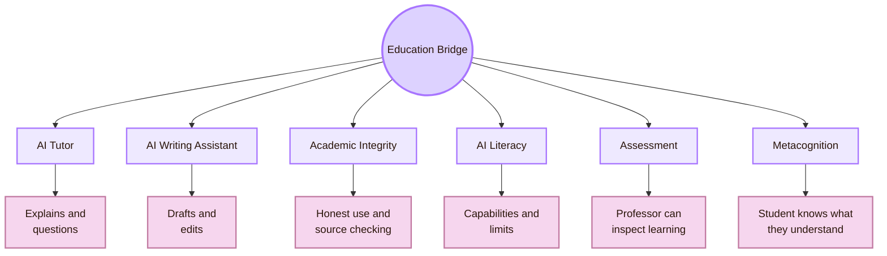

| Education problem | Oracle response |
|---|---|
| Student copies AI output | Add source verification and comprehension checks |
| AI hides weak understanding | Ask the student to explain the idea in their own words |
| Professor cannot inspect process | Keep sources, claim status, and version history visible |
| AI gives generic content | Require UVT and Romanian grounding where relevant |
| AI replaces practice | Use AI as tutor, critic, and editor, not as final author |
| Academic integrity risk | Make AI-assisted work transparent where required by the course |

## Security bridge

Natural language can become a control channel. This makes Human-AI Interaction partly a security problem.

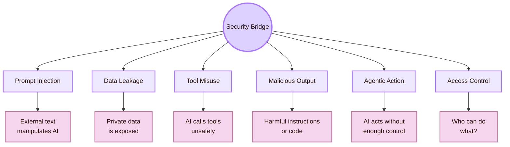

| Security issue | Design implication |
|---|---|
| Prompt injection | Treat external text, webpages, documents, and tool outputs as untrusted until inspected |
| Data leakage | Avoid giving unnecessary private context to AI systems |
| Tool misuse | Require preview and confirmation before tool actions |
| Malicious output | Check generated commands, code, and instructions before use |
| Agentic action | Add permissions, logs, undo, and diffs |
| Access control | Limit what AI can read, edit, delete, publish, or send |

## Visualisation bridge

Visualisation helps users inspect AI behaviour. It should support judgement, not decoration.

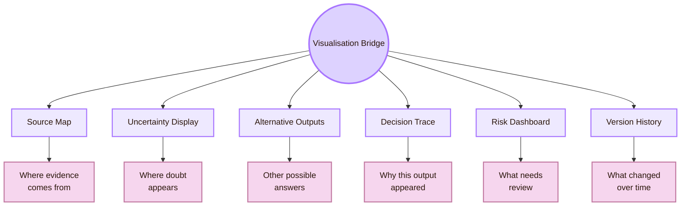

| Visualisation       | Use                                                 | Risk                                                 |
| ------------------- | --------------------------------------------------- | ---------------------------------------------------- |
| Source map          | Shows where evidence comes from                     | Can imply support that sources do not really provide |
| Uncertainty display | Shows where doubt, incompleteness, or risk appears  | False precision can mislead users                    |
| Alternative outputs | Reduces anchoring on the first answer               | Too many alternatives can overload users             |
| Decision trace      | Shows how input, model, and interface shaped output | Trace may be incomplete or too technical             |
| Risk dashboard      | Highlights unsupported or high-risk claims          | Users may ignore it if it becomes routine            |
| Version history     | Shows what changed after review                     | Needs discipline to maintain                         |

## Cognishire connection board

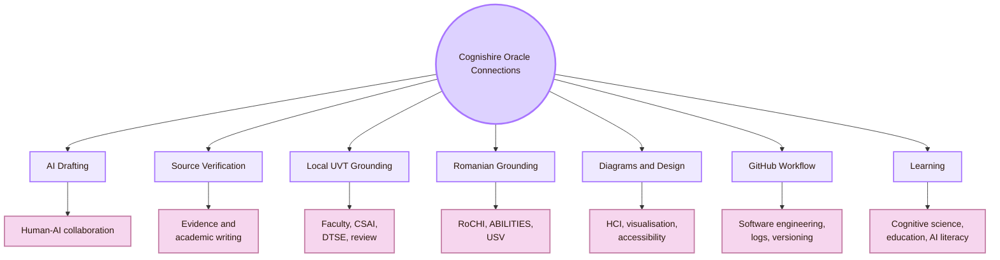

| Cognishire element | Connected field | Practical rule |
|---|---|---|
| AI-generated pages | Human-AI collaboration, academic writing, source verification | The student must verify and understand the final page |
| Prompt templates | HCI design, cognitive scaffolding, AI literacy | Prompts should request sources, limits, and simple academic language |
| Source anchors | Data provenance, evidence design, accountability | Every important claim should have a credible route |
| Mermaid diagrams | Visualisation, accessibility, cognitive load | Diagrams should clarify one idea and have a text/table route |
| GitHub commits | Software engineering, traceability, responsibility | Commit messages should show what changed and why |
| Local UVT sections | Institutional context and local AI research | Use cautious wording and official sources |
| Romania sections | National HCI, AI accessibility, language context | Include Romanian grounding without inflating it |
| Professor review | Evaluation, accountability, academic integrity | Make AI use and source grounding inspectable |
| Student learning | Education, metacognition, tutor design | AI should help the student explain, not just produce text |

## Connection-to-design translation

| Connected field | Interface pattern for the Oracle Engine |
|---|---|
| HCI | Prompt helper, output card, source panel, correction button, feedback path |
| AI | Capability statement, model limitation note, uncertainty label, failure examples |
| Cognitive science | Short outputs, explanation prompts, comparison views, assumption reminders |
| Psychology | Trust calibration cues, verification reminders, anti-automation-bias friction |
| Data science | Source provenance, data-limit labels, missing-context warnings |
| Software engineering | Version history, prompt log, model/version note, rollback path |
| Ethics and law | Risk category, human review requirement, accountability note, contestability route |
| Accessibility | Keyboard support, screen reader structure, editable generated content, plain-language output |
| Education | Comprehension check, reflection prompt, source-check task, AI-use disclosure |
| Security | Untrusted-content warning, tool confirmation, permissions, audit log |
| Visualisation | Evidence map, uncertainty display, alternatives, decision trace |

## Study route

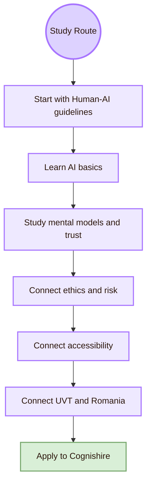

| Step | Study focus | Output for this vault |
|---|---|---|
| 1 | Microsoft Human-AI guidelines and HAX Toolkit | AI interface checklist |
| 2 | Google PAIR Guidebook | Human-centered AI design notes |
| 3 | AI basics: models, data, prediction, generation, uncertainty | Capability and limitation table |
| 4 | Mental models, trust calibration, automation bias | Trust and verification tasks |
| 5 | NIST AI RMF and EU AI Act human oversight | Risk and oversight table |
| 6 | ASSETS, Web4All, A(I)BILITIES, inclusive AI | AI accessibility notes |
| 7 | UVT CSAI, DTSE, TRAIN, RoCHI, USV routes | Local and Romanian grounding |
| 8 | Cognishire prompt scaffold, source panel, issue log | Practical design repair |

## What this page should not claim

| Do not claim | Safer wording |
|---|---|
| “Human-AI Interaction is only AI.” | “Human-AI Interaction studies how AI behaviour is interpreted and controlled through human use.” |
| “A good model guarantees a good user experience.” | “Model quality is necessary, but interface design, trust, verification, and control also matter.” |
| “UVT has a Human-AI Interaction lab.” | “UVT has AI, ML, software, workflow, recommender, e-health, and XAI-related routes that can support Human-AI Interaction questions.” |
| “Romania has a complete Human-AI field map here.” | “This page gives selected Romanian routes relevant to HCI, AI accessibility, and Human-AI questions.” |
| “AI explanations solve trust.” | “Explanations help only when they improve user judgement and are tested with users.” |
| “AI improves accessibility automatically.” | “AI can support access, but generated accessibility must be verified and user-controlled.” |
| “Security is separate from UX.” | “In AI systems, natural-language interaction can create security risks that affect user trust and safety.” |

## Synthesis

Connections in **Human-AI Interaction** show that the Oracle Engine is a sociotechnical system. It connects HCI, AI, cognitive science, psychology, data science, software engineering, ethics, law, accessibility, education, security, and visualisation.

Locally, the Oracle Engine connects to UVT’s Faculty of Informatics, CSAI, DTSE, AI and ML research, student learning, professor review, GitHub, Obsidian, and source verification. These are relevant local routes, not proof of a dedicated Human-AI Interaction lab.

Nationally, the Oracle Engine connects to RoCHI, A(I)BILITIES, USV/MintViz, Radu-Daniel Vatavu, Ovidiu-Andrei Schipor, Romanian-language interaction, and Romanian accessibility or AI contexts.

Globally, it connects to CS2023, Microsoft Human-AI guidelines, Google PAIR, Stanford HAI, NIST AI RMF, the EU AI Act, CHI, IUI, FAccT, ASSETS, CSCW, and TiiS.

The central question is:

> Which fields must connect so that AI output becomes understandable, controllable, verifiable, fair, accessible, and useful for real humans?

This page connects to [[Activities/Theory]] because each bridge explains a concept behind Human-AI Interaction. It connects to [[Activities/Design]] because each bridge becomes an interface requirement. It connects to [[Activities/Experiment]] because each bridge needs evidence. It connects to [[Overview|Overview]] because the Oracle Engine coordinates the Human-AI room.

## Academic anchors

| Route | Source |
|---|---|
| CS2023 HCI basis | [CS2023 HCI Version Gamma](https://csed.acm.org/wp-content/uploads/2023/09/HCI-Version-Gamma.pdf) |
| CS2023 Artificial Intelligence basis | [CS2023 AI SIGCSE 2022 version](https://csed.acm.org/knowledge-areas-intelligent-systems-ai-sigcse-2022-version/) |
| CS2023 Knowledge Areas | [CS2023 Knowledge Areas](https://csed.acm.org/knowledge-areas/) |
| Microsoft Human-AI guidelines | [Guidelines for Human-AI Interaction](https://www.microsoft.com/en-us/research/project/guidelines-for-human-ai-interaction/) |
| Microsoft HAX Toolkit | [HAX Toolkit AI Guidelines](https://www.microsoft.com/en-us/haxtoolkit/ai-guidelines/) |
| Google PAIR Guidebook | [People + AI Guidebook](https://pair.withgoogle.com/guidebook/) |
| Google PAIR | [People + AI Research](https://pair.withgoogle.com/) |
| Stanford HAI | [Stanford HAI](https://hai.stanford.edu/) |
| NIST AI RMF | [NIST AI Risk Management Framework](https://www.nist.gov/itl/ai-risk-management-framework) |
| NIST AI RMF Core | [Govern, Map, Measure, Manage](https://airc.nist.gov/airmf-resources/airmf/5-sec-core/) |
| EU AI Act | [European Commission AI Act](https://digital-strategy.ec.europa.eu/en/policies/regulatory-framework-ai) |
| EU AI Act human oversight | [EU AI Act Article 14](https://artificialintelligenceact.eu/article/14/) |
| AI Incident Database | [AI Incident Database](https://incidentdatabase.ai/) |
| ACM CHI | [ACM CHI](https://dl.acm.org/conference/chi) |
| ACM IUI | [ACM Intelligent User Interfaces](https://iui.acm.org/) |
| ACM FAccT | [ACM FAccT](https://facctconference.org/) |
| ACM ASSETS | [ASSETS Conference](https://www.sigaccess.org/assets/) |
| ACM TiiS | [ACM Transactions on Interactive Intelligent Systems](https://dl.acm.org/journal/tiis) |
| ACM CSCW | [ACM CSCW](https://cscw.acm.org/) |
| ACM AIES | [AAAI/ACM AIES](https://www.aies-conference.com/) |
| UVT Faculty of Informatics | [Faculty of Informatics UVT](https://info.uvt.ro/en/) |
| UVT Faculty departments | [Faculty of Informatics Departments](https://info.uvt.ro/en/departamente/) |
| UVT CSAI Department | [Department of Computational Sciences and Artificial Intelligence](https://info.uvt.ro/en/departamente/csai/) |
| UVT DTSE Department | [Department of Digital Technologies and Software Engineering](https://info.uvt.ro/en/departamente/dtse/) |
| UVT AI and ML research route | [Artificial Intelligence and Machine Learning](https://research.info.uvt.ro/artificial-intelligence-and-machine-learning/) |
| UVT research routes | [Research Center in Computer Science: Researchers](https://research.info.uvt.ro/researchers/) |
| RoCHI proceedings | [Romanian HCI proceedings](https://rochi.utcluj.ro/proceedings/en/) |
| A(I)BILITIES project | [A(I)BILITIES](https://aibilities.ro/en/about/) |
| ASSIST Software A(I)BILITIES | [A(I)BILITIES: Generative AI for Digital Accessibility](https://assist-software.net/project/aibilities) |
| MintViz A(I)BILITIES route | [MintViz A(I)BILITIES](https://mintviz.usv.ro/projects/A%28I%29BILITIES/index.php) |
| Radu-Daniel Vatavu | [Radu-Daniel Vatavu homepage](https://raduvatavu.usv.ro/) |
| Ovidiu-Andrei Schipor | [Ovidiu-Andrei Schipor projects](https://www.eed.usv.ro/~schipor/projects.php) |

^connections-human-ai-interaction-end
