![[cybercity.gif|1000]]
# Important People

Back to [[Overview|The Oracle Engine]].

> [!abstract] Oracle People Roadmap
> This page maps **real people, labs, and institutional routes** that can help a student study **Human-AI Interaction**. It starts with the local UVT context, then moves to Romanian HCI and AI-accessibility routes, then to global researchers and research teams working on human-centered AI, Human-AI guidelines, explainable AI, Human-AI collaboration, responsible AI, AI accessibility, and AI literacy.

The fantasy name is **Oracle People Roadmap**.  
The academic topic is **Human-AI Interaction**.  
The CS2023 bridge is **HCI + Artificial Intelligence + Society, Ethics, and Professionalism**.  
The real-life meaning is **knowing whose work can help explain how people should understand, verify, control, trust, and remain responsible when using AI systems**.

## People Map

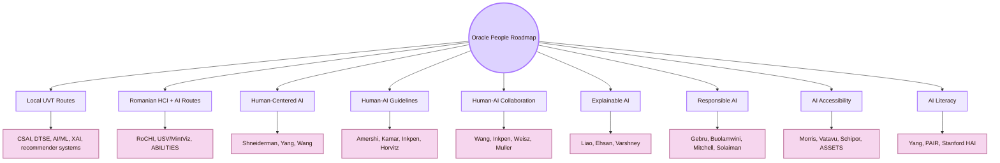

| Route | What it teaches | Start with |
|---|---|---|
| Local UVT routes | AI, ML, XAI, recommender systems, e-health, software workflows, and reliability inside the local university context | CSAI, DTSE, UVT AI/ML research routes |
| Romanian HCI + AI routes | National HCI, accessible computing, AI accessibility, assistive technology, and Romanian-language context | RoCHI, Radu-Daniel Vatavu, Ovidiu-Andrei Schipor, A(I)BILITIES |
| Human-centered AI | Human agency, human control, reliable automation, and useful AI support | Ben Shneiderman, Qian Yang, Dakuo Wang |
| Human-AI guidelines | Practical interaction patterns for AI systems, including expectation setting, feedback, failure, and adaptation | Saleema Amershi, Ece Kamar, Kori Inkpen, Eric Horvitz |
| Human-AI collaboration | How AI enters workplaces, writing, data science, design, healthcare, and organisations | Dakuo Wang, Kori Inkpen, Justin Weisz, Michael Muller |
| Explainable AI | Explanations, transparency, uncertainty, trust, reliance, control, and oversight | Q. Vera Liao, Upol Ehsan, Kush Varshney |
| Responsible AI | Bias, documentation, audit, dataset harm, policy, and accountability | Timnit Gebru, Joy Buolamwini, Margaret Mitchell, Irene Solaiman |
| AI accessibility | AI systems that support or harm disabled users and assistive technologies | Meredith Ringel Morris, Radu-Daniel Vatavu, Ovidiu-Andrei Schipor, ASSETS community |
| AI literacy | How people learn with AI without copying blindly or overtrusting outputs | Qian Yang, Google PAIR, Stanford HAI routes |

## Local Route First: UVT

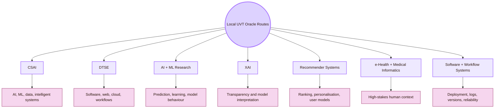

| UVT route | Public basis | Human-AI connection |
|---|---|---|
| Department of Computational Sciences and Artificial Intelligence | UVT Faculty of Informatics lists CSAI publicly | Local basis for AI, ML, intelligent systems, prediction, data, and model behaviour |
| Department of Digital Technologies and Software Engineering | UVT Faculty of Informatics lists DTSE publicly | Local basis for AI as implemented software: workflows, web systems, cloud, versioning, and reliability |
| AI and Machine Learning research route | UVT Research Center lists AI/ML researchers and topics | Useful for prediction, uncertainty, recommender systems, e-health, medical AI, and XAI |
| TRAIN / XAION route | Public pages describe TRAIN and XAION in connection with explainable AI competitions | Useful local route for XAI, AI evaluation, and public AI research infrastructure |
| Scientific Seminar | UVT seminar pages can contain talks relevant to AI and XAI | Useful for local research exchange, but not proof of a Human-AI group |
| Student project workflow | Cognishire is built with AI assistance, Obsidian, GitHub, Markdown, CSS, and sources | A real local Human-AI case: AI helps draft, but the student must verify and understand |

## Local UVT People and Routes

Use this section as a local map. It does not label the people below as Human-AI Interaction specialists. It identifies **local CS routes** that can support Human-AI questions.

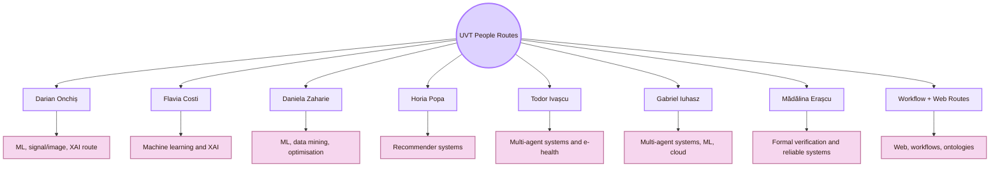

|---|---|---|
| Horia Popa | Use for recommender systems, personalisation, ranking, and user-model questions | Do not imply recommender systems automatically equal Human-AI Interaction |
| Gabriel Iuhasz | Use for multi-agent systems, machine learning, cloud computing, and intelligent system behaviour | Do not treat all multi-agent work as user-facing AI |
| Mădălina Erașcu | Use for formal verification, automated theorem proving, and reliability around software/AI systems | Do not describe formal verification as explainable AI |

## Romanian Route: HCI and AI in Romania

The Romanian layer gives the Oracle Engine national grounding. The strongest Romanian route here is **HCI + accessible computing + assistive technology + generative AI for accessibility**, especially through USV/MintViz, RoCHI, and A(I)BILITIES.

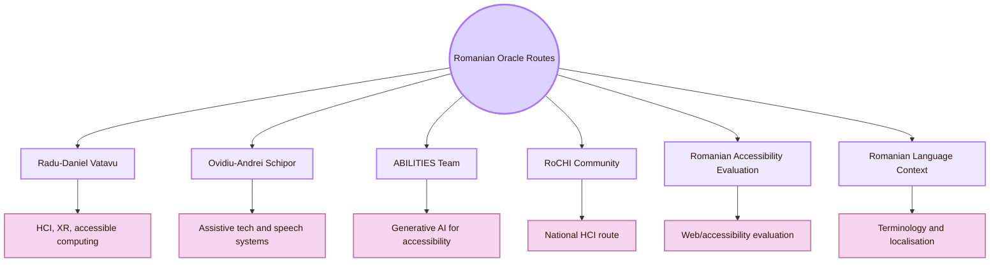

### Radu-Daniel Vatavu

| Field | Details |
|---|---|
| Institution | “Ștefan cel Mare” University of Suceava |
| Careful route | HCI, interactive technologies, gesture input, XR, accessible computing, ambient intelligence |
| Why he matters here | Strong Romania-based route for HCI, intelligent interaction, accessibility, and multimodal interfaces |
| How to study this route | Start from his homepage and project pages. Look for work on gesture interaction, accessible computing, XR, and A(I)BILITIES-related research |
| Good project question | “How do intelligent or embodied interfaces change what users need to understand, control, and access?” |
| Source route | [Radu-Daniel Vatavu homepage](https://raduvatavu.usv.ro/) |

### Ovidiu-Andrei Schipor

| Field | Details |
|---|---|
| Institution | “Ștefan cel Mare” University of Suceava |
| Careful route | HCI, assistive technologies, computer-based speech therapy, wearables, smart environments |
| Why he matters here | Strong Romania-based route for assistive systems and accessible interaction |
| How to study this route | Read work on computer-assisted speech therapy, wearable assistive technologies, smart environments, and accessible interaction |
| Good project question | “How can AI support therapy or accessibility while preserving user agency and evidence?” |
| Source route | [Ovidiu-Andrei Schipor CV](https://fiesc.usv.ro/wp-content/uploads/sites/17/2022/09/CV_en_2022.pdf) |

### A(I)BILITIES Team

| Field | Details |
|---|---|
| Institutions | ASSIST Software + “Ștefan cel Mare” University of Suceava routes |
| Careful route | Generative AI for personalised digital accessibility solutions |
| Why it matters here | It gives a current Romanian example connecting generative AI, adaptive interfaces, accessibility, and users with disabilities |
| How to study this route | Compare its aims with Human-AI principles: user control, adaptation, validation, trust, evidence, and accessibility evaluation |
| Good project question | “How can generative AI adapt digital interfaces while keeping the user informed and in control?” |
| Source route | [A(I)BILITIES](https://aibilities.ro/en/about/) |

### RoCHI Community

| Field | Details |
|---|---|
| Route | Romanian Conference on Human-Computer Interaction |
| Careful route | National HCI publication and community route |
| Why it matters here | It helps ground the Oracle Engine in Romanian HCI instead of only global AI sources |
| How to study this route | Search RoCHI proceedings for intelligent interfaces, accessibility, usability, interaction design, and AI-related work |
| Good project question | “Which Romanian HCI work can make this page locally grounded?” |
| Source route | [RoCHI proceedings](https://rochi.utcluj.ro/proceedings/en/) |

## Global Route I: Human-Centered AI Foundations

This route gives the main design idea: AI should support human agency, judgement, creativity, and responsibility. It should not make human oversight symbolic.

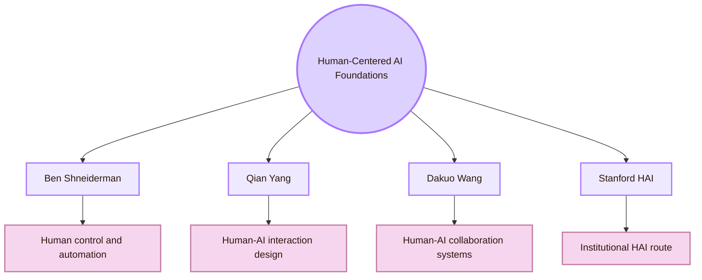

| Person / route | Careful current-role wording | Why this route matters |
|---|---|---|
| Ben Shneiderman | Retired Emeritus Professor at the University of Maryland, founding director of the Human-Computer Interaction Lab | Human-centered AI, human control, high automation with high human control, reliable/safe/trustworthy systems |
| Qian Yang | Assistant Professor of Information Science at Cornell | Human-AI interaction design, AI literacy, AI applications connected to user needs and societal goals |
| Dakuo Wang | Associate Professor at Northeastern University, jointly appointed in Khoury College and CAMD | Human-AI collaboration in organisations, healthcare, data work, and knowledge work |
| Stanford HAI | Institutional route, not a single person route | Human-centered AI as a broad research and education area |

## Global Route II: Human-AI Guidelines and AI Product Design

This route is useful when you need concrete design patterns for AI behaviour: expectation setting, user feedback, uncertainty, failure, correction, and adaptation over time.

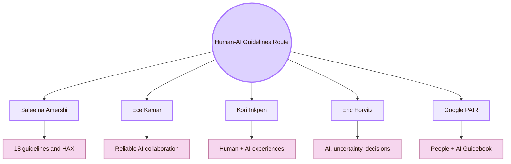

| Person / route | Careful current-role wording | Use for |
|---|---|---|
| Saleema Amershi | Partner Research Manager at Microsoft Research AI Frontiers | Human-AI guidelines, HAX Toolkit, agentic platforms, human-AI collaboration |
| Ece Kamar | Microsoft Research route | Reliable AI systems, open-world AI, responsible AI, human-AI collaboration |
| Kori Inkpen | Partner Research Manager at Microsoft Research | Future human + AI experiences, HCI, CSCW, meaningful AI-assisted interaction |
| Eric Horvitz | Microsoft Research route | AI, uncertainty, decision-making, responsible AI systems, long-running Human-AI research |
| Google PAIR | Team and toolkit route | People + AI Guidebook, product-facing human-centered AI design |

## Global Route III: Explainable AI and Transparency

This route helps a student move beyond “the AI explained it” toward the harder question: did the explanation help the user judge the output correctly?

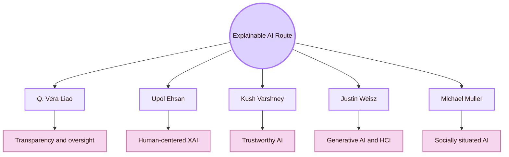

| Person | Use this route for |
|---|---|
| Q. Vera Liao | Human-AI interaction, responsible AI, explainable AI, uncertainty communication, trust, reliance, control, and oversight |
| Upol Ehsan | Human-centered explainable AI, social transparency, sociotechnical explanations, responsible AI governance |
| Kush Varshney | Trustworthy AI, responsible AI, explainability, uncertainty, AI for social good |
| Justin Weisz | Human-centered AI, generative AI design, Human-AI collaboration, work practices, source attribution and factuality patterns |
| Michael Muller | Participatory design, Human-AI collaboration, social transparency, co-creativity, socially situated AI |

## Global Route IV: Responsible AI and Accountability

This route connects Human-AI Interaction to bias, audit, documentation, dataset harm, power, release decisions, and policy.

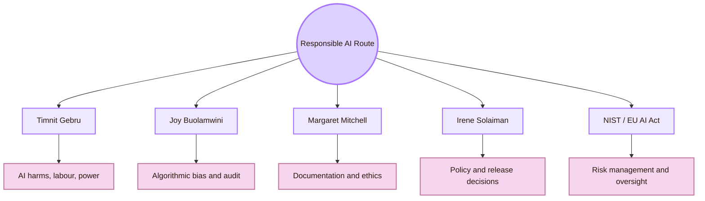

| Person / route                              | Use for                                                                                               |
| ------------------------------------------- | ----------------------------------------------------------------------------------------------------- |
| Timnit Gebru / DAIR                         | AI harms, dataset documentation, community-rooted AI research, power, labour, accountability          |
| Joy Buolamwini / Algorithmic Justice League | Algorithmic bias, facial analysis audits, public accountability, algorithmic harm                     |
| Margaret Mitchell                           | Responsible AI development, data documentation, model cards, assistive technology, ethics-informed AI |
| Irene Solaiman                              | AI policy, openness, release strategy, global policy, safety and governance                           |
| NIST AI RMF / EU AI Act route               | Risk management, human oversight, governance, documented responsibility                               |

## Global Route V: AI and Accessibility

This route connects the Oracle Engine to the [[../04_Accessibility_and_Accountability/Overview|Inclusive Gate]]. AI can support access, but it can also automate barriers.

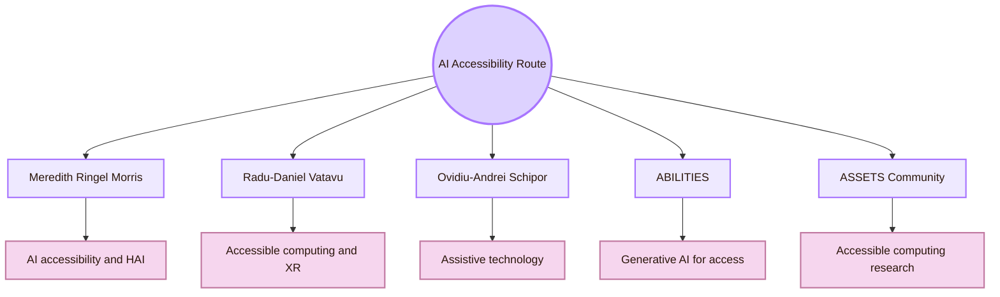

| Person / route         | Use for                                                                                                                |
| ---------------------- | ---------------------------------------------------------------------------------------------------------------------- |
| Meredith Ringel Morris | Human-AI interaction, human-centered AI, AI accessibility, social computing, responsible AI, disabled-user experiences |
| Radu-Daniel Vatavu     | Accessible computing, XR, gesture input, intelligent interaction, Romanian HCI                                         |
| Ovidiu-Andrei Schipor  | Assistive technology, speech therapy systems, wearables, smart environments                                            |
| A(I)BILITIES           | Romanian route for generative AI and personalised accessibility                                                        |
| ASSETS community       | Global research community for accessible computing and assistive technology                                            |
|                        |                                                                                                                        |

## Study Route by Question

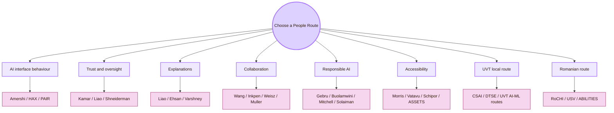

| If your question is... | Read first | Small Cognishire test |
|---|---|---|
| How should an AI interface behave? | Amershi, Microsoft HAX, Google PAIR | Check whether the page states AI capability, limits, uncertainty, and correction options |
| What kind of explanation helps users? | Liao, Ehsan, Varshney | Compare no explanation, source explanation, and uncertainty explanation |
| How do people collaborate with AI? | Wang, Inkpen, Weisz, Muller | Log where AI drafts, where the student verifies, and where the student edits |
| How do we handle AI harm and bias? | Gebru, Buolamwini, Mitchell, Solaiman | Audit whose data, language, labour, or access needs are missing |
| How can AI help accessibility? | Morris, Vatavu, Schipor, A(I)BILITIES | Test AI-generated alt text, summaries, and adaptive interface suggestions |
| How do we ground this nationally? | RoCHI, USV/MintViz, A(I)BILITIES | Add Romanian routes instead of relying only on US/UK sources |

## Contact Protocol

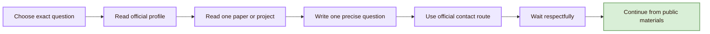

| Email part      | What to include                                                       |
| --------------- | --------------------------------------------------------------------- |
| Subject         | “Question about Human-AI Interaction in a CS2023 HCI student project” |
| Opening         | Who you are and what you are building                                 |
| Specific fit    | One sentence connecting your question to their published work         |
| Evidence        | One paper, lab page, project page, or guideline you read              |
| Project context | The Cognishire HCI map, Obsidian/GitHub, CS2023, Human-AI room        |
| Ask             | One narrow question about reading route, method, or concept           |
| Close           | Thank them. Do not pressure. Do not mass email.                       |
|                 |                                                                       |

### Minimal email template

## Cognishire Application

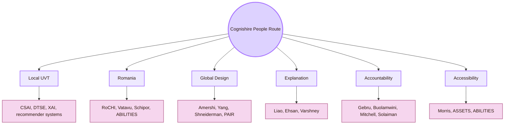

| Cognishire problem                                        | Best people route                                            |
| --------------------------------------------------------- | ------------------------------------------------------------ |
| AI generated a page that sounds correct but lacks sources | Amershi, PAIR, Liao, source-verification pattern             |
| Student may copy without understanding                    | Yang, AI literacy route, education route                     |
| AI output needs trust calibration                         | Kamar, Inkpen, Shneiderman, Wang                             |
| AI explanation is vague                                   | Liao, Ehsan, Varshney                                        |
| AI role is unclear                                        | Amershi, HAX Toolkit, PAIR Guidebook                         |
| Local UVT relevance is weak                               | CSAI, DTSE, UVT AI/ML research routes                        |
| Romania layer is missing                                  | RoCHI, Vatavu, Schipor, A(I)BILITIES                         |
| AI accessibility is assumed but not tested                | Morris, Vatavu, Schipor, ASSETS, A(I)BILITIES                |
| Ethical risk is thin                                      | Gebru, Buolamwini, Mitchell, Solaiman, NIST/EU AI Act routes |
| Agentic AI may edit files later                           | Amershi, Kamar, software engineering and oversight routes    |

## Academic Anchors

| Route | Source |
|---|---|
| CS2023 HCI basis | [CS2023 HCI Version Gamma](https://csed.acm.org/wp-content/uploads/2023/09/HCI-Version-Gamma.pdf) |
| CS2023 AI basis | [CS2023 AI SIGCSE 2022 version](https://csed.acm.org/knowledge-areas-intelligent-systems-ai-sigcse-2022-version/) |
| UVT Faculty of Informatics | [Faculty of Informatics UVT](https://info.uvt.ro/en/) |
| UVT departments | [Faculty of Informatics Departments](https://info.uvt.ro/en/departamente/) |
| UVT CSAI Department | [Department of Computational Sciences and Artificial Intelligence](https://info.uvt.ro/en/departamente/csai/) |
| UVT DTSE Department | [Department of Digital Technologies and Software Engineering](https://info.uvt.ro/en/departamente/dtse/) |
| UVT AI and ML research route | [Artificial Intelligence and Machine Learning](https://research.info.uvt.ro/artificial-intelligence-and-machine-learning/) |
| UVT researchers | [Research Center in Computer Science: Researchers](https://research.info.uvt.ro/researchers/) |
| TRAIN | [Timisoara Research in Artificial Intelligence Network](https://train.uvt.ro/) |
| Darian Onchiș AI Research Lab | [AI Research Lab](https://staff.fmi.uvt.ro/~darian.onchis/) |
| Flavia Costi | [UVT research profile](https://research.info.uvt.ro/researchers/flavia-costi/) |
| Horia Popa | [UVT research profile](https://research.info.uvt.ro/researchers/horia-popa/) |
| Todor Ivașcu | [UVT-related team route](https://samexperience.eu/team/todor-ivascu/) |
| Radu-Daniel Vatavu | [Radu-Daniel Vatavu homepage](https://raduvatavu.usv.ro/) |
| Ovidiu-Andrei Schipor | [Ovidiu-Andrei Schipor CV](https://fiesc.usv.ro/wp-content/uploads/sites/17/2022/09/CV_en_2022.pdf) |
| A(I)BILITIES | [A(I)BILITIES project](https://aibilities.ro/en/about/) |
| MintViz A(I)BILITIES route | [MintViz A(I)BILITIES](https://mintviz.usv.ro/projects/A%28I%29BILITIES/index.php) |
| RoCHI proceedings | [Romanian HCI proceedings](https://rochi.utcluj.ro/proceedings/en/) |
| Ben Shneiderman | [University of Maryland profile](https://www.cs.umd.edu/users/ben/) |
| Ben Shneiderman Human-Centered AI | [Human-Centered AI paper](https://arxiv.org/abs/2002.04087) |
| Qian Yang | [Cornell profile](https://bowers.cornell.edu/people/qian-yang) |
| Qian Yang DesignAI Lab | [Human-AI Interaction Design @ Cornell](https://designai.cis.cornell.edu/) |
| Dakuo Wang | [Northeastern profile](https://www.khoury.northeastern.edu/people/dakuo-wang/) |
| Dakuo Wang personal route | [Dakuo Wang homepage](https://www.dakuowang.com/) |
| Saleema Amershi | [Microsoft Research profile](https://www.microsoft.com/en-us/research/people/samershi/) |
| Guidelines for Human-AI Interaction | [Microsoft Research publication](https://www.microsoft.com/en-us/research/publication/guidelines-for-human-ai-interaction/) |
| HAX Toolkit | [Microsoft HAX Toolkit](https://www.microsoft.com/en-us/haxtoolkit/ai-guidelines/) |
| Ece Kamar | [Microsoft Research profile](https://www.microsoft.com/en-us/research/people/eckamar/) |
| Kori Inkpen | [Microsoft Research profile](https://www.microsoft.com/en-us/research/people/kori/) |
| Google PAIR | [People + AI Research](https://pair.withgoogle.com/) |
| People + AI Guidebook | [Google PAIR Guidebook](https://pair.withgoogle.com/guidebook/) |
| Q. Vera Liao | [Q. Vera Liao homepage](https://qveraliao.com/) |
| Q. Vera Liao University profile | [University of Michigan EECS profile](https://eecs.engin.umich.edu/people/liao-qingzi/) |
| Human-Centered XAI | [Liao and Varshney paper](https://arxiv.org/abs/2110.10790) |
| Upol Ehsan HCXAI | [Human-centered Explainable AI](https://arxiv.org/abs/2002.01092) |
| Upol Ehsan route | [Northeastern article](https://www.khoury.northeastern.edu/inside-the-project-to-make-ai-explainable-for-all-and-why-it-matters/) |
| Kush Varshney | [IBM Research profile](https://research.ibm.com/people/kush-varshney) |
| IBM Human-Centered AI | [IBM Research topic page](https://research.ibm.com/topics/human-centered-ai) |
| Justin Weisz | [ACM profile](https://dl.acm.org/profile/81311482644) |
| Michael Muller | [ACM profile](https://dl.acm.org/profile/81332517372) |
| Meredith Ringel Morris | [Google Research profile](https://research.google/people/meredithringelmorris/) |
| Meredith Ringel Morris personal route | [Meredith Ringel Morris homepage](https://cs.stanford.edu/~merrie/) |
| Margaret Mitchell | [Hugging Face profile](https://huggingface.co/meg) |
| Irene Solaiman | [Irene Solaiman homepage](https://www.irenesolaiman.com/) |
| DAIR Institute | [Distributed AI Research Institute](https://www.dair-institute.org/) |
| Algorithmic Justice League | [AJL](https://www.ajl.org/) |
| NIST AI RMF | [NIST AI Risk Management Framework](https://www.nist.gov/itl/ai-risk-management-framework) |
| EU AI Act human oversight | [EU AI Act Article 14](https://artificialintelligenceact.eu/article/14/) |
| ACM CHI | [ACM CHI](https://dl.acm.org/conference/chi) |
| ACM IUI | [ACM Intelligent User Interfaces](https://iui.acm.org/) |
| ACM FAccT | [ACM FAccT](https://facctconference.org/) |
| ACM TiiS | [ACM Transactions on Interactive Intelligent Systems](https://dl.acm.org/journal/tiis) |
| ACM ASSETS | [ASSETS Conference](https://www.sigaccess.org/assets/) |

^important-people-human-ai-interaction-end
