![[shopcyber.gif|1000]]
# Important Venues

> [!abstract] Oracle Venue Atlas
> This page maps the places where **Human-AI Interaction** is studied, designed, tested, criticised, and governed. It includes local UVT routes, Romanian HCI and AI-accessibility routes, international conferences, journals, research institutes, standards bodies, design toolkits, and policy sources.

The real academic topic is **Human-AI Interaction**.  
The CS2023 bridge is **Human-Computer Interaction + Artificial Intelligence + Society, Ethics, and Professionalism**.  
The real-life meaning is **knowing where to search when the question is how people should understand, verify, trust, correct, control, and remain responsible when using AI systems**.

## How to use this page

- **AI interface behaviour:** start with...: IUI, CHI, Microsoft HAX, Google PAIR; then check...: TiiS, TOCHI
- **Trust, verification, and uncertainty:** start with...: CHI, IUI, TiiS; then check...: FAccT, NIST AI RMF, VIS
- **Explainable AI for users:** start with...: IUI, CHI, TiiS; then check...: VIS, FAccT, AIES
- **AI in work and organisations:** start with...: CSCW, CHIWORK, CHI; then check...: ICSE, DIS
- **Agents, chatbots, robots, or assistants:** start with...: HAI, HRI, IVA, ICMI; then check...: ACL/EMNLP, CHI
- **AI accessibility:** start with...: ASSETS, Web4All, A(I)BILITIES; then check...: CHI, IUI, XR Access
- **AI education and AI literacy:** start with...: SIGCSE, AIED, Learning at Scale; then check...: CHI, LAK, EDM
- **Responsible AI and governance:** start with...: FAccT, AIES, NIST AI RMF, EU AI Act; then check...: AI Incident Database, Partnership on AI
- **Local UVT grounding:** start with...: UVT Faculty of Informatics, CSAI, DTSE, TRAIN; then check...: UVT seminar and AI/ML routes
- **Romanian grounding:** start with...: RoCHI, A(I)BILITIES, USV/MintViz; then check...: Romanian accessibility and HCI work

## Venue Atlas Map

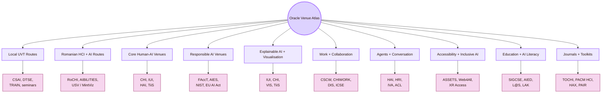

## CS2023 Venue Gate

Human-AI Interaction is best treated as a bridge across CS2023 areas. It belongs to HCI because people interact with the system. It belongs to AI because the system predicts, ranks, recommends, classifies, or generates. It belongs to ethics because AI can affect rights, fairness, privacy, safety, and accountability. It belongs to software engineering because AI systems must be deployed, monitored, updated, and repaired.

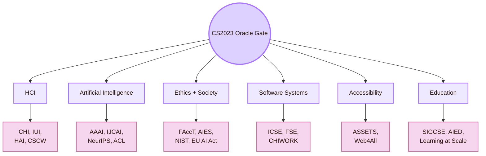

- **HCI Design:** best venue route: CHI, IUI, DIS, UIST, HAI (look for: interface patterns, feedback, prompt design, controls)
- **HCI Evaluation:** best venue route: CHI, IUI, CSCW, TiiS, TOCHI (look for: user studies, trust measures, explanation studies, oversight tests)
- **Artificial Intelligence:** best venue route: AAAI, IJCAI, NeurIPS, ICML, ICLR, ACL (look for: model capability, uncertainty, language systems, safety, technical limits)
- **Ethics and Accountability:** best venue route: FAccT, AIES, NIST AI RMF, EU AI Act (look for: risk, harm, fairness, governance, human oversight)
- **Software Engineering:** best venue route: ICSE, FSE, CHIWORK, CSCW (look for: AI as deployed software, code assistants, logs, monitoring, reliability)
- **Accessibility:** best venue route: ASSETS, Web4All, XR Access, A(I)BILITIES (look for: inclusive AI, assistive AI, access barriers, disabled-user experience)
- **Education:** best venue route: SIGCSE, AIED, Learning at Scale, LAK, EDM (look for: AI literacy, tutoring, student-AI use, learning analytics)

## Local UVT Venue Layer

The local layer begins with UVT. These are not all Human-AI research venues in a strict sense. They are local routes that can support Human-AI questions inside the real study context.

## Romanian Venue Layer

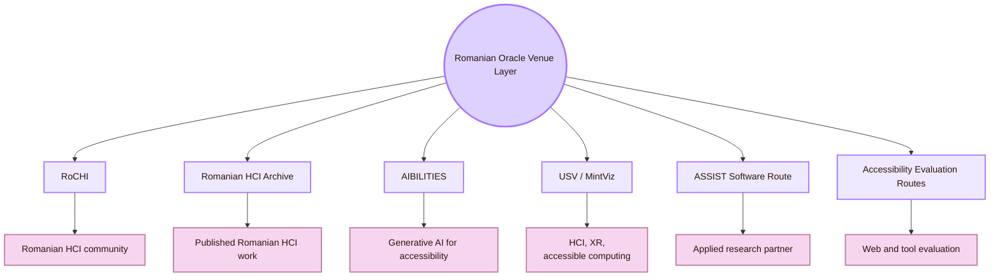

- **RoCHI proceedings:** National HCI route for Romanian interactive systems, usability, accessibility, and HCI education
- **Romanian HCI community:** Keeps the study from being only global and imported
- **A(I)BILITIES:** Romanian route for generative AI and personalised digital accessibility
- **USV / MintViz:** Route for HCI, XR, accessible computing, gesture interaction, and intelligent interaction
- **ASSIST Software A(I)BILITIES page:** Applied Romanian research route for generative AI and digital accessibility
- **Romanian accessibility evaluation papers:** Evidence route for web accessibility, tools, public systems, and university websites
- **Romanian language context:** Localisation, terminology, translation accuracy, and cognitive access

## Core Human-AI Venues

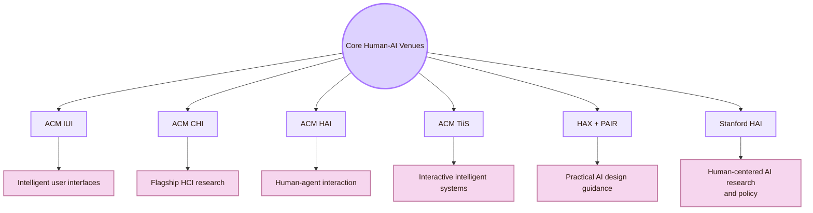

| Venue | What it contributes |
|---|---|
| [ACM IUI](https://iui.acm.org/) | Central conference route for intelligent user interfaces at the intersection of AI and HCI |
| [ACM CHI](https://dl.acm.org/conference/chi) | Flagship HCI venue for AI interaction, design, evaluation, accessibility, trust, and user studies |
| [ACM HAI](https://hai-conference.net/) | Human-Agent Interaction route for social agents, software agents, robots, chatbots, and agentic systems |
| [ACM Transactions on Interactive Intelligent Systems](https://dl.acm.org/journal/TIIS) | Journal route for interactive systems that use machine intelligence |
| [Microsoft HAX Toolkit](https://www.microsoft.com/en-us/haxtoolkit/) | Practical Human-AI design guidance for user-facing AI products |
| [Google People + AI Guidebook](https://pair.withgoogle.com/guidebook/) | Practical guidance for designing human-centered AI products |
| [Stanford HAI](https://hai.stanford.edu/) | Institute route for human-centered AI research, education, policy, and public discussion |

**Practical use:** use this route when the page is about prompts, AI outputs, uncertainty, trust, explanations, source verification, AI roles, user control, and intelligent interface design.

## Responsible AI and Accountability Venues

These venues focus on fairness, accountability, transparency, ethics, governance, harm, risk, and social consequences.

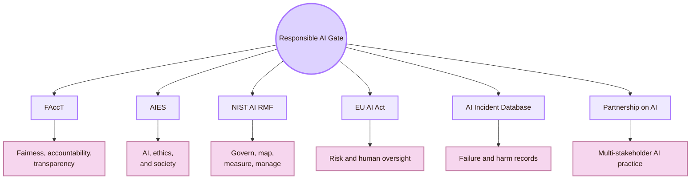

| Venue / body | Use it for |
|---|---|
| [ACM FAccT](https://facctconference.org/) | Fairness, accountability, transparency, sociotechnical systems, and algorithmic harms |
| [AAAI/ACM AIES](https://www.aies-conference.com/) | AI ethics and society, including social, legal, technical, and policy questions |
| [NIST AI RMF](https://www.nist.gov/itl/ai-risk-management-framework) | AI risk management vocabulary and the Govern, Map, Measure, Manage structure |
| [EU AI Act](https://digital-strategy.ec.europa.eu/en/policies/regulatory-framework-ai) | Risk-based AI regulation in the EU and human-centred AI policy context |
| [EU AI Act Article 14](https://artificialintelligenceact.eu/article/14/) | Human oversight requirements for high-risk AI systems |
| [AI Incident Database](https://incidentdatabase.ai/) | Case evidence about AI failures and harms |
| [Partnership on AI](https://partnershiponai.org/) | Multi-stakeholder guidance and responsible AI practice |

**Practical use:** use this route when an AI system can affect fairness, trust, power, privacy, safety, human oversight, or responsibility.

## Explainable AI and Visualisation Venues

Explainability is not only a model property. It is also a communication problem. The interface must help the user understand enough to make a better judgement.

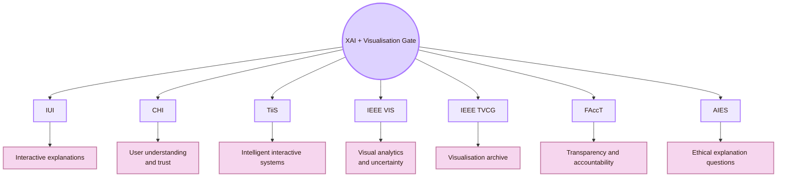

| Venue | Best use |
|---|---|
| IUI | Explanations inside intelligent interfaces |
| CHI | User studies of explanation usefulness, trust, mental models, and decision support |
| TiiS | Long-form work on interactive intelligent systems and XAI |
| IEEE VIS | Visual analytics, model interpretation, and uncertainty visualisation |
| IEEE TVCG | Archival visualisation research |
| FAccT | Explanations tied to fairness, accountability, transparency, and social impact |
| AIES | Explanations tied to ethics, policy, and governance |

**Practical use:** use this route when the question is: **how should the system explain itself so a human can make a better decision?**

## Human-AI Work and Collaboration Venues

AI often enters real work: writing, software development, medicine, education, data analysis, design, administration, and teamwork.

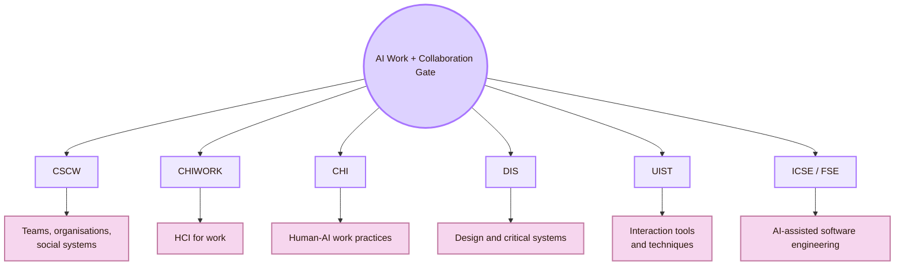

| Venue | Use it for |
|---|---|
| [ACM CSCW](https://cscw.acm.org/) | AI in organisations, collaboration, social systems, teams, and platforms |
| [CHIWORK](https://chiwork.org/) | HCI for work, workplace AI, productivity, and future work |
| CHI | Human-AI work practices, studies, and evaluation |
| DIS | Design theory, critical design, speculative AI systems, and participatory design |
| UIST | AI-powered interaction techniques and interface tools |
| ICSE / FSE | AI-assisted software engineering, developer tools, code generation, and reliability |

**Practical use:** use this route when AI changes how people write, code, make decisions, organise tasks, or cooperate.

## Human-Agent and Conversational AI Venues

When AI appears as an agent, assistant, social robot, chatbot, or embodied system, interaction changes. Users may attribute intention, agency, knowledge, or authority to the system.

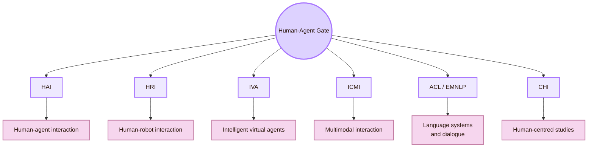

| Venue | Best use |
|---|---|
| HAI | Human-agent interaction, social agents, software agents, and human-agent communication |
| HRI | Human-robot interaction and embodied AI |
| IVA | Intelligent virtual agents and embodied conversational agents |
| ICMI | Multimodal interaction, speech, gesture, emotion, and AI-mediated communication |
| ACL / EMNLP | Language models, dialogue systems, summarisation, NLP behaviour, and evaluation |
| CHI | Human-centred evaluation of agents and conversational systems |

**Practical use:** use this route when the AI is not only giving an output, but appearing as a social, conversational, or semi-autonomous actor.

## AI Accessibility and Inclusive AI Venues

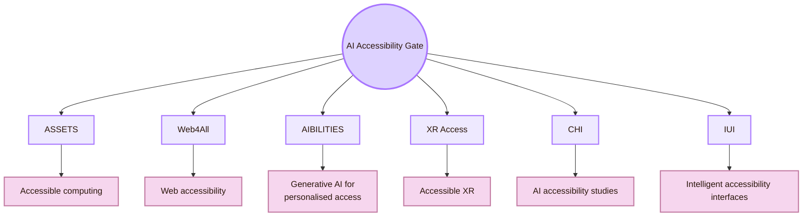

| Venue / route | Use it for |
|---|---|
| ASSETS | AI and accessibility, assistive technology, and disabled-user experiences |
| Web4All | Web accessibility, AI-generated web access, and adaptive interfaces |
| A(I)BILITIES | Romanian generative AI route for adaptive digital accessibility |
| XR Access | AI and accessibility in immersive environments |
| CHI | Human-centred AI accessibility studies |
| IUI | Intelligent interfaces for access, adaptation, and personalisation |

## AI Education and AI Literacy Venues

Human-AI Interaction in a student context needs venues for AI literacy, tutoring, learning support, and academic integrity.

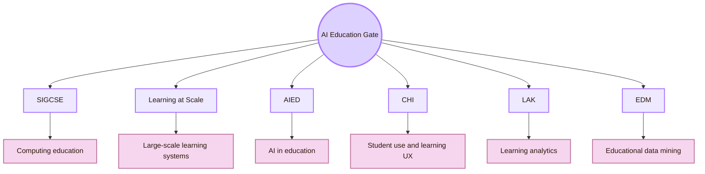

| Venue | Use it for |
|---|---|
| SIGCSE | AI literacy inside computing education |
| Learning at Scale | AI learning systems, online learning, and large-scale tutoring |
| AIED | Artificial intelligence in education, tutoring systems, learner modelling, and educational AI |
| CHI | Student-AI interaction, learning experience, and educational tools |
| LAK | Learning analytics and educational data |
| EDM | Educational data mining and adaptive learning systems |

**Practical use:** use this route when the question is whether AI helps the student learn, reason, verify, and revise, rather than simply complete a task.

## Technical AI Venues to Use Carefully

Large AI venues are useful, but they are not automatically Human-AI venues. Use them for the AI mechanism. Then return to HCI venues to check human use.

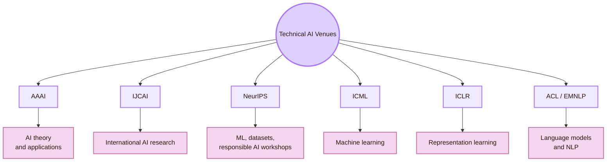

| Venue | Use it when... | Caution |
|---|---|---|
| AAAI | The AI method, agent design, planning, reasoning, or ethics topic matters | Many papers are not user-facing |
| IJCAI | The AI method has human-facing implications | HCI evidence may be weak or absent |
| NeurIPS | Model behaviour, datasets, safety, robustness, or evaluation matters | Technical performance is not the same as usability |
| ICML | ML uncertainty, learning, or robustness matters | User studies are often not central |
| ICLR | Language models, representation, and generative systems matter | Interface design may be missing |
| ACL / EMNLP | LLMs, dialogue, summarisation, translation, and language interaction matter | NLP benchmarks do not prove good Human-AI interaction |

## Journal Archive Gate

Journals and archival venues are useful for deeper theory, stronger literature reviews, and more stable references.

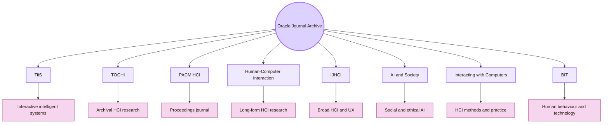

- **ACM Transactions on Interactive Intelligent Systems:** Strong archive for systems that combine interaction and machine intelligence
- **ACM Transactions on Computer-Human Interaction:** Core archival HCI journal
- **Proceedings of the ACM on Human-Computer Interaction:** Major HCI proceedings journal, including CSCW and other HCI communities
- **Human-Computer Interaction:** Long-form HCI research journal
- **International Journal of Human-Computer Interaction:** Broad HCI journal including AI interaction, UX, usability, and human factors
- **AI & Society:** Social, ethical, philosophical, and policy dimensions of AI
- **Interacting with Computers:** HCI research methods, theory, and applied interaction
- **Behaviour & Information Technology:** Human factors, usability, and technology in real contexts

## Toolkit and Institute Gate

These are not conference venues, but they are important sources for applied Human-AI design. Use them to translate research into interface rules.

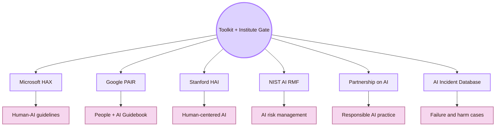

- **Microsoft HAX Toolkit:** Human-AI design guidelines, checklists, cards, and failure-aware design
- **Google PAIR Guidebook:** Practical patterns for human-centered AI products
- **Stanford HAI:** Research, policy, education, and public reports about human-centered AI
- **NIST AI RMF:** Risk management vocabulary and governance structure
- **Partnership on AI:** Responsible AI practice and multi-stakeholder guidance
- **AI Incident Database:** Concrete cases of AI failure and harm

## Venue Selection Route

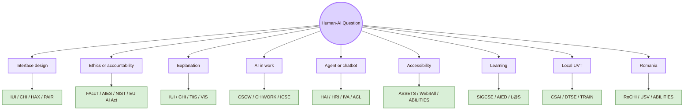

| If the question is... | Start here | Then broaden to |
|---|---|---|
| How should the AI interface behave? | IUI, CHI, Microsoft HAX, Google PAIR | TiiS, TOCHI |
| How should trust and uncertainty be designed? | CHI, IUI, TiiS | NIST, FAccT, VIS |
| How do users understand AI explanations? | IUI, CHI, TiiS, VIS | FAccT, AIES |
| How does AI affect work? | CSCW, CHIWORK, CHI | ICSE, DIS |
| How do agents interact with humans? | HAI, HRI, IVA | CHI, ICMI, ACL |
| How does AI affect disabled users? | ASSETS, Web4All, A(I)BILITIES | CHI, IUI |
| How should students learn with AI? | SIGCSE, AIED, Learning at Scale | CHI, LAK, EDM |
| How do we ground locally? | UVT CSAI, DTSE, TRAIN, seminars | CS2023 and global HCI |
| How do we ground nationally? | RoCHI, A(I)BILITIES, USV/MintViz | IUI, CHI, ASSETS |

## Reading Across Venues

Human-AI Interaction rarely needs only one source family. A strong route combines local context, national grounding, Human-AI design, responsible AI, and technical AI knowledge.

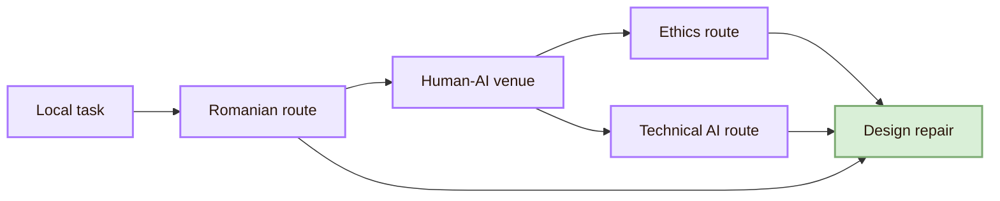

## Venue Reliability Ladder

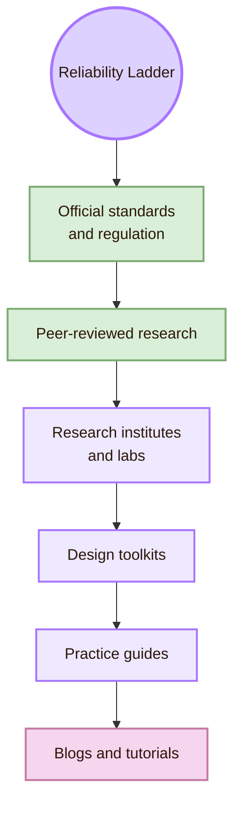

| Source type | Use it for | Caution |
|---|---|---|
| Official standards and regulation | Human oversight, risk management, accountability, legal context | They do not replace user testing |
| Peer-reviewed research | Evidence, methods, theories, and evaluated systems | Papers may be narrow or difficult for beginners |
| Research institutes and labs | Research direction, public reports, policy framing | Check whether the page is a report, opinion, or peer-reviewed work |
| Design toolkits | Practical design rules and checklists | Toolkits simplify complex research |
| Practice guides | Fast applied understanding | Not always peer-reviewed |
| Blogs and tutorials | Setup help and examples | Do not use them as the main academic source |

## Broad Oracle Venue Atlas

- **Local UVT:** main routes: Faculty of Informatics, CSAI, DTSE, TRAIN, seminars, academic review; what they map: Local AI, software, workflow, and student-work context
- **Romania:** main routes: RoCHI, A(I)BILITIES, USV/MintViz, Romanian accessibility evaluation; what they map: National HCI, AI accessibility, assistive technology, Romanian-language context
- **Core Human-AI:** main routes: IUI, CHI, HAI, TiiS; what they map: AI interfaces, intelligent systems, user studies, agents
- **Responsible AI:** main routes: FAccT, AIES, NIST, EU AI Act, AI Incident Database; what they map: Accountability, fairness, risk, oversight, governance
- **Explanation + visualisation:** main routes: IUI, CHI, TiiS, IEEE VIS, FAccT; what they map: Explainability, uncertainty, evidence displays
- **Work + collaboration:** main routes: CSCW, CHIWORK, ICSE, DIS, UIST; what they map: AI in organisations, teams, software, workflows
- **Agents + conversation:** main routes: HAI, HRI, IVA, ICMI, ACL/EMNLP; what they map: Chatbots, robots, virtual agents, multimodal AI
- **Accessibility:** main routes: ASSETS, Web4All, A(I)BILITIES, XR Access; what they map: AI for access and disabled-user experience
- **Education:** main routes: SIGCSE, AIED, Learning at Scale, LAK, EDM; what they map: AI literacy, tutoring, learning analytics
- **Journals:** main routes: TiiS, TOCHI, PACM HCI, HCI Journal, IJHCI, AI & Society; what they map: Deep literature and archival references
- **Toolkits:** main routes: Microsoft HAX, Google PAIR, Stanford HAI, NIST AI RMF; what they map: Practical design, risk, policy, and public guidance

## Academic Anchors

| Route | Source |
|---|---|
| CS2023 HCI basis | [CS2023 HCI Version Gamma](https://csed.acm.org/wp-content/uploads/2023/09/HCI-Version-Gamma.pdf) |
| CS2023 Artificial Intelligence basis | [CS2023 AI SIGCSE 2022 version](https://csed.acm.org/knowledge-areas-intelligent-systems-ai-sigcse-2022-version/) |
| UVT Faculty of Informatics | [Faculty of Informatics UVT](https://info.uvt.ro/en/) |
| UVT Faculty departments | [Faculty of Informatics Departments](https://info.uvt.ro/en/departamente/) |
| UVT CSAI Department | [Department of Computational Sciences and Artificial Intelligence](https://info.uvt.ro/en/departamente/csai/) |
| UVT DTSE Department | [Department of Digital Technologies and Software Engineering](https://info.uvt.ro/en/departamente/dtse/) |
| UVT AI and ML research route | [Artificial Intelligence and Machine Learning](https://research.info.uvt.ro/artificial-intelligence-and-machine-learning/) |
| UVT TRAIN | [Timișoara Research in Artificial Intelligence Network](https://uvt.ro/en/comunicate-presa/uvt-lanseaza-noul-hub-de-inteligenta-artificiala-ai-timisoara-research-in-artificial-intelligence-network-train/) |
| UVT Scientific Seminar | [Scientific Seminar](https://research.info.uvt.ro/scientific-seminar/) |
| UVT AI and Distributed Computing master | [Artificial Intelligence and Distributed Computing](https://info.uvt.ro/en/master/artificial-intelligence-distributed-computing/) |
| RoCHI proceedings | [Romanian HCI proceedings](https://rochi.utcluj.ro/proceedings/en/) |
| A(I)BILITIES route | [A(I)BILITIES](https://aibilities.ro/en/about/) |
| MintViz A(I)BILITIES route | [MintViz A(I)BILITIES](https://mintviz.usv.ro/projects/A%28I%29BILITIES/index.php) |
| ASSIST Software A(I)BILITIES | [A(I)BILITIES at ASSIST Software](https://assist-software.net/project/aibilities) |
| Radu-Daniel Vatavu route | [Radu-Daniel Vatavu homepage](https://raduvatavu.usv.ro/) |
| Ovidiu-Andrei Schipor route | [Ovidiu-Andrei Schipor projects](https://www.eed.usv.ro/~schipor/projects.php) |
| ACM IUI | [ACM Conference on Intelligent User Interfaces](https://iui.acm.org/) |
| ACM CHI | [ACM CHI](https://dl.acm.org/conference/chi) |
| ACM HAI | [International Conference on Human-Agent Interaction](https://hai-conference.net/) |
| ACM TiiS | [ACM Transactions on Interactive Intelligent Systems](https://dl.acm.org/journal/TIIS) |
| ACM TOCHI | [ACM Transactions on Computer-Human Interaction](https://dl.acm.org/journal/tochi) |
| PACM HCI | [Proceedings of the ACM on Human-Computer Interaction](https://dl.acm.org/journal/pacmhci) |
| ACM FAccT | [ACM Conference on Fairness, Accountability, and Transparency](https://facctconference.org/) |
| AAAI/ACM AIES | [AI, Ethics, and Society](https://www.aies-conference.com/) |
| ACM CSCW | [ACM CSCW](https://cscw.acm.org/) |
| CHIWORK | [Human-Computer Interaction for Work](https://chiwork.org/) |
| ACM DIS | [ACM Designing Interactive Systems](https://dis.acm.org/) |
| ACM UIST | [ACM UIST](https://uist.acm.org/) |
| ICSE | [IEEE/ACM International Conference on Software Engineering](https://conf.researchr.org/series/icse) |
| ACM HRI | [ACM/IEEE Human-Robot Interaction](https://humanrobotinteraction.org/) |
| ACM IVA | [ACM Intelligent Virtual Agents](https://dl.acm.org/conference/iva) |
| ACM ICMI | [ACM International Conference on Multimodal Interaction](https://icmi.acm.org/) |
| ACL | [Association for Computational Linguistics](https://www.aclweb.org/portal/) |
| EMNLP | [EMNLP](https://2026.emnlp.org/) |
| ASSETS | [ACM ASSETS](https://www.sigaccess.org/assets/) |
| Web4All | [International Web for All Conference](https://www.w4a.info/) |
| XR Access | [XR Access](https://xraccess.org/) |
| SIGCSE | [ACM SIGCSE](https://sigcse.org/) |
| Learning at Scale | [ACM Learning at Scale](https://learningatscale.acm.org/) |
| AIED | [International AIED Society](https://iaied.org/) |
| LAK | [Society for Learning Analytics Research](https://www.solaresearch.org/events/lak/) |
| EDM | [International Educational Data Mining Society](https://educationaldatamining.org/) |
| IEEE VIS | [IEEE VIS](https://ieeevis.org/) |
| IEEE TVCG | [IEEE Transactions on Visualization and Computer Graphics](https://www.computer.org/csdl/journal/tg) |
| AAAI | [AAAI Conference](https://aaai.org/conference/aaai/) |
| IJCAI | [International Joint Conferences on Artificial Intelligence](https://www.ijcai.org/) |
| NeurIPS | [NeurIPS](https://neurips.cc/) |
| ICML | [International Conference on Machine Learning](https://icml.cc/) |
| ICLR | [International Conference on Learning Representations](https://iclr.cc/) |
| Microsoft HAX Toolkit | [HAX Toolkit](https://www.microsoft.com/en-us/haxtoolkit/) |
| Microsoft Human-AI guidelines | [Guidelines for Human-AI Interaction](https://www.microsoft.com/en-us/haxtoolkit/ai-guidelines/) |
| Google PAIR | [People + AI Research](https://pair.withgoogle.com/) |
| Google PAIR Guidebook | [People + AI Guidebook](https://pair.withgoogle.com/guidebook/) |
| Stanford HAI | [Stanford Institute for Human-Centered AI](https://hai.stanford.edu/) |
| NIST AI RMF | [NIST AI Risk Management Framework](https://www.nist.gov/itl/ai-risk-management-framework) |
| NIST AI RMF Core | [Govern, Map, Measure, Manage](https://airc.nist.gov/airmf-resources/airmf/5-sec-core/) |
| EU AI Act | [European Commission AI Act](https://digital-strategy.ec.europa.eu/en/policies/regulatory-framework-ai) |
| EU AI Act Article 14 | [Human oversight](https://artificialintelligenceact.eu/article/14/) |
| AI Incident Database | [AI Incident Database](https://incidentdatabase.ai/) |
| Partnership on AI | [Partnership on AI](https://partnershiponai.org/) |

^important-venues-human-ai-interaction-end
