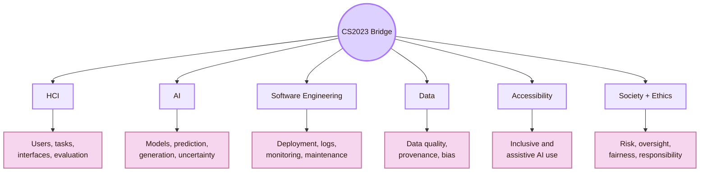
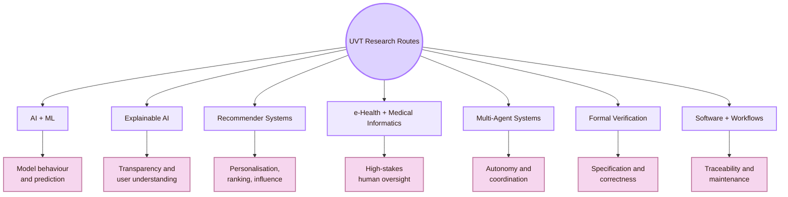
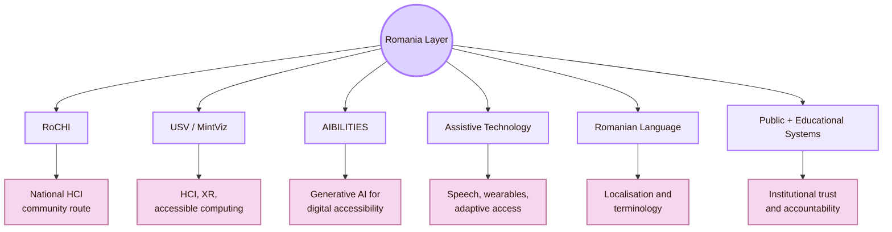
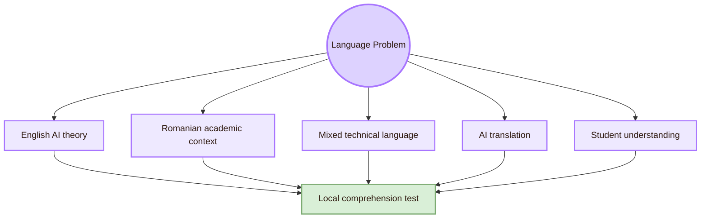
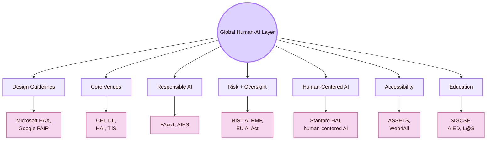
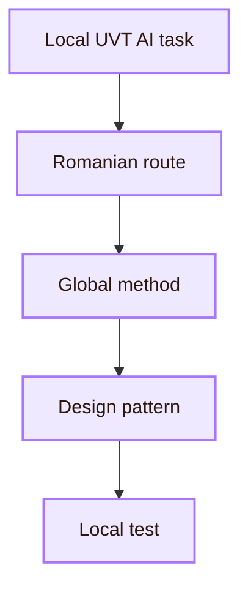
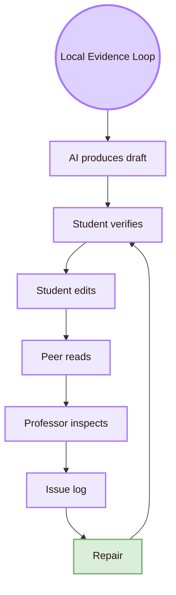
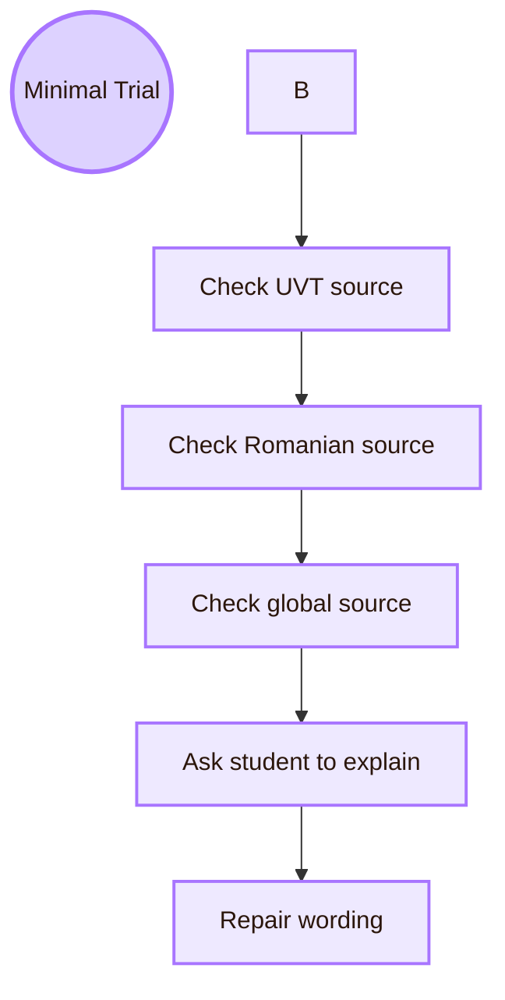
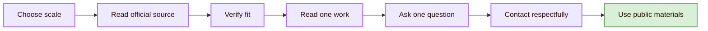

![[train.gif|1000]]
# Local and Global

## Scale map

## Why local and global both matter

A Human-AI study becomes weak if it uses only one scale.

If it is only local, it may become a personal study with weak academic grounding. If it is only global, it may ignore the university, language, tools, and people who actually use the system. If it ignores Romania, it treats Human-AI Interaction as if national HCI and accessibility work do not exist.

- **Only UVT:** problem: The page may describe one study but miss the field; stronger route: Connect local evidence to global Human-AI methods
- **Only Romania:** problem: The page may list people or projects without method structure; stronger route: Link Romanian routes to HCI, AI, accessibility, and evaluation concepts
- **Only AI:** problem: The page may focus on models and ignore users; stronger route: Add HCI: mental models, trust, control, explanation, and verification
- **Only HCI:** problem: The page may ignore model limits and uncertainty; stronger route: Add AI: data, prediction, generation, drift, and failure modes

## CS2023 grounding

Human-AI Interaction is best treated as a bridge across CS2023 areas. It is not only HCI and not only AI.

## Local UVT layer

The **Department of Computational Sciences and Artificial Intelligence** gives the AI side: models, learning, prediction, intelligent systems, medical informatics, recommender systems, and explainability routes. The **Department of Digital Technologies and Software Engineering** gives the software side: web systems, workflows, cloud systems, deployment, versioning, reliability, and maintainability.

Human-AI Interaction needs both. An AI interface is a user-facing system, but it is also software that must be logged, tested, updated, and repaired.

## Local UVT people and research routes

## Romania layer

The Romanian layer matters because Human-AI Interaction should not be framed only through US, UK, or global sources. Romanian routes give national grounding in HCI, accessibility, assistive technology, intelligent interaction, language, and institutional context.

- **RoCHI:** human-ai connection: National HCI route for design, evaluation, implementation, and study of interactive systems; safe use in this page: Use as the main Romanian HCI anchor
- **Radu-Daniel Vatavu / USV:** human-ai connection: HCI, XR, accessible computing, ambient intelligence, and multimodal interaction route; safe use in this page: Use for Romanian HCI and accessible interaction grounding
- **Ovidiu-Andrei Schipor:** human-ai connection: HCI and assistive-technology route, especially speech and smart-environment contexts; safe use in this page: Use for assistive Human-AI and accessibility routes
- **MintViz:** human-ai connection: USV research route linked to machine intelligence and information visualisation; safe use in this page: Use for intelligent interaction and visualisation context
- **ASSIST Software A(I)BILITIES route:** human-ai connection: Applied R&D route for digital accessibility with generative AI; safe use in this page: Use as case evidence, not as general proof
- **Romanian language:** human-ai connection: Affects AI prompts, explanations, translation, terminology, and learning; safe use in this page: Use for localisation and AI-literacy questions

## Romanian language and localisation problem

Human-AI Interaction changes when language changes. A model may perform differently in English, Romanian, or mixed academic language. A student may also understand a concept in English but explain it better in Romanian.

- **English terms remain unclear:** human-ai risk: Student copies without understanding; repair: Add a short plain-English explanation
- **Romanian translation is inaccurate:** human-ai risk: Concept meaning changes; repair: Keep key terms in English and explain them
- **AI over-localises:** human-ai risk: Academic terms become informal or imprecise; repair: Preserve official terminology
- **AI ignores Romanian context:** human-ai risk: Page becomes generic; repair: Add UVT and Romanian source routes
- **Mixed language creates confusion:** human-ai risk: User cannot explain the concept; repair: Ask for a short paraphrase task
- **AI invents local terminology:** human-ai risk: False academic wording enters the study; repair: Verify terms with official or academic sources

## Global Human-AI layer

The global layer provides the strongest method vocabulary for Human-AI Interaction: mental models, trust calibration, uncertainty, explanation, verification, user control, human oversight, risk management, and responsible AI.

- **Microsoft Guidelines for Human-AI Interaction:** Gives design rules for expectation setting, regular interaction, AI failure, and change over time
- **Microsoft HAX Toolkit:** Helps turn Human-AI guidelines into design review and failure analysis
- **Google People + AI Guidebook:** Gives product-design guidance for human-centered AI
- **NIST AI RMF:** Gives risk-management vocabulary: govern, map, measure, manage
- **EU AI Act Article 14:** Gives a formal human-oversight route for high-risk AI systems
- **CHI:** Broad HCI venue for Human-AI studies
- **IUI:** Core intelligent user interface venue
- **HAI:** Human-agent interaction and social-agent route
- **FAccT and AIES:** Fairness, accountability, ethics, governance, and social impact
- **TiiS:** Archival route for interactive intelligent systems
- **ASSETS and Web4All:** Accessibility and inclusive AI routes
- **Stanford HAI:** Interdisciplinary human-centered AI research and public-facing analysis

## Local to Romania to global bridge

## Local Human-AI evidence loop

## Local and global comparison matrix

## Minimal local-global trial

Use this small trial to make the local-global page evidence-based.

| Step | Concrete action |
|---|---|
| Check Romanian source | Does RoCHI, A(I)BILITIES, or USV provide national grounding? |
| Check global source | Does Microsoft, Google PAIR, NIST, CHI, IUI, or FAccT support the method? |

## Contact protocol

Contact comes after source reading. Do not ask broad questions before checking official pages and one relevant source.

## S## Academic anchors

| Route | Source |
|---|---|
| CS2023 HCI basis | [CS2023 HCI Version Gamma](https://csed.acm.org/wp-content/uploads/2023/09/HCI-Version-Gamma.pdf) |
| CS2023 Artificial Intelligence basis | [CS2023 AI SIGCSE 2022 version](https://csed.acm.org/knowledge-areas-intelligent-systems-ai-sigcse-2022-version/) |
| UVT Faculty of Informatics | [Faculty of Informatics UVT](https://info.uvt.ro/en/) |
| UVT Faculty departments | [Faculty of Informatics Departments](https://info.uvt.ro/en/departamente/) |
| UVT CSAI Department | [Department of Computational Sciences and Artificial Intelligence](https://info.uvt.ro/en/departamente/csai/) |
| UVT DTSE Department | [Department of Digital Technologies and Software Engineering](https://info.uvt.ro/en/departamente/dtse/) |
| UVT AI and ML research route | [Artificial Intelligence and Machine Learning](https://research.info.uvt.ro/artificial-intelligence-and-machine-learning/) |
| UVT TRAIN | [Timișoara Research in Artificial Intelligence Network](https://train.uvt.ro/) |
| UVT TRAIN launch | [UVT launches TRAIN](https://uvt.ro/en/comunicate-presa/uvt-lanseaza-noul-hub-de-inteligenta-artificiala-ai-timisoara-research-in-artificial-intelligence-network-train/) |
| UVT Artificial Intelligence bachelor route | [Artificial Intelligence - UVT admission](https://admission.uvt.ro/study-programmes/artificial-intelligence/) |
| UVT Artificial Intelligence and Distributed Computing master | [AIDC master](https://info.uvt.ro/en/master/artificial-intelligence-distributed-computing/) |
| UVT AIDC admission route | [AIDC admission](https://admission.uvt.ro/study-programmes/artificial-intelligence-and-distributed-computing-aidc/) |
| UVT Scientific Seminar | [Scientific Seminar](https://research.info.uvt.ro/scientific-seminar/) |
| RoCHI proceedings | [Romanian HCI proceedings](https://rochi.utcluj.ro/proceedings/en/) |
| RoCHI community route | [Romanian Special Interest Group in HCI](https://cgis.utcluj.ro/rochi_group/) |
| RoCHI DBLP route | [RoCHI on DBLP](https://dblp.org/db/conf/rochi/index) |
| Radu-Daniel Vatavu | [Radu-Daniel Vatavu homepage](https://raduvatavu.usv.ro/) |
| Radu-Daniel Vatavu publications | [Vatavu publications](https://raduvatavu.usv.ro/publications.php) |
| Ovidiu-Andrei Schipor | [Ovidiu-Andrei Schipor homepage](https://www.eed.usv.ro/~schipor/) |
| Ovidiu-Andrei Schipor CV | [Ovidiu-Andrei Schipor CV](https://fiesc.usv.ro/wp-content/uploads/sites/17/2022/09/CV_en_2022.pdf) |
| A(I)BILITIES route | [A(I)BILITIES](https://aibilities.ro/en/about/) |
| ASSIST Software A(I)BILITIES | [A(I)BILITIES — Generative AI for Digital Accessibility](https://assist-software.net/project/aibilities) |
| MintViz A(I)BILITIES route | [MintViz A(I)BILITIES](https://mintviz.usv.ro/projects/A%28I%29BILITIES/index.php) |
| Microsoft Human-AI guidelines | [Guidelines for Human-AI Interaction](https://www.microsoft.com/en-us/research/project/guidelines-for-human-ai-interaction/) |
| Microsoft HAX Toolkit | [HAX Toolkit AI Guidelines](https://www.microsoft.com/en-us/haxtoolkit/ai-guidelines/) |
| Google People + AI Guidebook | [PAIR Guidebook](https://pair.withgoogle.com/guidebook/) |
| Google People + AI Research | [PAIR](https://pair.withgoogle.com/) |
| Stanford HAI | [Stanford HAI](https://hai.stanford.edu/) |
| NIST AI RMF | [NIST AI Risk Management Framework](https://www.nist.gov/itl/ai-risk-management-framework) |
| NIST AI RMF Core | [Govern, Map, Measure, Manage](https://airc.nist.gov/airmf-resources/airmf/5-sec-core/) |
| EU AI Act | [European Commission AI Act](https://digital-strategy.ec.europa.eu/en/policies/regulatory-framework-ai) |
| EU AI Act Article 14 | [Human oversight](https://artificialintelligenceact.eu/article/14/) |
| ACM IUI | [ACM Conference on Intelligent User Interfaces](https://iui.acm.org/) |
| ACM CHI | [ACM CHI](https://dl.acm.org/conference/chi) |
| ACM HAI | [Human-Agent Interaction](https://hai-conference.net/) |
| ACM TiiS | [ACM Transactions on Interactive Intelligent Systems](https://dl.acm.org/journal/TIIS) |
| ACM FAccT | [ACM FAccT](https://facctconference.org/) |
| AAAI/ACM AIES | [AI, Ethics, and Society](https://www.aies-conference.com/) |
| ACM ASSETS | [ASSETS Conference](https://www.sigaccess.org/assets/) |
| Web4All | [International Web for All Conference](https://www.w4a.info/) |

^local-global-human-ai-interaction-end
