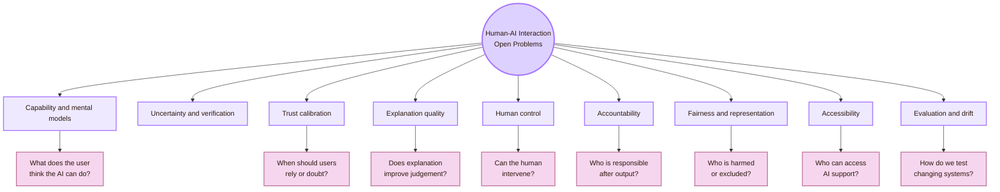
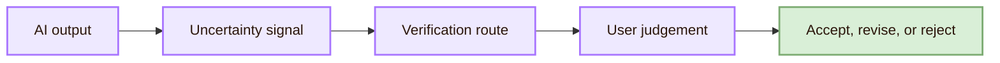
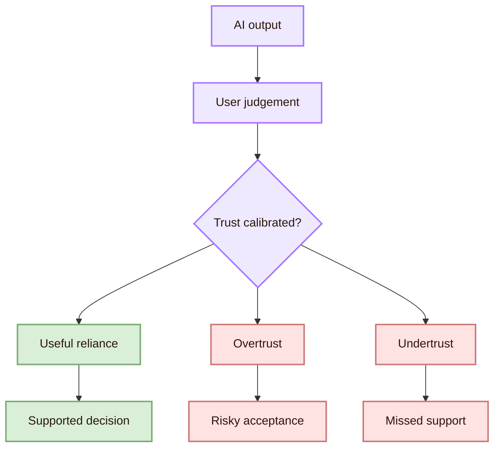
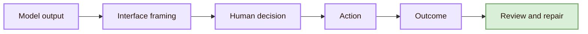

![[sega.gif|1000]]
# Open Problems

> [!abstract] Human-AI Interaction Open Problems
> This page explains the main open problems in **Human-AI Interaction**: how people understand, verify, trust, correct, and remain responsible for AI systems that predict, recommend, rank, classify, generate, explain, adapt, or act with uncertainty.

This page is written as a student guide. It should help you choose research questions, design small studys, build portfolio evidence, and understand where Human-AI Interaction becomes difficult in real systems.

## Core open problem map

## Open Problem 1: Capability and mental models

Users often form incorrect mental models of AI systems. They may think a chatbot “knows” facts, a recommender is neutral, a classifier is objective, or a generated answer is evidence. The open problem is how to design interfaces that show capability without exaggerating intelligence.

- **Do users know what the AI can do?:** Ask users to predict which tasks the system can complete reliably
- **Do users know what the AI cannot do?:** Ask users to identify risky tasks before using the system
- **Does the interface create false authority?:** Compare a plain output with an output that includes limits and verification cues
- **Does the user understand the model role?:** Ask users to explain whether the system is predicting, ranking, retrieving, or generating

### Portfolio evidence

- **Capability statement:** Shows you can design expectation-setting UI
- **User prediction task:** Shows you can test mental models
- **Error expectation table:** Shows you understand limits before use
- **Before/after findings:** Shows evidence-based design revision

## Open Problem 2: Uncertainty and verification

AI systems often produce outputs that look more certain than they are. This is especially serious with generative AI, where fluent language can make weak evidence sound strong. The open problem is how to make uncertainty visible without overwhelming users.

| Open question | Why it is difficult |
|---|---|
| How much friction is useful? | Too little friction encourages copying; too much friction makes users ignore the system |

### Career route

This problem connects to UX research, AI product design, information literacy, responsible AI, and HCI evaluation.

## Open Problem 3: Hallucination and source grounding

- **The AI invents a source:** Require source verification before final use
- **The AI gives outdated information:** Add date and source checks
- **The user copies without understanding:** Add explanation and self-check tasks
- **The output sounds polished:** Remind users that style is not evidence

## Open Problem 4: Trust calibration and automation bias

Trust calibration means the user trusts the AI when it is useful and doubts it when evidence is weak. Overtrust means accepting AI output too easily. Undertrust means rejecting useful AI support even when it is reliable. Automation bias is the tendency to rely too much on automated output.

- **Do users accept wrong AI answers?:** Seed known errors and observe acceptance
- **Do users reject useful AI help?:** Compare user performance with and without appropriate AI support
- **Does explanation reduce overtrust?:** Test whether explanations make users verify more accurately
- **Does confidence display help?:** Test whether users interpret confidence correctly
- **Does expertise change trust?:** Compare beginner and advanced users

## Open Problem 5: Explanation quality

Explainable AI is not solved by showing more information. An explanation is useful only if it helps the user make a better decision. Some explanations are too technical. Some are too vague. Some create false confidence.

- **Feature importance:** possible value: Shows factors that influenced output; possible failure: May be too abstract for users
- **Example-based explanation:** possible value: Shows similar cases; possible failure: Examples may mislead if context differs
- **Natural-language explanation:** possible value: Easy to read; possible failure: Can sound convincing without real support
- **Uncertainty explanation:** possible value: Shows limits; possible failure: Users may ignore or misunderstand it

## Open Problem 6: Human control and oversight

Human oversight is not the same as placing a human near the AI. The human needs real control: inspect, edit, reject, override, stop, appeal, or repair. The open problem is how to design controls that people can actually use under time pressure.

- **Edit:** The user can correct the AI output
- **Reject:** The user can refuse the output
- **Override:** The user can choose a different decision
- **Undo:** The user can reverse an AI-assisted action
- **Stop:** The user can interrupt automation
- **Appeal:** The affected person can contest a decision
- **Log:** The system records what was suggested, accepted, changed, or rejected

## Open Problem 7: Accountability and responsibility

AI systems can blur responsibility. A user may say “the AI gave me this.” A developer may say “the user accepted it.” An institution may say “the tool is optional.” The open problem is how to make responsibility visible across the whole human-AI loop.

- **Who generated the output?:** Authorship and responsibility need traceability
- **Who verified the output?:** Academic and professional work require evidence
- **Who accepted the final action?:** Final responsibility cannot disappear
- **What changed after review?:** Revision logs support accountability
- **What happens after harm?:** Systems need repair and escalation paths

### Portfolio evidence

Save an AI-use log for an HCI study. Record prompt, output, checked sources, errors found, human revisions, and final decision.

## Open Problem 8: Fairness, bias, and representation

AI systems can behave differently across groups, languages, abilities, cultures, and contexts. Human-AI Interaction must ask not only whether the model works on average, but who it works for, who it misreads, and who is excluded.

| Bias source | Human-AI interaction problem |
|---|---|
| Training data | The system may represent some groups poorly |
| Default user assumptions | The system may assume ability, device access, or prior knowledge |
| Feedback loops | User behaviour shaped by AI can become future data |
| Evaluation sample | Testing only classmates may hide broader harms |
| Cultural context | A system designed globally may fail locally |

## Open Problem 9: Privacy and data boundaries

Human-AI systems often ask users to enter sensitive, personal, academic, workplace, or health-related data. The open problem is how to help users understand what data is needed, what should not be entered, where data may go, and how privacy affects trust.

- **What data is needed?:** Ask only for necessary information
- **What data is risky?:** Warn before sensitive input
- **Where does the data go?:** Explain storage, processing, and sharing
- **Can the user delete it?:** Provide deletion or reset options where possible
- **Is the user in a school or work context?:** Clarify institutional rules
- **Does the AI remember context?:** Show memory or context controls clearly

## Open Problem 10: Accessibility and assistive AI

AI can improve accessibility, but it can also create new barriers. It can generate alt text, captions, summaries, translations, and interface assistance. It can also generate wrong descriptions, inaccessible layouts, confusing text, biased recommendations, or unstable experiences for assistive technology users.

- **AI-generated alt text:** Wrong or incomplete descriptions
- **AI summaries:** Important detail may be removed
- **Voice assistants:** Speech recognition may fail for some users
- **Personalised interfaces:** Changes can disorient users
- **AI writing help:** Text may become less understandable
- **AI accessibility checkers:** Automated checks can miss real barriers

## Open Problem 11: AI literacy and learning

Students increasingly use AI for writing, coding, studying, summarising, and study building. The open problem is how to make AI support learning instead of replacing learning. A student can produce a polished page without understanding it.

- **Copying without understanding:** Can the student explain the output in their own words?
- **False confidence:** Does the student check sources and uncertainty?
- **Skill loss:** Does AI reduce practice in writing, coding, or reasoning?
- **Better scaffolding:** Does AI help the student ask better questions?
- **Academic integrity:** Is AI use visible, allowed, and reviewed?

## Open Problem 12: Evaluation of adaptive and generative systems

Traditional usability testing often assumes that the system is stable. Human-AI systems may change across prompts, users, time, model versions, or hidden context. This makes reproducibility harder.

- **Output variability:** The same prompt may produce different answers
- **Model updates:** Results may change after the system is updated
- **Hidden context:** The system may use memory, retrieval, or profile data
- **Prompt sensitivity:** Small wording changes can change output
- **Long-term adaptation:** User and system behaviour change together
- **Tool use:** AI agents may act in external systems

## Open Problem 13: Security and misuse in AI interfaces

Human-AI Interaction includes security because natural language becomes a control surface. Prompt injection, unsafe tool use, private-data leakage, and malicious instructions can appear through normal interaction.

- **Prompt injection:** The user may not know the AI has been manipulated
- **Tool misuse:** The AI may act beyond what the user intended
- **Data leakage:** Sensitive input may be exposed or stored
- **Malicious output:** The system may help produce harmful or deceptive content
- **Confusing permission:** The user may not know what the AI can access
- **Hidden automation:** The user may not know when AI is acting independently

## Open Problem 14: Local UVT and Romanian context

## Career directions connected to these open problems

- **UX researcher for AI products:** skills to build: Usability testing, trust studies, interviews, task design; portfolio evidence: Human-AI evaluation protocol and findings report
- **AI product designer:** skills to build: Capability statements, uncertainty cues, controls, source panels; portfolio evidence: Prototype of an AI interface with verification and control
- **Explainable AI researcher:** skills to build: Explanation design, user studies, decision support; portfolio evidence: Comparison of explanation styles and judgement accuracy
- **Accessibility researcher:** skills to build: Assistive AI, WCAG, disabled-user evidence, alt text evaluation; portfolio evidence: Accessibility issue log and AI-generated content audit
- **AI literacy educator:** skills to build: Student AI use, source checking, learning scaffolds; portfolio evidence: AI study workflow with reflection and verification tasks
- **Human-AI evaluation researcher:** skills to build: Mixed methods, trust calibration, automation bias; portfolio evidence: Study comparing user reliance across interface conditions
- **AI safety or governance route:** skills to build: Oversight, logging, prompt injection, auditability; portfolio evidence: Tool permission prototype and oversight checklist

## What to save for a portfolio

- **Human-AI research question:** Shows you can define a focused problem
- **Prototype:** Shows you can design an AI interaction, not only describe one
- **Evaluation protocol:** Shows you can test trust, verification, control, or understanding
- **Prompt and output log:** Shows traceability
- **Source verification table:** Shows academic responsibility
- **Error and hallucination log:** Shows critical evaluation
- **User study findings:** Shows evidence-based reasoning
- **Accessibility check:** Shows inclusive evaluation
- **Revision notes:** Shows that evidence changed the design

## Academic anchors

| Route | Source |
|---|---|
| CS2023 Knowledge Areas | [CS2023 Knowledge Areas](https://csed.acm.org/knowledge-areas/) |
| CS2023 Body of Knowledge | [CS2023 Body of Knowledge PDF](https://csed.acm.org/wp-content/uploads/2024/04/3.1-Body-of-Knowledge-1.pdf) |
| Human-AI interaction guidelines | [Microsoft Guidelines for Human-AI Interaction](https://www.microsoft.com/en-us/haxtoolkit/ai-guidelines/) |
| Human-AI experience toolkit | [Microsoft HAX Toolkit](https://www.microsoft.com/en-us/haxtoolkit/) |
| Human-centred AI design guide | [Google People + AI Guidebook](https://pair.withgoogle.com/guidebook/) |
| Human-centred AI institute route | [Stanford HAI](https://hai.stanford.edu/) |
| AI risk management | [NIST AI Risk Management Framework](https://www.nist.gov/itl/ai-risk-management-framework) |
| AI RMF core functions | [NIST AI RMF Core](https://airc.nist.gov/airmf-resources/airmf/5-sec-core/) |
| Human oversight | [EU AI Act Article 14](https://artificialintelligenceact.eu/article/14/) |
| Intelligent user interfaces | [ACM IUI](https://iui.acm.org/) |
| HCI research venue | [ACM CHI](https://dl.acm.org/conference/chi) |
| Human-AI interaction venue | [ACM HAI](https://hai-conference.net/) |
| Human-AI systems journal | [ACM TiiS](https://dl.acm.org/journal/tiis) |
| Fairness, accountability, transparency | [ACM FAccT](https://facctconference.org/) |
| AI ethics and society | [AIES](https://www.aies-conference.com/) |
| Accessibility research venue | [ACM ASSETS](https://dl.acm.org/conference/assets) |
| Web accessibility | [W3C WAI](https://www.w3.org/WAI/) |
| Accessibility standard | [WCAG 2.2](https://www.w3.org/TR/WCAG22/) |
| Computing ethics | [ACM Code of Ethics](https://www.acm.org/code-of-ethics) |
| Local UVT departments | [UVT Faculty of Informatics Departments](https://info.uvt.ro/en/departamente/) |
| UVT AI and ML route | [UVT Artificial Intelligence and Machine Learning](https://research.info.uvt.ro/artificial-intelligence-and-machine-learning/) |
| Romanian HCI route | [RoCHI](https://rochi.utcluj.ro/) |

^open-problems-human-ai-interaction-end
