# The Oracle Engine

> [!abstract] Human-AI Interaction
> **The Oracle Engine** is the map name for **Human-AI Interaction**. This room studies how people use, question, verify, correct, and remain responsible for AI systems that predict, recommend, rank, classify, generate, explain, adapt, or act with uncertainty.

The official academic area is **Human-Computer Interaction**.  
The CS2023 grounding is best treated as a bridge between **Human-Computer Interaction**, **Artificial Intelligence**, **Software Engineering**, **Accessibility**, and **Society, Ethics, and Professionalism**.  
The map name is **Oracle Engine** because this room asks how people should work with systems that appear intelligent, while still treating them as technical systems with limits.

This page does not treat AI as magic or authority. An AI system is shaped by data, models, prompts, deployment choices, interface design, organisational rules, and user interpretation. The human still has to judge the output and decide what to do with it.

The local dimension is **UVT**: the Faculty of Informatics, CSAI, DTSE, TRAIN, AI and ML research routes, software systems, student AI use, professor review, Obsidian, GitHub, source verification, and AI-assisted academic work.

The Romanian dimension includes **RoCHI**, **A(I)BILITIES**, **USV/MintViz**, Romanian HCI, Romanian AI accessibility, assistive technology, and Romanian-language interaction.

The global dimension includes **Microsoft Human-AI guidelines**, **Google People + AI Research**, **Stanford HAI**, **NIST AI Risk Management Framework**, **EU AI Act human oversight**, **CHI**, **IUI**, **HAI**, **TiiS**, **FAccT**, **AIES**, **ASSETS**, and **Web4All**.

> [!quote] Oracle rule
> An AI interface is risky when it sounds certain but hides uncertainty. A responsible Human-AI system makes capability, evidence, limits, control, and responsibility visible.

## What this room is about

Human-AI Interaction asks what happens when AI enters the interaction loop. The core issue is not only whether the AI output is accurate. The issue is how the output changes human judgement.

A useful AI interface should help users form realistic expectations, ask better questions, inspect evidence, recognise uncertainty, correct errors, and keep control. A weak AI interface makes the output look final, hides limits, and encourages the user to accept claims too quickly.

| Core concern | Simple meaning | Student question |
|---|---|---|
| Capability | What can the AI actually do? | What should I expect from this system? |
| Mental model | What does the user think the AI is doing? | Am I treating a prediction as a fact? |
| Uncertainty | Where can the output be wrong or incomplete? | What needs checking? |
| Trust | Does trust match reliability? | Am I copying too quickly or rejecting useful support? |
| Explanation | Does the system help me judge the answer? | Does the explanation help, or does it only sound impressive? |
| Control | Can the user edit, reject, stop, or override? | Can I intervene before the output affects the project? |
| Accountability | Who owns the final decision? | Can I explain and defend this work myself? |

## Engine entrance

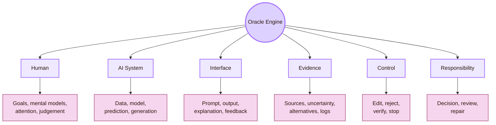

| Engine layer | Real meaning | Main question |
|---|---|---|
| Human | The user brings goals, prior knowledge, pressure, trust, and responsibility | What does the user think the AI is doing? |
| AI system | The model predicts, ranks, classifies, recommends, generates, or acts | What can the system do, and where can it fail? |
| Interface | The design frames prompts, outputs, explanations, warnings, and controls | Does the interface help the user judge the AI correctly? |
| Evidence | The user needs sources, uncertainty, alternatives, and logs | What makes the output checkable? |
| Control | The user needs edit, reject, undo, stop, and override routes | Can the human really intervene? |
| Responsibility | Decisions need visible ownership and repair paths | Who is accountable when the output causes an error? |

## Room identity

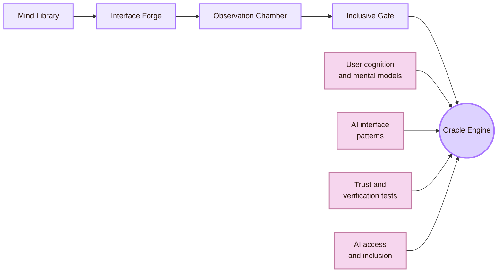

| Connected room | What it gives to the Oracle Engine | What the Oracle Engine gives back |
|---|---|---|
| [[../01_Understanding_the_User/Overview|Mind Library]] | Mental models, attention, memory, trust, learning, and user expectations | AI-specific questions about overtrust, undertrust, automation bias, and AI literacy |
| [[../02_System_Design/Overview|Interface Forge]] | Interface structure, prompts, feedback, controls, pages, diagrams, and implementation patterns | AI-specific design patterns such as source panels, uncertainty labels, output cards, and oversight controls |
| [[../03_Evaluating_the_Design/Overview|Observation Chamber]] | Evaluation methods, task evidence, validity, usability testing, and issue logs | AI-specific experiments for hallucination, source checking, explanation usefulness, trust, and control |
| [[../04_Accessibility_and_Accountability/Overview|Inclusive Gate]] | Accessibility, inclusion, assistive technology, and disability-centred design | AI-specific access risks such as biased summaries, wrong alternative text, inaccessible generated UI, and hidden automation |

## What this room protects

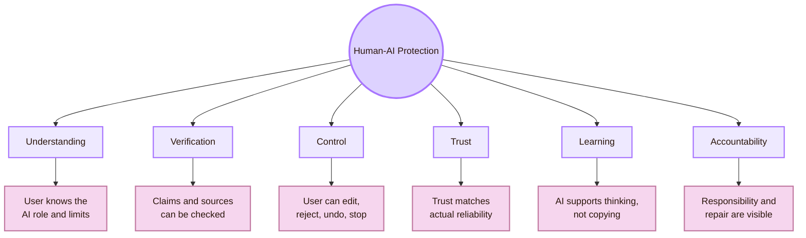

| Protection target | Design meaning | Cognishire example |
|---|---|---|
| Understanding | The user knows the AI role, capability, and limits | AI is a tutor and drafting assistant, not the final academic authority |
| Verification | AI claims can be checked against sources | UVT, Romania, CS2023, Microsoft, NIST, EU, ACM, and paper claims must be verified |
| Control | The user can change or reject output | Generated pages are drafts until human reviewed |
| Trust | User confidence matches actual reliability | A confident AI answer without source support is treated as risky |
| Learning | AI strengthens the student’s understanding | The student should be able to explain the page without copying |
| Accountability | The process records what was generated, checked, repaired, and still uncertain | GitHub, issue logs, claim status, and academic anchors support traceability |

## The Human-AI loop

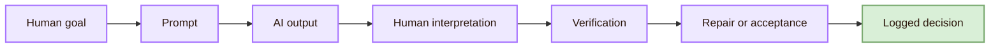

| Loop stage | Human-AI problem | Repair direction |
|---|---|---|
| Human goal | The user may ask for output without knowing the real task | Clarify goal, audience, constraints, and risk |
| Prompt | The prompt may omit context or source rules | Use prompt scaffolds and explicit source requirements |
| AI output | The output may be fluent, wrong, unsupported, biased, or incomplete | Separate draft text from verified claims |
| Human interpretation | The user may treat style as truth | Teach claim extraction and source checking |
| Verification | The user may skip checking because the answer looks polished | Require source panels and uncertainty labels |
| Repair or acceptance | The user may not know how to weaken or correct a claim | Provide edit, reject, and rewrite paths |
| Logged decision | Errors may disappear instead of becoming learning evidence | Keep issue logs, commit notes, and claim boundaries |

## Local, Romanian, and global route

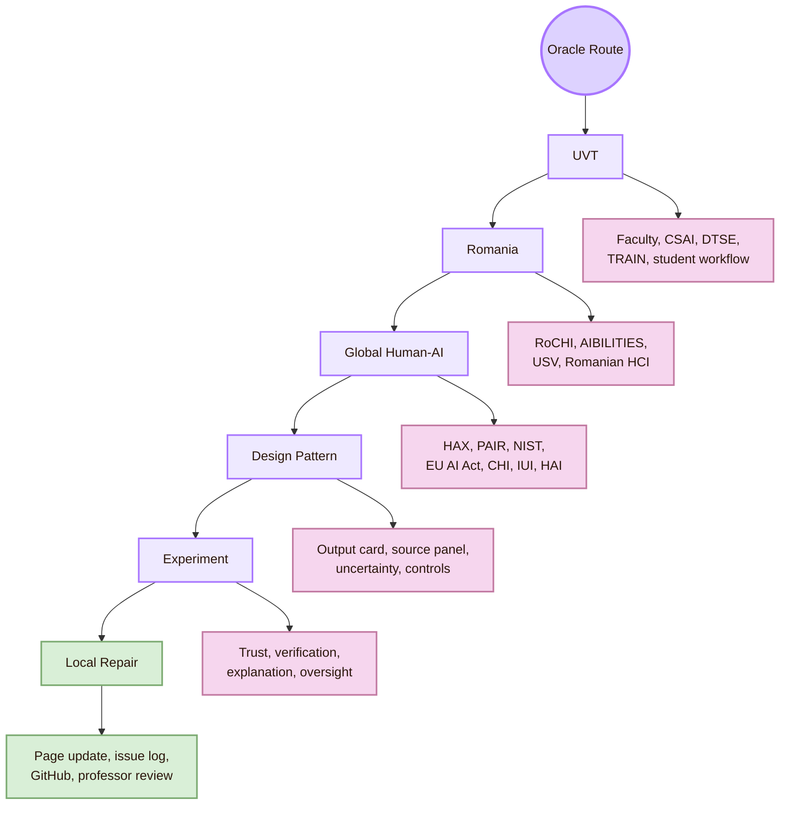

| Scale | What belongs here | Why it matters |
|---|---|---|
| UVT | Faculty of Informatics, CSAI, DTSE, TRAIN, AI and ML routes, student AI workflow, professor review | The project must be meaningful where it is made and judged |
| Romania | RoCHI, A(I)BILITIES, USV/MintViz, Romanian HCI, assistive technology, Romanian-language AI interaction | The map should not erase national HCI and AI-accessibility routes |
| Global Human-AI | Microsoft HAX, Google PAIR, Stanford HAI, NIST AI RMF, EU AI Act, CHI, IUI, HAI, FAccT, AIES | The map needs recognised methods for AI design, risk, oversight, and evaluation |
| Design pattern | Prompt scaffold, source panel, uncertainty badge, output card, issue log | Theory must become visible interface structure |
| Experiment | Trust calibration, source verification, explanation usefulness, automation bias, oversight | Claims about Human-AI quality need evidence |
| Local repair | Obsidian page edits, GitHub commits, professor feedback, source corrections | Human-AI work improves through visible correction |

## Page route board

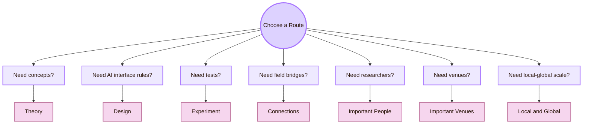

| Page | Oracle role | Use it when the question is... |
|---|---|---|
| [[Activities/Theory|Theory]] | Explains AI capability, mental models, uncertainty, trust calibration, explainability, oversight, automation bias, human-centred AI, and risk | Why is this a Human-AI Interaction problem? |
| [[Activities/Design|Design]] | Turns theory into output cards, prompt scaffolds, uncertainty signals, source panels, correction controls, and oversight workflows | What should the AI interface show and let users do? |
| [[Activities/Experiment|Experiment]] | Tests output quality, hallucination, prompt sensitivity, trust, explanation, oversight, automation bias, accessibility, and AI tutoring | What evidence shows whether humans use the AI appropriately? |
| [[Connections|Connections]] | Links Human-AI Interaction to HCI, AI, cognitive science, psychology, data, software, ethics, law, education, security, visualisation, and accessibility | Which fields explain this AI interaction? |
| [[Important People|Important People]] | Maps UVT, Romanian, and global researchers or routes | Whose work should I read? |
| [[Important Venues|Important Venues]] | Maps local, Romanian, and global venues | Where should I search for methods, papers, frameworks, and examples? |
| [[Local and Global|Local and Global]] | Connects UVT, Romania, and global Human-AI research | What does Human-AI Interaction mean locally, nationally, and globally? |

## Oracle interface components

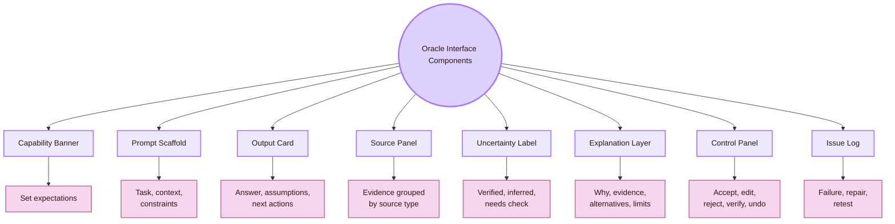

| Component | Purpose in Human-AI Interaction | Cognishire version |
|---|---|---|
| Capability banner | Prevent unrealistic expectations before output appears | AI can draft and structure, but sources must be verified |
| Prompt scaffold | Helps the user give task, context, constraints, source rules, and format | Room, page type, UVT layer, Romania layer, global sources, diagram rules |
| Output card | Makes AI output inspectable instead of final-looking | Draft, assumptions, sources, uncertainty, next actions |
| Source panel | Separates official curriculum, local, national, research, policy, and practice sources | Academic anchors grouped by function |
| Uncertainty label | Marks weak, current, inferred, or high-risk claims | Verified, partly supported, needs check, unsupported, do not use |
| Explanation layer | Helps the user decide what to do next | Why this source, why this design, what to check |
| Control panel | Preserves human agency | Edit, reject, regenerate, verify, undo |
| Issue log | Turns failure into repair evidence | Unsupported source, overclaim, hallucination, broken local route |

## Trust and verification stack

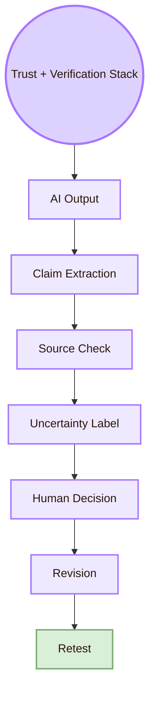

| Stack layer | What the user does |
|---|---|
| AI output | Reads the generated answer or page section |
| Claim extraction | Marks factual claims, current claims, people, venues, departments, and source-dependent statements |
| Source check | Opens official or trusted sources and compares the exact claim |
| Uncertainty label | Marks verified, partly supported, needs check, unsupported, or do not use |
| Human decision | Accepts, edits, weakens, rejects, or asks for repair |
| Revision | Updates the page or design |
| Retest | Checks whether the same failure returns |

## AI failure types

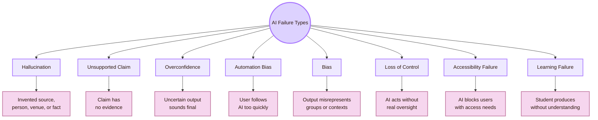

| Failure | Repair pattern |
|---|---|
| Hallucination | Verify official source, remove invented claim, log issue |
| Unsupported claim | Add evidence or weaken wording |
| Overconfidence | Add uncertainty and verification action |
| Automation bias | Show alternatives, require source checking, slow down acceptance |
| Bias | Check who is missing, harmed, stereotyped, or misrepresented |
| Loss of control | Add preview, confirmation, undo, stop, and logs |
| Accessibility failure | Check AI output and interface against accessibility methods |
| Learning failure | Ask the student to explain and revise in their own words |

## Human oversight ladder

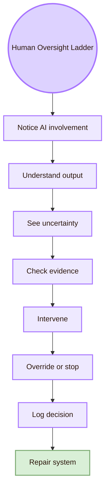

| Oversight layer | Meaning |
|---|---|
| Notice AI involvement | The user knows AI shaped the output |
| Understand output | The user can interpret what the output claims |
| See uncertainty | The user knows what may be wrong or weak |
| Check evidence | The user can inspect sources or supporting data |
| Intervene | The user can edit, reject, or redirect |
| Override or stop | The user can block an action or reverse it |
| Log decision | The system records what happened |
| Repair system | Future outputs or templates improve |

Human oversight is not real if the human has responsibility without information, time, authority, or controls.

## Minimal Oracle trial

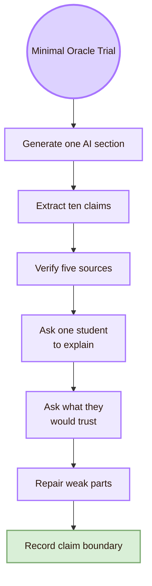

| Trial step | Concrete action |
|---|---|
| Generate one AI section | Ask AI to draft a short Human-AI page part |
| Extract ten claims | Mark all factual, source-dependent, current, and local claims |
| Verify five sources | Check official or trusted sources |
| Ask one student to explain | Test whether the content supports learning |
| Ask what they would trust | Detect overtrust and unchecked copying |
| Repair weak parts | Fix unsupported claims, unclear diagrams, or overconfident wording |
| Record claim boundary | State what the trial can and cannot prove |

## Source compass

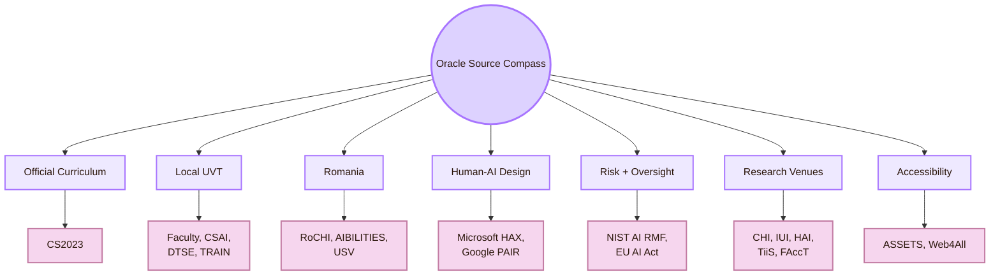

| Source type | Use it for |
|---|---|
| CS2023 | Official Computer Science curriculum grounding |
| UVT | Local institutional, department, programme, and research grounding |
| Romania | National HCI, accessibility, AI, language, and project grounding |
| Microsoft HAX and Google PAIR | Applied Human-AI design patterns |
| NIST AI RMF and EU AI Act | Risk, governance, oversight, and accountability |
| CHI, IUI, HAI, TiiS, FAccT | Peer-reviewed Human-AI research venues |
| ASSETS and Web4All | AI accessibility and inclusive technology routes |

## What this room must fix in Cognishire

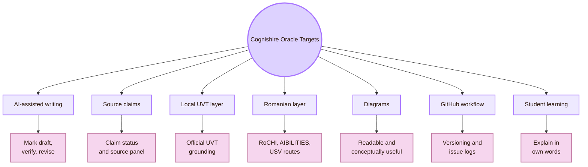

| Cognishire issue | Oracle requirement |
|---|---|
| AI writes text | Treat it as draft until verified and understood |
| AI gives sources | Check whether each source supports the exact claim |
| AI maps local people or departments | Use official UVT pages and cautious wording |
| AI maps Romania | Use RoCHI, A(I)BILITIES, USV, and verified Romanian sources |
| AI creates diagrams | Test whether diagrams improve understanding |
| AI helps with GitHub | Preview commands, track changes, and keep rollback possible |
| AI supports learning | The student must explain the content without copying |
| AI acts confidently | Add uncertainty labels and claim boundaries |

## Local and global synthesis

The Oracle Engine exists to keep AI from becoming invisible authority inside the HCI map. It asks whether the user understands the AI role, whether sources support the claims, whether uncertainty is visible, whether the human can intervene, and whether final responsibility remains human.

Locally, this means UVT: Faculty of Informatics, CSAI, DTSE, TRAIN, AI and ML routes, software workflows, student use, professor review, Obsidian, GitHub, and source verification.

Nationally, this means Romania: RoCHI, A(I)BILITIES, USV/MintViz, Romanian HCI, Romanian AI accessibility, assistive technologies, and Romanian-language AI interaction.

Globally, this means CS2023, Microsoft Human-AI guidelines, Google PAIR, Stanford HAI, NIST AI RMF, EU AI Act human oversight, CHI, IUI, HAI, TiiS, FAccT, AIES, ASSETS, and Web4All.

The central question of this room is:

> How can AI help the human think, design, verify, and learn without hiding uncertainty, reducing agency, or shifting responsibility away from humans?

Back to [[00_Index/Human-Computer Interaction|The five rooms of HCI]].

## Academic anchors

| Route | Source |
|---|---|
| CS2023 HCI basis | [CS2023 HCI Version Gamma](https://csed.acm.org/wp-content/uploads/2023/09/HCI-Version-Gamma.pdf) |
| CS2023 Artificial Intelligence basis | [CS2023 AI SIGCSE 2022 version](https://csed.acm.org/knowledge-areas-intelligent-systems-ai-sigcse-2022-version/) |
| UVT Faculty of Informatics | [Faculty of Informatics UVT](https://info.uvt.ro/en/) |
| UVT Faculty departments | [Faculty of Informatics Departments](https://info.uvt.ro/en/departamente/) |
| UVT CSAI Department | [Department of Computational Sciences and Artificial Intelligence](https://info.uvt.ro/en/departamente/csai/) |
| UVT DTSE Department | [Department of Digital Technologies and Software Engineering](https://info.uvt.ro/en/departamente/dtse/) |
| UVT AI and ML research route | [Artificial Intelligence and Machine Learning](https://research.info.uvt.ro/artificial-intelligence-and-machine-learning/) |
| UVT TRAIN | [Timișoara Research in Artificial Intelligence Network](https://train.uvt.ro/) |
| UVT TRAIN launch | [UVT launches TRAIN](https://uvt.ro/en/comunicate-presa/uvt-lanseaza-noul-hub-de-inteligenta-artificiala-ai-timisoara-research-in-artificial-intelligence-network-train/) |
| UVT Artificial Intelligence bachelor route | [Artificial Intelligence - UVT admission](https://admission.uvt.ro/study-programmes/artificial-intelligence/) |
| UVT Artificial Intelligence and Distributed Computing master | [AIDC master](https://info.uvt.ro/en/master/artificial-intelligence-distributed-computing/) |
| UVT Scientific Seminar | [Scientific Seminar](https://research.info.uvt.ro/scientific-seminar/) |
| RoCHI proceedings | [Romanian HCI proceedings](https://rochi.utcluj.ro/proceedings/en/) |
| RoCHI DBLP route | [RoCHI on DBLP](https://dblp.org/db/conf/rochi/index) |
| Radu-Daniel Vatavu | [Radu-Daniel Vatavu homepage](https://raduvatavu.usv.ro/) |
| Ovidiu-Andrei Schipor | [Ovidiu-Andrei Schipor homepage](https://www.eed.usv.ro/~schipor/) |
| A(I)BILITIES project | [A(I)BILITIES](https://aibilities.ro/en/about/) |
| ASSIST Software A(I)BILITIES | [A(I)BILITIES - Generative AI for Digital Accessibility](https://assist-software.net/project/aibilities) |
| MintViz A(I)BILITIES route | [MintViz A(I)BILITIES](https://mintviz.usv.ro/projects/A%28I%29BILITIES/index.php) |
| Microsoft Human-AI guidelines | [Guidelines for Human-AI Interaction](https://www.microsoft.com/en-us/research/project/guidelines-for-human-ai-interaction/) |
| Microsoft Human-AI guidelines paper | [Guidelines for Human-AI Interaction PDF](https://www.microsoft.com/en-us/research/wp-content/uploads/2019/01/Guidelines-for-Human-AI-Interaction-camera-ready.pdf) |
| Microsoft HAX Toolkit | [HAX Toolkit AI Guidelines](https://www.microsoft.com/en-us/haxtoolkit/ai-guidelines/) |
| Google People + AI Guidebook | [PAIR Guidebook](https://pair.withgoogle.com/guidebook/) |
| Google People + AI Research | [PAIR](https://pair.withgoogle.com/) |
| Stanford HAI | [Stanford HAI](https://hai.stanford.edu/) |
| Stanford HAI human-centred AI definition | [Brief Definitions of Key Terms in AI](https://hai.stanford.edu/policy/brief-definitions-of-key-terms-in-ai) |
| NIST AI Risk Management Framework | [NIST AI RMF](https://www.nist.gov/itl/ai-risk-management-framework) |
| NIST AI RMF Core | [Govern, Map, Measure, Manage](https://airc.nist.gov/airmf-resources/airmf/5-sec-core/) |
| EU AI Act | [Regulation (EU) 2024/1689](https://eur-lex.europa.eu/eli/reg/2024/1689/oj/eng) |
| EU AI Act human oversight | [Article 14: Human Oversight](https://artificialintelligenceact.eu/article/14/) |
| ACM IUI | [ACM Conference on Intelligent User Interfaces](https://iui.acm.org/) |
| ACM CHI | [ACM CHI](https://dl.acm.org/conference/chi) |
| ACM HAI | [Human-Agent Interaction](https://hai-conference.net/) |
| ACM TiiS | [ACM Transactions on Interactive Intelligent Systems](https://dl.acm.org/journal/TIIS) |
| ACM FAccT | [ACM FAccT](https://facctconference.org/) |
| AAAI/ACM AIES | [AI, Ethics, and Society](https://www.aies-conference.com/) |
| ACM ASSETS | [ASSETS Conference](https://www.sigaccess.org/assets/) |
| Web4All | [International Web for All Conference](https://www.w4a.info/) |
| AI Incident Database | [AI Incident Database](https://incidentdatabase.ai/) |

^overview-human-ai-interaction-end
