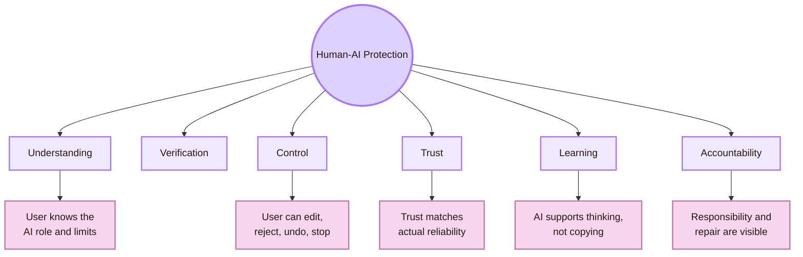
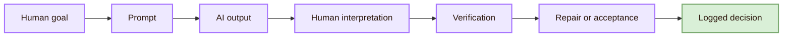
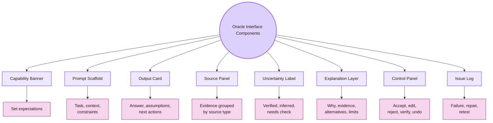
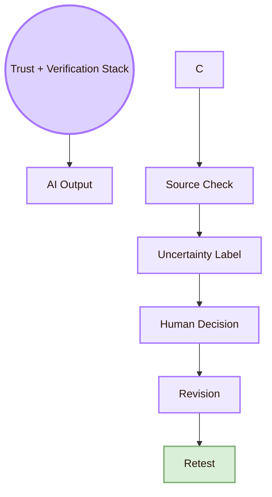
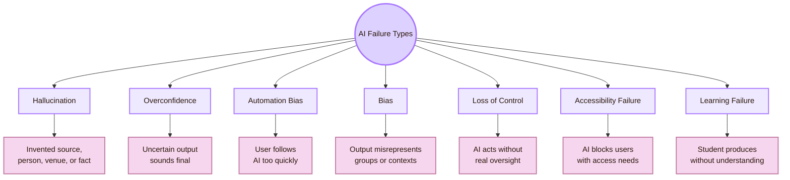
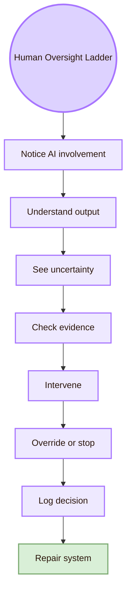
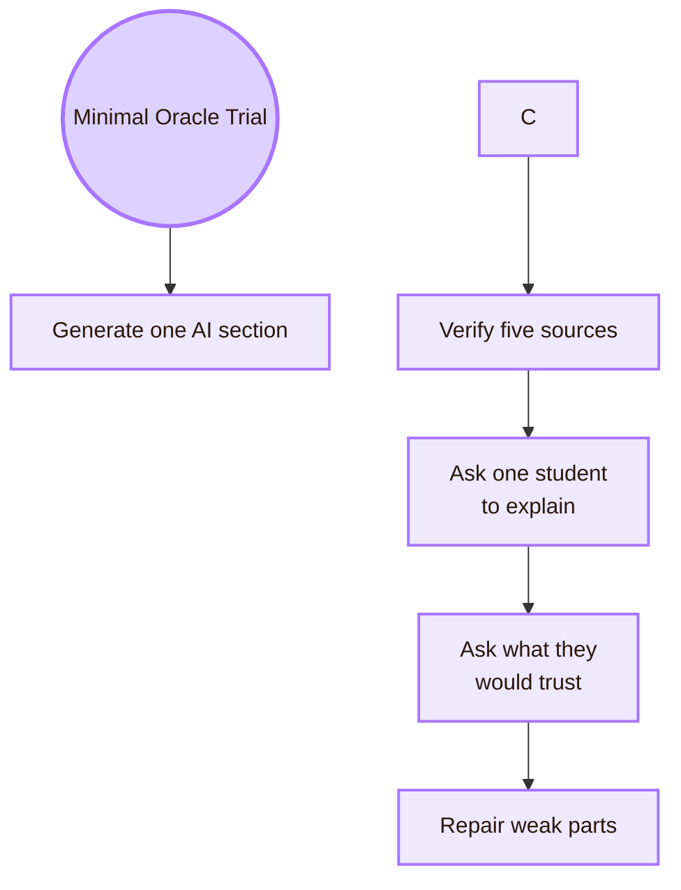
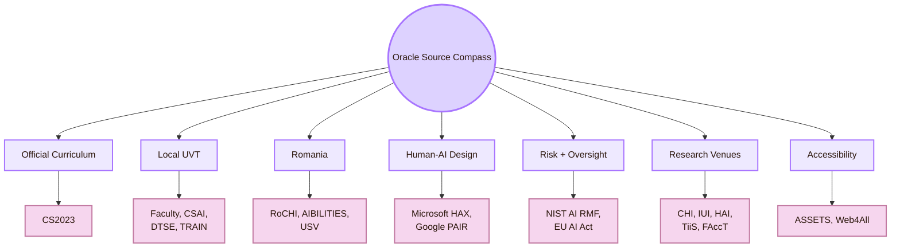

![[cybercity.gif|1000]]
# Human-AI Interaction

This page does not treat AI as magic or authority. An AI system is shaped by data, models, prompts, deployment choices, interface design, organisational rules, and user interpretation. The human still has to judge the output and decide what to do with it.

The Romanian dimension includes **RoCHI**, **A(I)BILITIES**, **USV/MintViz**, Romanian HCI, Romanian AI accessibility, assistive technology, and Romanian-language interaction.

The global dimension includes **Microsoft Human-AI guidelines**, **Google People + AI Research**, **Stanford HAI**, **NIST AI Risk Management Framework**, **EU AI Act human oversight**, **CHI**, **IUI**, **HAI**, **TiiS**, **FAccT**, **AIES**, **ASSETS**, and **Web4All**.

> [!quote] Oracle rule
> An AI interface is risky when it sounds certain but hides uncertainty. A responsible Human-AI system makes capability, evidence, limits, control, and responsibility visible.

## What this area is about

Human-AI Interaction asks what happens when AI enters the interaction loop. The core issue is not only whether the AI output is accurate. The issue is how the output changes human judgement.

- **Capability:** simple meaning: What can the AI actually do?; student question: What should I expect from this system?
- **Mental model:** simple meaning: What does the user think the AI is doing?; student question: Am I treating a prediction as a fact?
- **Uncertainty:** simple meaning: Where can the output be wrong or incomplete?; student question: What needs checking?
- **Trust:** simple meaning: Does trust match reliability?; student question: Am I copying too quickly or rejecting useful support?
- **Explanation:** simple meaning: Does the system help me judge the answer?; student question: Does the explanation help, or does it only sound impressive?
- **Control:** simple meaning: Can the user edit, reject, stop, or override?; student question: Can I intervene before the output affects the study?
- **Accountability:** simple meaning: Who owns the final decision?; student question: Can I explain and defend this work myself?

## Engine entrance

- **Human:** The user brings goals, prior knowledge, pressure, trust, and responsibility; What does the user think the AI is doing?
- **AI system:** The model predicts, ranks, classifies, recommends, generates, or acts; What can the system do, and where can it fail?
- **Evidence:** The user needs sources, uncertainty, alternatives, and logs; What makes the output checkable?
- **Control:** The user needs edit, reject, undo, stop, and override routes; Can the human really intervene?
- **Responsibility:** Decisions need visible ownership and repair paths; Who is accountable when the output causes an error?

## Area identity

## What this area protects

## The Human-AI loop

| Loop stage | Human-AI problem | Repair direction |
|---|---|---|
| Human goal | The user may ask for output without knowing the real task | Clarify goal, audience, constraints, and risk |
| Prompt | The prompt may omit context or source rules | Use prompt scaffolds and explicit source requirements |
| Verification | The user may skip checking because the answer looks polished | Require source panels and uncertainty labels |

## Local, Romanian, and global route

## Oracle interface components

## Trust and verification stack

- **AI output:** Reads the generated answer or page section
- **Uncertainty label:** Marks verified, partly supported, needs check, unsupported, or do not use
- **Human decision:** Accepts, edits, weakens, rejects, or asks for repair
- **Revision:** Updates the page or design
- **Retest:** Checks whether the same failure returns

## AI failure types

- **Overconfidence:** Add uncertainty and verification action
- **Automation bias:** Show alternatives, require source checking, slow down acceptance
- **Bias:** Check who is missing, harmed, stereotyped, or misrepresented
- **Loss of control:** Add preview, confirmation, undo, stop, and logs
- **Accessibility failure:** Check AI output and interface against accessibility methods
- **Learning failure:** Ask the student to explain and revise in their own words

## Human oversight ladder

- **Notice AI involvement:** The user knows AI shaped the output
- **See uncertainty:** The user knows what may be wrong or weak
- **Check evidence:** The user can inspect sources or supporting data
- **Intervene:** The user can edit, reject, or redirect
- **Override or stop:** The user can block an action or reverse it
- **Log decision:** The system records what happened
- **Repair system:** Future outputs or templates improve

Human oversight is not real if the human has responsibility without information, time, authority, or controls.

## Minimal Oracle trial

- **Generate one AI section:** Ask AI to draft a short Human-AI page part
- **Verify five sources:** Check official or trusted sources
- **Ask one student to explain:** Test whether the content supports learning
- **Ask what they would trust:** Detect overtrust and unchecked copying

## Source compass

| Source type | Use it for |
|---|---|
| CS2023 | Official Computer Science curriculum grounding |
| UVT | Local institutional, department, programme, and research grounding |
| Romania | National HCI, accessibility, AI, language, and local grounding |
| Microsoft HAX and Google PAIR | Applied Human-AI design patterns |
| NIST AI RMF and EU AI Act | Risk, governance, oversight, and accountability |
| CHI, IUI, HAI, TiiS, FAccT | Peer-reviewed Human-AI research venues |
| ASSETS and Web4All | AI accessibility and inclusive technology routes |

## Academic anchors

| Route | Source |
|---|---|
| CS2023 HCI basis | [CS2023 HCI Version Gamma](https://csed.acm.org/wp-content/uploads/2023/09/HCI-Version-Gamma.pdf) |
| CS2023 Artificial Intelligence basis | [CS2023 AI SIGCSE 2022 version](https://csed.acm.org/knowledge-areas-intelligent-systems-ai-sigcse-2022-version/) |
| UVT Faculty of Informatics | [Faculty of Informatics UVT](https://info.uvt.ro/en/) |
| UVT Faculty departments | [Faculty of Informatics Departments](https://info.uvt.ro/en/departamente/) |
| UVT CSAI Department | [Department of Computational Sciences and Artificial Intelligence](https://info.uvt.ro/en/departamente/csai/) |
| UVT DTSE Department | [Department of Digital Technologies and Software Engineering](https://info.uvt.ro/en/departamente/dtse/) |
| UVT AI and ML research route | [Artificial Intelligence and Machine Learning](https://research.info.uvt.ro/artificial-intelligence-and-machine-learning/) |
| UVT TRAIN | [Timișoara Research in Artificial Intelligence Network](https://train.uvt.ro/) |
| UVT TRAIN launch | [UVT launches TRAIN](https://uvt.ro/en/comunicate-presa/uvt-lanseaza-noul-hub-de-inteligenta-artificiala-ai-timisoara-research-in-artificial-intelligence-network-train/) |
| UVT Artificial Intelligence bachelor route | [Artificial Intelligence - UVT admission](https://admission.uvt.ro/study-programmes/artificial-intelligence/) |
| UVT Artificial Intelligence and Distributed Computing master | [AIDC master](https://info.uvt.ro/en/master/artificial-intelligence-distributed-computing/) |
| UVT Scientific Seminar | [Scientific Seminar](https://research.info.uvt.ro/scientific-seminar/) |
| RoCHI proceedings | [Romanian HCI proceedings](https://rochi.utcluj.ro/proceedings/en/) |
| RoCHI DBLP route | [RoCHI on DBLP](https://dblp.org/db/conf/rochi/index) |
| Radu-Daniel Vatavu | [Radu-Daniel Vatavu homepage](https://raduvatavu.usv.ro/) |
| Ovidiu-Andrei Schipor | [Ovidiu-Andrei Schipor homepage](https://www.eed.usv.ro/~schipor/) |
| A(I)BILITIES route | [A(I)BILITIES](https://aibilities.ro/en/about/) |
| ASSIST Software A(I)BILITIES | [A(I)BILITIES - Generative AI for Digital Accessibility](https://assist-software.net/project/aibilities) |
| MintViz A(I)BILITIES route | [MintViz A(I)BILITIES](https://mintviz.usv.ro/projects/A%28I%29BILITIES/index.php) |
| Microsoft Human-AI guidelines | [Guidelines for Human-AI Interaction](https://www.microsoft.com/en-us/research/project/guidelines-for-human-ai-interaction/) |
| Microsoft Human-AI guidelines paper | [Guidelines for Human-AI Interaction PDF](https://www.microsoft.com/en-us/research/wp-content/uploads/2019/01/Guidelines-for-Human-AI-Interaction-camera-ready.pdf) |
| Microsoft HAX Toolkit | [HAX Toolkit AI Guidelines](https://www.microsoft.com/en-us/haxtoolkit/ai-guidelines/) |
| Google People + AI Guidebook | [PAIR Guidebook](https://pair.withgoogle.com/guidebook/) |
| Google People + AI Research | [PAIR](https://pair.withgoogle.com/) |
| Stanford HAI | [Stanford HAI](https://hai.stanford.edu/) |
| Stanford HAI human-centred AI definition | [Brief Definitions of Key Terms in AI](https://hai.stanford.edu/policy/brief-definitions-of-key-terms-in-ai) |
| NIST AI Risk Management Framework | [NIST AI RMF](https://www.nist.gov/itl/ai-risk-management-framework) |
| NIST AI RMF Core | [Govern, Map, Measure, Manage](https://airc.nist.gov/airmf-resources/airmf/5-sec-core/) |
| EU AI Act | [Regulation (EU) 2024/1689](https://eur-lex.europa.eu/eli/reg/2024/1689/oj/eng) |
| EU AI Act human oversight | [Article 14: Human Oversight](https://artificialintelligenceact.eu/article/14/) |
| ACM IUI | [ACM Conference on Intelligent User Interfaces](https://iui.acm.org/) |
| ACM CHI | [ACM CHI](https://dl.acm.org/conference/chi) |
| ACM HAI | [Human-Agent Interaction](https://hai-conference.net/) |
| ACM TiiS | [ACM Transactions on Interactive Intelligent Systems](https://dl.acm.org/journal/TIIS) |
| ACM FAccT | [ACM FAccT](https://facctconference.org/) |
| AAAI/ACM AIES | [AI, Ethics, and Society](https://www.aies-conference.com/) |
| ACM ASSETS | [ASSETS Conference](https://www.sigaccess.org/assets/) |
| Web4All | [International Web for All Conference](https://www.w4a.info/) |
| AI Incident Database | [AI Incident Database](https://incidentdatabase.ai/) |

^overview-human-ai-interaction-end
