# Important Venues

Back to [[Overview|The Oracle Engine]].

> [!abstract] Oracle Venue Atlas
> This page maps the places where **Human-AI Interaction** is studied, designed, tested, criticised, and governed. It includes local UVT routes, Romanian HCI and AI-accessibility routes, international conferences, journals, research institutes, standards bodies, design toolkits, and policy sources.

The fantasy name is **Oracle Venue Atlas**.  
The real academic topic is **Human-AI Interaction**.  
The CS2023 bridge is **Human-Computer Interaction + Artificial Intelligence + Society, Ethics, and Professionalism**.  
The real-life meaning is **knowing where to search when the question is how people should understand, verify, trust, correct, control, and remain responsible when using AI systems**.

This page is not a generic AI conference list. A technical machine-learning venue may be useful, but the Oracle Engine focuses on the meeting point between AI and people. The best sources for this page study intelligent user interfaces, human-centred AI, explainable AI, Human-AI collaboration, human-agent interaction, trust calibration, AI accessibility, AI literacy, and responsible AI governance.

> [!quote] Atlas rule
> A venue belongs in the Oracle Engine when it helps answer this question: **what happens to human judgement, trust, control, access, and responsibility when AI becomes part of the interaction?**

## How to use this page

| If your question is about... | Start with... | Then check... |
|---|---|---|
| AI interface behaviour | IUI, CHI, Microsoft HAX, Google PAIR | TiiS, TOCHI |
| Trust, verification, and uncertainty | CHI, IUI, TiiS | FAccT, NIST AI RMF, VIS |
| Explainable AI for users | IUI, CHI, TiiS | VIS, FAccT, AIES |
| AI in work and organisations | CSCW, CHIWORK, CHI | ICSE, DIS |
| Agents, chatbots, robots, or assistants | HAI, HRI, IVA, ICMI | ACL/EMNLP, CHI |
| AI accessibility | ASSETS, Web4All, A(I)BILITIES | CHI, IUI, XR Access |
| AI education and AI literacy | SIGCSE, AIED, Learning at Scale | CHI, LAK, EDM |
| Responsible AI and governance | FAccT, AIES, NIST AI RMF, EU AI Act | AI Incident Database, Partnership on AI |
| Local UVT grounding | UVT Faculty of Informatics, CSAI, DTSE, TRAIN | UVT seminar and AI/ML routes |
| Romanian grounding | RoCHI, A(I)BILITIES, USV/MintViz | Romanian accessibility and HCI work |

## Venue Atlas Map

```mermaid
flowchart TB
    A((Oracle Venue Atlas))

    A --> B[Local UVT Routes]
    A --> C[Romanian HCI + AI Routes]
    A --> D[Core Human-AI Venues]
    A --> E[Responsible AI Venues]
    A --> F[Explainable AI + Visualisation]
    A --> G[Work + Collaboration]
    A --> H[Agents + Conversation]
    A --> I[Accessibility + Inclusive AI]
    A --> J[Education + AI Literacy]
    A --> K[Journals + Toolkits]

    B --> B1[CSAI, DTSE,<br/>TRAIN, seminars]
    C --> C1[RoCHI, A(I)BILITIES,<br/>USV / MintViz]
    D --> D1[CHI, IUI,<br/>HAI, TiiS]
    E --> E1[FAccT, AIES,<br/>NIST, EU AI Act]
    F --> F1[IUI, CHI,<br/>VIS, TiiS]
    G --> G1[CSCW, CHIWORK,<br/>DIS, ICSE]
    H --> H1[HAI, HRI,<br/>IVA, ACL]
    I --> I1[ASSETS, Web4All,<br/>XR Access]
    J --> J1[SIGCSE, AIED,<br/>L@S, LAK]
    K --> K1[TOCHI, PACM HCI,<br/>HAX, PAIR]

    classDef center fill:#ddd2ff,stroke:#a875ff,color:#2b160b,stroke-width:3px;
    classDef node fill:#eee9ff,stroke:#a875ff,color:#2b160b,stroke-width:2px;
    classDef detail fill:#f6d6ee,stroke:#c27aa2,color:#2b160b,stroke-width:2px;

    class A center;
    class B,C,D,E,F,G,H,I,J,K node;
    class B1,C1,D1,E1,F1,G1,H1,I1,J1,K1 detail;
```

| Venue territory | Real meaning | Use it when the question is about... |
|---|---|---|
| Local UVT routes | The local university context where AI, ML, software systems, seminars, and student projects exist | grounding the project in the place where it is built and reviewed |
| Romanian HCI + AI routes | National HCI, AI accessibility, assistive technology, and Romanian-language context | avoiding a page that is only imported from global sources |
| Core Human-AI venues | International HCI venues focused on AI-facing interfaces | design, evaluation, trust, explanation, and intelligent interaction |
| Responsible AI venues | Fairness, accountability, transparency, risk, policy, and social impact | harms, oversight, audit, governance, and power |
| Explainable AI + visualisation | Explanations, interpretability, evidence displays, and uncertainty | helping users judge AI output |
| Work + collaboration | AI in teams, organisations, software work, and knowledge work | how AI changes human work practices |
| Agents + conversation | Human-agent, robot, virtual-agent, multimodal, and dialogue interaction | chatbots, assistants, robots, embodied systems, and agentic AI |
| Accessibility + inclusive AI | AI for disabled users and AI systems that affect access | whether AI supports or blocks participation |
| Education + AI literacy | AI tutoring, student use, learning analytics, and academic integrity | whether AI helps students learn or only produce work |
| Journals + toolkits | Long-form research and practical design guidance | deeper literature and design patterns |

## CS2023 Venue Gate

Human-AI Interaction is best treated as a bridge across CS2023 areas. It belongs to HCI because people interact with the system. It belongs to AI because the system predicts, ranks, recommends, classifies, or generates. It belongs to ethics because AI can affect rights, fairness, privacy, safety, and accountability. It belongs to software engineering because AI systems must be deployed, monitored, updated, and repaired.

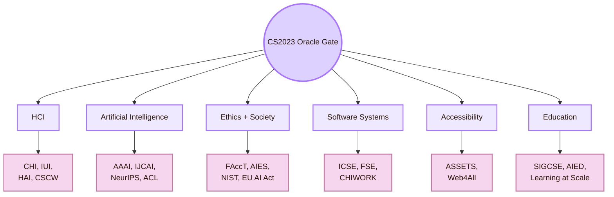

| CS2023 route | Best venue route | What to look for |
|---|---|---|
| HCI Design | CHI, IUI, DIS, UIST, HAI | interface patterns, feedback, prompt design, controls |
| HCI Evaluation | CHI, IUI, CSCW, TiiS, TOCHI | user studies, trust measures, explanation studies, oversight tests |
| Artificial Intelligence | AAAI, IJCAI, NeurIPS, ICML, ICLR, ACL | model capability, uncertainty, language systems, safety, technical limits |
| Ethics and Accountability | FAccT, AIES, NIST AI RMF, EU AI Act | risk, harm, fairness, governance, human oversight |
| Software Engineering | ICSE, FSE, CHIWORK, CSCW | AI as deployed software, code assistants, logs, monitoring, reliability |
| Accessibility | ASSETS, Web4All, XR Access, A(I)BILITIES | inclusive AI, assistive AI, access barriers, disabled-user experience |
| Education | SIGCSE, AIED, Learning at Scale, LAK, EDM | AI literacy, tutoring, student-AI use, learning analytics |

## Local UVT Venue Layer

The local layer begins with UVT. These are not all Human-AI research venues in a strict sense. They are local routes that can support Human-AI questions inside the real project context.

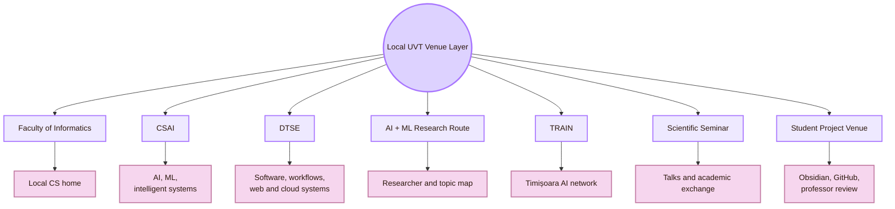

| Local UVT route | Why it matters for Human-AI Interaction |
|---|---|
| UVT Faculty of Informatics | Local Computer Science home of the project |
| CSAI | Local route for artificial intelligence, machine learning, intelligent systems, data, prediction, and AI education |
| DTSE | Local route for AI as software: workflows, web systems, distributed systems, cloud, implementation, and maintainability |
| UVT AI and ML research route | Local map for AI/ML researchers and topics |
| TRAIN | Local AI network route for Timișoara and UVT AI visibility |
| Scientific Seminar | Local academic exchange route, useful for AI and explainable-AI topics when relevant talks appear |
| Artificial Intelligence bachelor programme | Local teaching route for AI foundations relevant to Human-AI Interaction |
| Artificial Intelligence and Distributed Computing master | Local route for AI, distributed systems, cloud, and reliable intelligent systems |
| Obsidian/GitHub project context | The immediate venue where AI-assisted source verification, design, and accountability are tested |
| Professor review | The local evaluation venue where the AI-assisted project must be academically inspectable |

> [!warning] Local wording rule
> Do not claim that UVT has a dedicated Human-AI Interaction venue unless an official source says so. Use the safer phrase: **UVT routes that can support Human-AI Interaction questions**.

## Romanian Venue Layer

The Romanian layer keeps the Oracle Engine grounded in national HCI and accessibility-related AI work. It should be used carefully. Some routes are direct HCI routes. Some are adjacent routes that become relevant when the topic is AI accessibility, assistive technology, or Romanian-language interaction.

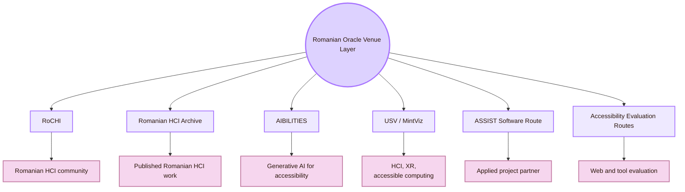

| Romanian route | What it contributes |
|---|---|
| RoCHI proceedings | National HCI route for Romanian interactive systems, usability, accessibility, and HCI education |
| Romanian HCI community | Keeps the project from being only global and imported |
| A(I)BILITIES | Romanian route for generative AI and personalised digital accessibility |
| USV / MintViz | Route for HCI, XR, accessible computing, gesture interaction, and intelligent interaction |
| ASSIST Software A(I)BILITIES page | Applied Romanian project route for generative AI and digital accessibility |
| Romanian accessibility evaluation papers | Evidence route for web accessibility, tools, public systems, and university websites |
| Romanian language context | Localisation, terminology, translation accuracy, and cognitive access |

## Core Human-AI Venues

These are the central international routes for the Oracle Engine.

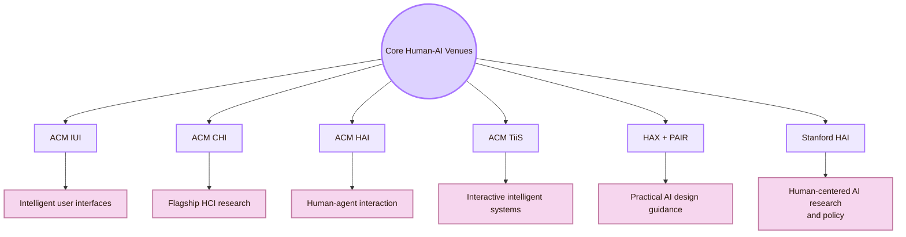

| Venue | What it contributes |
|---|---|
| [ACM IUI](https://iui.acm.org/) | Central conference route for intelligent user interfaces at the intersection of AI and HCI |
| [ACM CHI](https://dl.acm.org/conference/chi) | Flagship HCI venue for AI interaction, design, evaluation, accessibility, trust, and user studies |
| [ACM HAI](https://hai-conference.net/) | Human-Agent Interaction route for social agents, software agents, robots, chatbots, and agentic systems |
| [ACM Transactions on Interactive Intelligent Systems](https://dl.acm.org/journal/TIIS) | Journal route for interactive systems that use machine intelligence |
| [Microsoft HAX Toolkit](https://www.microsoft.com/en-us/haxtoolkit/) | Practical Human-AI design guidance for user-facing AI products |
| [Google People + AI Guidebook](https://pair.withgoogle.com/guidebook/) | Practical guidance for designing human-centered AI products |
| [Stanford HAI](https://hai.stanford.edu/) | Institute route for human-centered AI research, education, policy, and public discussion |

**Real-life translation:** use this gate when the page is about prompts, AI outputs, uncertainty, trust, explanations, source verification, AI roles, user control, and intelligent interface design.

## Responsible AI and Accountability Venues

These venues focus on fairness, accountability, transparency, ethics, governance, harm, risk, and social consequences.

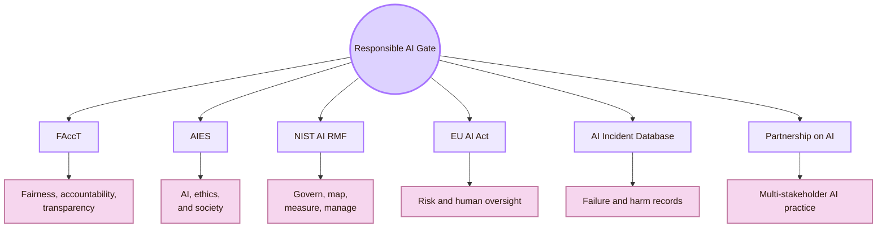

| Venue / body | Use it for |
|---|---|
| [ACM FAccT](https://facctconference.org/) | Fairness, accountability, transparency, sociotechnical systems, and algorithmic harms |
| [AAAI/ACM AIES](https://www.aies-conference.com/) | AI ethics and society, including social, legal, technical, and policy questions |
| [NIST AI RMF](https://www.nist.gov/itl/ai-risk-management-framework) | AI risk management vocabulary and the Govern, Map, Measure, Manage structure |
| [EU AI Act](https://digital-strategy.ec.europa.eu/en/policies/regulatory-framework-ai) | Risk-based AI regulation in the EU and human-centred AI policy context |
| [EU AI Act Article 14](https://artificialintelligenceact.eu/article/14/) | Human oversight requirements for high-risk AI systems |
| [AI Incident Database](https://incidentdatabase.ai/) | Case evidence about AI failures and harms |
| [Partnership on AI](https://partnershiponai.org/) | Multi-stakeholder guidance and responsible AI practice |

**Real-life translation:** use this gate when an AI system can affect fairness, trust, power, privacy, safety, human oversight, or responsibility.

## Explainable AI and Visualisation Venues

Explainability is not only a model property. It is also a communication problem. The interface must help the user understand enough to make a better judgement.

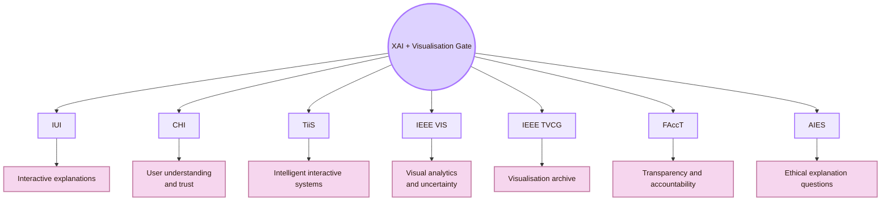

| Venue | Best use |
|---|---|
| IUI | Explanations inside intelligent interfaces |
| CHI | User studies of explanation usefulness, trust, mental models, and decision support |
| TiiS | Long-form work on interactive intelligent systems and XAI |
| IEEE VIS | Visual analytics, model interpretation, and uncertainty visualisation |
| IEEE TVCG | Archival visualisation research |
| FAccT | Explanations tied to fairness, accountability, transparency, and social impact |
| AIES | Explanations tied to ethics, policy, and governance |

**Real-life translation:** use this gate when the question is: **how should the system explain itself so a human can make a better decision?**

## Human-AI Work and Collaboration Venues

AI often enters real work: writing, software development, medicine, education, data analysis, design, administration, and teamwork.

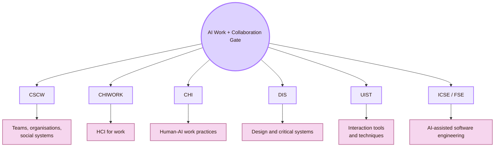

| Venue | Use it for |
|---|---|
| [ACM CSCW](https://cscw.acm.org/) | AI in organisations, collaboration, social systems, teams, and platforms |
| [CHIWORK](https://chiwork.org/) | HCI for work, workplace AI, productivity, and future work |
| CHI | Human-AI work practices, studies, and evaluation |
| DIS | Design theory, critical design, speculative AI systems, and participatory design |
| UIST | AI-powered interaction techniques and interface tools |
| ICSE / FSE | AI-assisted software engineering, developer tools, code generation, and reliability |

**Real-life translation:** use this gate when AI changes how people write, code, make decisions, organise tasks, or cooperate.

## Human-Agent and Conversational AI Venues

When AI appears as an agent, assistant, social robot, chatbot, or embodied system, interaction changes. Users may attribute intention, agency, knowledge, or authority to the system.

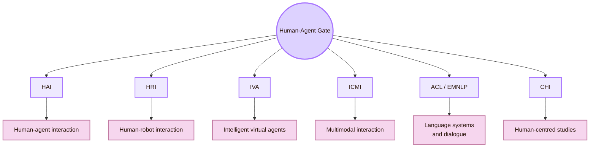

| Venue | Best use |
|---|---|
| HAI | Human-agent interaction, social agents, software agents, and human-agent communication |
| HRI | Human-robot interaction and embodied AI |
| IVA | Intelligent virtual agents and embodied conversational agents |
| ICMI | Multimodal interaction, speech, gesture, emotion, and AI-mediated communication |
| ACL / EMNLP | Language models, dialogue systems, summarisation, NLP behaviour, and evaluation |
| CHI | Human-centred evaluation of agents and conversational systems |

**Real-life translation:** use this gate when the AI is not only giving an output, but appearing as a social, conversational, or semi-autonomous actor.

## AI Accessibility and Inclusive AI Venues

This gate connects the Oracle Engine to the Inclusive Gate.

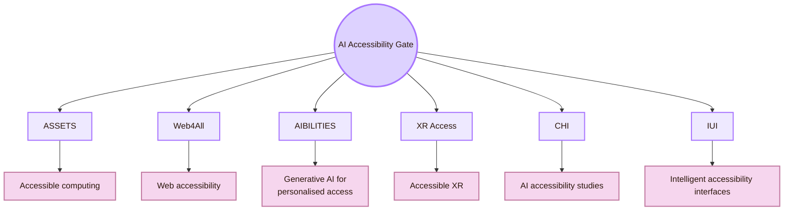

| Venue / route | Use it for |
|---|---|
| ASSETS | AI and accessibility, assistive technology, and disabled-user experiences |
| Web4All | Web accessibility, AI-generated web access, and adaptive interfaces |
| A(I)BILITIES | Romanian generative AI route for adaptive digital accessibility |
| XR Access | AI and accessibility in immersive environments |
| CHI | Human-centred AI accessibility studies |
| IUI | Intelligent interfaces for access, adaptation, and personalisation |

**Real-life translation:** use this gate when AI claims to help disabled users, adapt interfaces, generate alt text, summarise content, personalise access, or make digital systems more usable.

## AI Education and AI Literacy Venues

Human-AI Interaction in a student context needs venues for AI literacy, tutoring, learning support, and academic integrity.

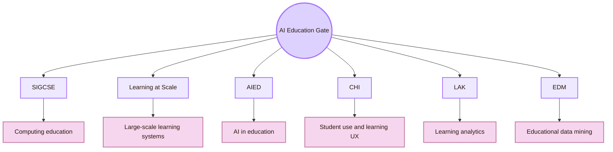

| Venue | Use it for |
|---|---|
| SIGCSE | AI literacy inside computing education |
| Learning at Scale | AI learning systems, online learning, and large-scale tutoring |
| AIED | Artificial intelligence in education, tutoring systems, learner modelling, and educational AI |
| CHI | Student-AI interaction, learning experience, and educational tools |
| LAK | Learning analytics and educational data |
| EDM | Educational data mining and adaptive learning systems |

**Real-life translation:** use this gate when the question is whether AI helps the student learn, reason, verify, and revise, rather than simply complete a task.

## Technical AI Venues to Use Carefully

Large AI venues are useful, but they are not automatically Human-AI venues. Use them for the AI mechanism. Then return to HCI venues to check human use.

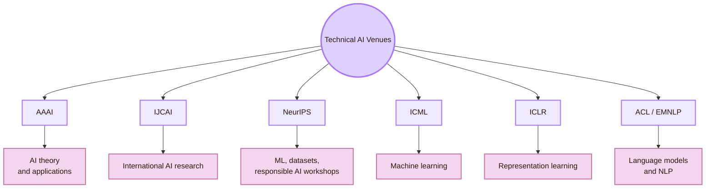

| Venue | Use it when... | Caution |
|---|---|---|
| AAAI | The AI method, agent design, planning, reasoning, or ethics topic matters | Many papers are not user-facing |
| IJCAI | The AI method has human-facing implications | HCI evidence may be weak or absent |
| NeurIPS | Model behaviour, datasets, safety, robustness, or evaluation matters | Technical performance is not the same as usability |
| ICML | ML uncertainty, learning, or robustness matters | User studies are often not central |
| ICLR | Language models, representation, and generative systems matter | Interface design may be missing |
| ACL / EMNLP | LLMs, dialogue, summarisation, translation, and language interaction matter | NLP benchmarks do not prove good Human-AI interaction |

## Journal Archive Gate

Journals and archival venues are useful for deeper theory, stronger literature reviews, and more stable references.

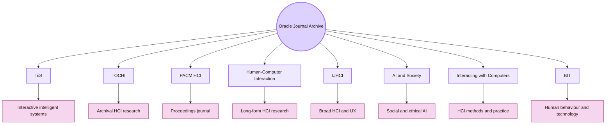

| Journal / archive | Why it matters |
|---|---|
| ACM Transactions on Interactive Intelligent Systems | Strong archive for systems that combine interaction and machine intelligence |
| ACM Transactions on Computer-Human Interaction | Core archival HCI journal |
| Proceedings of the ACM on Human-Computer Interaction | Major HCI proceedings journal, including CSCW and other HCI communities |
| Human-Computer Interaction | Long-form HCI research journal |
| International Journal of Human-Computer Interaction | Broad HCI journal including AI interaction, UX, usability, and human factors |
| AI & Society | Social, ethical, philosophical, and policy dimensions of AI |
| Interacting with Computers | HCI research methods, theory, and applied interaction |
| Behaviour & Information Technology | Human factors, usability, and technology in real contexts |

## Toolkit and Institute Gate

These are not conference venues, but they are important sources for applied Human-AI design. Use them to translate research into interface rules.

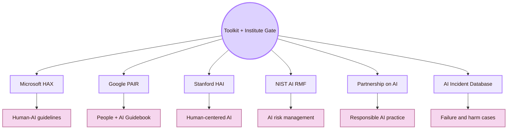

| Toolkit / institute | Use it for |
|---|---|
| Microsoft HAX Toolkit | Human-AI design guidelines, checklists, cards, and failure-aware design |
| Google PAIR Guidebook | Practical patterns for human-centered AI products |
| Stanford HAI | Research, policy, education, and public reports about human-centered AI |
| NIST AI RMF | Risk management vocabulary and governance structure |
| Partnership on AI | Responsible AI practice and multi-stakeholder guidance |
| AI Incident Database | Concrete cases of AI failure and harm |

## Venue Selection Route

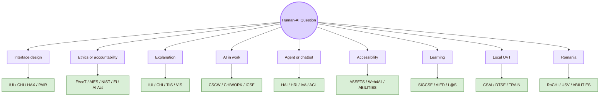

| If the question is... | Start here | Then broaden to |
|---|---|---|
| How should the AI interface behave? | IUI, CHI, Microsoft HAX, Google PAIR | TiiS, TOCHI |
| How should trust and uncertainty be designed? | CHI, IUI, TiiS | NIST, FAccT, VIS |
| How do users understand AI explanations? | IUI, CHI, TiiS, VIS | FAccT, AIES |
| How does AI affect work? | CSCW, CHIWORK, CHI | ICSE, DIS |
| How do agents interact with humans? | HAI, HRI, IVA | CHI, ICMI, ACL |
| How does AI affect disabled users? | ASSETS, Web4All, A(I)BILITIES | CHI, IUI |
| How should students learn with AI? | SIGCSE, AIED, Learning at Scale | CHI, LAK, EDM |
| How do we ground locally? | UVT CSAI, DTSE, TRAIN, seminars | CS2023 and global HCI |
| How do we ground nationally? | RoCHI, A(I)BILITIES, USV/MintViz | IUI, CHI, ASSETS |

## Reading Across Venues

Human-AI Interaction rarely needs only one source family. A strong route combines local context, national grounding, Human-AI design, responsible AI, and technical AI knowledge.

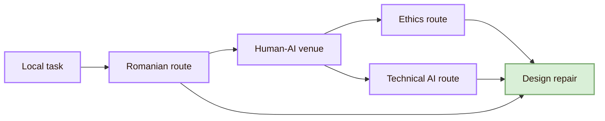

| Project problem | Venue combination |
|---|---|
| AI invented or overstated a local UVT claim | UVT official page + HAX/PAIR verification pattern + issue log |
| AI generated an impressive but unsupported page | CHI/IUI + source verification + NIST risk framing |
| AI explanation did not help judgement | IUI + CHI + TiiS + VIS |
| AI changed how the student works | CHIWORK + CSCW + SIGCSE |
| AI accessibility claim is untested | ASSETS + Web4All + A(I)BILITIES + WCAG/WAI if web-based |
| AI agent might edit project files | HAI + software engineering + HAX + GitHub workflow |
| AI output may be biased or harmful | FAccT + AIES + AI Incident Database + NIST AI RMF |
| AI source support is weak | Official source + Human-AI method + claim-boundary table |

## Venue Reliability Ladder

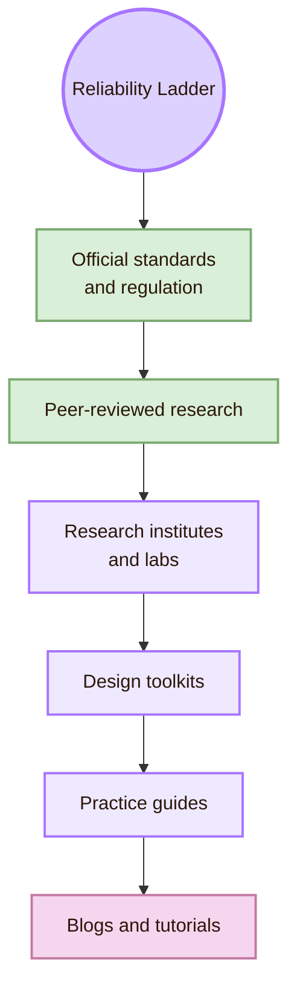

| Source type | Use it for | Caution |
|---|---|---|
| Official standards and regulation | Human oversight, risk management, accountability, legal context | They do not replace user testing |
| Peer-reviewed research | Evidence, methods, theories, and evaluated systems | Papers may be narrow or difficult for beginners |
| Research institutes and labs | Research direction, public reports, policy framing | Check whether the page is a report, opinion, or peer-reviewed work |
| Design toolkits | Practical design rules and checklists | Toolkits simplify complex research |
| Practice guides | Fast applied understanding | Not always peer-reviewed |
| Blogs and tutorials | Setup help and examples | Do not use them as the main academic source |

## Broad Oracle Venue Atlas

| Territory                   | Main routes                                                         | What they map                                                                   |
| --------------------------- | ------------------------------------------------------------------- | ------------------------------------------------------------------------------- |
| Local UVT                   | Faculty of Informatics, CSAI, DTSE, TRAIN, seminars, project review | Local AI, software, workflow, and student-project context                       |
| Romania                     | RoCHI, A(I)BILITIES, USV/MintViz, Romanian accessibility evaluation | National HCI, AI accessibility, assistive technology, Romanian-language context |
| Core Human-AI               | IUI, CHI, HAI, TiiS                                                 | AI interfaces, intelligent systems, user studies, agents                        |
| Responsible AI              | FAccT, AIES, NIST, EU AI Act, AI Incident Database                  | Accountability, fairness, risk, oversight, governance                           |
| Explanation + visualisation | IUI, CHI, TiiS, IEEE VIS, FAccT                                     | Explainability, uncertainty, evidence displays                                  |
| Work + collaboration        | CSCW, CHIWORK, ICSE, DIS, UIST                                      | AI in organisations, teams, software, workflows                                 |
| Agents + conversation       | HAI, HRI, IVA, ICMI, ACL/EMNLP                                      | Chatbots, robots, virtual agents, multimodal AI                                 |
| Accessibility               | ASSETS, Web4All, A(I)BILITIES, XR Access                            | AI for access and disabled-user experience                                      |
| Education                   | SIGCSE, AIED, Learning at Scale, LAK, EDM                           | AI literacy, tutoring, learning analytics                                       |
| Journals                    | TiiS, TOCHI, PACM HCI, HCI Journal, IJHCI, AI & Society             | Deep literature and archival references                                         |
| Toolkits                    | Microsoft HAX, Google PAIR, Stanford HAI, NIST AI RMF               | Practical design, risk, policy, and public guidance                             |

## Cognishire Venue Route

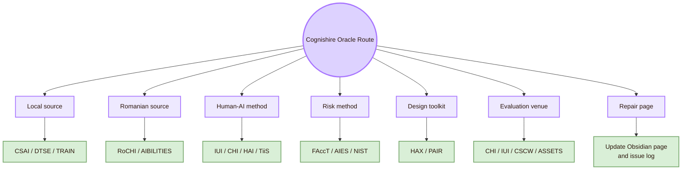

| Cognishire issue | Best venue route |
|---|---|
| AI wrote content that needs verification | HAX, PAIR, CHI, IUI |
| AI source support is weak | Official source + IUI/CHI method + issue log |
| AI role is unclear | Microsoft Human-AI guidelines, Google PAIR |
| AI trust is miscalibrated | CHI, IUI, TiiS, FAccT |
| AI changes student workflow | CHIWORK, CSCW, SIGCSE |
| AI affects accessibility | ASSETS, Web4All, A(I)BILITIES |
| AI output needs local grounding | UVT CSAI/DTSE, TRAIN, RoCHI |
| AI output needs national Romanian grounding | RoCHI, USV/MintViz, A(I)BILITIES |
| AI agent might act across files | HAI, software engineering, HAX, NIST AI RMF |
| AI explanation is unclear | IUI, CHI, TiiS, VIS |

## What this page should not claim

| Do not claim | Safer wording |
|---|---|
| “Human-AI Interaction is a single official CS2023 unit.” | “Human-AI Interaction is treated here as a bridge between HCI, AI, software, accessibility, and ethics.” |
| “UVT has a dedicated Human-AI Interaction venue.” | “UVT has local AI, ML, software, seminar, and project routes relevant to Human-AI questions.” |
| “A technical AI benchmark proves good Human-AI Interaction.” | “Technical AI evidence must be paired with HCI evidence about user understanding, control, and trust.” |
| “A toolkit is a peer-reviewed venue.” | “Toolkits are practical design sources. They should be used with research and official standards.” |
| “FAccT or AIES replaces interface evaluation.” | “Responsible AI venues frame risk and accountability. Interface behaviour still needs HCI evaluation.” |
| “AI accessibility is solved by an AI feature.” | “AI accessibility claims need evidence from accessibility venues, standards, and user testing.” |

## Venue Synthesis

Important Venues for **Human-AI Interaction** form a local-global atlas. Locally, the Oracle Engine starts with UVT: Faculty of Informatics, CSAI, DTSE, AI and ML research routes, TRAIN, scientific seminars, AI programmes, and the real Obsidian/GitHub project context. Nationally, it connects to RoCHI, A(I)BILITIES, USV/MintViz, ASSIST Software, Romanian accessibility evaluation, and Romanian-language interaction. Globally, it connects to IUI, CHI, HAI, TiiS, FAccT, AIES, CSCW, CHIWORK, ASSETS, Web4All, SIGCSE, AIED, NIST AI RMF, EU AI Act, Microsoft HAX, Google PAIR, and Stanford HAI.

The central lesson is that there is no single Human-AI venue. If the question is interface behaviour, search IUI and CHI. If the question is responsibility, search FAccT, AIES, NIST, and the EU AI Act. If the question is agent behaviour, search HAI, HRI, IVA, and ACL/EMNLP. If the question is accessibility, search ASSETS and Web4All. If the question is work, search CSCW and CHIWORK. If the question is learning, search SIGCSE and AIED. If the question is local, start from UVT and Romania before expanding globally.

The central question is:

> Where should I search for evidence, standards, methods, and examples when AI changes what humans believe, decide, trust, verify, and control?

This page connects to [[Theory]] because venues shape the concepts used in Human-AI Interaction. It connects to [[Design]] because toolkits and Human-AI venues become interface patterns. It connects to [[Experiment]] because venues define how trust, verification, explanation, oversight, and collaboration are tested. It connects to [[Connections]] because each venue belongs to several fields. It connects to [[Important People]] because researchers publish and organise work through these venues.

## Academic Anchors

| Route | Source |
|---|---|
| CS2023 HCI basis | [CS2023 HCI Version Gamma](https://csed.acm.org/wp-content/uploads/2023/09/HCI-Version-Gamma.pdf) |
| CS2023 Artificial Intelligence basis | [CS2023 AI SIGCSE 2022 version](https://csed.acm.org/knowledge-areas-intelligent-systems-ai-sigcse-2022-version/) |
| UVT Faculty of Informatics | [Faculty of Informatics UVT](https://info.uvt.ro/en/) |
| UVT Faculty departments | [Faculty of Informatics Departments](https://info.uvt.ro/en/departamente/) |
| UVT CSAI Department | [Department of Computational Sciences and Artificial Intelligence](https://info.uvt.ro/en/departamente/csai/) |
| UVT DTSE Department | [Department of Digital Technologies and Software Engineering](https://info.uvt.ro/en/departamente/dtse/) |
| UVT AI and ML research route | [Artificial Intelligence and Machine Learning](https://research.info.uvt.ro/artificial-intelligence-and-machine-learning/) |
| UVT TRAIN | [Timișoara Research in Artificial Intelligence Network](https://uvt.ro/en/comunicate-presa/uvt-lanseaza-noul-hub-de-inteligenta-artificiala-ai-timisoara-research-in-artificial-intelligence-network-train/) |
| UVT Scientific Seminar | [Scientific Seminar](https://research.info.uvt.ro/scientific-seminar/) |
| UVT AI and Distributed Computing master | [Artificial Intelligence and Distributed Computing](https://info.uvt.ro/en/master/artificial-intelligence-distributed-computing/) |
| RoCHI proceedings | [Romanian HCI proceedings](https://rochi.utcluj.ro/proceedings/en/) |
| A(I)BILITIES project | [A(I)BILITIES](https://aibilities.ro/en/about/) |
| MintViz A(I)BILITIES route | [MintViz A(I)BILITIES](https://mintviz.usv.ro/projects/A%28I%29BILITIES/index.php) |
| ASSIST Software A(I)BILITIES | [A(I)BILITIES at ASSIST Software](https://assist-software.net/project/aibilities) |
| Radu-Daniel Vatavu route | [Radu-Daniel Vatavu homepage](https://raduvatavu.usv.ro/) |
| Ovidiu-Andrei Schipor route | [Ovidiu-Andrei Schipor projects](https://www.eed.usv.ro/~schipor/projects.php) |
| ACM IUI | [ACM Conference on Intelligent User Interfaces](https://iui.acm.org/) |
| ACM CHI | [ACM CHI](https://dl.acm.org/conference/chi) |
| ACM HAI | [International Conference on Human-Agent Interaction](https://hai-conference.net/) |
| ACM TiiS | [ACM Transactions on Interactive Intelligent Systems](https://dl.acm.org/journal/TIIS) |
| ACM TOCHI | [ACM Transactions on Computer-Human Interaction](https://dl.acm.org/journal/tochi) |
| PACM HCI | [Proceedings of the ACM on Human-Computer Interaction](https://dl.acm.org/journal/pacmhci) |
| ACM FAccT | [ACM Conference on Fairness, Accountability, and Transparency](https://facctconference.org/) |
| AAAI/ACM AIES | [AI, Ethics, and Society](https://www.aies-conference.com/) |
| ACM CSCW | [ACM CSCW](https://cscw.acm.org/) |
| CHIWORK | [Human-Computer Interaction for Work](https://chiwork.org/) |
| ACM DIS | [ACM Designing Interactive Systems](https://dis.acm.org/) |
| ACM UIST | [ACM UIST](https://uist.acm.org/) |
| ICSE | [IEEE/ACM International Conference on Software Engineering](https://conf.researchr.org/series/icse) |
| ACM HRI | [ACM/IEEE Human-Robot Interaction](https://humanrobotinteraction.org/) |
| ACM IVA | [ACM Intelligent Virtual Agents](https://dl.acm.org/conference/iva) |
| ACM ICMI | [ACM International Conference on Multimodal Interaction](https://icmi.acm.org/) |
| ACL | [Association for Computational Linguistics](https://www.aclweb.org/portal/) |
| EMNLP | [EMNLP](https://2026.emnlp.org/) |
| ASSETS | [ACM ASSETS](https://www.sigaccess.org/assets/) |
| Web4All | [International Web for All Conference](https://www.w4a.info/) |
| XR Access | [XR Access](https://xraccess.org/) |
| SIGCSE | [ACM SIGCSE](https://sigcse.org/) |
| Learning at Scale | [ACM Learning at Scale](https://learningatscale.acm.org/) |
| AIED | [International AIED Society](https://iaied.org/) |
| LAK | [Society for Learning Analytics Research](https://www.solaresearch.org/events/lak/) |
| EDM | [International Educational Data Mining Society](https://educationaldatamining.org/) |
| IEEE VIS | [IEEE VIS](https://ieeevis.org/) |
| IEEE TVCG | [IEEE Transactions on Visualization and Computer Graphics](https://www.computer.org/csdl/journal/tg) |
| AAAI | [AAAI Conference](https://aaai.org/conference/aaai/) |
| IJCAI | [International Joint Conferences on Artificial Intelligence](https://www.ijcai.org/) |
| NeurIPS | [NeurIPS](https://neurips.cc/) |
| ICML | [International Conference on Machine Learning](https://icml.cc/) |
| ICLR | [International Conference on Learning Representations](https://iclr.cc/) |
| Microsoft HAX Toolkit | [HAX Toolkit](https://www.microsoft.com/en-us/haxtoolkit/) |
| Microsoft Human-AI guidelines | [Guidelines for Human-AI Interaction](https://www.microsoft.com/en-us/haxtoolkit/ai-guidelines/) |
| Google PAIR | [People + AI Research](https://pair.withgoogle.com/) |
| Google PAIR Guidebook | [People + AI Guidebook](https://pair.withgoogle.com/guidebook/) |
| Stanford HAI | [Stanford Institute for Human-Centered AI](https://hai.stanford.edu/) |
| NIST AI RMF | [NIST AI Risk Management Framework](https://www.nist.gov/itl/ai-risk-management-framework) |
| NIST AI RMF Core | [Govern, Map, Measure, Manage](https://airc.nist.gov/airmf-resources/airmf/5-sec-core/) |
| EU AI Act | [European Commission AI Act](https://digital-strategy.ec.europa.eu/en/policies/regulatory-framework-ai) |
| EU AI Act Article 14 | [Human oversight](https://artificialintelligenceact.eu/article/14/) |
| AI Incident Database | [AI Incident Database](https://incidentdatabase.ai/) |
| Partnership on AI | [Partnership on AI](https://partnershiponai.org/) |

^important-venues-human-ai-interaction-end
