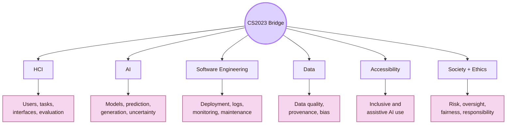
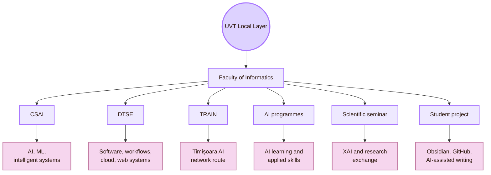
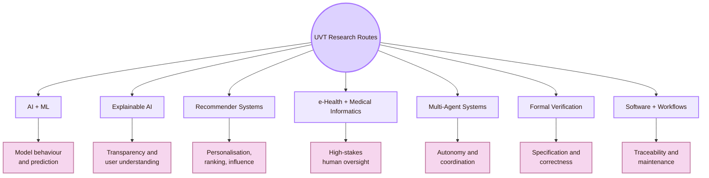
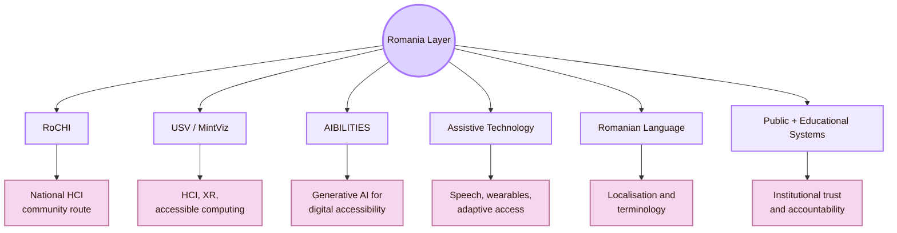
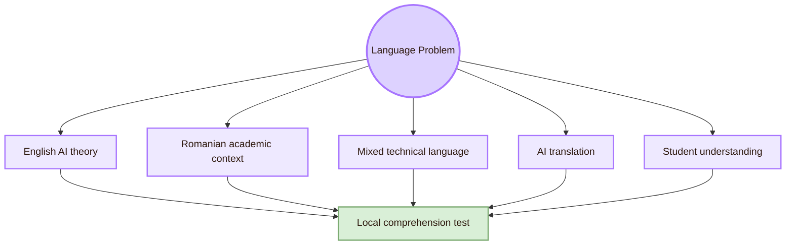
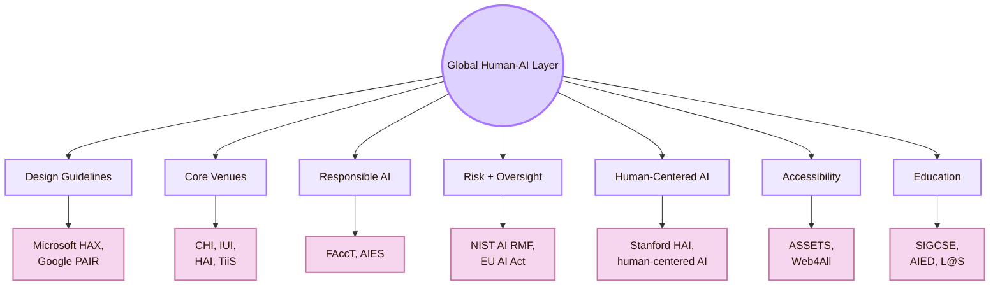
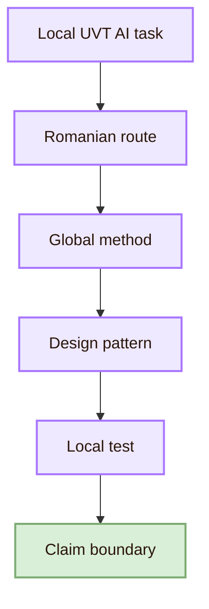
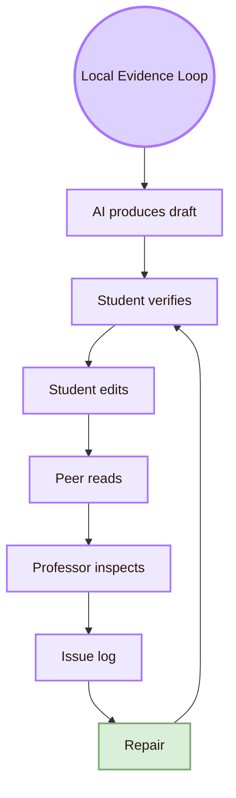
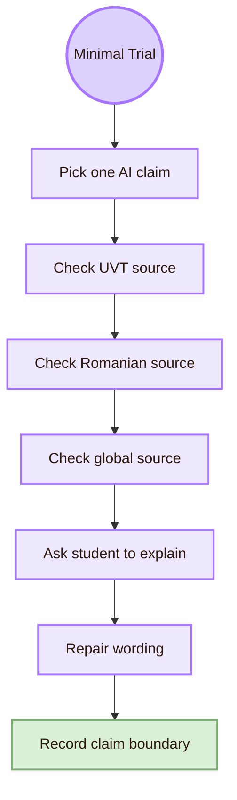
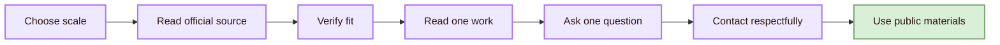

# Local and Global

Back to [[Overview|The Oracle Engine]].

> [!abstract] Local and Global Oracle Map
> **Local and Global** in the **Oracle Engine** maps Human-AI Interaction across three scales: the local UVT Computer Science context, the Romanian HCI and AI-accessibility context, and the global Human-AI Interaction field.

The project name is **Local and Global Oracle Map**.  
The academic topic is **Human-AI Interaction**.  
The CS2023 grounding is a bridge between **Human-Computer Interaction**, **Artificial Intelligence**, **Software Engineering**, **Accessibility**, and **Society, Ethics, and Professionalism**.  
The real-life meaning is **understanding AI interaction first where the project is actually used, then connecting that local case to Romanian routes and global research methods**.

This page should not claim that UVT has a dedicated Human-AI Interaction programme unless an official source says that. The safer academic claim is more precise: UVT provides local routes in AI, machine learning, software systems, workflows, and research seminars that can support Human-AI Interaction questions.

For this project, the local case is concrete. A student uses AI to help build the Cognishire HCI vault. The system includes Obsidian, GitHub, Markdown, Mermaid diagrams, source checking, professor review, and academic writing. That is already a Human-AI Interaction case.

> [!quote] Scale rule
> Start where the AI is actually used. Then move outward: UVT, Romania, global HCI.

## Scale map

```mermaid
flowchart TB
    A((Oracle Scale Map))

    A --> B[Local UVT]
    A --> C[Romania]
    A --> D[Global Human-AI]

    B --> B1[Faculty, CSAI, DTSE,<br/>TRAIN, student project]
    C --> C1[RoCHI, USV/MintViz,<br/>A(I)BILITIES]
    D --> D1[CHI, IUI, HAI,<br/>FAccT, NIST, EU AI Act]

    B --> E[Local evidence]
    C --> F[National grounding]
    D --> G[Global methods]

    E --> H[Careful design repair]
    F --> H
    G --> H

    classDef center fill:#ddd2ff,stroke:#a875ff,color:#2b160b,stroke-width:3px;
    classDef node fill:#eee9ff,stroke:#a875ff,color:#2b160b,stroke-width:2px;
    classDef detail fill:#f6d6ee,stroke:#c27aa2,color:#2b160b,stroke-width:2px;
    classDef final fill:#d9efd7,stroke:#7cab72,color:#2b160b,stroke-width:2px;

    class A center;
    class B,C,D,E,F,G node;
    class B1,C1,D1 detail;
    class H final;
```

| Scale | What it means here | Human-AI question |
|---|---|---|
| Local UVT | The actual university, faculty, tools, project workflow, professor review, and student learning context | How does AI interaction appear in this real academic workflow? |
| Romania | Romanian HCI, accessible computing, AI-accessibility, assistive technology, language, and institutional context | Which Romanian routes make this topic locally relevant beyond UVT? |
| Global Human-AI | International Human-AI research, design guidelines, risk frameworks, and venues | Which methods explain trust, verification, uncertainty, oversight, and responsibility? |

## Why local and global both matter

A Human-AI project becomes weak if it uses only one scale.

If it is only local, it may become a personal project with weak academic grounding. If it is only global, it may ignore the university, language, tools, and people who actually use the system. If it ignores Romania, it treats Human-AI Interaction as if national HCI and accessibility work do not exist.

| Weak route | Problem | Stronger route |
|---|---|---|
| Only UVT | The page may describe one project but miss the field | Connect local evidence to global Human-AI methods |
| Only Romania | The page may list people or projects without method structure | Link Romanian routes to HCI, AI, accessibility, and evaluation concepts |
| Only global | The page may become generic and detached from the student project | Test claims in the actual Obsidian, GitHub, and professor-review context |
| Only AI | The page may focus on models and ignore users | Add HCI: mental models, trust, control, explanation, and verification |
| Only HCI | The page may ignore model limits and uncertainty | Add AI: data, prediction, generation, drift, and failure modes |

## CS2023 grounding

Human-AI Interaction is best treated as a bridge across CS2023 areas. It is not only HCI and not only AI.



| CS2023 route | Local UVT interpretation | Romanian interpretation | Global interpretation |
|---|---|---|---|
| HCI | Test how students use, check, and revise AI-assisted pages | Use Romanian HCI routes such as RoCHI when relevant | Use CHI, IUI, HAI, TiiS, and Human-AI studies |
| AI | Connect to AI/ML teaching, prediction, XAI, recommender systems, and e-health routes | Connect to Romanian AI, AI-accessibility, and assistive-technology projects | Use model capability, uncertainty, hallucination, drift, and generation concepts |
| Software Engineering | Use GitHub, versioning, prompt logs, file histories, and issue logs | Connect to applied software and AI projects in Romania | Use monitoring, rollback, auditability, and system reliability concepts |
| Data | Verify local and Romanian claims against sources | Treat Romanian language and missing data as interaction issues | Use provenance, data quality, bias, and uncertainty concepts |
| Accessibility | Ask whether AI helps or blocks access | Connect to A(I)BILITIES and accessible-computing routes | Use ASSETS, Web4All, and inclusive AI research |
| Society and Ethics | State what AI can and cannot responsibly do in academic work | Connect to Romanian institutional and education contexts | Use NIST AI RMF, FAccT, AIES, and EU AI Act human oversight |

## Local UVT layer

The strongest local home for this page is the **UVT Faculty of Informatics**. Inside that context, two routes matter most for the Oracle Engine.

The **Department of Computational Sciences and Artificial Intelligence** gives the AI side: models, learning, prediction, intelligent systems, medical informatics, recommender systems, and explainability routes. The **Department of Digital Technologies and Software Engineering** gives the software side: web systems, workflows, cloud systems, deployment, versioning, reliability, and maintainability.

Human-AI Interaction needs both. An AI interface is a user-facing system, but it is also software that must be logged, tested, updated, and repaired.



| UVT local route | Human-AI value | Careful wording |
|---|---|---|
| Faculty of Informatics | Gives the local Computer Science home of the project | Local institutional anchor |
| CSAI | Supports AI, ML, model behaviour, prediction, and intelligent systems | Local AI foundation for Human-AI questions |
| DTSE | Supports software systems, workflows, web systems, and maintainability | Local software foundation for Human-AI systems |
| TRAIN | Gives a regional AI network route around Timișoara and Banat | AI hub route, not proof of every Human-AI subfield |
| AI bachelor and master routes | Provide AI education routes relevant to students | Teaching context, not automatically HCI specialisation |
| Scientific Seminar | Gives local research exchange and possible XAI routes | Use only when the seminar topic directly supports the claim |
| Cognishire project | Real AI-assisted learning and writing workflow | Local Human-AI case study |

## Local UVT people and research routes

Use this section as a **route map**, not as a claim that every person listed is a Human-AI Interaction supervisor. The safer framing is: these UVT routes can support questions about AI capability, explainability, recommender systems, e-health, software workflows, formal reliability, and local academic review.



| Local research route | Why it matters for Human-AI Interaction | Safe use in this page |
|---|---|---|
| AI and machine learning | Helps explain capability, prediction, classification, uncertainty, and limits | Use for the AI foundation |
| Explainable AI | Connects to transparency, explanation, user trust, and review | Use for Human-AI explanation questions |
| Recommender systems | Connects to ranking, personalisation, hidden influence, and user control | Use for AI choice architecture |
| e-health and medical informatics | Connects to high-stakes AI, risk, trust, and human oversight | Use for careful examples of high-stakes interaction |
| Multi-agent systems | Connects to agentic AI, autonomy, coordination, and intervention | Use for control and delegation questions |
| Formal verification | Connects to reliability, specification, correctness, and the limits of AI certainty | Use for system assurance questions |
| Software and workflow systems | Connects to GitHub, logs, versioning, deployment, and reproducibility | Use for traceability in AI-assisted work |

> [!warning] Local claim rule
> Write “local route relevant to Human-AI Interaction,” not “Human-AI Interaction professor,” unless the official profile explicitly states that exact field.

## Local UVT claim boundaries

| Unsafe claim | Safer academic wording |
|---|---|
| UVT has Human-AI Interaction professors. | UVT has AI, ML, software systems, XAI, recommender, e-health, and workflow routes that can support Human-AI Interaction questions. |
| CSAI equals Human-AI Interaction. | CSAI provides the local AI foundation for Human-AI Interaction. |
| DTSE is an AI department. | DTSE provides the software engineering and systems layer needed to implement and maintain Human-AI systems. |
| TRAIN proves all AI subfields are covered locally. | TRAIN is a regional AI hub route that can connect the project to AI development in Timișoara and Banat. |
| A local test proves global Human-AI validity. | A local test shows how this project works in the UVT context. |

## Romania layer

The Romanian layer matters because Human-AI Interaction should not be framed only through US, UK, or global sources. Romanian routes give national grounding in HCI, accessibility, assistive technology, intelligent interaction, language, and institutional context.



| Romanian route | Human-AI connection | Safe use in this page |
|---|---|---|
| RoCHI | National HCI route for design, evaluation, implementation, and study of interactive systems | Use as the main Romanian HCI anchor |
| Radu-Daniel Vatavu / USV | HCI, XR, accessible computing, ambient intelligence, and multimodal interaction route | Use for Romanian HCI and accessible interaction grounding |
| Ovidiu-Andrei Schipor | HCI and assistive-technology route, especially speech and smart-environment contexts | Use for assistive Human-AI and accessibility routes |
| A(I)BILITIES | Romanian generative-AI and digital-accessibility project route | Use for AI accessibility, but do not claim it solves accessibility |
| MintViz | USV research route linked to machine intelligence and information visualisation | Use for intelligent interaction and visualisation context |
| ASSIST Software A(I)BILITIES route | Applied R&D route for digital accessibility with generative AI | Use as project evidence, not as general proof |
| Romanian language | Affects AI prompts, explanations, translation, terminology, and learning | Use for localisation and AI-literacy questions |

## Romanian language and localisation problem

Human-AI Interaction changes when language changes. A model may perform differently in English, Romanian, or mixed academic language. A student may also understand a concept in English but explain it better in Romanian.



| Localisation issue | Human-AI risk | Repair |
|---|---|---|
| English terms remain unclear | Student copies without understanding | Add a short plain-English explanation |
| Romanian translation is inaccurate | Concept meaning changes | Keep key terms in English and explain them |
| AI over-localises | Academic terms become informal or imprecise | Preserve official terminology |
| AI ignores Romanian context | Page becomes generic | Add UVT and Romanian source routes |
| Mixed language creates confusion | User cannot explain the concept | Ask for a short paraphrase task |
| AI invents local terminology | False academic wording enters the project | Verify terms with official or academic sources |

## Global Human-AI layer

The global layer provides the strongest method vocabulary for Human-AI Interaction: mental models, trust calibration, uncertainty, explanation, verification, user control, human oversight, risk management, and responsible AI.



| Global route | Why it matters for this project |
|---|---|
| Microsoft Guidelines for Human-AI Interaction | Gives design rules for expectation setting, regular interaction, AI failure, and change over time |
| Microsoft HAX Toolkit | Helps turn Human-AI guidelines into design review and failure analysis |
| Google People + AI Guidebook | Gives product-design guidance for human-centered AI |
| NIST AI RMF | Gives risk-management vocabulary: govern, map, measure, manage |
| EU AI Act Article 14 | Gives a formal human-oversight route for high-risk AI systems |
| CHI | Broad HCI venue for Human-AI studies |
| IUI | Core intelligent user interface venue |
| HAI | Human-agent interaction and social-agent route |
| FAccT and AIES | Fairness, accountability, ethics, governance, and social impact |
| TiiS | Archival route for interactive intelligent systems |
| ASSETS and Web4All | Accessibility and inclusive AI routes |
| Stanford HAI | Interdisciplinary human-centered AI research and public-facing analysis |

## Local to Romania to global bridge



| Local UVT task | Romanian route | Global method | Design repair |
|---|---|---|---|
| Student uses AI to draft HCI pages | RoCHI | Microsoft Human-AI guidelines | Add AI role note, verification step, and source panel |
| AI suggests UVT people or local routes | Official UVT pages | Source verification and claim status | Mark claims as verified, partially supported, needs check, or removed |
| AI helps explain accessibility | A(I)BILITIES, Vatavu, Schipor | ASSETS, Web4All, inclusive AI | Add human control and accessibility checks |
| AI gives a confident but unsupported claim | Romanian source check | NIST AI RMF, FAccT | Add uncertainty label and issue log |
| AI helps organise GitHub/Obsidian files | DTSE and software routes | Software engineering and HAX patterns | Add preview, diff, undo, and version log |
| AI personalises learning for a student | Romanian education and HCI context | AI literacy, SIGCSE, Google PAIR | Add reflection task and student explanation |

## Local Human-AI evidence loop

The Oracle Engine should collect evidence from the actual project. It should not only describe sources.



| Local evidence | What it can support | What it cannot support |
|---|---|---|
| Student can explain the page | AI-assisted content supports local learning | All students will learn from it |
| Source claims are checked | Selected claims have academic grounding | Every claim is complete forever |
| Professor can inspect structure | The project is locally readable and credible | The page is globally accepted |
| GitHub version tracks changes | The AI-assisted workflow is traceable | The content is automatically correct |
| Peer detects unclear AI output | A local usability problem is visible | All Human-AI issues are solved |
| Issue log records hallucinations | AI failures are not hidden | The AI will not fail again |

## Local and global comparison matrix

| Dimension | Local UVT | Romania | Global Human-AI |
|---|---|---|---|
| Main role | Project context and local academic accountability | National HCI, accessibility, and AI grounding | International methods, venues, standards, and frameworks |
| Main institutions | UVT Faculty of Informatics, CSAI, DTSE, TRAIN | RoCHI, USV/MintViz, A(I)BILITIES, ASSIST Software | IUI, CHI, HAI, FAccT, AIES, NIST, EU AI Act |
| Main evidence | Student use, professor review, source verification, GitHub logs | Romanian HCI/accessibility projects and publications | Peer-reviewed research, design guidelines, risk frameworks |
| Main risk | Overclaiming local Human-AI expertise | Ignoring Romanian HCI and accessibility routes | Importing global theory without local evidence |
| Best use | Ground the project where it is built | Add national relevance | Anchor concepts and methods |

## Minimal local-global trial

Use this small trial to make the local-global page evidence-based.



| Step | Concrete action |
|---|---|
| Pick one AI claim | Example: “Human-AI systems need trust calibration.” |
| Check UVT source | Does a local UVT route make the claim relevant to AI, XAI, or student workflows? |
| Check Romanian source | Does RoCHI, A(I)BILITIES, or USV provide national grounding? |
| Check global source | Does Microsoft, Google PAIR, NIST, CHI, IUI, or FAccT support the method? |
| Ask student to explain | Can a first-year student say why the claim matters? |
| Repair wording | Remove overclaiming and add source-specific wording |
| Record claim boundary | State what local, national, and global evidence can and cannot prove |

## Contact protocol

Contact comes after source reading. Do not ask broad questions before checking official pages and one relevant source.



| Contact target | Better question |
|---|---|
| UVT CSAI route | “Which AI concept is most important for explaining model limits to HCI students?” |
| UVT DTSE route | “How should an AI-assisted Obsidian/GitHub project keep source verification traceable?” |
| UVT XAI route | “What is a correct beginner-level explanation of explainable AI?” |
| Romanian HCI route | “Which RoCHI paper or Romanian HCI source should I read for AI interaction or accessibility?” |
| A(I)BILITIES route | “How can generative AI support accessibility without removing user control?” |
| Global researcher | “Which Human-AI method is best for testing trust calibration or source verification?” |

## Claim boundary rules

| Claim type | Required evidence |
|---|---|
| Current UVT department, programme, or staff | Official UVT page |
| UVT person research area | Official UVT research profile, department page, or publication page |
| Romanian researcher topic | Official personal page, university profile, project page, or publication page |
| A(I)BILITIES objective | Official project page or project partner page |
| Global guideline | Official Microsoft, Google, NIST, EU, ACM, or peer-reviewed source |
| Venue description | Official venue page |
| Human-AI theory claim | Peer-reviewed paper, official toolkit, or recognised research institute |
| Local project claim | Actual test, GitHub record, issue log, or professor/student review |

## What not to claim

| Do not claim | Safer wording |
|---|---|
| This page proves UVT has a Human-AI Interaction field. | This page maps UVT routes that can support Human-AI Interaction questions. |
| Romania is absent from Human-AI Interaction. | Romanian routes exist through RoCHI, USV/MintViz, A(I)BILITIES, assistive technology, and accessible computing. |
| Global guidelines are enough. | Global guidelines need local testing and Romanian grounding. |
| AI can be trusted if it cites sources. | Sources must be checked to see whether they support the exact claim. |
| Human oversight means a human is present. | Oversight requires information, authority, time, control, and logs. |
| A student using AI means the project is not academic. | AI-assisted work can be academic if claims are verified, learning is visible, and responsibility remains human. |
| A(I)BILITIES solves accessibility. | A(I)BILITIES is a Romanian route for generative AI and personalised digital accessibility; each claim still needs evaluation. |

## Cognishire application

```mermaid
flowchart TB
    A((Cognishire Oracle Route))

    A --> B[Local]
    B --> C[Romania]
    C --> D[Global]
    D --> E[Design rule]
    E --> F[Experiment]
    F --> G[Local repair]

    B --> B1[UVT, CSAI, DTSE,<br/>TRAIN, project workflow]
    C --> C1[RoCHI, A(I)BILITIES,<br/>USV/MintViz]
    D --> D1[HAX, PAIR, NIST,<br/>EU AI Act, CHI, IUI]
    E --> E1[Source panel,<br/>uncertainty, oversight]
    F --> F1[Trust, verification,<br/>explanation test]
    G --> G1[Update page,<br/>issue log, GitHub]

    classDef center fill:#ddd2ff,stroke:#a875ff,color:#2b160b,stroke-width:3px;
    classDef node fill:#eee9ff,stroke:#a875ff,color:#2b160b,stroke-width:2px;
    classDef detail fill:#f6d6ee,stroke:#c27aa2,color:#2b160b,stroke-width:2px;

    class A center;
    class B,C,D,E,F,G node;
    class B1,C1,D1,E1,F1,G1 detail;
```

| Cognishire element | Local UVT route | Romanian route | Global route |
|---|---|---|---|
| AI drafting | Student project and professor review | RoCHI HCI context | Microsoft HAX, Google PAIR, CHI |
| Source verification | Official UVT pages and GitHub logs | RoCHI, A(I)BILITIES, USV sources | NIST, FAccT, Human-AI guidelines |
| AI design patterns | Obsidian, CSS, Mermaid, Markdown | Romanian language and HCI context | IUI, HAI, TiiS |
| AI accessibility | UVT accessibility and student needs | A(I)BILITIES, Vatavu, Schipor | ASSETS, Web4All |
| Agentic file editing | DTSE, GitHub workflow | Applied software/AI route | HAX, software engineering, NIST |
| AI learning | Local student comprehension | Romanian education/HCI route | SIGCSE, AIED, AI literacy |
| Human oversight | Professor and student review | Romanian institutional context | EU AI Act Article 14, NIST AI RMF |

## Synthesis

Local and Global for **Human-AI Interaction** has three layers.

The first layer is **UVT**: Faculty of Informatics, CSAI, DTSE, TRAIN, AI/ML research, XAI, recommender systems, e-health, software workflows, student use, professor review, GitHub, and Obsidian. This is the local project environment.

The second layer is **Romania**: RoCHI, Radu-Daniel Vatavu, Ovidiu-Andrei Schipor, USV/MintViz, A(I)BILITIES, ASSIST Software, Romanian language, and Romanian accessibility or HCI routes. This gives national grounding.

The third layer is **global Human-AI**: CS2023, Microsoft Human-AI guidelines, Google PAIR, Stanford HAI, NIST AI RMF, EU AI Act human oversight, CHI, IUI, HAI, TiiS, FAccT, AIES, ASSETS, and Web4All. This gives the method vocabulary.

The central lesson is that Human-AI Interaction should not be built from global theory alone. It needs local evidence, national grounding, and global methods. UVT shows where the AI is actually used. Romania shows that HCI and AI-accessibility routes exist nationally. Global research gives the concepts needed to design and test the interaction.

The central question is:

> What does Human-AI Interaction mean at UVT, which Romanian routes ground it nationally, and which global methods help humans understand, verify, control, and remain responsible for AI systems?

This page connects to [[Theory]] because local and global routes explain the concepts behind Human-AI Interaction. It connects to [[Design]] because these routes become interface patterns. It connects to [[Experiment]] because claims need local evidence and global methods. It connects to [[Connections]] because Human-AI Interaction crosses AI, HCI, software, ethics, accessibility, education, and security. It connects to [[Important People]] and [[Important Venues]] because the local, Romanian, and global maps must be visible together.

## Academic anchors

| Route | Source |
|---|---|
| CS2023 HCI basis | [CS2023 HCI Version Gamma](https://csed.acm.org/wp-content/uploads/2023/09/HCI-Version-Gamma.pdf) |
| CS2023 Artificial Intelligence basis | [CS2023 AI SIGCSE 2022 version](https://csed.acm.org/knowledge-areas-intelligent-systems-ai-sigcse-2022-version/) |
| UVT Faculty of Informatics | [Faculty of Informatics UVT](https://info.uvt.ro/en/) |
| UVT Faculty departments | [Faculty of Informatics Departments](https://info.uvt.ro/en/departamente/) |
| UVT CSAI Department | [Department of Computational Sciences and Artificial Intelligence](https://info.uvt.ro/en/departamente/csai/) |
| UVT DTSE Department | [Department of Digital Technologies and Software Engineering](https://info.uvt.ro/en/departamente/dtse/) |
| UVT AI and ML research route | [Artificial Intelligence and Machine Learning](https://research.info.uvt.ro/artificial-intelligence-and-machine-learning/) |
| UVT TRAIN | [Timișoara Research in Artificial Intelligence Network](https://train.uvt.ro/) |
| UVT TRAIN launch | [UVT launches TRAIN](https://uvt.ro/en/comunicate-presa/uvt-lanseaza-noul-hub-de-inteligenta-artificiala-ai-timisoara-research-in-artificial-intelligence-network-train/) |
| UVT Artificial Intelligence bachelor route | [Artificial Intelligence - UVT admission](https://admission.uvt.ro/study-programmes/artificial-intelligence/) |
| UVT Artificial Intelligence and Distributed Computing master | [AIDC master](https://info.uvt.ro/en/master/artificial-intelligence-distributed-computing/) |
| UVT AIDC admission route | [AIDC admission](https://admission.uvt.ro/study-programmes/artificial-intelligence-and-distributed-computing-aidc/) |
| UVT Scientific Seminar | [Scientific Seminar](https://research.info.uvt.ro/scientific-seminar/) |
| RoCHI proceedings | [Romanian HCI proceedings](https://rochi.utcluj.ro/proceedings/en/) |
| RoCHI community route | [Romanian Special Interest Group in HCI](https://cgis.utcluj.ro/rochi_group/) |
| RoCHI DBLP route | [RoCHI on DBLP](https://dblp.org/db/conf/rochi/index) |
| Radu-Daniel Vatavu | [Radu-Daniel Vatavu homepage](https://raduvatavu.usv.ro/) |
| Radu-Daniel Vatavu publications | [Vatavu publications](https://raduvatavu.usv.ro/publications.php) |
| Ovidiu-Andrei Schipor | [Ovidiu-Andrei Schipor homepage](https://www.eed.usv.ro/~schipor/) |
| Ovidiu-Andrei Schipor CV | [Ovidiu-Andrei Schipor CV](https://fiesc.usv.ro/wp-content/uploads/sites/17/2022/09/CV_en_2022.pdf) |
| A(I)BILITIES project | [A(I)BILITIES](https://aibilities.ro/en/about/) |
| ASSIST Software A(I)BILITIES | [A(I)BILITIES — Generative AI for Digital Accessibility](https://assist-software.net/project/aibilities) |
| MintViz A(I)BILITIES route | [MintViz A(I)BILITIES](https://mintviz.usv.ro/projects/A%28I%29BILITIES/index.php) |
| Microsoft Human-AI guidelines | [Guidelines for Human-AI Interaction](https://www.microsoft.com/en-us/research/project/guidelines-for-human-ai-interaction/) |
| Microsoft HAX Toolkit | [HAX Toolkit AI Guidelines](https://www.microsoft.com/en-us/haxtoolkit/ai-guidelines/) |
| Google People + AI Guidebook | [PAIR Guidebook](https://pair.withgoogle.com/guidebook/) |
| Google People + AI Research | [PAIR](https://pair.withgoogle.com/) |
| Stanford HAI | [Stanford HAI](https://hai.stanford.edu/) |
| NIST AI RMF | [NIST AI Risk Management Framework](https://www.nist.gov/itl/ai-risk-management-framework) |
| NIST AI RMF Core | [Govern, Map, Measure, Manage](https://airc.nist.gov/airmf-resources/airmf/5-sec-core/) |
| EU AI Act | [European Commission AI Act](https://digital-strategy.ec.europa.eu/en/policies/regulatory-framework-ai) |
| EU AI Act Article 14 | [Human oversight](https://artificialintelligenceact.eu/article/14/) |
| ACM IUI | [ACM Conference on Intelligent User Interfaces](https://iui.acm.org/) |
| ACM CHI | [ACM CHI](https://dl.acm.org/conference/chi) |
| ACM HAI | [Human-Agent Interaction](https://hai-conference.net/) |
| ACM TiiS | [ACM Transactions on Interactive Intelligent Systems](https://dl.acm.org/journal/TIIS) |
| ACM FAccT | [ACM FAccT](https://facctconference.org/) |
| AAAI/ACM AIES | [AI, Ethics, and Society](https://www.aies-conference.com/) |
| ACM ASSETS | [ASSETS Conference](https://www.sigaccess.org/assets/) |
| Web4All | [International Web for All Conference](https://www.w4a.info/) |

^local-global-human-ai-interaction-end
