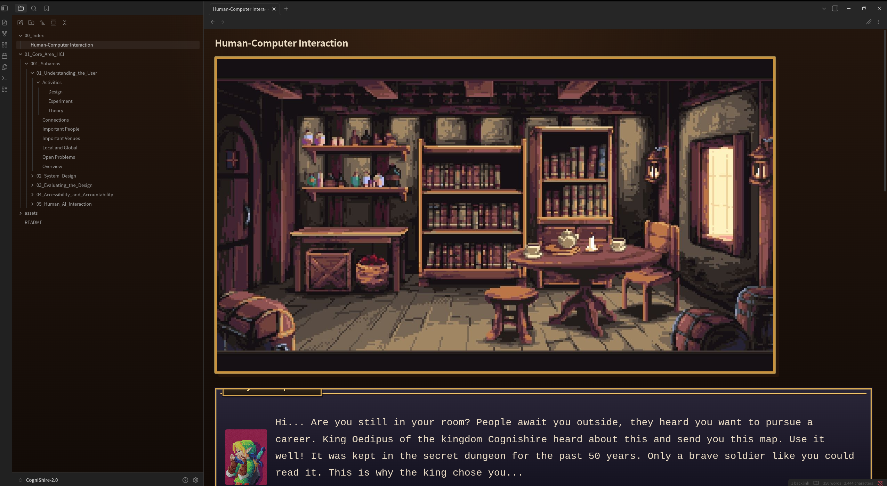

## How to run the project

### 1. Install Obsidian (if not already installed)

Download and install Obsidian from the official website:

[Download Obsidian](https://obsidian.md/download)

### 2. Download the latest release

Open the **Releases** section of this repository from the right the right side of the page ---->

<p align="center">
  
</p>

Click:

```text
Source code (zip)
```

<p align="center">
  
</p>

### 3. Extract the ZIP file

After downloading, extract the ZIP file on your computer.

You should get a folder similar to:

```text
CogniShire-2.0
```

### 4. Open (for the first time)

If it is your first time using obsidian select open folder as vault. Then select the folder you extracted. Enjoy :)
<p align="center">
  
</p>

### 5. If you are already using obsidian
Open obsidian.
<p align="center">
  
</p>

Select this bottom left corner button: (here you will have another vault open but it's the same button)

<p align="center">
  
</p>

Then manage vaults

<p align="center">
  
</p>

then open folder as vault.

### 5. Start using the vault

Start from the main navigation page and follow the links between the rooms.

<p align="center">
  
</p>

Each room introduces one important area of Human-Computer Interaction.

## Requirements

* Obsidian
* The latest CogniShire release
* No programming setup is required

## Important note

Open the full extracted folder as a vault. Do not open only one Markdown file.
