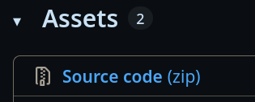
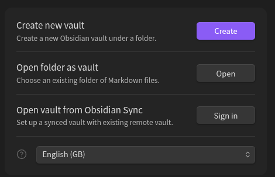
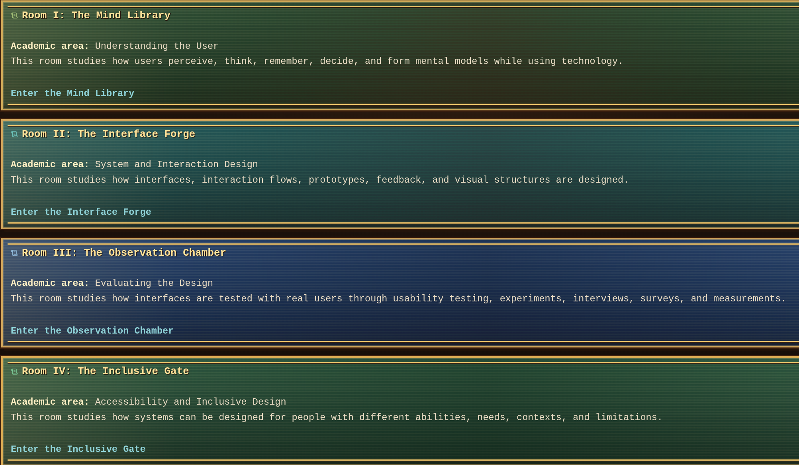

## How to run the project

### 1. Install Obsidian

Download and install Obsidian from the official website:

[Download Obsidian](https://obsidian.md/download)

### 2. Download the latest release

Open the **Releases** section of this repository and download the latest version.

<p align="center">
  
</p>

Click:

```text
Source code (zip)
```

<p align="center">
  
</p>

### 3. Extract the ZIP file

After downloading, extract the ZIP file on your computer.

You should get a folder similar to:

```text
CogniShire-2.0
```

### 4. Open Obsidian

Start Obsidian.

If this screen appears, choose **Open folder as vault**.

<p align="center">
  
</p>

If Obsidian already opened another vault, click the vault name in the bottom left corner and choose **Manage vaults...**.

<p align="center">
  
</p>

### 5. Select the CogniShire folder

Choose the extracted folder:

```text
CogniShire-2.0
```

Then click **Open**.

<p align="center">
  
</p>

### 6. Start using the vault

Start from the main navigation page and follow the links between the rooms.

<p align="center">
  
</p>

The main rooms are:

```text
Room I: The Mind Library
Room II: The Interface Forge
Room III: The Observation Chamber
Room IV: The Inclusive Gate
Room V: The Oracle Engine
```

Each room introduces one important area of Human-Computer Interaction.

## Requirements

* Obsidian
* The latest CogniShire release
* No programming setup is required

## Important note

Open the full extracted folder as a vault. Do not open only one Markdown file.
